# Claude Code CLI 技术设计文档

---

## 1. 概述

### 1.1 系统定位

Claude Code CLI 是 Anthropic 公司开发的命令行编程助手，为开发者提供基于 Claude 大语言模型的 AI 辅助编程能力。该系统通过终端界面与开发者交互，能够理解自然语言指令，执行文件系统操作、Shell 命令、代码编辑、Web 搜索等复杂任务，并支持多智能体协作（MCP、Agent Swarm）、远程控制会话、插件扩展等高级功能。

作为 Claude AI 生态系统的终端入口，Claude Code CLI 承担以下核心职责：

- **用户交互层**：通过 INK 框架渲染丰富的终端 UI，处理用户输入、权限确认、消息展示
- **任务编排层**：管理 Agent、Tool、Task 的生命周期，协调本地与远程执行
- **服务通信层**：与 Anthropic API 通信，处理 API 调用、对话压缩、事件遥测
- **扩展生态层**：支持 MCP 服务器、插件系统、Hook 机制，允许第三方扩展

### 1.2 核心交互

Claude Code CLI 在系统架构中处于以下交互位置：

```
┌─────────────────────────────────────────────────────────────────┐
│                        用户 (Developer)                         │
│                     通过终端与 Claude Code 交互                   │
└───────────────────────────────┬─────────────────────────────────┘
                                │
                                ▼
┌─────────────────────────────────────────────────────────────────┐
│                      Claude Code CLI 应用                        │
│  ┌──────────────────────────────────────────────────────────┐   │
│  │                      src/cli 模块                         │   │
│  │  • 命令行入口与参数解析                                    │   │
│  │  • 子命令路由 (86 个命令)                                 │   │
│  │  • 结构化 I/O (SDK 协议)                                 │   │
│  │  • 多种传输协议 (WebSocket/SSE/HTTP)                      │   │
│  └──────────────────────────────────────────────────────────┘   │
│                               │                               │
│  ┌─────────────┬─────────────┼─────────────┬─────────────┐   │
│  ▼             ▼             ▼             ▼             ▼   │
│ ┌────┐  ┌─────┐  ┌────────┐  ┌────────┐  ┌────────┐  │
│ │UI层│  │状态层│  │业务服务│  │工具执行│  │远程通信│  │
│ │组件│  │管理 │  │  层   │  │  层   │  │  层   │  │
│ └────┘  └─────┘  └────────┘  └────────┘  └────────┘  │
└───────────────────────────────┬─────────────────────────────────┘
                                │
        ┌───────────────────────┼───────────────────────┐
        ▼                       ▼                       ▼
┌───────────────┐  ┌───────────────────┐  ┌───────────────────┐
│ Anthropic API │  │  CCR 云服务        │  │ MCP/插件生态     │
│ (LLM 调用)    │  │ (远程控制会话)     │  │ (工具扩展)        │
└───────────────┘  └───────────────────┘  └───────────────────┘
```

**上游交互**：
- 用户通过终端输入命令和自然语言提示
- IDE 插件通过 SDK 协议调用 Claude Code
- Web 端通过 Remote Bridge 控制本地会话

**下游交互**：
- Anthropic API：对话补全、工具调用
- MCP 服务器：扩展工具生态
- Git/GitHub：版本控制集成
- 文件系统：代码读写执行

---

## 2. 功能清单

Claude Code CLI 提供以下核心功能模块：

### 2.1 命令行入口与传输层 (src/cli)

| 功能名称 | 功能说明 | 优先级 |
|----------|----------|--------|
| 子命令路由 | 解析并执行 `claude <subcommand>` 的 86 个子命令 | P0 |
| 结构化通信 | 通过 NDJSON 实现 SDK 协议的双向通信 | P0 |
| 远程会话 | 支持通过 WebSocket/SSE 连接到远程会话 | P1 |
| 传输层管理 | 统一管理 WebSocket、SSE、HTTP POST 多种传输协议 | P1 |
| 认证处理 | OAuth 登录、登出、状态查询 | P0 |
| MCP 服务器管理 | 添加、删除、列出 MCP 服务器 | P1 |
| 插件管理 | 安装、卸载、启用、禁用插件 | P1 |
| 无头运行 | 在 `-p` 模式下执行用户提示，非交互式批量处理 | P1 |
| 批量事件上传 | 支持事件批处理、重试、背压控制 | P2 |
| 自动更新 | 检查并执行应用更新 | P2 |

### 2.2 远程桥接通信 (src/bridge)

| 功能名称 | 功能说明 | 优先级 |
|----------|----------|--------|
| 环境注册与注销 | 将本地 Bridge 注册到 CCR 服务，获取 environment_id | P1 |
| 工作轮询 | 定时向 CCR 轮询新工作项（用户输入、会话控制请求） | P1 |
| 会话创建与归档 | 创建远程控制会话，关闭时归档 | P1 |
| 权限回调 | 处理云端权限请求并返回决策 | P1 |
| 子进程会话管理 | spawn 并管理 Claude Code 子进程处理工作项 | P1 |
| 传输层抽象 | 封装 v1（WebSocket + HTTP）和 v2（SSE + CCRClient） | P1 |
| 令牌刷新 | 主动刷新即将过期的 JWT 令牌 | P2 |
| 会话恢复指针 | 崩溃恢复机制，保存会话信息供下次启动恢复 | P2 |
| Env-less 连接 | v2 路径跳过 Environments API 层直接连接 | P2 |

### 2.3 终端渲染引擎 (src/ink)

| 功能名称 | 功能说明 | 优先级 |
|----------|----------|--------|
| React 终端渲染 | 将 React 组件树渲染到终端，替代传统 Web DOM | P0 |
| 文本样式与颜色 | 通过 ANSI SGR 序列实现文本样式、超链接支持 | P0 |
| Flexbox 布局 | 集成 Yoga 布局引擎，实现 CSS-like 布局系统 | P0 |
| 交互事件处理 | 捕获键盘、鼠标、焦点等终端事件并分发 | P0 |
| 文本选择 | 在备用屏幕模式下支持文本选择、复制到剪贴板 | P1 |
| 滚动容器 | ScrollBox 组件提供虚拟滚动，支持命令式滚动 API | P1 |
| 备用屏幕模式 | 使用 DECNM 模式切换独立屏幕缓冲区 | P1 |
| 搜索高亮 | 在终端中搜索文本并高亮显示 | P2 |
| 终端能力检测 | 检测终端对超链接、鼠标、颜色等特性的支持 | P1 |
| RTL 语言支持 | 对希伯来语、阿拉伯语等 RTL 语言进行 Bidi 重排序 | P2 |

### 2.4 UI 组件层 (src/components)

| 功能名称 | 功能说明 | 优先级 |
|----------|----------|--------|
| 终端设计系统 | Dialog、ThemedBox、ThemeProvider 等基础组件 | P0 |
| 自定义选择器 | 单选、多选、输入型选择器 | P0 |
| 代理管理系统 | 代理创建向导、编辑界面、文件持久化 | P1 |
| 权限请求系统 | Bash、文件编辑、WebFetch 等工具的权限确认 | P0 |
| 消息渲染系统 | 渲染 AI 响应、工具执行结果、系统通知 | P0 |
| MCP 服务器管理 | MCP 服务器列表、认证、连接、工具浏览 | P1 |
| 多步骤向导框架 | 向导容器、步骤导航、状态管理 | P1 |
| 任务管理系统 | 后台任务列表、详情、状态追踪 | P1 |
| 虚拟化消息列表 | 大容量消息高效渲染、增量搜索、高亮定位 | P0 |
| Diff 展示系统 | Git diff 展示、文件编辑差异、语法高亮 | P1 |
| 反馈调查系统 | 用户满意度调查、转录分享提示 | P2 |

### 2.5 工具实现层 (src/tools)

| 功能名称 | 功能说明 | 优先级 |
|----------|----------|--------|
| Bash 命令执行 | Shell 命令执行，支持沙箱隔离、权限验证 | P0 |
| PowerShell 执行 | Windows 环境 PowerShell 命令支持 | P1 |
| 文件读取 | 文本、图像、PDF、Notebook 读取，支持 token 预算控制 | P0 |
| 文件写入与编辑 | 字符串替换操作，生成 diff patch | P0 |
| Glob/Grep 搜索 | 文件模式匹配和正则表达式搜索 | P1 |
| Agent 管理 | 多 Agent 协作、任务分发、结果汇总 | P1 |
| LSP 通信 | 与语言服务器交互，代码跳转、引用查找 | P2 |
| Web 抓取与搜索 | 网页内容抓取和网络搜索 | P1 |
| 团队协作 | TeamCreate、SendMessage 等多 Agent 协调 | P1 |
| 任务管理 | TaskCreate、TaskList、TaskStop 等任务操作 | P1 |
| 定时任务 | Cron 创建、删除、列表管理 | P2 |

### 2.6 业务服务层 (src/services)

| 功能名称 | 功能说明 | 优先级 |
|----------|----------|--------|
| API 客户端 | 与 Anthropic API 通信，流式/非流式请求 | P0 |
| 对话压缩 | 消息历史压缩、微压缩、自动压缩触发 | P1 |
| 分析遥测 | Datadog 和 1P 事件双泄流，GrowthBook 实验管理 | P1 |
| MCP 协议支持 | MCP 客户端生命周期、OAuth 认证 | P1 |
| LSP 服务器管理 | 多 LSP 服务器实例、诊断跟踪 | P2 |
| 记忆系统 | 自动梦境合并、团队记忆同步 | P2 |
| 设置同步 | 用户设置跨环境同步、远程托管设置 | P2 |

### 2.7 任务执行框架 (src/tasks)

| 功能名称 | 功能说明 | 优先级 |
|----------|----------|--------|
| 任务注册与生命周期 | 统一管理 Shell、Agent、RemoteAgent 等任务类型 | P0 |
| 状态通知机制 | 通过消息队列向 UI 层推送任务状态变更 | P1 |
| 远程任务轮询 | 定时轮询获取远程 Claude.ai 会话状态 | P1 |
| Shell Stall 检测 | 检测长时间无输出是否在等待交互式输入 | P2 |
| 进程内队友管理 | 同进程内 AI 队友的消息注入和关机请求 | P1 |
| 任务停止机制 | 统一的任务停止入口，分发到具体实现 | P1 |

### 2.8 状态管理 (src/state)

| 功能名称 | 功能说明 | 优先级 |
|----------|----------|--------|
| 状态存储管理 | 中央化状态存储，支持订阅/发布模式 | P0 |
| 细粒度订阅 | 通过选择器函数订阅状态切片，仅变化时触发渲染 | P0 |
| 状态同步 | 监听外部设置变更并同步到应用状态 | P1 |
| 副作用处理 | 状态变更时执行权限同步、配置持久化 | P1 |

### 2.9 命令注册与分发 (src/commands)

| 功能名称 | 功能说明 | 优先级 |
|----------|----------|--------|
| 会话管理命令 | clear、exit、resume、rename、tag、rewind | P1 |
| 版本控制命令 | branch、commit、diff、pr_comments | P1 |
| 系统配置命令 | config、theme、keybindings、permissions | P1 |
| 插件与扩展命令 | plugin、mcp、reload-plugins | P1 |
| 外部集成命令 | install-github-app、remote-control、ide | P1 |
| 模型与推理命令 | model、effort、advisor、plan | P1 |
| 分析与诊断命令 | doctor、context、insights、cost | P2 |

### 2.10 权限与分类系统 (src/utils/permissions)

| 功能名称 | 功能说明 | 优先级 |
|----------|----------|--------|
| 权限检查 | 所有工具调用的权限决策入口 | P0 |
| 权限模式管理 | default/acceptEdits/plan/bypass/auto 等六种模式 | P0 |
| 文件系统权限检查 | 路径安全验证、危险文件检测 | P0 |
| AI 自动分类器 | 两阶段 XML 分类器判断动作是否安全 | P1 |
| 危险规则检测 | 检测 `Bash(*)` 等危险配置 | P1 |
| 阴影规则检测 | 发现被高优先级规则遮挡的无效规则 | P2 |

### 2.11 插件系统 (src/utils/plugins)

| 功能名称 | 功能说明 | 优先级 |
|----------|----------|--------|
| 插件加载器 | 核心插件发现和加载引擎 | P0 |
| 市场平台管理 | 管理插件市场的注册和缓存 | P1 |
| 依赖解析 | 解析插件依赖闭包，支持跨市场依赖 | P1 |
| 插件安装 | 核心安装逻辑和设置写入 | P1 |
| Hook 系统 | 生命周期事件钩子 (PreToolUse、PostToolUse 等) | P1 |
| MCP/LSP 集成 | MCP 服务器和 LSP 服务器配置管理 | P1 |
| 版本管理 | 插件版本计算和兼容性检查 | P2 |

### 2.12 Hook 机制 (src/utils/hooks)

| 功能名称 | 功能说明 | 优先级 |
|----------|----------|--------|
| 多源钩子配置 | 从用户/项目/本地/策略/插件多源加载钩子 | P1 |
| 命令型钩子执行 | 异步 shell 命令钩子，支持进度追踪 | P1 |
| 提示型钩子执行 | LLM 单轮评估条件是否满足 | P1 |
| 代理型钩子执行 | 多轮 agent 验证复杂逻辑 | P2 |
| HTTP 钩子执行 | POST 请求远程 webhook，SSRF 防护 | P1 |
| 文件变更监控 | chokidar 监控文件变化触发钩子 | P1 |
| 会话级钩子管理 | agent/skill frontmatter 中的临时钩子 | P1 |

### 2.13 Swarm 多智能体编排 (src/utils/swarm)

| 功能名称 | 功能说明 | 优先级 |
|----------|----------|--------|
| 多执行模式支持 | 进程内、tmux、iTerm2 三种队友执行模式 | P1 |
| 智能体编排 | 队友创建、任务分发、状态同步 | P1 |
| 上下文隔离 | AsyncLocalStorage 确保多智能体状态隔离 | P1 |
| 通信机制 | 基于文件的邮箱系统消息传递 | P1 |
| 权限协调 | 智能体间权限请求和审批流程 | P1 |
| 环境检测适配 | 自动选择 tmux/iTerm2/进程内模式 | P1 |

### 2.14 远程会话管理 (src/remote)

| 功能名称 | 功能说明 | 优先级 |
|----------|----------|--------|
| WebSocket 连接 | 建立与 CCR 容器的 WebSocket 连接 | P1 |
| 消息格式转换 | SDK 格式与内部消息格式转换 | P1 |
| 权限请求桥接 | 远程权限请求转发和响应处理 | P1 |
| 中断信号发送 | 向远程 CCR 发送 Ctrl+C/Escape 信号 | P1 |
| 自动重连 | 连接断开后自动尝试重连 | P1 |
| 用户消息发送 | HTTP POST 向远程会话发送消息 | P1 |

---

## 3. 实现模型

### 3.1 上下文视图

Claude Code CLI 的边界及其与外部系统的关系如下：

```
┌─────────────────────────────────────────────────────────────────────┐
│                        Claude Code CLI 边界                          │
│                                                                     │
│  ┌─────────────────────────────────────────────────────────────┐   │
│  │                      用户交互层                               │   │
│  │  • 终端 UI (INK)                                           │   │
│  │  • 命令行参数解析 (Commander.js)                           │   │
│  │  • SDK 协议通信 (IDE 插件集成)                             │   │
│  └─────────────────────────────────────────────────────────────┘   │
│                               │                                   │
│  ┌─────────────────────────────────────────────────────────────┐   │
│  │                      核心业务层                            │   │
│  │  • 状态管理 (AppState)                                    │   │
│  │  • 任务执行 (Tasks)                                       │   │
│  │  • 工具系统 (Tools)                                       │   │
│  │  • 权限系统 (Permissions)                                 │   │
│  │  • 命令注册 (Commands)                                    │   │
│  └─────────────────────────────────────────────────────────────┘   │
│                               │                                   │
│  ┌─────────────────────────────────────────────────────────────┐   │
│  │                      服务通信层                             │   │
│  │  • API 客户端 (Anthropic API)                            │   │
│  │  • 远程桥接 (CCR/Remote Bridge)                          │   │
│  │  • 分析遥测 (Datadog/GrowthBook)                         │   │
│  │  • MCP 协议 (Model Context Protocol)                    │   │
│  └─────────────────────────────────────────────────────────────┘   │
│                                                                     │
└─────────────────────────────────────────────────────────────────────┘
         │                │                │                │
         ▼                ▼                ▼                ▼
┌─────────────┐  ┌─────────────┐  ┌─────────────┐  ┌─────────────┐
│ Anthropic   │  │ CCR 云服务  │  │ MCP 服务器  │  │ 文件系统    │
│ API         │  │ (远程会话)  │  │ (工具扩展)  │  │ (代码仓库)  │
└─────────────┘  └─────────────┘  └─────────────┘  └─────────────┘
```

**边界说明**：

| 边界实体 | 交互协议 | 数据流向 |
|----------|----------|----------|
| 用户 | 终端 TTY | 双向：输入命令 → 输出结果 |
| IDE 插件 | SDK 协议 (NDJSON) | 双向：控制请求/响应 |
| Anthropic API | HTTP REST | 请求：对话补全 → 响应：文本流 |
| CCR 云服务 | WebSocket/SSE | 双向：会话控制、事件推送 |
| MCP 服务器 | JSON-RPC (stdio) | 请求：工具调用 → 响应：结果 |
| 文件系统 | 系统调用 | 读写：源代码、配置、日志 |

### 3.2 服务/组件总体架构

Claude Code CLI 采用分层架构设计，核心组件及依赖关系如下：

```
┌─────────────────────────────────────────────────────────────────────────────┐
│                          表现层 (Presentation Layer)                      │
│  ┌──────────────┐  ┌──────────────┐  ┌──────────────┐  ┌──────────────┐ │
│  │ src/components│  │    src/ink   │  │ src/commands │  │ src/cli      │ │
│  │              │  │  (终端渲染)   │  │  (命令入口)  │  │  (传输层)    │ │
│  │ • Agent UI   │  │              │  │              │  │              │ │
│  │ • 权限对话框 │  │ • Box/Text   │  │ • 86 个命令  │  │ • WebSocket │ │
│  │ • 消息渲染   │  │ • Flexbox    │  │ • 命令路由   │  │ • SSE       │ │
│  │ • 向导框架   │  │ • 事件处理   │  │ • 参数解析   │  │ • NDJSON    │ │
│  └──────┬───────┘  └──────────────┘  └──────┬───────┘  └──────┬───────┘ │
└─────────┼────────────────────────────────────────────┼──────────────┼─────────┘
          │                                             │              │
          ▼                                             ▼              ▼
┌─────────────────────────────────────────────────────────────────────────────┐
│                          状态管理层 (State Management Layer)              │
│  ┌──────────────────────────────────────────────────────────────────────┐ │
│  │                         src/state                                     │ │
│  │  • AppState (全局状态)  • useAppState (细粒度订阅)  • onChangeAppState │ │
│  └──────────────────────────────────────────────────────────────────────┘ │
└─────────────────────────────────────────────────────────────────────────────┘
          │
          ▼
┌─────────────────────────────────────────────────────────────────────────────┐
│                          业务逻辑层 (Business Logic Layer)                  │
│  ┌──────────────┐  ┌──────────────┐  ┌──────────────┐  ┌──────────────┐ │
│  │  src/tasks   │  │  src/tools   │  │ src/services │  │ src/utils/   │ │
│  │ (任务框架)   │  │  (工具执行)  │  │ (业务服务)  │  │ (工具函数)   │ │
│  │              │  │              │  │              │  │              │ │
│  │ • Shell任务 │  │ • BashTool   │  │ • API客户端  │  │ • 权限系统   │ │
│  │ • Agent任务 │  │ • 文件工具   │  │ • 对话压缩   │  │ • 插件系统   │ │
│  │ • Remote任务│  │ • AgentTool │  │ • 分析遥测   │  │ • Hook机制   │ │
│  │ • 队友任务  │  │ • MCPTool   │  │ • MCP支持   │  │ • Swarm编排  │ │
│  └──────────────┘  └──────────────┘  └──────────────┘  └──────────────┘ │
└─────────────────────────────────────────────────────────────────────────────┘
          │
          ▼
┌─────────────────────────────────────────────────────────────────────────────┐
│                          通信层 (Communication Layer)                       │
│  ┌──────────────┐  ┌──────────────┐  ┌──────────────┐  ┌──────────────┐ │
│  │ src/bridge  │  │ src/remote  │  │ Anthropic   │  │ MCP 协议    │ │
│  │ (远程桥接)   │  │ (远程会话)  │  │ API         │  │             │ │
│  │              │  │              │  │              │  │              │ │
│  │ • 工作轮询   │  │ • WebSocket │  │ • 流式调用   │  │ • JSON-RPC  │ │
│  │ • 会话管理   │  │ • 消息适配  │  │ • 重试策略   │  │ • 工具调用   │ │
│  │ • 权限桥接  │  │ • 重连机制  │  │ • 错误分类   │  │ • 资源读写   │ │
│  └──────────────┘  └──────────────┘  └──────────────┘  └──────────────┘ │
└─────────────────────────────────────────────────────────────────────────────┘
```

**架构设计原则**：

| 设计原则 | 体现方式 |
|---------|----------|
| **单一职责原则** | 每个模块专注于单一领域：UI 组件、状态管理、工具执行、通信协议 |
| **开闭原则** | 新增工具类型只需实现 Tool 接口，无需修改核心代码 |
| **依赖倒置** | 核心业务依赖抽象接口（如 Transport），而非具体实现 |
| **分层架构** | 表现层 → 状态层 → 业务层 → 通信层，依赖单向流动 |
| **观察者模式** | AppState 订阅机制、Hook 事件系统 |
| **工厂模式** | 工具注册表、任务工厂、MCP 服务器连接工厂 |
| **策略模式** | 传输协议选择（Bun 原生 vs ws 库）、权限检查策略 |

---

## 3.3. src/cli 模块实现设计文档

### 3.3.1. 模块介绍

### 模块概述

`src/cli` 是 Claude Code 的命令行界面（CLI）核心模块，负责处理所有与终端用户的交互逻辑。该模块是整个 Claude Code 应用与用户之间的桥梁，接收用户的命令行输入、执行业务逻辑、并以结构化的方式将结果输出到终端。


### 主要职责

1. **子命令路由**：将用户输入的 `claude <subcommand>` 分发到对应的处理器
2. **结构化I/O**：通过 SDK 协议与外部消费者（IDE、Web应用等）进行双向通信
3. **传输层抽象**：支持 WebSocket、SSE、HTTP POST 等多种传输协议
4. **认证管理**：处理 OAuth 认证、API Key 管理、会话状态
5. **插件系统**：支持 MCP 服务器和插件的生命周期管理
6. **无头运行**：支持 `-p/--print` 模式下的非交互式批量处理

### 模块路径

- **模块根目录**：`src/cli`
- **处理器目录**：`src/cli/handlers`
- **传输层目录**：`src/cli/transports`

---

### 3.3.2. 功能描述

### 核心功能列表

| 序号 | 功能名称 | 功能描述 | 关键实现位置 |
|------|----------|----------|--------------|
| 1 | **子命令处理** | 解析并执行 `claude` 的各个子命令（auth, mcp, plugin, agent 等） | [handlers/](./handlers/) |
| 2 | **结构化通信** | 通过 NDJSON 实现 SDK 协议的双向通信 | [structuredIO.ts](./structuredIO.ts) |
| 3 | **远程会话** | 支持通过 WebSocket/SSE 连接到远程会话 | [remoteIO.ts](./remoteIO.ts)、[transports/](./transports/) |
| 4 | **传输层管理** | 统一管理多种传输协议（WS、SSE、HTTP） | [transportUtils.ts](./transports/transportUtils.ts) |
| 5 | **认证处理** | OAuth 登录、登出、状态查询 | [handlers/auth.ts](./handlers/auth.ts) |
| 6 | **MCP服务器管理** | 添加、删除、列出 MCP 服务器 | [handlers/mcp.tsx](./handlers/mcp.tsx) |
| 7 | **插件管理** | 安装、卸载、启用、禁用插件 | [handlers/plugins.ts](./handlers/plugins.ts) |
| 8 | **自动模式规则** | 自动模式分类器规则的查看和审查 | [handlers/autoMode.ts](./handlers/autoMode.ts) |
| 9 | **无头运行** | 在 `-p` 模式下执行用户提示 | [print.ts](./print.ts) |
| 10 | **批量事件上传** | 支持事件批处理、重试、背压控制 | [SerialBatchEventUploader.ts](./transports/SerialBatchEventUploader.ts) |
| 11 | **自动更新** | 检查并执行应用更新 | [update.ts](./update.ts) |
| 12 | **安全退出** | 统一的进程退出处理 | [exit.ts](./exit.ts) |

---

### 3.3.3. 模块的文件夹详细结构及功能介绍

```
src/cli/
│
├── exit.ts                          # 进程退出统一处理
│   └── cliError() / cliOk()        # 提供标准化的错误/成功退出函数
│
├── handlers/                        # 子命令处理器目录
│   ├── agents.ts                   # Agent 列表命令
│   │   └── agentsHandler()        # 列出所有已配置的 agent
│   │
│   ├── auth.ts                     # 认证相关命令
│   │   ├── authLogin()            # 登录（支持 OAuth、SSO、环境变量）
│   │   ├── authStatus()           # 查询认证状态
│   │   ├── authLogout()           # 登出
│   │   └── installOAuthTokens()   # 安装 OAuth 令牌
│   │
│   ├── autoMode.ts                # 自动模式规则
│   │   ├── autoModeDefaultsHandler()   # 输出默认规则
│   │   ├── autoModeConfigHandler()     # 输出合并后的配置
│   │   └── autoModeCritiqueHandler()  # AI 审查用户规则
│   │
│   ├── mcp.tsx                    # MCP 服务器管理
│   │   ├── mcpServeHandler()      # 启动 MCP 服务器
│   │   ├── mcpRemoveHandler()     # 移除 MCP 服务器
│   │   ├── mcpListHandler()       # 列出 MCP 服务器
│   │   ├── mcpGetHandler()        # 获取服务器详情
│   │   ├── mcpAddJsonHandler()    # 通过 JSON 添加
│   │   ├── mcpAddFromDesktopHandler()  # 从 Claude Desktop 导入
│   │   └── mcpResetChoicesHandler()    # 重置项目选择
│   │
│   ├── plugins.ts                 # 插件与市场管理
│   │   ├── pluginValidateHandler()    # 验证插件清单
│   │   ├── pluginListHandler()        # 列出插件
│   │   ├── pluginInstallHandler()     # 安装插件
│   │   ├── pluginUninstallHandler()  # 卸载插件
│   │   ├── pluginEnableHandler()      # 启用插件
│   │   ├── pluginDisableHandler()     # 禁用插件
│   │   ├── pluginUpdateHandler()      # 更新插件
│   │   ├── marketplaceAddHandler()     # 添加市场
│   │   ├── marketplaceListHandler()   # 列出市场
│   │   ├── marketplaceRemoveHandler() # 移除市场
│   │   └── marketplaceUpdateHandler()  # 更新市场
│   │
│   └── util.tsx                    # 杂项工具命令
│       ├── setupTokenHandler()     # 设置令牌
│       ├── doctorHandler()         # 诊断命令
│       └── installHandler()        # 安装命令
│
├── ndjsonSafeStringify.ts          # NDJSON 安全序列化
│   └── ndjsonSafeStringify()      # 转义 U+2028/U+2029 行终止符
│
├── print.ts                        # 无头运行核心逻辑
│   ├── runHeadless()              # 主入口函数
│   ├── runHeadlessStreaming()     # 流式消息循环
│   ├── handleInitializeRequest()   # SDK 初始化请求处理
│   ├── handleMcpSetServers()      # MCP 服务器动态配置
│   └── reconcileMcpServers()       # 服务器状态协调
│
├── remoteIO.ts                    # 远程 I/O（扩展 StructuredIO）
│   └── RemoteIO class             # 支持远程会话的传输层
│
├── structuredIO.ts                # 结构化 I/O
│   └── StructuredIO class         # SDK 协议消息处理
│       ├── structuredInput        # 异步输入流
│       ├── outbound               # 输出消息队列
│       ├── createCanUseTool()     # 权限处理
│       └── handleElicitation()    # 采集请求处理
│
├── transports/                    # 传输层目录
│   ├── transportUtils.ts          # 传输工具
│   │   └── getTransportForUrl()   # 根据 URL 选择传输方式
│   │
│   ├── Transport.ts               # 传输接口定义
│   │   └── Transport interface    # 连接、读写、状态管理
│   │
│   ├── WebSocketTransport.ts      # WebSocket 传输
│   │   └── WebSocketTransport     # WS 双向通信
│   │
│   ├── SSETransport.ts            # SSE 传输（CCR v2）
│   │   └── SSETransport          # 服务端推送 + HTTP POST
│   │
│   ├── HybridTransport.ts         # 混合传输（WS 读 + HTTP 写）
│   │   └── HybridTransport        # 读 WS + 写 POST
│   │
│   ├── ccrClient.ts              # CCR 客户端
│   │   └── CCRClient             # 工作者生命周期管理
│   │       ├── writeEvent()      # 事件写入
│   │       ├── readInternalEvents()  # 读取内部事件
│   │       └── heartbeat()        # 心跳保活
│   │
│   ├── SerialBatchEventUploader.ts  # 批量上传器
│   │   └── SerialBatchEventUploader  # 串行批处理、重试、背压
│   │
│   └── WorkerStateUploader.ts     # 工作者状态上传
│       └── WorkerStateUploader    # PUT /worker 状态合并
│
└── update.ts                     # 自动更新
    └── update()                   # 版本检查与更新执行
```

---

### 3.3.4. 架构与设计图谱

#### 3.3.4.1 类图 (Class Diagram)

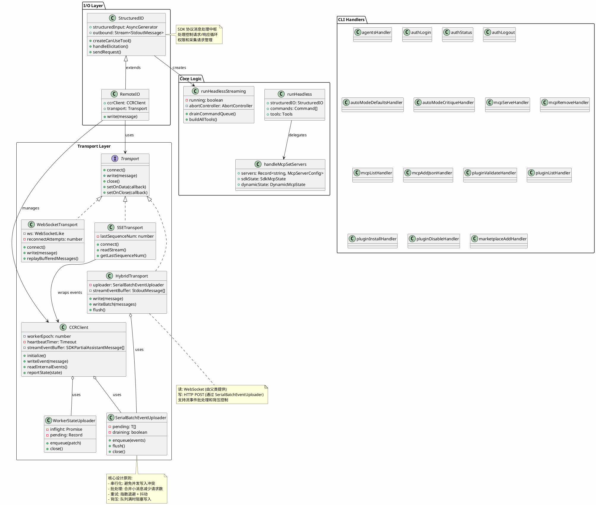
```plantuml
@startuml
skinparam backgroundColor #FEFEFE
skinparam componentStyle rectangle

package "CLI Handlers" {
    class "agentsHandler" as AH
    class "authLogin" as AL
    class "authStatus" as AS
    class "authLogout" as ALO
    class "autoModeDefaultsHandler" as AMDH
    class "autoModeCritiqueHandler" as AMCH
    class "mcpServeHandler" as MSH
    class "mcpRemoveHandler" as MRH
    class "mcpListHandler" as MLH
    class "mcpAddJsonHandler" as MAJH
    class "pluginValidateHandler" as PVH
    class "pluginListHandler" as PLH
    class "pluginInstallHandler" as PIH
    class "pluginDisableHandler" as PDH
    class "marketplaceAddHandler" as MAPH
}

package "I/O Layer" {
    class "StructuredIO" as SIO {
        +structuredInput: AsyncGenerator
        +outbound: Stream<StdoutMessage>
        +createCanUseTool()
        +handleElicitation()
        +sendRequest()
    }
    
    class "RemoteIO" as RIO {
        +ccrClient: CCRClient
        +transport: Transport
        +write(message)
    }
    
    SIO <|-- RIO : extends
}

package "Transport Layer" <<Rectangle>> {
    interface "Transport" as T {
        +connect()
        +write(message)
        +close()
        +setOnData(callback)
        +setOnClose(callback)
    }
    
    class "WebSocketTransport" as WST {
        -ws: WebSocketLike
        -reconnectAttempts: number
        +connect()
        +write(message)
        +replayBufferedMessages()
    }
    
    class "SSETransport" as SSET {
        -lastSequenceNum: number
        +connect()
        +readStream()
        +getLastSequenceNum()
    }
    
    class "HybridTransport" as HT {
        -uploader: SerialBatchEventUploader
        -streamEventBuffer: StdoutMessage[]
        +write(message)
        +writeBatch(messages)
        +flush()
    }
    
    class "SerialBatchEventUploader" as SBEU {
        -pending: T[]
        -draining: boolean
        +enqueue(events)
        +flush()
        +close()
    }
    
    class "WorkerStateUploader" as WSU {
        -inflight: Promise
        -pending: Record
        +enqueue(patch)
        +close()
    }
    
    class "CCRClient" as CCR {
        -workerEpoch: number
        -heartbeatTimer: Timeout
        -streamEventBuffer: SDKPartialAssistantMessage[]
        +initialize()
        +writeEvent(message)
        +readInternalEvents()
        +reportState(state)
    }
    
    T <|.. WST
    T <|.. SSET
    T <|.. HT
    HT o-- SBEU : uses
    CCR o-- SBEU : uses
    CCR o-- WSU : uses
}

package "Core Logic" {
    class "runHeadless" as RH {
        +structuredIO: StructuredIO
        +commands: Command[]
        +tools: Tools
    }
    
    class "runHeadlessStreaming" as RHS {
        -running: boolean
        -abortController: AbortController
        +drainCommandQueue()
        +buildAllTools()
    }
    
    class "handleMcpSetServers" as HMS {
        +servers: Record<string, McpServerConfig>
        +sdkState: SdkMcpState
        +dynamicState: DynamicMcpState
    }
}

SIO --> RHS : creates
RH --> HMS : delegates
RIO --> CCR : manages
RIO --> T : uses
SSET --> CCR : wraps events

note right of SIO
  SDK 协议消息处理中枢
  处理控制请求/响应循环
  权限和采集请求管理
end note

note bottom of HT
  读: WebSocket (由父类提供)
  写: HTTP POST (通过 SerialBatchEventUploader)
  支持流事件批处理和背压控制
end note

note bottom of SBEU
  核心设计原则:
  - 串行化: 避免并发写入冲突
  - 批处理: 合并小消息减少请求数
  - 重试: 指数退避 + 抖动
  - 背压: 队列满时阻塞写入
end note

@enduml
```

**类图设计原则分析：**

1. **单一职责原则 (SRP)**：
   - `StructuredIO` 专注协议消息处理
   - `Transport` 接口仅定义传输能力
   - `SerialBatchEventUploader` 独立处理重试逻辑

2. **开闭原则 (OCP)**：
   - 新增传输协议只需实现 `Transport` 接口
   - `getTransportForUrl()` 根据 URL 动态选择

3. **依赖倒置 (DIP)**：
   - `HybridTransport` 依赖抽象的 `SerialBatchEventUploader`
   - `RemoteIO` 通过接口使用 `Transport`

---

#### 3.3.4.2 关键时序图 (Key Sequence Diagram)

#### 场景：`claude mcp list` 命令执行流程

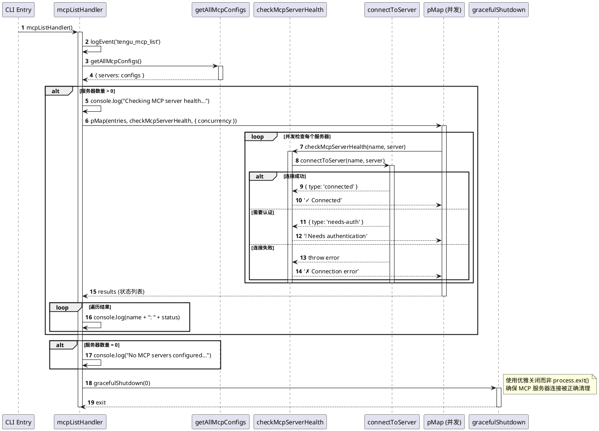
```plantuml
@startuml
autonumber
participant "CLI Entry" as CLI
participant "mcpListHandler" as MLH
participant "getAllMcpConfigs" as GAC
participant "checkMcpServerHealth" as CSH
participant "connectToServer" as CTS
participant "pMap (并发)" as PM
participant "gracefulShutdown" as GS

CLI -> MLH : mcpListHandler()
activate MLH

MLH -> MLH : logEvent('tengu_mcp_list')

MLH -> GAC : getAllMcpConfigs()
activate GAC
GAC --> MLH : { servers: configs }
deactivate GAC

alt 服务器数量 > 0
    MLH -> MLH : console.log("Checking MCP server health...")
    
    MLH -> PM : pMap(entries, checkMcpServerHealth, { concurrency })
    activate PM
    
    loop 并发检查每个服务器
        PM -> CSH : checkMcpServerHealth(name, server)
        activate CSH
        
        CSH -> CTS : connectToServer(name, server)
        activate CTS
        
        alt 连接成功
            CTS --> CSH : { type: 'connected' }
            CSH --> PM : '✓ Connected'
        else 需要认证
            CTS --> CSH : { type: 'needs-auth' }
            CSH --> PM : '! Needs authentication'
        else 连接失败
            CTS --> CSH : throw error
            CSH --> PM : '✗ Connection error'
        end
        
        deactivate CTS
        deactivate CSH
    end
    
    PM --> MLH : results (状态列表)
    deactivate PM
    
    loop 遍历结果
        MLH -> MLH : console.log(name + ": " + status)
    end
end

alt 服务器数量 = 0
    MLH -> MLH : console.log("No MCP servers configured...")
end

MLH -> GS : gracefulShutdown(0)
activate GS
note right
  使用优雅关闭而非 process.exit()
  确保 MCP 服务器连接被正确清理
end note
GS --> MLH : exit
deactivate GS

deactivate MLH

@enduml
```

**时序图分析：**

| 交互特征 | 说明 |
|---------|------|
| **并发健康检查** | 使用 `pMap` 并发检查多个 MCP 服务器，提升响应速度 |
| **优雅关闭** | 使用 `gracefulShutdown(0)` 而非 `process.exit()` 确保资源清理 |
| **错误隔离** | 单个服务器失败不影响其他服务器状态的展示 |
| **日志追踪** | 每个关键步骤都有 `logEvent` 记录用于分析 |

---

#### 场景：SDK 初始化请求处理

```plantuml
@startuml
autonumber
participant "StructuredIO" as SIO
participant "handleInitializeRequest" as HIR
participant "parseAgentsFromJson" as PAJ
participant "registerHookCallbacks" as RHC
participant "setInitJsonSchema" as SIS
participant "output" as OUT

SIO -> HIR : process control_request(initialize)
activate HIR

alt 已初始化
    HIR -> OUT : enqueue error response (Already initialized)
    HIR --> SIO : return
end

HIR -> HIR : request.systemPrompt !== undefined?

HIR -> HIR : request.agents?
HIR -> PAJ : parseAgentsFromJson(request.agents, 'flagSettings')
PAJ --> HIR : stdinAgents[]
HIR -> HIR : agents.push(...stdinAgents)

HIR -> HIR : request.hooks?
loop 遍历每个 hook
    HIR -> HIR : createHookCallback(matcher)
end
HIR -> RHC : registerHookCallbacks(hooks)
activate RHC
deactivate RHC

HIR -> SIS : setInitJsonSchema(request.jsonSchema)
activate SIS
deactivate SIS

HIR -> HIR : build initResponse
note right
  initResponse 包含:
  - commands (可调用命令列表)
  - agents (可用 agent 列表)
  - models (模型选项)
  - account (账户信息)
  - output_style (输出样式)
end

HIR -> OUT : enqueue success response
activate OUT
deactivate OUT

deactivate HIR

@enduml
```

---

#### 3.3.4.3 核心逻辑流程图/活动图 (Activity Diagram)

#### 场景：handleMcpSetServers 动态 MCP 配置处理

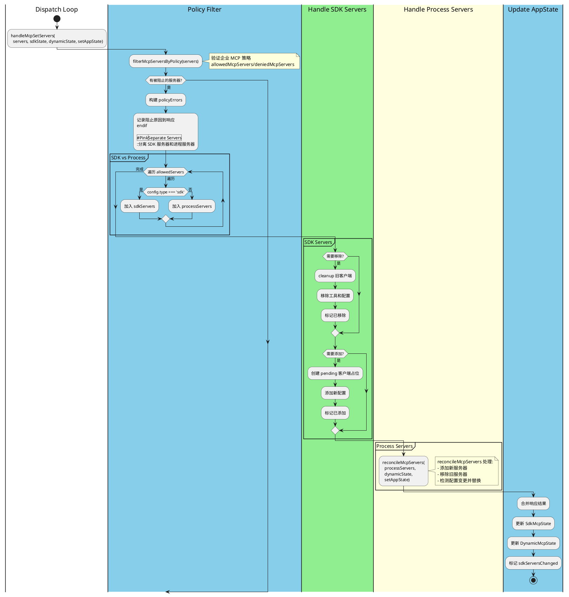
```plantuml
@startuml
|Dispatch Loop|
start
:handleMcpSetServers(
  servers, sdkState, dynamicState, setAppState);

|#SkyBlue|Policy Filter|
:filterMcpServersByPolicy(servers);
note right
  验证企业 MCP 策略
  allowedMcpServers/deniedMcpServers
end note

if (有被阻止的服务器?) then (是)
  :构建 policyErrors;
  :记录阻止原因到响应
endif

|#Pink|Separate Servers|
:分离 SDK 服务器和进程服务器;
partition "SDK vs Process" {
  while (遍历 allowedServers) is (遍历)
    if (config.type === 'sdk') then (是)
      :加入 sdkServers;
    else (否)
      :加入 processServers;
    endif
  end while (完成)
}

|#LightGreen|Handle SDK Servers|
partition "SDK Servers" {
  if (需要移除?) then (是)
    :cleanup 旧客户端;
    :移除工具和配置;
    :标记已移除;
  endif
  
  if (需要添加?) then (是)
    :创建 pending 客户端占位;
    :添加新配置;
    :标记已添加;
  endif
}

|#LightYellow|Handle Process Servers|
partition "Process Servers" {
  :reconcileMcpServers(
    processServers, 
    dynamicState, 
    setAppState);
  note right
    reconcileMcpServers 处理:
    - 添加新服务器
    - 移除旧服务器
    - 检测配置变更并替换
  end note
}

|#SkyBlue|Update AppState|
:合并响应结果;
:更新 SdkMcpState;
:更新 DynamicMcpState;
:标记 sdkServersChanged;

stop

@enduml
```

**活动图设计分析：**

| 设计考量 | 说明 |
|---------|------|
| **策略先行** | 企业策略过滤作为入口，确保安全边界 |
| **类型分离** | SDK 服务器和进程服务器采用不同处理路径 |
| **幂等操作** | 支持增量更新，避免全量刷新 |
| **状态合并** | 合并多个来源的状态变更，保证原子性 |

---

#### 3.3.4.4 实体关系图 (ER Diagram)

根据代码分析，`src/cli` 模块**不涉及持久化实体**，其主要数据模型为内存中的运行时状态：

```
┌─────────────────────────────────────────────────────────────┐
│                  运行时数据模型 (Memory Only)                 │
├─────────────────────────────────────────────────────────────┤
│                                                              │
│  StructuredIO                                                │
│  ├── input: AsyncIterable<string>                          │
│  ├── pendingRequests: Map<requestId, PendingRequest>       │
│  ├── resolvedToolUseIds: Set<string>                       │
│  └── outbound: Stream<StdoutMessage>                       │
│                                                              │
│  RemoteIO                                                    │
│  ├── url: URL                                               │
│  ├── transport: Transport                                   │
│  ├── ccrClient: CCRClient | null                           │
│  └── keepAliveTimer: Timeout | null                        │
│                                                              │
│  CCRClient                                                  │
│  ├── workerEpoch: number                                    │
│  ├── streamEventBuffer: SDKPartialAssistantMessage[]       │
│  ├── streamTextAccumulator: StreamAccumulatorState           │
│  ├── eventUploader: SerialBatchEventUploader               │
│  └── internalEventUploader: SerialBatchEventUploader        │
│                                                              │
│  DynamicMcpState                                             │
│  ├── clients: MCPServerConnection[]                          │
│  ├── tools: Tools                                            │
│  └── configs: Record<string, ScopedMcpServerConfig>        │
│                                                              │
└─────────────────────────────────────────────────────────────┘
```

**说明**：CLI 模块的数据模型均为内存中的运行时状态，无数据库持久化需求。持久化逻辑由上层模块（如 `src/utils/sessionStorage.ts`）负责。

---

### 3.3.6. 接口设计

#### 3.3.6.1 对外接口 (Public APIs)

#### StructuredIO 类

| 属性 | 值 |
|------|-----|
| **文件位置** | [structuredIO.ts](./structuredIO.ts) |
| **功能概述** | SDK 协议消息处理中枢，处理控制请求/响应循环、权限请求、采集请求 |

| 方法名称 | `createCanUseTool()` |
|---------|---------------------|
| **功能概述** | 创建工具权限检查函数，支持 hook 拦截和 SDK 远程授权 |
| **参数列表** | `onPermissionPrompt?: (details: RequiresActionDetails) => void` |
| **返回值** | `CanUseToolFn` - 异步权限检查函数 |
| **异常处理** | 无直接异常；内部 `sendRequest` 失败时通过 AbortError 中断 |

| 方法名称 | `handleElicitation()` |
|---------|---------------------|
| **功能概述** | 向 SDK 消费者发送采集请求（表单/URL）并等待响应 |
| **参数列表** | `(serverName, message, requestedSchema?, signal?, mode?, url?, elicitationId?)` |
| **返回值** | `Promise<ElicitResult>` - 包含 `action: 'allow' | 'cancel'` |
| **异常处理** | 请求失败时返回 `{ action: 'cancel' }` |

#### SerialBatchEventUploader 类

| 属性 | 值 |
|------|-----|
| **文件位置** | [transports/SerialBatchEventUploader.ts](./transports/SerialBatchEventUploader.ts) |
| **功能概述** | 串行化批量事件上传器，支持批处理、重试、背压控制 |

| 方法名称 | `enqueue()` |
|---------|------------|
| **功能概述** | 添加事件到待上传缓冲区，支持背压控制 |
| **参数列表** | `events: T \| T[]` |
| **返回值** | `Promise<void>` |
| **异常处理** | 缓冲区满时阻塞等待；已关闭时静默忽略 |

| 方法名称 | `flush()` |
|---------|----------|
| **功能概述** | 阻塞直到所有待处理事件已发送 |
| **参数列表** | 无 |
| **返回值** | `Promise<void>` |
| **异常处理** | 无；即使部分发送失败也正常解析 |

#### CCRClient 类

| 属性 | 值 |
|------|-----|
| **文件位置** | [transports/ccrClient.ts](./transports/ccrClient.ts) |
| **功能概述** | CCR v2 工作者生命周期管理，处理心跳、状态上报、事件读写 |

| 方法名称 | `initialize()` |
|---------|--------------|
| **功能概述** | 初始化工作者：读取 epoch、报告空闲状态、启动心跳 |
| **参数列表** | `epoch?: number` |
| **返回值** | `Promise<Record<string, unknown> \| null>` - 恢复的元数据 |
| **异常处理** | `CCRInitError` - 包含失败原因 |

| 方法名称 | `writeEvent()` |
|---------|--------------|
| **功能概述** | 写入客户端事件到 CCR，支持流事件批处理和文本累积 |
| **参数列表** | `message: StdoutMessage` |
| **返回值** | `Promise<void>` |
| **异常处理** | 内部队列重试，持久失败时日志记录 |

---

#### 3.3.6.2 内部关键交互 (Key Internal Interactions)

#### 交互 1：StructuredIO 控制请求/响应循环

```
┌──────────────┐     sendRequest()      ┌──────────────────┐
│   Caller     │ ─────────────────────> │ StructuredIO     │
│              │                        │                  │
│              │ <───────────────────── │ pendingRequests  │
│              │    返回 Promise         │ 保存 resolve     │
└──────────────┘                        └────────┬─────────┘
                                                 │
                           ┌─────────────────────┼─────────────────────┐
                           │ processLine()       │                     │
                           ▼                     ▼                     │
                    ┌──────────────┐     ┌──────────────┐           │
                    │ JSON 解析    │     │ 过滤 keep_alive│           │
                    └──────┬───────┘     └──────────────┘           │
                           ▼                                         │
                    ┌──────────────┐                                 │
                    │ 类型判断     │                                 │
                    │ control_request / user / ... │                 │
                    └──────┬───────┘                                 │
                           │                                         │
           ┌───────────────┼───────────────┐                        │
           ▼               ▼               ▼                        │
    ┌────────────┐  ┌────────────┐  ┌────────────┐                │
    │ control_  │  │   user     │  │ assistant/ │                │
    │ request   │  │   message  │  │ system     │                │
    └─────┬──────┘  └────────────┘  └────────────┘                │
          │                                                       │
          │ resolve(result)                                        │
          ▼                                                       │
    pendingRequests ◄─────────────────────────────────────────────┘
```

**关键性分析**：此交互实现了同步请求/异步响应的 SDK 协议模式，确保每个请求都能正确路由并等待响应。

#### 交互 2：HybridTransport 写路径

```
write(stream_event)
       │
       ▼
┌──────────────────┐
│ 推入 buffer     │ ◄── 100ms 定时器
└────────┬─────────┘
         │ flush 时
         ▼
┌──────────────────┐     enqueue()
│ takeStreamEvents │ ──────────────► SerialBatchEventUploader
└──────────────────┘                  │
                                     │ 串行化队列
                                     ▼
                              ┌─────────────────┐
                              │ send() HTTP POST │
                              └────────┬────────┘
                                       │
                         ┌─────────────┼─────────────┐
                         ▼             ▼             ▼
                    成功            429/5xx        4xx
                         │             │             │
                         ▼             ▼             ▼
                   ✓ 继续          重试          丢弃
                                     │ (指数退避)
                                     └────► 重新入队
```

**关键性分析**：HybridTransport 的分离读写路径避免了并发写入冲突，SerialBatchEventUploader 提供了可靠的重试保证。

---

### 3.3.8. 关键数据结构与模型

#### 3.3.8.1 StructuredIO 类

```typescript
// 定义位置: structuredIO.ts
export class StructuredIO {
    readonly structuredInput: AsyncGenerator<StdinMessage | SDKMessage>
    private readonly pendingRequests = new Map<string, PendingRequest<unknown>>()
    
    // CCR 外部元数据读取
    restoredWorkerState: Promise<SessionExternalMetadata | null> = Promise.resolve(null)
    
    // 已解决的 tool_use ID 追踪
    private readonly resolvedToolUseIds = new Set<string>()
    
    // 预追加行（用于初始化消息）
    private prependedLines: string[] = []
    
    // 出站消息流
    readonly outbound = new Stream<StdoutMessage>()
    
    constructor(
        private readonly input: AsyncIterable<string>,
        private readonly replayUserMessages?: boolean
    ) { /* ... */ }
}
```

#### 3.3.8.2 SerialBatchEventUploader 配置

```typescript
// 定义位置: SerialBatchEventUploader.ts
type SerialBatchEventUploaderConfig<T> = {
    maxBatchSize: number        // 每次 POST 最大条目数
    maxBatchBytes?: number     // 最大字节数限制
    maxQueueSize: number        // 队列满时阻塞阈值
    send: (batch: T[]) => Promise<void>  // 实际 HTTP 发送函数
    baseDelayMs: number         // 退避基准延迟
    maxDelayMs: number          // 最大延迟上限
    jitterMs: number            // 抖动范围
    maxConsecutiveFailures?: number  // 最大连续失败次数
    onBatchDropped?: (batchSize: number, failures: number) => void
}
```

#### 3.3.8.3 CCRClient 状态

```typescript
// 定义位置: ccrClient.ts
export type StreamAccumulatorState = {
    // API 消息 ID → 文本块累积器
    byMessage: Map<string, string[][]>
    // 作用域键 → 活跃消息 ID
    scopeToMessage: Map<string, string>
}
```

#### 3.3.8.4 DynamicMcpState

```typescript
// 定义位置: print.ts
export type DynamicMcpState = {
    clients: MCPServerConnection[]                    // 动态添加的客户端
    tools: Tools                                      // 动态工具列表
    configs: Record<string, ScopedMcpServerConfig>   // 动态配置
}
```

---

## 3.4. Bridge模块实现设计文档

### 3.4.1. 模块介绍

#### 3.4.1.1 用途与定位

`src/bridge` 模块是 Claude Code CLI 的远程控制（Remote Control）功能的核心实现。该模块使本地运行的 Claude Code 会话能够通过云端服务（claude.ai/code）与 Web 端或移动端应用进行双向通信，让用户能够在任何设备上继续本地已启动的工作会话。

#### 3.4.1.2 在系统中的定位

Bridge 模块位于 Claude Code 的核心层与外部服务层之间，扮演着 **本地会话与云端编排系统之间的桥梁** 角色：

```
┌─────────────────────────────────────────────────────────────┐
│                    Claude Code CLI                          │
│  ┌─────────────────────────────────────────────────────┐   │
│  │                  src/bridge 模块                      │   │
│  │  • 会话生命周期管理                                    │   │
│  │  • 与 CCR 服务双向通信                                │   │
│  │  • 子进程会话管理                                     │   │
│  │  • 消息转发与事件处理                                 │   │
│  └─────────────────────────────────────────────────────┘   │
└─────────────────────────────────────────────────────────────┘
                           │
                           ▼
┌─────────────────────────────────────────────────────────────┐
│              CCR (Claude Remote Control) 服务                  │
│  • 会话编排    • Web/移动端订阅    • 权限管理                 │
└─────────────────────────────────────────────────────────────┘
```

#### 3.4.1.3 主要职责

1. **会话管理**：创建、归档、恢复远程控制会话
2. **工作分发**：通过轮询（v1）或直接连接（v2）获取云端分配的工作项
3. **消息路由**：将本地 REPL 事件转发至云端，同时将云端用户输入回传至本地
4. **传输层抽象**：封装 v1（WebSocket + HTTP POST）和 v2（SSE + CCRClient）两种传输协议
5. **容错恢复**：处理网络中断、会话过期、令牌刷新等异常情况

#### 3.4.1.4 模块路径

`src/bridge`

---

### 3.4.2. 功能描述

#### 3.4.2.1 核心功能列表

| 功能名称 | 功能描述 | 实现位置 |
|---------|---------|---------|
| **环境注册与注销** | 将本地 Bridge 注册到 CCR 服务，获取 environment_id 和 secret | [bridgeApi.ts](./bridgeApi.ts) - `registerBridgeEnvironment` |
| **工作轮询** | 定时向 CCR 轮询新工作项（用户输入、会话控制请求） | [bridgeApi.ts](./bridgeApi.ts) - `pollForWork` |
| **会话创建** | 通过 POST /v1/sessions 创建远程控制会话 | [createSession.ts](./createSession.ts) - `createBridgeSession` |
| **会话归档** | 关闭时归档会话，标记为非活跃状态 | [createSession.ts](./createSession.ts) - `archiveBridgeSession` |
| **入口消息处理** | 解析并路由来自 WebSocket/SSE 的入站消息 | [bridgeMessaging.ts](./bridgeMessaging.ts) - `handleIngressMessage` |
| **权限回调** | 处理云端权限请求并返回决策 | [bridgePermissionCallbacks.ts](./bridgePermissionCallbacks.ts) |
| **子进程会话管理** | spawn 并管理 Claude Code 子进程处理工作项 | [sessionRunner.ts](./sessionRunner.ts) - `createSessionSpawner` |
| **传输层抽象** | 统一 v1/v2 传输协议的接口差异 | [replBridgeTransport.ts](./replBridgeTransport.ts) |
| **令牌刷新** | 主动刷新即将过期的 JWT 令牌 | [jwtUtils.ts](./jwtUtils.ts) - `createTokenRefreshScheduler` |
| **会话恢复指针** | 崩溃恢复机制，保存会话信息供下次启动恢复 | [bridgePointer.ts](./bridgePointer.ts) |
| **Env-less 连接** | v2 路径：跳过 Environments API 层直接连接 | [remoteBridgeCore.ts](./remoteBridgeCore.ts) - `initEnvLessBridgeCore` |
| **Env-based 连接** | v1 路径：通过 Environments API 层的轮询-分发机制 | [replBridge.ts](./replBridge.ts) - `initBridgeCore` |
| **入站附件解析** | 下载并解析 Web 端上传的文件附件 | [inboundAttachments.ts](./inboundAttachments.ts) |
| **可信设备认证** | 管理 X-Trusted-Device-Token 用于 ELEVATED 安全层级会话 | [trustedDevice.ts](./trustedDevice.ts) |
| **特性门控** | GrowthBook 驱动的功能开关检查 | [bridgeEnabled.ts](./bridgeEnabled.ts) |

---

### 3.4.3. 模块文件夹详细结构及功能介绍

```
src/bridge/
├── bridgeApi.ts           # CCR REST API 客户端封装
├── bridgeConfig.ts       # 认证和 URL 配置解析
├── bridgeDebug.ts        # Ant-only 故障注入调试工具
├── bridgeEnabled.ts      # GrowthBook 特性门控检查
├── bridgeMain.ts         # 独立 Bridge 入口（standalone mode）
├── bridgeMessaging.ts     # 传输层消息处理公共逻辑
├── bridgePermissionCallbacks.ts  # 权限回调类型定义
├── bridgePointer.ts      # 崩溃恢复会话指针
├── bridgeStatusUtil.ts   # 状态显示工具函数
├── bridgeUI.ts           # CLI TUI 日志输出
├── capacityWake.ts       # 容量唤醒信号原语
├── codeSessionApi.ts     # CCR v2 /code/sessions API 封装
├── createSession.ts      # 会话创建/归档/获取 API
├── debugUtils.ts         # 调试日志和错误处理工具
├── envLessBridgeConfig.ts # v2 Env-less 路径配置
├── flushGate.ts          # 初始消息刷屏状态机
├── inboundAttachments.ts  # 入站文件附件解析
├── inboundMessages.ts    # 入站消息内容提取
├── initReplBridge.ts     # REPL Bridge 初始化入口
├── jwtUtils.ts           # JWT 编解码和令牌刷新调度器
├── pollConfig.ts         # 轮询间隔配置（GrowthBook）
├── pollConfigDefaults.ts # 轮询配置默认值
├── remoteBridgeCore.ts   # v2 Env-less 核心实现
├── replBridge.ts         # v1 Env-based 核心实现
├── replBridgeHandle.ts   # 全局 Bridge 句柄指针
├── replBridgeTransport.ts # 传输层抽象（v1/v2 适配器）
├── sessionIdCompat.ts    # cse_/session_ ID 标签转换
├── sessionRunner.ts      # 子进程会话 spawner
├── trustedDevice.ts      # 可信设备令牌管理
├── types.ts              # 类型定义和接口
└── workSecret.ts         # 工作密钥解码和 URL 构建
```

#### 3.4.3.1 文件夹功能总结

| 文件夹 | 内部文件功能 | 文件夹职责 |
|-------|-------------|-----------|
| **API 层** | `bridgeApi.ts`, `codeSessionApi.ts`, `createSession.ts` | 封装与 CCR 服务的所有 HTTP/REST 通信 |
| **配置层** | `bridgeConfig.ts`, `envLessBridgeConfig.ts`, `pollConfig.ts`, `pollConfigDefaults.ts` | 管理配置获取、默认值和 GrowthBook 集成 |
| **核心实现** | `replBridge.ts`, `remoteBridgeCore.ts`, `bridgeMain.ts` | 实现两种连接路径的轮询循环和会话管理 |
| **传输层** | `replBridgeTransport.ts`, `bridgeMessaging.ts` | 抽象 v1/v2 传输协议差异，提供统一接口 |
| **会话管理** | `sessionRunner.ts`, `bridgePointer.ts` | 子进程 spawn 和崩溃恢复机制 |
| **令牌管理** | `jwtUtils.ts`, `trustedDevice.ts` | JWT 刷新和可信设备认证 |
| **UI/日志** | `bridgeUI.ts`, `bridgeStatusUtil.ts`, `debugUtils.ts` | 命令行界面输出和调试日志 |
| **工具层** | `inboundMessages.ts`, `inboundAttachments.ts`, `sessionIdCompat.ts`, `flushGate.ts`, `capacityWake.ts` | 消息解析、附件下载、ID 兼容、状态机、信号原语 |
| **入口层** | `initReplBridge.ts`, `bridgeEnabled.ts` | REPL 初始化流程和特性门控 |
| **调试层** | `bridgeDebug.ts` | Ant-only 故障注入 |
| **类型定义** | `types.ts` | 所有核心类型的单一真实来源 |

---

### 3.4.4. 架构与设计图谱

#### 3.4.4.1 类图 (Class Diagram)


```plantuml
@startuml
skinparam backgroundColor #FEFEFE
skinparam componentStyle rectangle

' ===== Types / Interfaces =====
package "types.ts" {
  interface "BridgeApiClient" as I_BridgeApiClient {
    + registerBridgeEnvironment()
    + pollForWork()
    + acknowledgeWork()
    + stopWork()
    + deregisterEnvironment()
    + archiveSession()
    + reconnectSession()
    + heartbeatWork()
    + sendPermissionResponseEvent()
  }
  
  interface "BridgeLogger" as I_BridgeLogger {
    + printBanner()
    + logSessionStart()
    + logSessionComplete()
    + logSessionFailed()
    + updateIdleStatus()
    + setAttached()
    + setSessionTitle()
    + toggleQr()
    + updateSessionCount()
    + addSession()
    + removeSession()
  }
  
  interface "ReplBridgeTransport" as I_Transport {
    + write()
    + writeBatch()
    + close()
    + connect()
    + setOnData()
    + setOnClose()
    + setOnConnect()
    + getLastSequenceNum()
    + isConnectedStatus()
    + reportState()
  }
  
  interface "SessionSpawner" as I_Spawner {
    + spawn()
  }
  
  class "SessionHandle" as C_SessionHandle {
    + sessionId: string
    + done: Promise<SessionDoneStatus>
    + currentActivity: SessionActivity | null
    + accessToken: string
    + activities: SessionActivity[]
    + lastStderr: string[]
    + kill()
    + forceKill()
    + writeStdin()
    + updateAccessToken()
  }
  
  class "BridgeConfig" as C_BridgeConfig {
    + dir: string
    + machineName: string
    + branch: string
    + gitRepoUrl: string | null
    + maxSessions: number
    + spawnMode: SpawnMode
    + environmentId: string
    + apiBaseUrl: string
    + sessionIngressUrl: string
  }
}

' ===== API & Session =====
package "bridgeApi.ts" {
  class "createBridgeApiClient" as F_createBridgeApiClient {
    + registerBridgeEnvironment()
    + pollForWork()
    + acknowledgeWork()
    + stopWork()
    + deregisterEnvironment()
    + archiveSession()
    + reconnectSession()
    + heartbeatWork()
    + sendPermissionResponseEvent()
  }
  
  class "BridgeFatalError" as C_BridgeFatalError {
    + status: number
    + errorType: string | undefined
  }
  
  class "validateBridgeId" as F_validateBridgeId
}

package "createSession.ts" {
  class "createBridgeSession" as F_createBridgeSession
  class "getBridgeSession" as F_getBridgeSession
  class "archiveBridgeSession" as F_archiveBridgeSession
  class "updateBridgeSessionTitle" as F_updateBridgeSessionTitle
}

package "codeSessionApi.ts" {
  class "createCodeSession" as F_createCodeSession
  class "fetchRemoteCredentials" as F_fetchRemoteCredentials
}

' ===== Core Bridge =====
package "replBridge.ts" {
  class "initBridgeCore" as F_initBridgeCore {
    + initBridgeCore()
    + startWorkPollLoop()
  }
  
  class "ReplBridgeHandle" as C_ReplBridgeHandle {
    + bridgeSessionId
    + environmentId
    + writeMessages()
    + writeSdkMessages()
    + sendControlRequest()
    + sendControlResponse()
    + sendResult()
    + teardown()
  }
}

package "remoteBridgeCore.ts" {
  class "initEnvLessBridgeCore" as F_initEnvLessBridgeCore
}

package "bridgeMain.ts" {
  class "runBridgeLoop" as F_runBridgeLoop
  class "runBridgeHeadless" as F_runBridgeHeadless
  class "bridgeMain" as F_bridgeMain
}

package "initReplBridge.ts" {
  class "initReplBridge" as F_initReplBridge
}

' ===== Transport =====
package "replBridgeTransport.ts" {
  class "createV1ReplTransport" as F_createV1ReplTransport
  class "createV2ReplTransport" as F_createV2ReplTransport
}

' ===== Utilities =====
package "jwtUtils.ts" {
  class "createTokenRefreshScheduler" as F_createTokenRefreshScheduler
  class "decodeJwtPayload" as F_decodeJwtPayload
  class "decodeJwtExpiry" as F_decodeJwtExpiry
}

package "sessionRunner.ts" {
  class "createSessionSpawner" as F_createSessionSpawner
  class "safeFilenameId" as F_safeFilenameId
}

package "bridgePointer.ts" {
  class "writeBridgePointer" as F_writeBridgePointer
  class "readBridgePointer" as F_readBridgePointer
  class "clearBridgePointer" as F_clearBridgePointer
  class "readBridgePointerAcrossWorktrees" as F_readBridgePointerAcrossWorktrees
}

package "bridgeMessaging.ts" {
  class "BoundedUUIDSet" as C_BoundedUUIDSet {
    + add()
    + has()
    + clear()
  }
  class "handleIngressMessage" as F_handleIngressMessage
  class "handleServerControlRequest" as F_handleServerControlRequest
  class "makeResultMessage" as F_makeResultMessage
  class "extractTitleText" as F_extractTitleText
}

package "flushGate.ts" {
  class "FlushGate" as C_FlushGate {
    + active: boolean
    + pendingCount: number
    + start()
    + end()
    + enqueue()
    + drop()
    + deactivate()
  }
}

package "capacityWake.ts" {
  class "createCapacityWake" as F_createCapacityWake {
    + signal()
    + wake()
  }
}

package "sessionIdCompat.ts" {
  class "toCompatSessionId" as F_toCompatSessionId
  class "toInfraSessionId" as F_toInfraSessionId
}

package "workSecret.ts" {
  class "decodeWorkSecret" as F_decodeWorkSecret
  class "buildSdkUrl" as F_buildSdkUrl
  class "buildCCRv2SdkUrl" as F_buildCCRv2SdkUrl
  class "registerWorker" as F_registerWorker
  class "sameSessionId" as F_sameSessionId
}

' ===== Relationships =====
F_initReplBridge ..> F_initBridgeCore : "delegates to"
F_initReplBridge ..> F_initEnvLessBridgeCore : "or delegates to"

F_initBridgeCore --> F_createBridgeApiClient : "creates"
F_initBridgeCore --> F_createSessionSpawner : "creates"
F_initBridgeCore --> F_createV1ReplTransport : "uses"
F_initBridgeCore --> F_createV2ReplTransport : "uses"
F_initBridgeCore --> F_createTokenRefreshScheduler : "creates"
F_initBridgeCore --> F_writeBridgePointer : "uses"
F_initBridgeCore ..> F_startWorkPollLoop : "contains"

F_initEnvLessBridgeCore --> F_createCodeSession : "creates session"
F_initEnvLessBridgeCore --> F_fetchRemoteCredentials : "fetches creds"
F_initEnvLessBridgeCore --> F_createV2ReplTransport : "creates"

F_createBridgeApiClient ..> C_BridgeFatalError : "throws"
F_createBridgeApiClient ..> F_validateBridgeId : "uses"

I_Transport <|.. F_createV1ReplTransport : "implements"
I_Transport <|.. F_createV2ReplTransport : "implements"

F_createBridgeSession ..> F_getBridgeSession : "uses"
F_createSessionSpawner ..> C_SessionHandle : "returns"

F_bridgeMain ..> F_runBridgeLoop : "calls"
F_runBridgeLoop ..> F_createSessionSpawner : "uses"

F_createCapacityWake ..> C_FlushGate : "composes"
F_initBridgeCore ..> C_FlushGate : "creates"
F_initEnvLessBridgeCore ..> C_FlushGate : "creates"

F_toCompatSessionId ..> F_toInfraSessionId : "paired with"

@enduml
```

**类图说明**：该图展示了 Bridge 模块的核心组件及其关系。模块遵循**接口隔离原则**：`BridgeApiClient`、`BridgeLogger`、`ReplBridgeTransport` 等接口将调用方与具体实现解耦。`initBridgeCore`（v1）和 `initEnvLessBridgeCore`（v2）实现了**策略模式**，根据 GrowthBook 门控选择不同的连接策略。`FlushGate` 和 `BoundedUUIDSet` 等工具类体现了**单一职责原则**，每个类只管理一个关注点。

#### 3.4.4.2 关键时序图 (Key Sequence Diagram)

##### 3.4.4.2.1 REPL Bridge 初始化与工作接收流程

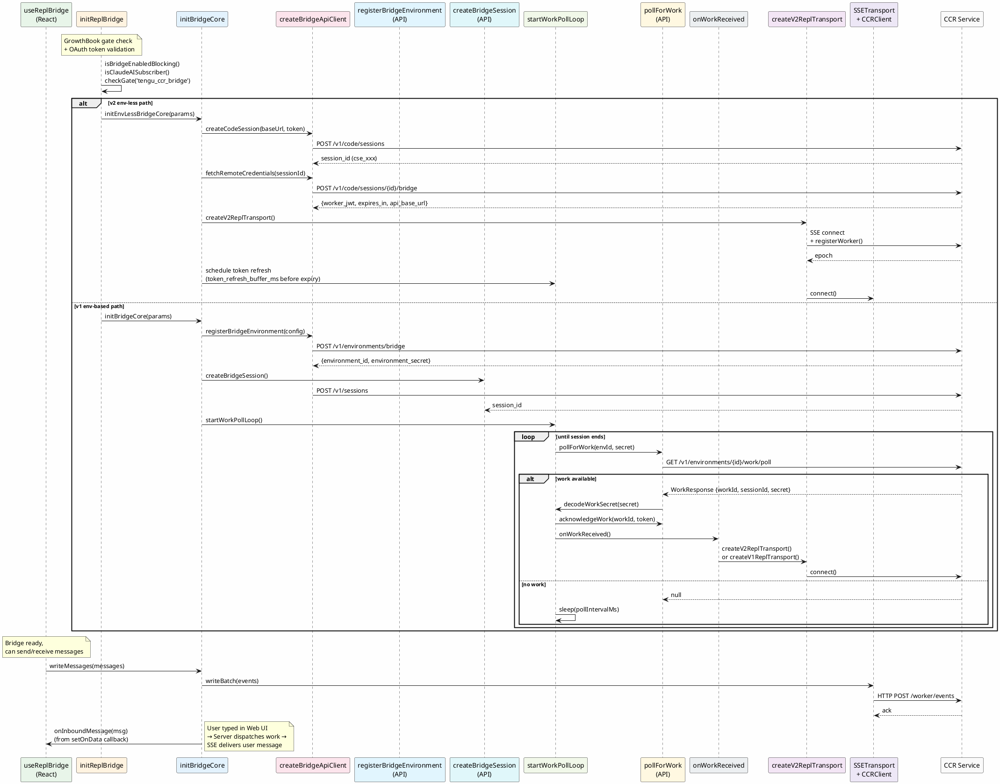
```plantuml
@startuml
skinparam backgroundColor #FEFEFE
participant "useReplBridge\n(React)" as React #E8F5E9
participant "initReplBridge" as InitRepl #FFF3E0
participant "initBridgeCore" as Core #E3F2FD
participant "createBridgeApiClient" as API #FCE4EC
participant "registerBridgeEnvironment\n(API)" as Register #E1F5FE
participant "createBridgeSession\n(API)" as CreateSess #E0F7FA
participant "startWorkPollLoop" as Poll #F1F8E9
participant "pollForWork\n(API)" as PollWork #FFF8E1
participant "onWorkReceived" as OnWork #ECEFF1
participant "createV2ReplTransport" as V2Trans #F3E5F5
participant "SSETransport\n+ CCRClient" as Transport #EDE7F6
participant "CCR Service" as CCR #FAFAFA

note over InitRepl: GrowthBook gate check\n+ OAuth token validation
InitRepl -> InitRepl: isBridgeEnabledBlocking()\nisClaudeAISubscriber()\ncheckGate('tengu_ccr_bridge')

alt v2 env-less path
  InitRepl -> Core: initEnvLessBridgeCore(params)
  Core -> API: createCodeSession(baseUrl, token)
  API -> CCR: POST /v1/code/sessions
  CCR --> API: session_id (cse_xxx)
  Core -> API: fetchRemoteCredentials(sessionId)
  API -> CCR: POST /v1/code/sessions/{id}/bridge
  CCR --> API: {worker_jwt, expires_in, api_base_url}
  Core -> V2Trans: createV2ReplTransport()
  V2Trans -> CCR: SSE connect\n+ registerWorker()
  CCR --> V2Trans: epoch
  Core -> Poll: schedule token refresh\n(token_refresh_buffer_ms before expiry)
  V2Trans -> Transport: connect()
else v1 env-based path
  InitRepl -> Core: initBridgeCore(params)
  Core -> API: registerBridgeEnvironment(config)
  API -> CCR: POST /v1/environments/bridge
  CCR --> API: {environment_id, environment_secret}
  Core -> CreateSess: createBridgeSession()
  API -> CCR: POST /v1/sessions
  CCR --> CreateSess: session_id
  Core -> Poll: startWorkPollLoop()
  loop until session ends
    Poll -> PollWork: pollForWork(envId, secret)
    PollWork -> CCR: GET /v1/environments/{id}/work/poll
    alt work available
      CCR --> PollWork: WorkResponse {workId, sessionId, secret}
      PollWork -> Poll: decodeWorkSecret(secret)
      Poll -> PollWork: acknowledgeWork(workId, token)
      Poll -> OnWork: onWorkReceived()
      OnWork -> V2Trans: createV2ReplTransport()\nor createV1ReplTransport()
      V2Trans -> CCR: connect()
    else no work
      CCR --> PollWork: null
      Poll -> Poll: sleep(pollIntervalMs)
    end
  end
end

note over React: Bridge ready, \ncan send/receive messages
React -> Core: writeMessages(messages)
Core -> Transport: writeBatch(events)
Transport -> CCR: HTTP POST /worker/events
CCR --> Transport: ack

React <- Core: onInboundMessage(msg)\n(from setOnData callback)
note right: User typed in Web UI\n→ Server dispatches work →\nSSE delivers user message

@enduml
```

**时序图说明**：该图展示了 Bridge 初始化的完整流程，包括 v1 和 v2 两条路径的选择逻辑。关键交互点：

1. **门控检查**：初始化首先通过 GrowthBook 验证用户是否有权限使用 Remote Control
2. **环境注册**：v1 路径需要先注册 environment 获取 environment_id
3. **会话创建**：两种路径都创建 CCR 服务端会话，但 API 端点不同（v1 用 /v1/sessions，v2 用 /v1/code/sessions）
4. **工作轮询**：v1 路径的 poll loop 持续运行，v2 路径则直接建立 SSE 长连接
5. **令牌刷新**：两种路径都使用 `createTokenRefreshScheduler` 在 JWT 过期前主动刷新

#### 3.4.4.3 核心逻辑流程图 (Activity Diagram)

##### 3.4.4.3.1 工作轮询循环 (startWorkPollLoop)

```plantuml
@startuml
skinparam backgroundColor #FEFEFE
skinparam activityBorderColor #1976D2
skinparam activityBackgroundColor #E3F2FD

title startWorkPollLoop - 核心工作轮询流程

start
note
  持续运行直到 signal.aborted
  管理连接错误、背压、以及会话容量
end note

while (signal.aborted? = false) is (no)
  :获取当前 credentials\n(environmentId, environmentSecret);

  :调用 pollForWork(environmentId, secret);

  if (work != null?) then (yes)
    #E8F5E9:解析并验证 sessionId;
    :调用 onWorkReceived(sessionId, token, workId);
    :继续轮询循环;
  else (no work available)
    #FFF3E0:检查是否 atCapacity\n(isAtCapacity() = transport != null);
    
    if (atCapacity?) then (yes)
      :获取 pollConfig;
      
      if (heartbeat enabled?\nnon_exclusive_heartbeat_interval_ms > 0) then (yes)
        #BBDEFB:进入 heartbeat 模式;
        note
          - 每 heartbeatIntervalMs 发送一次 heartbeatWork
          - 可选: 每 atCapMs 中断退出进行一次 poll
          - 被 capacitySignal 或 abort 中断时退出
        end note
        
        while (atCapacity && !aborted) is (loop)
          :获取 heartbeatInfo\n(workId, token);
          :调用 heartbeatWork();
          
          if (BridgeFatalError?) then (yes)
            #FFCDD2:调用 onHeartbeatFatal(err);
            :快速轮询恢复;
            detach
          endif;
          
          :sleep(heartbeatIntervalMs, capacitySignal);
        endwhile (exit)
        
        if (poll_due?) then (yes)
          :继续到外层循环\n进行一次 poll;
        endif;
        
      else (heartbeat disabled)
        :sleep(pollIntervalMsAtCapacity, capacitySignal);
      endif;
      
    else (below capacity)
      #E8F5E9:sleep(pollIntervalMsNotAtCapacity);
    endif;
  endif;
  
  detach
endwhile (yes - aborted)

stop

note right of #FFCDD2
  onHeartbeatFatal 处理:
  - 401/403: JWT 过期
  - 404/410: 工作项已删除
  → 关闭 transport
  → 调用 stopWork
  → wakePollLoop() 快速轮询
end note

@enduml
```

**流程图说明**：该图展示了轮询循环的完整控制流。设计亮点：

1. **双重模式**：正常模式（below capacity）使用较短轮询间隔；at-capacity 模式使用心跳延长轮询间隔
2. **非排他心跳**：当 `non_exclusive_heartbeat_interval_ms` > 0 时，心跳和轮询可同时运行
3. **容量信号**：`capacityWake` 机制确保会话结束时立即唤醒轮询
4. **错误恢复**：心跳失败时通过 `onHeartbeatFatal` 触发快速恢复，而非等待长轮询间隔

#### 3.4.4.4 实体关系图 (ER Diagram)

根据代码分析，Bridge 模块**不涉及持久化数据库实体**。其数据模型主要是：

1. **内存中的运行时数据结构**（如 `BridgeConfig`、`SessionHandle`）
2. **JSON 文件**（如 `bridge-pointer.json` 用于崩溃恢复）

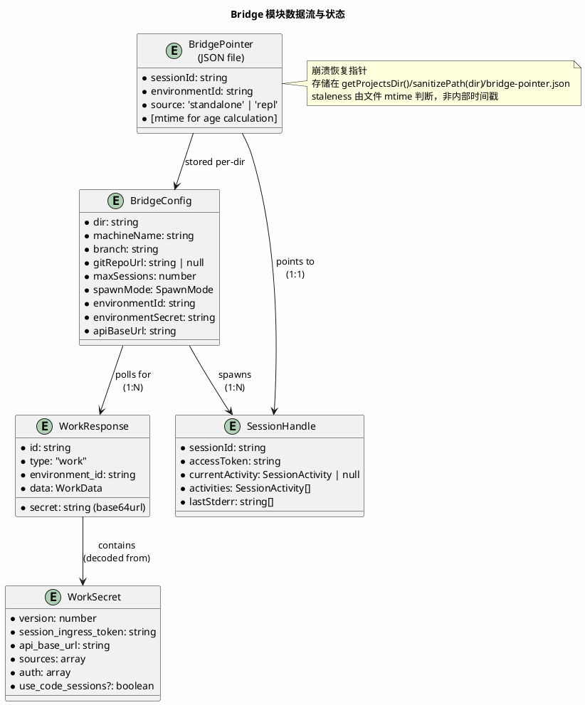
```plantuml
@startuml
skinparam backgroundColor #FEFEFE
skinparam entityBackgroundColor #E3F2FD
skinparam entityBorderColor #1976D2

title Bridge 模块数据流与状态

' BridgeConfig 实体
entity "BridgeConfig" as E_Config {
  * dir: string
  * machineName: string
  * branch: string
  * gitRepoUrl: string | null
  * maxSessions: number
  * spawnMode: SpawnMode
  * environmentId: string
  * environmentSecret: string
  * apiBaseUrl: string
}

' SessionHandle 实体
entity "SessionHandle" as E_Session {
  * sessionId: string
  * accessToken: string
  * currentActivity: SessionActivity | null
  * activities: SessionActivity[]
  * lastStderr: string[]
}

' WorkResponse 实体
entity "WorkResponse" as E_Work {
  * id: string
  * type: "work"
  * environment_id: string
  * data: WorkData
  * secret: string (base64url)
}

' WorkSecret 实体
entity "WorkSecret" as E_Secret {
  * version: number
  * session_ingress_token: string
  * api_base_url: string
  * sources: array
  * auth: array
  * use_code_sessions?: boolean
}

' BridgePointer 文件
entity "BridgePointer\n(JSON file)" as E_Pointer {
  * sessionId: string
  * environmentId: string
  * source: 'standalone' | 'repl'
  * [mtime for age calculation]
}

' 关系
E_Config --> E_Session : "spawns\n(1:N)"
E_Work --> E_Secret : "contains\n(decoded from)"
E_Config --> E_Work : "polls for\n(1:N)"
E_Pointer --> E_Session : "points to\n(1:1)"
E_Pointer --> E_Config : "stored per-dir"

note right of E_Pointer
  崩溃恢复指针
  存储在 getProjectsDir()/sanitizePath(dir)/bridge-pointer.json
  staleness 由文件 mtime 判断，非内部时间戳
end note

@enduml
```

---

### 3.4.6. 接口设计

#### 3.4.6.1 对外接口 (Public APIs)

##### 3.4.6.1.1 `createBridgeApiClient()`

| 属性 | 内容 |
|------|------|
| **文件位置** | [bridgeApi.ts](./bridgeApi.ts) |
| **功能概述** | 创建 CCR REST API 客户端封装实例，提供所有与后端通信的方法 |
| **参数列表** | `deps: BridgeApiDeps` - 包含 baseUrl、getAccessToken、runnerVersion、onDebug、onAuth401、getTrustedDeviceToken |
| **返回值** | `BridgeApiClient` - 包含 registerBridgeEnvironment、pollForWork、acknowledgeWork、stopWork、deregisterEnvironment、archiveSession、reconnectSession、heartbeatWork、sendPermissionResponseEvent |
| **异常处理** | `BridgeFatalError`（401/403/404/410 状态码）；普通 `Error`（429、其他 5xx） |

##### 3.4.6.1.2 `initBridgeCore()`

| 属性 | 内容 |
|------|------|
| **文件位置** | [replBridge.ts](./replBridge.ts) |
| **功能概述** | 初始化 env-based (v1) Bridge 核心，启动轮询循环和工作处理 |
| **参数列表** | `params: BridgeCoreParams` - 包含 dir、machineName、branch、gitRepoUrl、title、baseUrl、sessionIngressUrl、workerType、getAccessToken、createSession、archiveSession、toSDKMessages、onAuth401、getPollIntervalConfig、initialHistoryCap、initialMessages、onInboundMessage、onUserMessage 等 |
| **返回值** | `Promise<BridgeCoreHandle | null>` - 包含 bridgeSessionId、environmentId、writeMessages、writeSdkMessages、sendControlRequest、sendControlResponse、sendResult、teardown、getSSESequenceNum |
| **异常处理** | 返回 null 表示注册或会话创建失败；内部错误通过 `onStateChange` 回调传播 |

##### 3.4.6.1.3 `initEnvLessBridgeCore()`

| 属性 | 内容 |
|------|------|
| **文件位置** | [remoteBridgeCore.ts](./remoteBridgeCore.ts) |
| **功能概述** | 初始化 env-less (v2) Bridge 核心，直接建立 SSE 长连接，跳过 Environments API 层 |
| **参数列表** | `params: EnvLessBridgeParams` - 包含 baseUrl、orgUUID、title、getAccessToken、onAuth401、toSDKMessages、initialHistoryCap、onInboundMessage、onUserMessage、outboundOnly、tags |
| **返回值** | `Promise<ReplBridgeHandle | null>` |
| **异常处理** | 返回 null 表示会话创建或凭证获取失败 |

##### 3.4.6.1.4 `initReplBridge()`

| 属性 | 内容 |
|------|------|
| **文件位置** | [initReplBridge.ts](./initReplBridge.ts) |
| **功能概述** | REPL-specific 初始化入口，负责门控检查、OAuth 验证、标题推导，然后委托给 initBridgeCore 或 initEnvLessBridgeCore |
| **参数列表** | `options?: InitBridgeOptions` - 包含 onInboundMessage、onPermissionResponse、onInterrupt、initialMessages、initialName、getMessages、previouslyFlushedUUIDs、perpetual、outboundOnly、tags |
| **返回值** | `Promise<ReplBridgeHandle | null>` |
| **异常处理** | 返回 null 表示门控未启用、无 OAuth 令牌、或策略禁止 |

##### 3.4.6.1.5 `bridgeMain()`

| 属性 | 内容 |
|------|------|
| **文件位置** | [bridgeMain.ts](./bridgeMain.ts) |
| **功能概述** | standalone Bridge 入口点，处理 CLI 参数解析、配置构建、然后进入 runBridgeLoop |
| **参数列表** | `args: string[]` - CLI 参数 |
| **返回值** | `Promise<void>` |
| **异常处理** | 通过 `process.exit()` 退出（不符合 CLI 程序的异常处理习惯，但 bridgeMain 是顶层入口） |

##### 3.4.6.1.6 `createTokenRefreshScheduler()`

| 属性 | 内容 |
|------|------|
| **文件位置** | [jwtUtils.ts](./jwtUtils.ts) |
| **功能概述** | 创建令牌刷新调度器，在 JWT 过期前主动调用 onRefresh 回调 |
| **参数列表** | `getAccessToken`、`onRefresh(sessionId, oauthToken)`、`label`、`refreshBufferMs`（默认 5 分钟） |
| **返回值** | `{ schedule, scheduleFromExpiresIn, cancel, cancelAll }` |
| **异常处理** | getAccessToken 失败时重试最多 3 次；生成计数防止过期回调覆盖 |

##### 3.4.6.1.7 `createSessionSpawner()`

| 属性 | 内容 |
|------|------|
| **文件位置** | [sessionRunner.ts](./sessionRunner.ts) |
| **功能概述** | 创建会话 spawner，负责 spawn Claude Code 子进程并管理其生命周期 |
| **参数列表** | `deps: SessionSpawnerDeps` - 包含 execPath、scriptArgs、env、verbose、sandbox、debugFile、permissionMode、onDebug、onActivity、onPermissionRequest |
| **返回值** | `SessionSpawner` - 包含 `spawn(opts, dir): SessionHandle` |
| **异常处理** | spawn 失败返回错误字符串；子进程 stderr 被捕获到 lastStderr 环形缓冲区 |

#### 3.4.6.2 内部关键交互 (Key Internal Interactions)

##### 3.4.6.2.1 传输层与消息处理交互

```
bridgeMessaging.ts                    replBridge.ts / remoteBridgeCore.ts
┌─────────────────────────────┐      ┌────────────────────────────────┐
│ BoundedUUIDSet              │      │ ReplBridgeHandle               │
│ • add(uuid)                 │◄────│ writeMessages(messages)        │
│ • has(uuid)                 │      │   ├─► isEligibleBridgeMessage() │
│ • clear()                   │      │   ├─► flushGate.enqueue()      │
└─────────────────────────────┘      │   └─► transport.writeBatch()   │
         ▲                           │                                │
         │                          │ transport.setOnData(data)      │
         │                          │   └─► handleIngressMessage()   │
         │                          │         ├─► isSDKMessage()     │
         │                          │         ├─► recentPostedUUIDs   │
         │                          │         ├─► recentInboundUUIDs  │
         │                          │         └─► onInboundMessage()  │
         │                          │                                │
         │                          │ transport.setOnClose(code)      │
         │                          │   └─► handleTransportClose()   │
         │                          │         ├─► reconnectEnvironment()│
         │                          │         └─► triggerTeardown()   │
         │                          └────────────────────────────────┘
         │                                    ▲
         │                                    │
    ┌────┴─────────────────────────────┐     │
    │ FlushGate<T>                     │     │
    │ • start() → enqueue returns true │     │
    │ • end() → returns pending items   │─────┘
    │ • drop() → discards items         │
    └──────────────────────────────────┘
```

**关键点**：
- `BoundedUUIDSet` 作为回声过滤的二级保护，主要依赖 hook 的 lastWrittenIndexRef
- `FlushGate` 确保初始历史消息在会话创建事件之前被刷新，防止乱序
- 传输层的 `setOnData`/`setOnClose` 回调通过闭包捕获 transport 引用，实现同步的内部状态更新

##### 3.4.6.2.2 令牌刷新交互

```
jwtUtils.ts                              replBridge.ts / remoteBridgeCore.ts
┌──────────────────────────┐            ┌────────────────────────────────┐
│ createTokenRefreshScheduler│            │ ReplBridgeHandle               │
│                          │            │                                │
│ schedule(token)           │            │ initBridgeCore()               │
│   ├─► decodeJwtExpiry()  │            │   ├─► createTokenRefreshScheduler │
│   ├─► setTimeout(delay)  │            │   │      └─► onRefresh(sessionId, │
│   └─► timers.set(id, t)  │            │   │           oauthToken)       │
│                          │            │   │                             │
│ doRefresh() (after delay) │            │   │ onRefresh()                  │
│   ├─► getAccessToken()   │───────────►│   ├─► v2Sessions: reconnectSession()│
│   └─► onRefresh()        │            │   └─► v1Sessions: handle.updateAccessToken()│
│                          │            │                                │
│ scheduleFromExpiresIn()   │            │ transport.onClose(401)        │
│   └─► delay = ttl - buffer│            │   └─► recoverFromAuthFailure()  │
└──────────────────────────┘            │       └─► onAuth401()           │
                                        │           └─► doRefresh()       │
                                        └────────────────────────────────┘
```

---

### 3.4.8. 关键数据结构与模型

#### 3.4.8.1 BridgeConfig

| 字段 | 类型 | 含义 |
|------|------|------|
| `dir` | `string` | 工作目录 |
| `machineName` | `string` | 主机名 |
| `branch` | `string` | 当前 Git 分支 |
| `gitRepoUrl` | `string \| null` | Git 远程 URL |
| `maxSessions` | `number` | 最大并发会话数 |
| `spawnMode` | `SpawnMode` | spawn 模式：single-session/same-dir/worktree |
| `environmentId` | `string` | 注册后服务端分配的 ID |
| `environmentSecret` | `string` | 注册后服务端分配的密钥 |
| `apiBaseUrl` | `string` | API 基础 URL |
| `sessionIngressUrl` | `string` | 会话入口 URL（WebSocket/SSE） |
| `bridgeId` | `string` | 客户端生成的 UUID |
| `workerType` | `string` | claude_code 或 claude_code_assistant |

#### 3.4.8.2 SessionHandle

| 字段 | 类型 | 含义 |
|------|------|------|
| `sessionId` | `string` | 会话 ID |
| `done` | `Promise<SessionDoneStatus>` | 会话完成 Promise |
| `currentActivity` | `SessionActivity \| null` | 当前活动（工具执行等） |
| `activities` | `SessionActivity[]` | 最近活动环形缓冲区 |
| `accessToken` | `string` | 会话入口 JWT |
| `lastStderr` | `string[]` | 最近 stderr 行 |

#### 3.4.8.3 WorkSecret

| 字段 | 类型 | 含义 |
|------|------|------|
| `version` | `number` | 版本号（必须为 1） |
| `session_ingress_token` | `string` | WebSocket/SSE 认证 JWT |
| `api_base_url` | `string` | API 基础 URL |
| `sources` | `array` | Git 来源信息 |
| `auth` | `array` | 认证配置 |
| `use_code_sessions` | `boolean?` | 是否使用 CCR v2 |

#### 3.4.8.4 BridgePointer

| 字段 | 类型 | 含义 |
|------|------|------|
| `sessionId` | `string` | 关联的会话 ID |
| `environmentId` | `string` | 关联的环境 ID |
| `source` | `'standalone' \| 'repl'` | 创建来源 |

---

## 3.5. Ink 模块实现设计文档

### 3.5.1. 模块介绍

#### 3.5.1.1 模块定位

**Ink** 是 Vercel 开发的 React 终端渲染器，定位为 React 生态系统与终端TTY之间的桥梁层。它通过实现自定义 React Reconciler，将 React 组件树转换为终端可识别的 ANSI 转义序列，实现"用 React 的方式开发命令行工具"这一核心目标。

在系统架构中，Ink 处于 **表现层**，位于以下层次结构之间：

```
┌─────────────────────────────────────┐
│     User React Components (CLI)     │
├─────────────────────────────────────┤
│     Ink Core (Reconciler + DOM)     │
├─────────────────────────────────────┤
│     Terminal Protocol (ANSI/CSI)    │
├─────────────────────────────────────┤
│     TTY / PTY (stdin/stdout)        │
└─────────────────────────────────────┘
```

#### 3.5.1.2 模块职责

Ink 模块承担以下核心职责：

1. **React组件渲染**：将React组件树渲染到终端，替代传统浏览器DOM
2. **终端协议适配**：实现类DOM接口与ANSI转义序列的双向转换
3. **交互事件处理**：捕获键盘、鼠标、焦点等终端事件并分发给React组件
4. **布局计算**：集成Yoga布局引擎，处理flexbox等CSS-like布局
5. **屏幕管理**：维护终端屏幕缓冲区，计算帧差异并优化渲染
6. **文本样式支持**：解析和渲染ANSI颜色、超链接、粗体等文本样式

#### 3.5.1.3 模块路径

`src/ink/`

---

### 3.5.2. 功能描述

Ink 模块提供以下核心功能：

| 编号 | 功能名称 | 功能描述 | 关键代码位置 |
|:---:|---------|---------|------------|
| F1 | **React终端渲染** | 将React组件树渲染到终端，支持Text、Box、Button等基础组件 | `components/App.tsx`, `reconciler.ts` |
| F2 | **文本样式与颜色** | 支持ANSI颜色、粗体、斜体、下划线、超链接等样式 | `components/Ansi.tsx`, `components/Text.tsx` |
| F3 | **Flexbox布局** | 实现类似CSS flexbox的布局系统，支持flexDirection、gap等 | `styles.ts`, `layout/yoga.ts` |
| F4 | **交互事件处理** | 捕获并分发键盘、鼠标、焦点等终端事件 | `events/event.ts`, `hooks/useInput.ts` |
| F5 | **文本选择** | 支持终端文本选择、复制到剪贴板 | `selection.ts`, `hooks/useSelection.ts` |
| F6 | **滚动容器** | 提供ScrollBox组件支持虚拟滚动和命令式滚动API | `components/ScrollBox.tsx` |
| F7 | **备用屏幕模式** | 使用DECNM替代屏幕缓冲区，实现全屏体验 | `components/AlternateScreen.tsx` |
| F8 | **搜索高亮** | 支持在终端中搜索文本并高亮显示 | `searchHighlight.ts`, `render-to-screen.ts` |
| F9 | **终端能力检测** | 检测终端对超链接、鼠标、颜色等特性的支持 | `terminal.ts`, `supports-hyperlinks.ts` |
| F10 | **RTL语言支持** | 对希伯来语、阿拉伯语等RTL语言进行Bidi重排序 | `bidi.ts` |
| F11 | **动画帧同步** | 基于共享时钟的requestAnimationFrame替代方案 | `ClockContext.tsx`, `hooks/useAnimationFrame.ts` |
| F12 | **进程生命周期管理** | 处理Ctrl+C退出、进程挂起/恢复(SIGSTOP) | `components/App.tsx` |

---

### 3.5.3. 模块文件夹详细结构

```
src/ink/
├── constants.ts                    # 全局常量定义（如帧间隔 FRAME_INTERVAL_MS=16）
│
├── components/                     # React 组件目录
│   ├── App.tsx                     # 根组件，管理原始模式和事件分发
│   ├── AppContext.ts               # 应用上下文，提供退出方法
│   ├── Box.tsx                     # 核心布局容器，类似CSS flex容器
│   ├── Button.tsx                  # 可聚焦按钮组件，支持键盘激活
│   ├── ClockContext.tsx            # 共享时钟上下文，用于动画同步
│   ├── CursorDeclarationContext.ts # 光标声明上下文，用于IME支持
│   ├── AlternateScreen.tsx         # 备用屏幕组件，DECNM模式包装器
│   ├── ErrorOverview.tsx           # 错误覆盖层，显示堆栈跟踪
│   ├── Link.tsx                    # 可点击链接组件，支持OSC 8超链接
│   ├── Newline.tsx                 # 换行符组件
│  ├── NoSelect.tsx                 # 不可选择内容标记组件
│   ├── RawAnsi.tsx                 # 原始ANSI序列渲染组件
│   ├── ScrollBox.tsx               # 可滚动容器，支持虚拟滚动
│   ├── Spacer.tsx                  # 弹性间距组件
│   ├── StdinContext.ts             # 标准输入上下文，暴露输入流
│   ├── TerminalFocusContext.tsx   # 终端焦点状态上下文
│   ├── TerminalSizeContext.tsx    # 终端尺寸上下文
│   └── Text.tsx                    # 文本组件，支持颜色和样式
│
├── events/                         # 事件系统目录
│   ├── event.ts                    # 基础事件类，支持stopImmediatePropagation
│   ├── click-event.ts              # 鼠标点击事件，包含坐标和空白检测
│   ├── focus-event.ts              # 焦点变化事件
│   ├── keyboard-event.ts           # 键盘事件，解析键位和修饰符
│   ├── terminal-focus-event.ts     # 终端窗口焦点事件
│   ├── emitter.ts                  # 事件发射器实现
│   ├── event-handlers.ts           # 事件处理器属性映射定义
│   ├── dispatcher.ts               # DOM风格两阶段事件分发
│   ├── input-event.ts              # 输入事件解析，keypress数据转换
│   └── terminal-event.ts           # 终端事件基类，模仿浏览器Event API
│
├── hooks/                          # React Hooks 目录
│   ├── use-animation-frame.ts      # 同步动画帧Hook，暂停时停止
│   ├── use-app.ts                  # 获取应用上下文退出方法
│   ├── use-declared-cursor.ts      # 声明原生光标位置用于IME
│   ├── use-input.ts                # 处理用户键盘输入
│   ├── use-interval.ts             # 基于共享时钟的定时器
│   ├── use-search-highlight.ts     # 设置搜索高亮和扫描元素
│   ├── use-selection.ts            # 文本选择操作的命令式API
│   ├── use-stdin.ts                # 获取标准输入上下文
│   ├── use-tab-status.ts           # 设置标签页状态指示器(OSC 21337)
│   ├── use-terminal-focus.ts       # 检测终端是否有焦点
│   ├── use-terminal-title.ts       # 设置终端窗口标题
│   ├── use-terminal-viewport.ts    # 检测组件是否在视口内
│   └── useTerminalNotification.ts   # 终端通知Hook，支持OSC 9;4进度报告
│
├── layout/                         # 布局引擎目录
│   ├── engine.ts                   # Yoga布局节点工厂
│   ├── geometry.ts                 # 几何类型：Point, Size, Rectangle, Edges
│   ├── node.ts                     # 布局节点抽象接口定义
│   └── yoga.ts                     # Yoga C++引擎TypeScript适配
│
├── termio/                         # ANSI终端协议解析目录
│   ├── ansi.ts                     # ANSI控制字符常量定义(C0, ESC, ESC_TYPE)
│   ├── csi.ts                      # CSI转义序列生成器
│   ├── dec.ts                      # DEC私有模式序列定义
│   ├── esc.ts                      # 简单ESC序列解析器
│   ├── osc.ts                      # OSC序列生成和解析(超链接、剪贴板)
│   ├── parser.ts                   # 流式ANSI语义解析器
│   ├── sgr.ts                      # SGR参数解析，应用样式
│   ├── tokenize.ts                 # 终端输入分词器
│   └── types.ts                    # ANSI解析语义类型定义
│
├── dom.ts                          # 类DOM接口实现，桥接React Reconciler
├── focus.ts                        # DOM风格焦点管理，Tab导航
├── frame.ts                        # 帧数据结构定义
├── hit-test.ts                     # 屏幕坐标命中测试，Click事件分发
├── ink.tsx                         # 主入口，管理渲染循环和生命周期
├── instances.ts                    # Ink实例Map，确保渲染一致性
├── log-update.ts                   # 帧差异计算，优化滚动操作
├── node-cache.ts                   # 节点布局缓存，用于blit优化
├── optimizer.ts                    # 渲染优化规则，减少补丁数量
├── output.ts                       # 输出操作收集，Screen缓冲区写入
├── reconciler.ts                   # React Reconciler接口实现
├── render-border.ts                # Box边框渲染
├── render-node-to-output.ts        # DOM节点到Output的渲染
├── render-to-screen.ts             # 隔离渲染React元素到独立Screen
├── renderer.ts                     # 渲染器创建和帧执行
├── root.ts                         # React DOM式API，根实例管理
├── screen.ts                       # 终端屏幕缓冲区高性能数据结构
├── searchHighlight.ts               # 搜索高亮覆盖层应用
├── selection.ts                    # 全屏文本选择状态管理
├── squash-text-nodes.ts            # DOM文本节点压缩为样式片段
├── stringWidth.ts                  # 字符串终端显示宽度计算
├── styles.ts                       # CSS-like样式类型和Yoga节点应用
├── supports-hyperlinks.ts         # 终端OSC 8超链接支持检测
├── tabstops.ts                     # Tab展开为空格
├── terminal-querier.ts            # 无超时的终端查询/响应处理
├── terminal.ts                     # 终端能力检测和差异写入
├── terminal-focus-state.ts        # 终端焦点状态信号管理
├── warn.ts                         # 整数参数验证工具
├── widest-line.ts                  # 字符串最长行宽度计算
├── wrap-text.ts                    # 文本截断和换行
└── wrapAnsi.ts                     # ANSI字符串换行封装
```

---

### 3.5.4. 架构与设计图谱

#### 3.5.4.1 类图

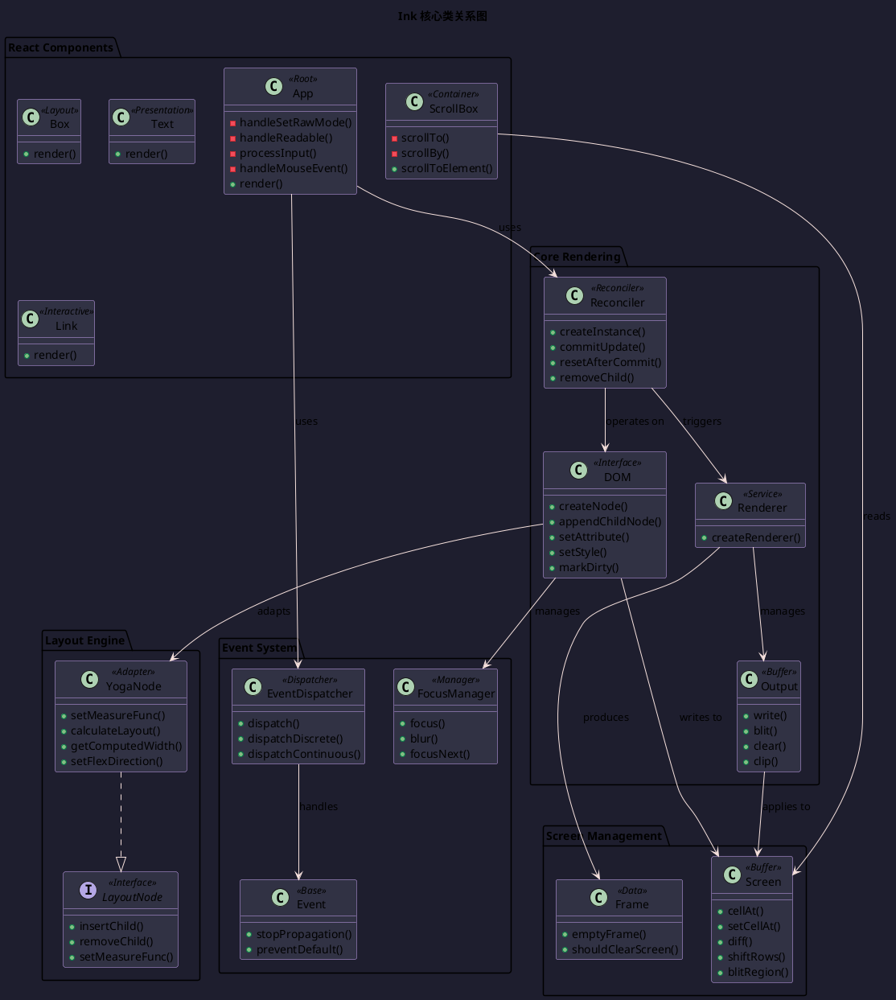
```plantuml
@startuml
skinparam backgroundColor #1E1E2E
skinparam classBackgroundColor #313244
skinparam classBorderColor #CBA6F7
skinparam arrowColor #F5E0DC
skinparam textColor #CDD6F4

title Ink 核心类关系图

package "React Components" {
    class App <<Root>> {
        -handleSetRawMode()
        -handleReadable()
        -processInput()
        -handleMouseEvent()
        +render()
    }
    
    class Box <<Layout>> {
        +render()
    }
    
    class Text <<Presentation>> {
        +render()
    }
    
    class ScrollBox <<Container>> {
        -scrollTo()
        -scrollBy()
        +scrollToElement()
    }
    
    class Link <<Interactive>> {
        +render()
    }
}

package "Core Rendering" {
    class Reconciler <<Reconciler>> {
        +createInstance()
        +commitUpdate()
        +resetAfterCommit()
        +removeChild()
    }
    
    class DOM <<Interface>> {
        +createNode()
        +appendChildNode()
        +setAttribute()
        +setStyle()
        +markDirty()
    }
    
    class Renderer <<Service>> {
        +createRenderer()
    }
    
    class Output <<Buffer>> {
        +write()
        +blit()
        +clear()
        +clip()
    }
}

package "Layout Engine" {
    class YogaNode <<Adapter>> {
        +setMeasureFunc()
        +calculateLayout()
        +getComputedWidth()
        +setFlexDirection()
    }
    
    interface LayoutNode <<Interface>> {
        +insertChild()
        +removeChild()
        +setMeasureFunc()
    }
}

package "Screen Management" {
    class Screen <<Buffer>> {
        +cellAt()
        +setCellAt()
        +diff()
        +shiftRows()
        +blitRegion()
    }
    
    class Frame <<Data>> {
        +emptyFrame()
        +shouldClearScreen()
    }
}

package "Event System" {
    class EventDispatcher <<Dispatcher>> {
        +dispatch()
        +dispatchDiscrete()
        +dispatchContinuous()
    }
    
    class Event <<Base>> {
        +stopPropagation()
        +preventDefault()
    }
    
    class FocusManager <<Manager>> {
        +focus()
        +blur()
        +focusNext()
    }
}

App --> Reconciler : uses
Reconciler --> DOM : operates on
DOM --> YogaNode : adapts
DOM --> Screen : writes to
Reconciler --> Renderer : triggers
Renderer --> Output : manages
Renderer --> Frame : produces
Output --> Screen : applies to

YogaNode ..|> LayoutNode
DOM --> FocusManager : manages
EventDispatcher --> Event : handles
App --> EventDispatcher : uses
ScrollBox --> Screen : reads
@enduml
```

**类图说明**：Ink采用分层架构设计，核心分为四个层次：

1. **React组件层**（最上层）：用户编写的Box、Text等组件
2. **Reconciler层**：实现React Reconciler接口，桥接React与DOM
3. **DOM接口层**：实现类DOM接口，管理布局和属性
4. **终端协议层**（最下层）：Screen缓冲区、Output操作

该设计遵循**关注点分离**原则：组件层不直接操作终端协议，由Reconciler和DOM层负责。

#### 3.5.4.2 关键时序图

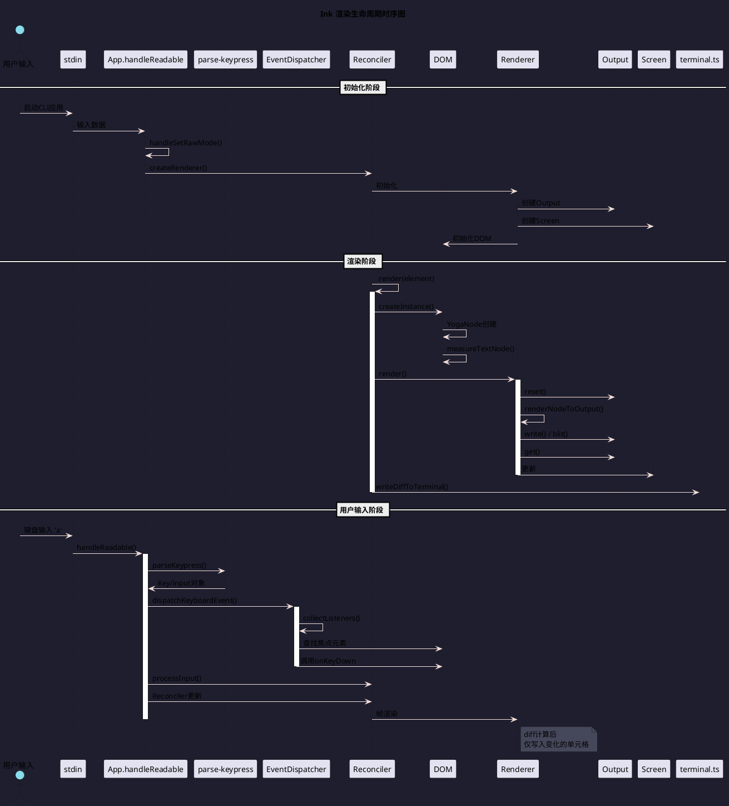
```plantuml
@startuml
skinparam backgroundColor #1E1E2E
skinparam actorBackgroundColor #89B4FA
skinparam lifelineBackgroundColor #313244
skinparam noteBackgroundColor #45475A
skinparam arrowColor #F5E0DC
skinparam textColor #CDD6F4

title Ink 渲染生命周期时序图

actor User as "用户输入" #89DCEB
participant "stdin" as STDIN
participant "App.handleReadable" as APP
participant "parse-keypress" as PARSER
participant "EventDispatcher" as DISPATCHER
participant "Reconciler" as RECONCILER
participant "DOM" as DOM
participant "Renderer" as RENDERER
participant "Output" as OUTPUT
participant "Screen" as SCREEN
participant "terminal.ts" as TERMINAL

== 初始化阶段 ==

User -> STDIN : 启动CLI应用
STDIN -> APP : 输入数据
APP -> APP : handleSetRawMode()
APP -> RECONCILER : createRenderer()
RECONCILER -> RENDERER : 初始化
RENDERER -> OUTPUT : 创建Output
RENDERER -> SCREEN : 创建Screen
RENDERER -> DOM : 初始化DOM

== 渲染阶段 ==

RECONCILER -> RECONCILER : render(element)
activate RECONCILER
RECONCILER -> DOM : createInstance()
DOM -> DOM : YogaNode创建
DOM -> DOM : measureTextNode()
RECONCILER -> RENDERER : render()
activate RENDERER
RENDERER -> OUTPUT : reset()
RENDERER -> RENDERER : renderNodeToOutput()
RENDERER -> OUTPUT : write() / blit()
RENDERER -> OUTPUT : get()
RENDERER -> SCREEN : 更新
deactivate RENDERER
RECONCILER -> TERMINAL : writeDiffToTerminal()
deactivate RECONCILER

== 用户输入阶段 ==

User -> STDIN : 键盘输入 'a'
STDIN -> APP : handleReadable()
activate APP
APP -> PARSER : parseKeypress()
PARSER -> APP : Key/input对象
APP -> DISPATCHER : dispatchKeyboardEvent()
activate DISPATCHER
DISPATCHER -> DISPATCHER : collectListeners()
DISPATCHER -> DOM : 查找焦点元素
DISPATCHER -> DOM : 调用onKeyDown
deactivate DISPATCHER
APP -> RECONCILER : processInput()
APP -> RECONCILER : Reconciler更新
RECONCILER -> RENDERER : 帧渲染
deactivate APP

note right of RENDERER
diff计算后
仅写入变化的单元格
end note

@enduml
```

**时序图说明**：

1. **初始化阶段**：App启动时启用原始模式，创建Reconciler、Renderer、Output和Screen实例
2. **渲染阶段**：React Reconciler执行协调，DOM层管理Yoga布局节点，Renderer计算帧差异并写入终端
3. **用户输入阶段**：stdin捕获键盘输入，parse-keypress解析为结构化Key对象，EventDispatcher分发事件到焦点组件，最后触发Reconciler更新和重新渲染

该流程体现了**单向数据流**和**事件驱动渲染**的核心设计理念。

#### 3.5.4.3 核心逻辑流程图

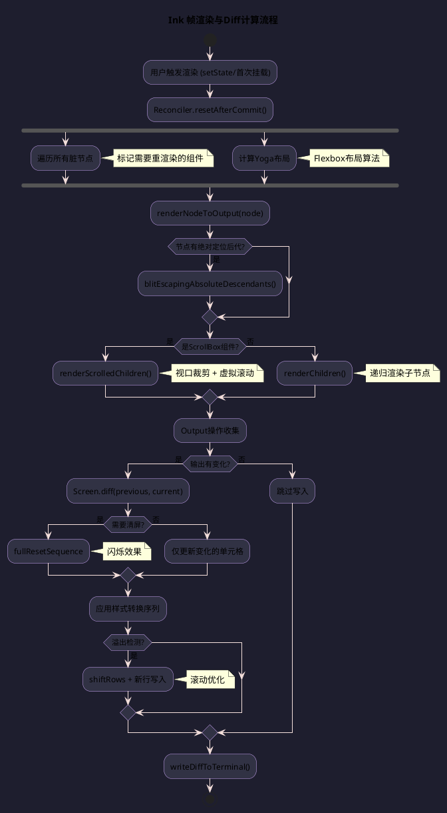
```plantuml
@startuml
skinparam backgroundColor #1E1E2E
skinparam activityBackgroundColor #313244
skinparam activityBorderColor #CBA6F7
skinparam arrowColor #F5E0DC
skinparam textColor #CDD6F4
skinparam decisionPointColor #F9E2AF
skinparam forkBackgroundColor #89B4FA
skinparam mergeBackgroundColor #89B4FA

title Ink 帧渲染与Diff计算流程

start

:用户触发渲染 (setState/首次挂载);

:Reconciler.resetAfterCommit();
detach

fork
    :遍历所有脏节点;
    note right: 标记需要重渲染的组件
fork again
    :计算Yoga布局;
    note right: Flexbox布局算法
end fork

:renderNodeToOutput(node);

if (节点有绝对定位后代?) then (是)
    :blitEscapingAbsoluteDescendants();
endif

if (是ScrollBox组件?) then (是)
    :renderScrolledChildren();
    note right: 视口裁剪 + 虚拟滚动
else (否)
    :renderChildren();
    note right: 递归渲染子节点
endif

:Output操作收集;

if (输出有变化?) then (是)
    :Screen.diff(previous, current);
    
    if (需要清屏?) then (是)
        :fullResetSequence;
        note right: 闪烁效果
    else (否)
        :仅更新变化的单元格;
    endif
    
    :应用样式转换序列;
    
    if (溢出检测?) then (是)
        :shiftRows + 新行写入;
        note right: 滚动优化
    endif
else (否)
    :跳过写入;
endif

:writeDiffToTerminal();

stop

@enduml
```

**流程图说明**：该流程展示Ink最复杂的渲染逻辑——帧差异计算与优化。

1. **布局计算**：Yoga引擎计算Flexbox布局，确定每个节点的位置和尺寸
2. **节点渲染**：递归渲染DOM树，收集Output操作（write/blit/clear）
3. **Diff计算**：Screen对比当前帧与上一帧，生成最小化的补丁
4. **优化策略**：
   - 清屏条件：窗口调整大小或内容溢出时触发全量重绘
   - 滚动优化：当检测到新增行在底部时，使用DECSTBM滚动区域序列
   - 样式转换：StylePool生成SGR序列的最小转换路径

该设计确保即使复杂CLI应用也能保持60fps级别的响应速度。

#### 3.5.4.4 实体关系图

根据代码分析，Ink模块不涉及持久化实体（如数据库、ORM），但存在内存中的核心数据模型：

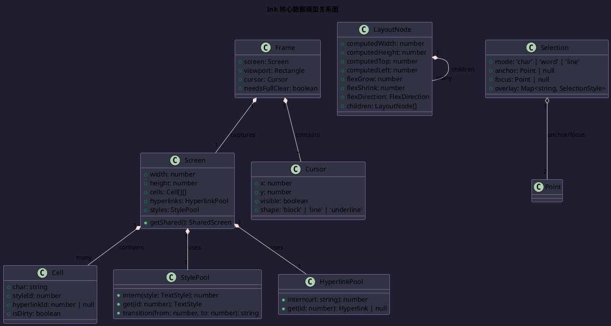
```plantuml
@startuml
skinparam backgroundColor #1E1E2E
skinparam classBackgroundColor #313244
skinparam classBorderColor #CBA6F7
skinparam arrowColor #F5E0DC
skinparam textColor #CDD6F4

title Ink 核心数据模型关系图

class Screen {
    +width: number
    +height: number
    +cells: Cell[][]
    +hyperlinks: HyperlinkPool
    +styles: StylePool
    +getShared(): SharedScreen
}

class Cell {
    +char: string
    +styleId: number
    +hyperlinkId: number | null
    +isDirty: boolean
}

class Frame {
    +screen: Screen
    +viewport: Rectangle
    +cursor: Cursor
    +needsFullClear: boolean
}

class LayoutNode {
    +computedWidth: number
    +computedHeight: number
    +computedTop: number
    +computedLeft: number
    +flexGrow: number
    +flexShrink: number
    +flexDirection: FlexDirection
    +children: LayoutNode[]
}

class Selection {
    +mode: 'char' | 'word' | 'line'
    +anchor: Point | null
    +focus: Point | null
    +overlay: Map<string, SelectionStyle>
}

class StylePool {
    +intern(style: TextStyle): number
    +get(id: number): TextStyle
    +transition(from: number, to: number): string
}

class HyperlinkPool {
    +intern(url: string): number
    +get(id: number): Hyperlink | null
}

class Cursor {
    +x: number
    +y: number
    +visible: boolean
    +shape: 'block' | 'line' | 'underline'
}

Screen "1" *-- "many" Cell : contains
Screen "1" *-- "1" StylePool : uses
Screen "1" *-- "1" HyperlinkPool : uses
Frame "1" *-- "1" Screen : captures
Frame "1" *-- "1" Cursor : contains
LayoutNode "1" *-- "many" LayoutNode : children
Selection "1" o-- "2" Point : anchor/focus
@enduml
```

**数据模型说明**：

1. **Screen**：终端屏幕缓冲区的内存表示，包含Cell二维数组、StylePool和HyperlinkPool
2. **Cell**：最小渲染单元，存储字符、样式ID和超链接ID
3. **Frame**：某一时刻的完整帧快照，用于diff计算
4. **LayoutNode**：Yoga布局引擎的节点表示，存储计算后的几何属性
5. **Selection**：文本选择状态，管理anchor/focus点和选择模式
6. **StylePool/HyperlinkPool**：字符串驻留池，减少内存占用并加速比较

---

### F1: React终端渲染

**功能描述**：Ink的核心能力，将React组件树渲染到终端，替代传统Web DOM。用户可以使用熟悉的React模式（JSX、hooks、context）开发命令行界面。

**典型用例**：
```jsx
import { render, Box, Text } from 'ink';

const App = () => (
  <Box>
    <Text color="green">Hello, Terminal!</Text>
  </Box>
);

render(<App />);
```

**实现入口**：`src/ink/components/App.tsx` - App组件的render方法，以及 `src/ink/reconciler.ts` - Reconciler的createInstance方法

---

### F2: 文本样式与颜色

**功能描述**：通过ANSI SGR序列实现文本颜色、背景、粗体、斜体、下划线等样式，以及OSC 8超链接支持。

**典型用例**：
```jsx
<Text color="red" backgroundColor="blue" bold italic underline>
  Styled Text
</Text>
<Link url="https://example.com">Click me</Link>
```

**实现入口**：`src/ink/components/Text.tsx` - Text组件的render方法，`src/ink/components/Ansi.tsx` - ANSI序列解析，`src/ink/termio/sgr.ts` - SGR参数解析

---

### F3: Flexbox布局

**功能描述**：集成Yoga布局引擎，实现类似CSS flexbox的布局系统，支持flexDirection、justifyContent、alignItems、gap等属性。

**典型用例**：
```jsx
<Box flexDirection="column" gap={1}>
  <Box justifyContent="space-between">
    <Text>Left</Text>
    <Text>Right</Text>
  </Box>
</Box>
```

**实现入口**：`src/ink/styles.ts` - 样式属性到Yoga节点的转换，`src/ink/layout/yoga.ts` - Yoga引擎适配

---

### F4: 交互事件处理

**功能描述**：捕获键盘、鼠标、焦点等终端事件，解析CSI ; ~序列，转换为React合成事件并分发给对应组件。

**典型用例**：
```jsx
<Box onKeyDown={(key) => console.log(key)}>
  <Text>Press any key</Text>
</Box>

<Box onClick={(event) => console.log(event)}>
  <Text>Click me</Text>
</Box>
```

**实现入口**：`src/ink/events/dispatcher.ts` - 事件分发器，`src/ink/events/event-handlers.ts` - 事件处理器映射，`src/ink/hooks/useInput.ts` - useInput hook

---

### F5: 文本选择

**功能描述**：在备用屏幕模式下支持文本选择、复制到剪贴板，支持字符/单词/行三种选择模式。

**典型用例**：
```jsx
const { copy, clearSelection } = useSelection();

// 双击选择单词，三击选择整行
// Ctrl+Shift+C 复制选中文本
```

**实现入口**：`src/ink/selection.ts` - Selection类管理选择状态，`src/ink/hooks/useSelection.ts` - useSelection hook

---

### F6: 滚动容器

**功能描述**：ScrollBox组件提供虚拟滚动，只渲染视口内可见的子元素，支持scrollTo、scrollBy等命令式API。

**典型用例**：
```jsx
const scrollRef = useRef();
<ScrollBox ref={scrollRef}>
  {/* 大量内容 */}
</ScrollBox>

// 滚动到底部
scrollRef.current.scrollToBottom();
```

**实现入口**：`src/ink/components/ScrollBox.tsx` - ScrollBox组件，`src/ink/render-node-to-output.ts` - renderScrolledChildren方法

---

### F7: 备用屏幕模式

**功能描述**：使用DECNM（Alternate Screen）模式，切换到独立屏幕缓冲区，退出时恢复原屏幕内容，适合全屏CLI应用。

**典型用例**：
```jsx
<AlternateScreen>
  <FullScreenApp />
</AlternateScreen>
```

**实现入口**：`src/ink/components/AlternateScreen.tsx` - AlternateScreen组件，`src/ink/ink.tsx` - setAltScreenActive方法

---

### F8: 搜索高亮

**功能描述**：支持在终端中搜索文本，使用OSC背景色覆盖层高亮显示匹配结果。

**实现入口**：`src/ink/searchHighlight.ts` - 搜索高亮应用，`src/ink/render-to-screen.ts` - scanPositions扫描位置，`src/ink/hooks/use-search-highlight.ts` - useSearchHighlight hook

---

### F9: 终端能力检测

**功能描述**：通过终端查询序列检测终端能力，如超链接支持、鼠标模式、同步输出等，确保功能兼容性。

**实现入口**：`src/ink/terminal.ts` - 能力检测函数，`src/ink/supports-hyperlinks.ts` - 超链接支持检测，`src/ink/terminal-querier.ts` - 查询响应处理

---

### F10: RTL语言支持

**功能描述**：对希伯来语、阿拉伯语等RTL语言进行Unicode双向算法重排序，确保正确显示。

**实现入口**：`src/ink/bidi.ts` - needsBidi、reorderBidi函数

---

### F11: 动画帧同步

**功能描述**：基于共享时钟的requestAnimationFrame替代方案，终端失焦时自动降低帧率以节省资源。

**实现入口**：`src/ink/components/ClockContext.tsx` - ClockProvider，`src/ink/hooks/use-animation-frame.ts` - useAnimationFrame hook

---

### F12: 进程生命周期管理

**功能描述**：处理Ctrl+C退出、进程挂起(SIGSTOP)和恢复，处理终端窗口大小变化。

**实现入口**：`src/ink/components/App.tsx` - handleSuspend、handleTerminalResize方法

---

### 3.5.6. 接口设计

#### 3.5.6.1 对外接口

#### `render(element, options)` - 主渲染入口

| 属性 | 值 |
|-----|-----|
| **文件位置** | `src/ink/ink.tsx` |
| **功能概述** | 将React元素渲染到终端，返回Unmount回调 |
| **参数列表** | `element: React.ReactElement`, `options?: RenderOptions` |
| **返回值** | `{ unmount: () => void, waitUntilExit: () => Promise<void> }` |
| **异常处理** | 渲染失败时调用ErrorOverview显示错误覆盖层 |

#### `createRoot(container)` - 创建异步根实例

| 属性 | 值 |
|-----|-----|
| **文件位置** | `src/ink/root.ts` |
| **功能概述** | 创建支持异步操作的Root实例 |
| **参数列表** | `container: TtyContext` |
| **返回值** | `{ render: (element) => Promise<void> }` |

#### `Reconciler.createInstance()` - 创建DOM节点

| 属性 | 值 |
|-----|-----|
| **文件位置** | `src/ink/reconciler.ts` |
| **功能概述** | 实现React Reconciler接口，创建Ink DOM元素 |
| **参数列表** | `type: string, props: Props` |
| **返回值** | `InkDOMElement` |

#### `EventDispatcher.dispatch()` - 事件分发

| 属性 | 值 |
|-----|-----|
| **文件位置** | `src/ink/events/dispatcher.ts` |
| **功能概述** | 实现DOM风格的两阶段事件分发(capture/bubble) |
| **参数列表** | `event: InkEvent, target: InkDOMNode` |
| **返回值** | `void` |
| **异常处理** | 异常不中断传播，控制在单个处理器 |

#### `Screen.diff()` - 帧差异计算

| 属性 | 值 |
|-----|-----|
| **文件位置** | `src/ink/screen.ts` |
| **功能概述** | 计算两帧之间的差异，返回需要更新的单元格序列 |
| **参数列表** | `previous: Screen, current: Screen` |
| **返回值** | `Diff[]` |

#### `Output.write()` - 写入文本

| 属性 | 值 |
|-----|-----|
| **文件位置** | `src/ink/output.ts` |
| **功能概述** | 收集写入操作到Output缓冲区 |
| **参数列表** | `x: number, y: number, text: string, style?: StyleId` |
| **返回值** | `void` |

#### 3.5.6.2 内部关键交互

#### 交互1：Reconciler与DOM的双向协作

```
Reconciler ──────创建────────> DOM.createNode()
Reconciler ──────更新────────> DOM.setAttribute() / DOM.setStyle()
Reconciler ──────删除────────> DOM.removeChildNode()
Reconciler <─────度量请求────── DOM.measureTextNode()
```

Reconciler是React组件与Ink DOM之间的协议层，当Yoga布局需要测量文本尺寸时，DOM回调Reconciler完成测量，形成双向协作。

#### 交互2：Renderer与Screen的帧同步

```
Renderer.render()
    │
    ├────> Output.reset() ──> 清空操作队列
    │
    ├────> renderNodeToOutput() ──> Output收集操作
    │
    ├────> Output.get() ──> 生成完整Screen
    │
    └────> Screen.diff() ──> 计算与上一帧的差异
              │
              └────> writeDiffToTerminal() ──> 输出到TTY
```

Renderer管理帧的生命周期，从清空到收集操作，再到diff计算和终端写入。

#### 交互3：EventDispatcher与FocusManager的联动

```
用户输入
    │
    └────> App.handleReadable()
              │
              └────> EventDispatcher.dispatch(event)
                        │
                        ├────> FocusManager查找activeElement
                        │
                        └────> 沿capture路径分发
                                 │
                                 └────> 沿bubble路径分发
                                           │
                                           └────> 用户回调可能调用focus()
                                                     │
                                                     └────> FocusManager更新activeElement
```

FocusManager维护焦点栈，事件分发沿着焦点元素的祖先链进行，支持stopPropagation和stopImmediatePropagation。

---

### 3.5.8. 关键数据结构与模型

#### 3.5.8.1 核心数据结构

#### `InkDOMElement` (dom.ts)

| 字段 | 类型 | 描述 |
|-----|-----|-----|
| `nodeType` | `'element'` \| `'text'` | 节点类型 |
| `tagName` | string | 标签名 |
| `attributes` | Map | 属性映射 |
| `styles` | Styles | 样式对象 |
| `yogaNode` | YogaNode | Yoga布局节点 |
| `children` | InkDOMNode[] | 子节点数组 |
| `parentNode` | InkDOMElement \| null | 父节点引用 |
| `layoutBounds` | Rectangle | 布局边界缓存 |
| `isDirty` | boolean | 脏标记 |
| `eventHandlers` | Map | 事件处理器映射 |

#### `Screen` (screen.ts)

| 字段 | 类型 | 描述 |
|-----|-----|-----|
| `width` | number | 屏幕宽度 |
| `height` | number | 屏幕高度 |
| `cells` | Cell[][] | 单元格二维数组 |
| `hyperlinkPool` | HyperlinkPool | 超链接驻留池 |
| `stylePool` | StylePool | 样式驻留池 |

#### `Cell` (screen.ts)

| 字段 | 类型 | 描述 |
|-----|-----|-----|
| `char` | string | 字符（可能为空格） |
| `styleId` | number | 样式ID |
| `hyperlinkId` | number \| null | 超链接ID |
| `width` | number | 显示宽度（CJK为2） |
| `dirty` | boolean | 是否需要重绘 |

#### `TextStyle` (termio/types.ts)

| 字段 | 类型 | 描述 |
|-----|-----|-----|
| `foreground` | Color | 前景色 |
| `background` | Color | 背景色 |
| `bold` | boolean | 粗体 |
| `dim` | boolean | 暗淡 |
| `italic` | boolean | 斜体 |
| `underline` | boolean | 下划线 |
| `strikethrough` | boolean | 删除线 |
| `inverse` | boolean | 反色 |
| `hidden` | boolean | 隐藏 |
| `link` | string \| null | 超链接URL |

#### `Frame` (frame.ts)

| 字段 | 类型 | 描述 |
|-----|-----|-----|
| `screen` | Screen | 当前屏幕 |
| `previousScreen` | Screen | 上一帧屏幕 |
| `viewport` | Rectangle | 视口区域 |
| `cursor` | Cursor | 光标位置 |
| `isDirty` | boolean | 帧是否变化 |

#### 3.5.8.2 数据流转

```
用户代码 (JSX)
    │
    ▼
React.createElement()
    │
    ▼
Reconciler协调
    │
    ├────> 创建/更新 InkDOMElement
    │           │
    │           ▼
    │      设置属性到 yogaNode
    │           │
    │           ▼
    │      计算Yoga布局
    │           │
    ▼           ▼
    ◄──── measure回调 ◄────
    │
    ▼
Renderer.render()
    │
    ▼
Output收集操作
    │
    ▼
Screen更新
    │
    ▼
Diff计算
    │
    ▼
writeDiffToTerminal()
    │
    ▼
用户看到结果
```

---

## 3.6. Claude Code CLI 前端组件库 (src/components) 实现设计文档

### 3.6.1. 模块介绍

#### 3.6.1.1 用途与定位

`src/components` 模块是 Claude Code CLI 应用的核心前端组件库，构建于 React + INK 框架之上，专为终端界面（Terminal UI）设计。该模块承载了应用的所有用户交互界面，从底层的文本输入、对话框到高级的代理管理、任务协调等复杂功能，构成了一套完整的终端应用 UI 系统。

作为 CLI 应用的前端呈现层，该模块在整个系统架构中处于用户交互的最前沿，直接面向终端用户，同时通过 AppState 和各种服务与后端逻辑层进行通信。

#### 3.6.1.2 主要职责

该模块承担以下核心职责：

- **终端 UI 渲染**：使用 INK 框架在终端中渲染丰富的交互界面
- **用户输入处理**：管理文本输入、命令解析、快捷键响应
- **状态管理协调**：协调应用状态、主题配置、通知展示
- **权限流程控制**：处理各类工具使用前的用户授权流程
- **消息可视化**：渲染 AI 响应、工具执行结果、系统通知
- **多步骤向导编排**：管理代理创建等复杂流程的步骤导航
- **MCP 集成界面**：提供 MCP 服务器配置、连接、工具浏览界面

#### 3.6.1.3 模块路径

所有文件位于 `src/components/` 目录及其子目录下。

---

### 3.6.2. 功能描述

#### 3.6.2.1 核心功能列表

1. **终端设计系统**
   - 实现位置：`design-system/` 目录
   - 功能：提供 Dialog、ThemedBox、ThemedText、ThemeProvider 等基础组件，支持主题感知渲染
   - 实现位置：`design-system/ThemeProvider.tsx`, `design-system/ThemedText.tsx`

2. **自定义选择器组件**
   - 实现位置：`components/CustomSelect/`
   - 功能：提供单选(Select)、多选(SelectMulti)、输入型选择器
   - 实现位置：`components/CustomSelect/select.tsx`, `components/CustomSelect/SelectMulti.tsx`

3. **代理管理系统**
   - 实现位置：`agents/`
   - 功能：代理列表展示、创建向导、编辑界面、文件持久化
   - 实现位置：`agents/AgentsMenu.tsx`, `agents/agentFileUtils.ts`, `agents/new-agent-creation/CreateAgentWizard.tsx`

4. **权限请求系统**
   - 实现位置：`permissions/`
   - 功能：处理 Bash、文件编辑、WebFetch、Shell 等工具的权限确认
   - 实现位置：`permissions/PermissionRequest.tsx`, `permissions/BashPermissionRequest/`, `permissions/FilePermissionDialog/`

5. **消息渲染系统**
   - 实现位置：`messages/`, `components/Messages.tsx`
   - 功能：渲染用户消息、助手消息、工具调用结果、系统通知
   - 实现位置：`messages/Message.tsx`, `messages/UserTextMessage.tsx`, `messages/AssistantTextMessage.tsx`

6. **MCP 服务器管理**
   - 实现位置：`mcp/`
   - 功能：MCP 服务器列表、认证、连接、工具浏览
   - 实现位置：`mcp/MCPSettings.tsx`, `mcp/MCPListPanel.tsx`, `mcp/MCPRemoteServerMenu.tsx`

7. **多步骤向导框架**
   - 实现位置：`wizard/`, `agents/new-agent-creation/wizard-steps/`
   - 功能：提供向导容器、步骤导航、状态管理
   - 实现位置：`wizard/WizardProvider.tsx`, `wizard/useWizard.ts`

8. **任务管理系统**
   - 实现位置：`tasks/`
   - 功能：后台任务列表、任务详情、状态追踪
   - 实现位置：`tasks/BackgroundTasksDialog.tsx`, `tasks/TaskListV2.tsx`

9. **反馈调查系统**
   - 实现位置：`FeedbackSurvey/`
   - 功能：用户满意度调查、转录分享提示
   - 实现位置：`FeedbackSurvey/FeedbackSurvey.tsx`, `FeedbackSurvey/useFeedbackSurvey.tsx`

10. **沙箱配置界面**
    - 实现位置：`sandbox/`
    - 功能：沙箱模式配置、依赖检测、覆盖策略
    - 实现位置：`sandbox/SandboxSettings.tsx`, `sandbox/SandboxOverridesTab.tsx`

11. **虚拟化消息列表**
    - 实现位置：`VirtualMessageList.tsx`
    - 功能：大容量消息高效渲染、增量搜索、文本高亮定位
    - 实现位置：`VirtualMessageList.tsx`

12. **Diff 展示系统**
    - 实现位置：`diff/`, `StructuredDiff/`
    - 功能：Git diff 展示、文件编辑差异、语法高亮
    - 实现位置：`diff/DiffDialog.tsx`, `StructuredDiff/StructuredDiff.tsx`

13. **终端文本输入**
    - 实现位置：`PromptInput/`, `TextInput.tsx`
    - 功能：命令输入、历史搜索、图片粘贴、外部编辑器集成
    - 实现位置：`PromptInput/PromptInput.tsx`, `src/components/TextInput.tsx`

---

### 3.6.3. 模块的文件夹详细结构及功能介绍

```
src/components/
│
├── agents/                                  # 代理(Agent)管理模块
│   ├── AgentNavigationFooter.tsx            # 代理导航页脚提示
│   ├── ModelSelector.tsx                   # 模型选择界面
│   ├── ColorPicker.tsx                     # 颜色选择交互组件
│   ├── AgentProgressLine.tsx               # 代理进度行状态渲染
│   ├── AgentDetail.tsx                     # 代理完整详情展示
│   ├── AgentEditor.tsx                     # 代理编辑界面
│   ├── agentFileUtils.ts                    # 代理文件读写与路径解析
│   ├── AgentsList.tsx                       # 代理列表(多来源分组)
│   ├── AgentsMenu.tsx                       # 代理管理主菜单状态机
│   ├── generateAgent.ts                     # AI生成代理配置
│   ├── ToolSelector.tsx                     # 代理工具选择界面
│   ├── validateAgent.ts                     # 代理配置验证
│   ├── types.ts                             # 代理状态和验证类型定义
│   ├── utils.ts                            # 代理工具函数
│   └── new-agent-creation/                  # 新代理创建向导
│       ├── CreateAgentWizard.tsx           # 多步骤创建流程编排
│       └── wizard-steps/                    # 各步骤组件
│           ├── ColorStep.tsx               # 颜色选择步骤
│           ├── ConfirmStep.tsx             # 配置预览确认
│           ├── ConfirmStepWrapper.tsx       # 保存确认与持久化
│           ├── DescriptionStep.tsx         # 描述输入
│           ├── GenerateStep.tsx            # AI生成描述
│           ├── LocationStep.tsx           # 存储位置选择
│           ├── MemoryStep.tsx             # 记忆功能配置
│           ├── MethodStep.tsx             # 生成方式选择
│           ├── ModelStep.tsx              # 模型选择步骤
│           ├── PromptStep.tsx             # 系统提示词输入
│           ├── ToolsStep.tsx              # 工具选择步骤
│           └── TypeStep.tsx               # 代理类型标识输入
│
├── components/                              # 通用组件库
│   ├── ContextSuggestions.tsx              # 上下文优化建议列表
│   ├── CostThresholdDialog.tsx             # 消费阈值警告对话框
│   ├── CtrlOToExpand.tsx                  # 快捷键提示组件
│   ├── CustomSelect/                       # 自定义选择器组件
│   │   ├── index.ts                       # 导出聚合
│   │   ├── option-map.ts                  # 选项映射与双向链表
│   │   ├── select-option.tsx              # 单个选项渲染
│   │   ├── select.tsx                     # 单选选择器核心
│   │   ├── SelectMulti.tsx                # 多选选择器
│   │   ├── use-multi-select-state.ts      # 多选状态管理Hook
│   │   ├── use-select-input.ts            # 选择输入处理Hook
│   │   ├── use-select-navigation.ts       # 选项导航状态Hook
│   │   └── use-select-state.ts            # 单选状态管理Hook
│   ├── Messages.tsx                        # 虚拟化消息渲染管理
│   ├── MessageSelector.tsx                 # 消息历史回溯选择器
│   ├── MessageTimestamp.tsx               # 消息时间戳渲染
│   ├── ModelPicker.tsx                     # 模型选择器(主界面)
│   ├── NativeAutoUpdater.tsx              # 原生自动更新器
│   ├── LogSelector.tsx                    # 会话日志浏览选择器
│   ├── Markdown.tsx                        # 高性能Markdown渲染
│   ├── MarkdownTable.tsx                   # 终端表格渲染
│   ├── NotebookEditToolUseRejectedMessage.tsx # 笔记本编辑拒绝消息
│   └── VirtualMessageList.tsx              # 虚拟化消息列表
│
├── design-system/                           # 设计系统基础组件
│   ├── Byline.tsx                         # 子元素分隔符
│   ├── color.ts                           # 主题颜色函数
│   ├── Dialog.tsx                         # 对话框容器
│   ├── Divider.tsx                        # 水平分隔线
│   ├── FuzzyPicker.tsx                    # 模糊搜索选择器
│   ├── KeyboardShortcutHint.tsx           # 快捷键提示
│   ├── ListItem.tsx                       # 列表项渲染
│   ├── LoadingState.tsx                   # 加载状态
│   ├── Pane.tsx                           # slash命令屏幕容器
│   ├── ProgressBar.tsx                    # 进度条
│   ├── Ratchet.tsx                        # 视口高度锁定
│   ├── StatusIcon.tsx                     # 状态指示器
│   ├── Tabs.tsx                           # 标签页容器
│   ├── ThemedBox.tsx                      # 主题感知Box
│   ├── ThemedText.tsx                     # 主题感知文本
│   └── ThemeProvider.tsx                   # 主题上下文提供者
│
├── mcp/                                    # MCP(Model Context Protocol)模块
│   ├── index.ts                           # 模块导出聚合
│   ├── ElicitationDialog.tsx              # MCP表单输入对话框
│   ├── MCPAgentServerMenu.tsx             # Agent MCP服务器菜单
│   ├── MCPListPanel.tsx                   # MCP服务器列表面板
│   ├── MCPReconnect.tsx                   # MCP服务器重连管理
│   ├── MCPRemoteServerMenu.tsx            # 远程MCP服务器菜单
│   ├── MCPSettings.tsx                    # MCP设置主入口
│   ├── MCPStdioServerMenu.tsx             # Stdio类型MCP菜单
│   ├── MCPToolDetailView.tsx              # MCP工具详情视图
│   ├── MCPToolListView.tsx               # MCP工具列表视图
│   ├── McpParsingWarnings.tsx             # MCP配置解析警告
│   ├── CapabilitiesSection.tsx            # MCP能力类型展示
│   └── utils/
│       └── reconnectHelpers.tsx            # 重连辅助函数
│
├── messages/                               # 消息渲染模块
│   ├── Message.tsx                        # 消息分发中央处理器
│   ├── MessageRow.tsx                     # 消息行包装组件
│   ├── messageActions.tsx                 # 消息动作与导航
│   ├── MessageModel.tsx                   # AI模型名称显示
│   ├── MessageResponse.tsx                 # 消息响应包装器
│   ├── AdvisorMessage.tsx                  # 顾问消息渲染
│   ├── AssistantTextMessage.tsx           # 助手文本消息
│   ├── AssistantToolUseMessage.tsx        # 工具调用消息
│   ├── AttachmentMessage.tsx              # 附件消息渲染
│   ├── CollapsedReadSearchContent.tsx    # 折叠读写搜索
│   ├── CompactBoundaryMessage.tsx         # 压缩边界消息
│   ├── GroupedToolUseContent.tsx         # 分组工具调用
│   ├── HighlightedThinkingText.tsx        # 高亮思考文本
│   ├── HookProgressMessage.tsx           # Hook进度消息
│   ├── PlanApprovalMessage.tsx           # 计划审批消息
│   ├── RateLimitMessage.tsx              # 速率限制消息
│   ├── ShutdownMessage.tsx               # 关闭消息
│   ├── SystemAPIErrorMessage.tsx         # API错误消息
│   ├── SystemTextMessage.tsx             # 系统文本消息
│   ├── TaskAssignmentMessage.tsx         # 任务分配消息
│   ├── AssistantThinkingMessage.tsx      # 思考块内容
│   ├── AssistantRedactedThinkingMessage.tsx # 已删除思考提示
│   ├── teamMemCollapsed.tsx              # 团队内存折叠
│   ├── teamMemSaved.ts                   # 团队记忆保存
│   ├── UserAgentNotificationMessage.tsx  # 代理通知消息
│   ├── UserBashInputMessage.tsx         # Bash输入消息
│   ├── UserBashOutputMessage.tsx        # Bash输出消息
│   ├── UserChannelMessage.tsx            # MCP通道消息
│   ├── UserCommandMessage.tsx           # 斜杠命令消息
│   ├── UserImageMessage.tsx             # 图片附件消息
│   ├── UserLocalCommandOutputMessage.tsx # 本地命令输出
│   ├── UserMemoryInputMessage.tsx       # 记忆输入消息
│   ├── UserPlanMessage.tsx              # 计划消息
│   ├── UserPromptMessage.tsx           # 用户提示消息
│   ├── UserResourceUpdateMessage.tsx    # 资源更新消息
│   ├── UserTeammateMessage.tsx         # 队友消息
│   ├── UserTextMessage.tsx             # 用户文本消息(分发器)
│   └── UserToolResultMessage/           # 工具结果消息
│       ├── UserToolResultMessage.tsx   # 工具结果分发器
│       ├── UserToolErrorMessage.tsx    # 工具错误消息
│       ├── UserToolSuccessMessage.tsx  # 工具成功消息
│       ├── UserToolCanceledMessage.tsx # 工具取消消息
│       ├── UserToolRejectMessage.tsx   # 工具拒绝消息
│       ├── RejectedPlanMessage.tsx     # 被拒绝计划
│       ├── RejectedToolUseMessage.tsx  # 被拒绝工具
│       └── utils.tsx                   # 工具消息工具函数
│
├── permissions/                            # 权限请求系统
│   ├── PermissionRequest.tsx             # 权限请求中央路由器
│   ├── PermissionDialog.tsx              # 权限对话框基础容器
│   ├── PermissionRequestTitle.tsx         # 权限请求标题
│   ├── PermissionPrompt.tsx              # 通用权限确认提示
│   ├── PermissionExplanation.tsx         # 权限解释服务
│   ├── PermissionRuleExplanation.tsx     # 规则解释组件
│   ├── PermissionDecisionDebugInfo.tsx   # 权限决策调试信息
│   ├── PermissionRuleDescription.tsx    # 权限规则描述
│   ├── WorkerPendingPermission.tsx       # 工作节点等待指示
│   ├── WorkerBadge.tsx                   # 工作节点徽章
│   ├── hooks.ts                          # 权限日志Hook
│   ├── utils.ts                          # 权限工具函数
│   ├── shellPermissionHelpers.tsx        # Shell权限辅助
│   ├── useShellPermissionFeedback.ts    # Shell权限反馈Hook
│   ├── AddPermissionRules.tsx           # 添加权限规则对话框
│   ├── AddWorkspaceDirectory.tsx        # 添加工作区目录
│   ├── PermissionRuleInput.tsx          # 权限规则输入
│   ├── PermissionRuleList.tsx           # 权限规则列表管理
│   ├── RecentDenialsTab.tsx             # 最近拒绝Tab
│   ├── RemoveWorkspaceDirectory.tsx     # 删除工作区目录
│   ├── WorkspaceTab.tsx                 # 工作区Tab
│   ├── SandboxPermissionRequest.tsx     # 沙箱权限请求
│   ├── FallbackPermissionRequest.tsx    # 后备权限请求
│   ├── ComputerUseApproval/             # 计算机使用权限
│   │   └── ComputerUseApproval.tsx
│   ├── EnterPlanModePermissionRequest/  # 进入计划模式权限
│   │   └── EnterPlanModePermissionRequest.tsx
│   ├── ExitPlanModePermissionRequest/   # 退出计划模式权限
│   │   └── ExitPlanModePermissionRequest.tsx
│   ├── BashPermissionRequest/           # Bash命令权限
│   │   ├── BashPermissionRequest.tsx
│   │   └── bashToolUseOptions.tsx
│   ├── FileEditPermissionRequest/      # 文件编辑权限
│   │   ├── FileEditPermissionRequest.tsx
│   │   └── ideDiffConfig.ts
│   ├── FilePermissionDialog/           # 文件权限对话框
│   │   ├── FilePermissionDialog.tsx
│   │   ├── useFilePermissionDialog.ts
│   │   ├── usePermissionHandler.ts
│   │   └── permissionOptions.tsx
│   ├── FileWritePermissionRequest/     # 文件写入权限
│   │   ├── FileWritePermissionRequest.tsx
│   │   └── FileWriteToolDiff.tsx
│   ├── NotebookEditPermissionRequest/ # 笔记本编辑权限
│   │   ├── NotebookEditPermissionRequest.tsx
│   │   └── NotebookEditToolDiff.tsx
│   ├── PowerShellPermissionRequest/    # PowerShell权限
│   │   ├── PowerShellPermissionRequest.tsx
│   │   └── powershellToolUseOptions.tsx
│   ├── SedEditPermissionRequest/       # Sed编辑权限
│   │   └── SedEditPermissionRequest.tsx
│   ├── SkillPermissionRequest/         # Skill使用权限
│   │   └── SkillPermissionRequest.tsx
│   ├── AskUserQuestionPermissionRequest/ # 用户提问权限
│   │   ├── AskUserQuestionPermissionRequest.tsx
│   │   ├── PreviewBox.tsx
│   │   ├── PreviewQuestionView.tsx
│   │   ├── QuestionNavigationBar.tsx
│   │   ├── QuestionView.tsx
│   │   ├── SubmitQuestionsView.tsx
│   │   └── use-multiple-choice-state.ts
│   └── WebFetchPermissionRequest/      # Web请求权限
│       └── WebFetchPermissionRequest.tsx
│
├── PromptInput/                           # 提示输入模块
│   ├── PromptInput.tsx                   # 主输入框核心组件
│   ├── PromptInputFooter.tsx            # 输入区页脚
│   ├── PromptInputFooterLeftSide.tsx    # 页脚左侧区域
│   ├── PromptInputFooterSuggestions.tsx # 命令/文件建议
│   ├── PromptInputHelpMenu.tsx          # 快捷键帮助菜单
│   ├── PromptInputModeIndicator.tsx     # 模式指示符
│   ├── PromptInputQueuedCommands.tsx   # 排队命令显示
│   ├── PromptInputStashNotice.tsx       # 暂存提示
│   ├── SandboxPromptFooterHint.tsx     # 沙箱违规警告
│   ├── Notifications.tsx                # 通知管理
│   ├── HistorySearchInput.tsx          # 历史搜索输入
│   ├── VoiceIndicator.tsx              # 语音模式指示
│   ├── ShimmeredInput.tsx              # 高亮输入
│   ├── inputModes.ts                   # 输入模式处理
│   ├── inputPaste.ts                   # 粘贴处理
│   ├── IssueFlagBanner.tsx             # 问题反馈横幅
│   ├── useMaybeTruncateInput.ts         # 输入截断Hook
│   ├── usePromptInputPlaceholder.ts     # 占位符生成Hook
│   ├── useShowFastIconHint.ts          # 快速模式提示Hook
│   ├── useSwarmBanner.ts               # Swarm横幅Hook
│   └── utils.ts                        # 输入工具函数
│
├── shell/                                 # Shell相关组件
│   ├── OutputLine.tsx                  # Shell输出行渲染
│   ├── ShellProgressMessage.tsx        # Shell进度状态
│   ├── ShellTimeDisplay.tsx            # Shell时间显示
│   └── ExpandShellOutputContext.tsx    # 输出完整显示上下文
│
├── Spinner/                              # 加载动画模块
│   ├── index.ts                        # 模块导出聚合
│   ├── Spinner.tsx                     # 主旋转器组件
│   ├── SpinnerGlyph.tsx               # 旋转符号帧
│   ├── GlimmerMessage.tsx              # 微光效果消息
│   ├── FlashingChar.tsx               # 字符闪烁
│   ├── ShimmerChar.tsx                # 微光字符
│   ├── SpinnerAnimationRow.tsx        # 动画行
│   ├── TeammateSpinnerLine.tsx        # 队友旋转行
│   ├── TeammateSpinnerTree.tsx        # 队友旋转树
│   ├── useShimmerAnimation.ts         # 微光动画Hook
│   ├── useStalledAnimation.ts         # 停滞动画Hook
│   ├── teammateSelectHint.ts           # 队友选择提示常量
│   └── utils.ts                       # 工具函数
│
├── tasks/                                # 任务管理模块
│   ├── TaskListV2.tsx                 # 任务列表渲染
│   ├── BackgroundTask.tsx              # 后台任务分发渲染
│   ├── BackgroundTasksDialog.tsx      # 后台任务对话框
│   ├── BackgroundTaskStatus.tsx       # 任务状态栏
│   ├── ShellDetailDialog.tsx          # Shell任务详情
│   ├── AsyncAgentDetailDialog.tsx     # 异步智能体详情
│   ├── DreamDetailDialog.tsx          # 记忆整合任务详情
│   ├── RemoteSessionDetailDialog.tsx  # 远程会话详情
│   ├── InProcessTeammateDetailDialog.tsx # 队友执行详情
│   ├── renderToolActivity.tsx         # 工具活动渲染
│   ├── ShellProgress.tsx              # Shell进度
│   └── taskStatusUtils.tsx            # 任务状态工具
│
├── LogoV2/                               # Logo和Feed模块
│   ├── LogoV2.tsx                     # 主Logo组件
│   ├── CondensedLogo.tsx              # 精简Logo
│   ├── WelcomeV2.tsx                  # ASCII欢迎界面
│   ├── AnimatedClawd.tsx             # 动画吉祥物
│   ├── Clawd.tsx                      # ASCII吉祥物
│   ├── Feed.tsx                       # Feed列表组件
│   ├── FeedColumn.tsx                 # Feed垂直列
│   ├── feedConfigs.tsx                # Feed配置工厂
│   ├── GuestPassesUpsell.tsx         # 访客通行证推广
│   ├── OverageCreditUpsell.tsx       # 超额积分推广
│   ├── Opus1mMergeNotice.tsx         # 上下文扩展通知
│   ├── VoiceModeNotice.tsx           # 语音模式通知
│   ├── ChannelsNotice.tsx            # 渠道功能通知
│   └── EmergencyTip.tsx               # 紧急提示
│
├── FeedbackSurvey/                      # 反馈调查模块
│   ├── FeedbackSurvey.tsx             # 反馈调查主界面
│   ├── FeedbackSurveyView.tsx         # 调查选项列表
│   ├── TranscriptSharePrompt.tsx     # 转录分享提示
│   ├── submitTranscriptShare.ts       # 转录提交服务
│   ├── useFeedbackSurvey.tsx         # 调查触发Hook
│   ├── useSurveyState.tsx            # 调查状态Hook
│   ├── usePostCompactSurvey.tsx      # 压缩后调查Hook
│   ├── useMemorySurvey.tsx           # 记忆调查Hook
│   └── useDebouncedDigitInput.ts     # 防抖数字输入
│
├── sandbox/                             # 沙箱配置模块
│   ├── SandboxSettings.tsx            # 沙箱设置主入口
│   ├── SandboxConfigTab.tsx          # 沙箱配置标签
│   ├── SandboxOverridesTab.tsx       # 覆盖策略标签
│   ├── SandboxDependenciesTab.tsx    # 依赖检测标签
│   ├── SandboxDoctorSection.tsx      # 依赖诊断区段
│   └── SandboxViolationExpandedView.tsx # 违规展开视图
│
├── diff/                                # Diff展示模块
│   ├── DiffDialog.tsx                # Diff对话框主组件
│   ├── DiffFileList.tsx              # Diff文件列表
│   └── DiffDetailView.tsx            # 单文件Diff详情
│
├── StructuredDiff/                      # 结构化Diff模块
│   ├── StructuredDiff.tsx            # 主渲染组件
│   ├── StructuredDiffList.tsx       # Diff列表渲染
│   ├── colorDiff.ts                  # 颜色差异模块
│   └── Fallback.tsx                  # 后备渲染
│
├── wizard/                              # 向导框架模块
│   ├── index.ts                      # 模块导出聚合
│   ├── WizardProvider.tsx            # 向导状态提供者
│   ├── useWizard.ts                  # 向导上下文Hook
│   ├── WizardDialogLayout.tsx        # 向导布局组件
│   └── WizardNavigationFooter.tsx   # 向导导航页脚
│
├── hooks/                               # Hook配置菜单模块
│   ├── HooksConfigMenu.tsx           # Hook配置主菜单
│   ├── SelectEventMode.tsx          # 事件选择模式
│   ├── SelectMatcherMode.tsx        # 匹配器选择模式
│   ├── SelectHookMode.tsx           # Hook选择模式
│   └── ViewHookMode.tsx             # Hook详情模式
│
├── teams/                               # 团队相关模块
│   ├── TeamsDialog.tsx              # 团队成员管理对话框
│   └── TeamStatus.tsx              # 团队状态显示
│
├── settings/                            # 设置面板模块
│   ├── Settings.tsx                  # 设置面板容器
│   ├── Config.tsx                   # 配置管理主组件
│   ├── Status.tsx                   # 系统状态展示
│   └── Usage.tsx                    # 使用量展示
│
├── ui/                                  # UI工具模块
│   ├── ToolUseLoader.tsx            # 工具使用状态指示
│   ├── OrderedList.tsx              # 嵌套有序列表
│   └── OrderedListItem.tsx          # 有序列表项
│
├── Spinner.tsx                         # 顶层旋转器入口
├── OffscreenFreeze.tsx               # 离屏冻结组件
├── StatusLine.tsx                    # 底部状态行
├── StatusNotices.tsx                 # 状态通知
├── PrBadge.tsx                       # PR状态徽章
├── PressEnterToContinue.tsx          # 回车继续提示
├── SearchBox.tsx                     # 搜索框组件
├── SentryErrorBoundary.ts            # React错误边界
├── Stats.tsx                         # 使用统计展示
├── TagTabs.tsx                       # 滚动标签页
├── ScrollKeybindingHandler.tsx       # 滚动键盘处理
├── SessionBackgroundHint.tsx         # 后台会话提示
├── SessionPreview.tsx               # 会话预览
├── ResumeTask.tsx                   # 会话恢复
├── TeleportError.tsx               # Teleport错误处理
├── TeleportProgress.tsx            # Teleport进度展示
├── TeleportRepoMismatchDialog.tsx   # 仓库路径不匹配
├── TeleportResumeWrapper.tsx       # Teleport恢复包装器
├── TeleportStash.tsx              # Teleport stash处理
├── ThemePicker.tsx                 # 主题选择器
├── ThinkingToggle.tsx             # 思考模式切换
├── TokenWarning.tsx               # Token警告
├── TreeSelect.tsx                 # 树形选择器
├── ValidationErrorsList.tsx       # 验证错误列表
├── VimTextInput.tsx              # Vim风格输入
├── FilePathLink.tsx              # 文件路径链接
├── ClickableImageRef.tsx        # 可点击图片引用
├── BridgeDialog.tsx             # 桥接连接对话框
├── CompactSummary.tsx           # 精简摘要
├── ContextVisualization.tsx     # 上下文可视化
├── CoordinatorTaskPanel.tsx     # 任务协调面板
├── DesktopHandoff.tsx          # 桌面交接
├── DesktopUpsell/               # 桌面推广
│   └── DesktopUpsellStartup.tsx
├── DevBar.tsx                  # 开发版本警告
├── DiagnosticsDisplay.tsx      # 诊断信息展示
├── DevChannelsDialog.tsx       # 开发渠道对话框
├── EffortCallout.tsx          # 努力等级提示
├── EffortIndicator.ts         # 努力等级指示
├── ExitFlow.tsx              # 退出流程
├── ExportDialog.tsx           # 导出对话框
├── FallbackToolUseErrorMessage.tsx   # 工具错误消息
├── FallbackToolUseRejectedMessage.tsx # 工具拒绝消息
├── FastIcon.tsx              # 快速模式图标
├── Feedback.tsx              # 反馈服务
├── FileEditToolDiff.tsx     # 文件编辑差异
├── FileEditToolUpdatedMessage.tsx    # 文件更新消息
├── FileEditToolUseRejectedMessage.tsx # 编辑拒绝消息
├── FullscreenLayout.tsx      # 全屏布局
├── GlobalSearchDialog.tsx    # 全局搜索
├── HelpV2/                   # 帮助系统
│   ├── HelpV2.tsx
│   ├── Commands.tsx
│   └── General.tsx
├── HighlightedCode/           # 代码高亮
│   ├── HighlightedCode.tsx
│   └── Fallback.tsx
├── HistorySearchDialog.tsx    # 历史搜索
├── IdeAutoConnectDialog.tsx   # IDE自动连接
├── IdeOnboardingDialog.tsx   # IDE引导
├── IdeStatusIndicator.tsx    # IDE状态指示
├── IdleReturnDialog.tsx      # 空闲返回
├── InvalidConfigDialog.tsx   # 配置错误
├── InvalidSettingsDialog.tsx # 设置验证错误
├── KeybindingWarnings.tsx   # 快捷键警告
├── LanguagePicker.tsx       # 语言选择
├── LspRecommendation/        # LSP推荐
│   └── LspRecommendationMenu.tsx
├── ManagedSettingsSecurityDialog/   # 托管设置安全
│   ├── ManagedSettingsSecurityDialog.tsx
│   └── utils.ts
├── MCPServerApprovalDialog.tsx      # MCP服务器审批
├── MCPServerDesktopImportDialog.tsx # MCP桌面导入
├── MCPServerDialogCopy.tsx         # MCP安全文案
├── MCPServerMultiselectDialog.tsx   # MCP多选审批
├── memory/                          # 记忆模块
│   ├── MemoryUpdateNotification.tsx
│   └── MemoryFileSelector.tsx
├── MemoryUsageIndicator.tsx    # 内存使用指示
├── Onboarding.tsx             # 初始引导
├── OutputStylePicker.tsx     # 输出样式选择
├── PackageManagerAutoUpdater.tsx # 包管理器更新
├── Passes/                    # 客人通行证
│   └── Passes.tsx
├── QuickOpenDialog.tsx       # 快速打开
├── RemoteCallout.tsx         # 远程控制首次弹窗
├── RemoteEnvironmentDialog.tsx # 远程环境选择
├── ShowInIDEPrompt.tsx       # IDE提示
├── SkillImprovementSurvey.tsx # 技能改进调查
├── skills/                    # 技能菜单
│   └── SkillsMenu.tsx
├── TeammateViewHeader.tsx    # 队友视图头部
└── TrustDialog/              # 信任对话框
    ├── TrustDialog.tsx
    └── utils.ts
```

---

### 3.6.4. 架构与设计图谱

#### 3.6.4.1 类图


```plantuml
@startuml
skinparam backgroundColor #FEFEFE
skinparam componentStyle uml2

package "设计系统 (design-system)" {
  class ThemeProvider {
    +useTheme(): Theme
    +useThemeSetting(): ThemeSetting
    +usePreviewTheme(): PreviewThemeActions
  }
  
  class ThemeContext {
    +theme: Theme
    +setTheme: (theme: Theme) => void
  }
  
  class ThemedText {
    +resolveColor(colorKey: string): Color
    +render(children, color?, bold?, italic?): ReactNode
  }
  
  class ThemedBox {
    +resolveColor(colorKey: string): Color
  }
  
  ThemeProvider --> ThemeContext : provides
  ThemedText --> ThemeContext : consumes
  ThemedBox --> ThemeContext : consumes
}

package "选择器系统 (CustomSelect)" {
  class Select {
    +layout: "compact" | "expanded" | "compact-vertical"
    +getTextContent(node: ReactNode): string
  }
  
  class SelectMulti {
    +selectedOptions: Option[]
    +handleConfirm(): void
  }
  
  class SelectOption {
    +label: string
    +description?: string
    +isSelected: boolean
  }
  
  class OptionMap {
    -options: Map<string, OptionNode>
    +getNext(): OptionNode
    +getPrev(): OptionNode
  }
  
  class useSelectState {
    +selectedOption: Option
    +focusedOption: Option
  }
  
  class useSelectNavigation {
    +visibleRange: {start, end}
    +scrollTo(index: number): void
  }
  
  class useMultiSelectState {
    +selectedOptions: Option[]
    +toggleOption(option: Option): void
  }
  
  Select o-- SelectOption
  SelectMulti o-- SelectOption
  Select o-- useSelectState
  SelectState o-- useSelectNavigation
  useSelectState o-- OptionMap
  SelectMulti o-- useMultiSelectState
  useMultiSelectState o-- useSelectNavigation
}

package "向导系统 (wizard)" {
  class WizardProvider {
    -state: WizardState
    +goToStep(step: WizardStep): void
    +nextStep(): void
    +prevStep(): void
    +getValue<T>(key: string): T
    +setValue<T>(key: string, value: T): void
  }
  
  class WizardContext {
    +currentStep: WizardStep
    +steps: WizardStep[]
    +values: Record<string, any>
    +onNext: () => void
    +onPrev: () => void
    +onGoTo: (step: WizardStep) => void
  }
  
  class useWizard {
    +currentStep: WizardStep
    +values: Record<string, any>
    +setValue: <T>(key: string, value: T) => void
  }
  
  WizardProvider o-- WizardContext : creates
  useWizard --> WizardContext : consumes
}

package "权限系统 (permissions)" {
  abstract class PermissionRequestBase {
    +toolUse: ToolUse
    +onApprove: (update: PermissionUpdate) => void
    +onReject: () => void
  }
  
  class BashPermissionRequest {
    +handleResponse(response: BashResponse): void
  }
  
  class FilePermissionDialog {
    +filePath: string
    +operation: "edit" | "write"
    +ideDiffSupport: IDEDiffSupport
  }
  
  class FallbackPermissionRequest {
    +toolName: string
    +showDontAskAgain: boolean
  }
  
  class useFilePermissionDialog {
    +options: PermissionOption[]
    +handleSelect(option: PermissionOption): void
  }
  
  class usePermissionHandler {
    +handleAcceptOnce(): void
    +handleAcceptSession(): void
  }
  
  PermissionRequestBase <|-- BashPermissionRequest
  PermissionRequestBase <|-- FilePermissionDialog
  PermissionRequestBase <|-- FallbackPermissionRequest
  FilePermissionDialog o-- useFilePermissionDialog
  FilePermissionDialog o-- usePermissionHandler
}

package "消息系统 (messages)" {
  class Message {
    +type: MessageType
    +render(): ReactNode
  }
  
  class UserTextMessage {
    +content: ContentBlock[]
    +dispatchToSubtype(): ReactNode
  }
  
  class AssistantTextMessage {
    +content: ContentBlock[]
    +errors: APIError[]
  }
  
  class AssistantToolUseMessage {
    +toolUse: ToolUse
    +state: "queued" | "resolved" | "in_progress"
  }
  
  class MessageRow {
    +messageId: string
    +isActiveCollapsedGroup: boolean
    +isStatic: boolean
  }
  
  Message <|-- UserTextMessage
  Message <|-- AssistantTextMessage
  Message <|-- AssistantToolUseMessage
  MessageRow --> Message : wraps
}

package "代理系统 (agents)" {
  class AgentsMenu {
    -state: MenuState
    +handleAgentCreated(agent: Agent): void
    +handleAgentDeleted(agentId: string): void
  }
  
  class CreateAgentWizard {
    +steps: WizardStep[]
    +handleComplete(values: AgentConfig): void
  }
  
  class agentFileUtils {
    +saveAgentToFile(agent: Agent): Promise<void>
    +updateAgentFile(agent: Agent): Promise<void>
    +deleteAgentFromFile(agentId: string): Promise<void>
  }
  
  class ToolSelector {
    +getToolBuckets(): ToolBucket[]
    +handleToggleTool(tool: Tool): void
  }
  
  AgentsMenu o-- CreateAgentWizard
  AgentsMenu o-- agentFileUtils
  CreateAgentWizard o-- ToolSelector
}

package "MCP系统 (mcp)" {
  class MCPSettings {
    +viewState: ViewState
    +prepareServers(): Promise<ServerInfo[]>
  }
  
  class MCPServerMenu {
    +server: MCPServer
    +handleAuthenticate(): void
    +handleToggleEnabled(): void
  }
  
  class MCPToolListView {
    +server: MCPServer
    +tools: MCPTool[]
  }
  
  class ElicitationDialog {
    +mode: "form" | "url"
    +handleSubmit(values: FormValues): void
  }
  
  MCPSettings --> MCPServerMenu
  MCPSettings --> MCPToolListView
  MCPSettings --> ElicitationDialog
}

package "任务系统 (tasks)" {
  class BackgroundTasksDialog {
    +mode: "list" | "detail"
    +tasks: BackgroundTask[]
    +handleSelect(task: BackgroundTask): void
    +handleKill(id: string): void
  }
  
  class TaskListV2 {
    +tasks: Task[]
    +sortBy: "recent" | "priority"
  }
  
  class BackgroundTask {
    +type: TaskType
    +dispatch(): ReactNode
  }
  
  BackgroundTasksDialog o-- TaskListV2
  BackgroundTask <|-- BackgroundTasksDialog
}

package "虚拟化列表" {
  class VirtualMessageList {
    +messages: Message[]
    +searchQuery: string
    +jump(target: ScrollTarget): void
    +step(direction: "next" | "prev"): void
  }
  
  class OffscreenFreeze {
    +isVisible: boolean
    +cachedContent: ReactNode
  }
  
  VirtualMessageList o-- OffscreenFreeze
}

@enduml
```

**类图补充说明**：

1. **设计系统 (ThemeProvider/ThemedText/ThemedBox)**：采用 Context 模式提供主题状态，子组件通过 `useTheme()` Hook 消费主题上下文，实现了**观察者模式**。ThemeProvider 支持自动/手动主题切换，监听系统主题变化，体现了**开闭原则**——新增主题类型无需修改消费组件。

2. **选择器系统 (CustomSelect)**：核心是 `OptionMap` 双向链表结构，支持 O(1) 的前后导航。`useSelectNavigation` 管理可见区域索引，`useSelectState` 协调选中状态，两者通过 **中介者模式** 解耦。SelectMulti 组合了 `useMultiSelectState`，处理多选特有的状态合并逻辑。

3. **向导系统 (WizardProvider)**：采用 **Provider 模式**管理跨步骤状态，WizardContext 暴露导航和值存储接口。useWizard 作为 Hook 封装，提供类型安全的上下文访问。步骤切换通过 `goToStep()` 方法实现，支持前进、后退、跳转三种模式。

4. **权限系统**：权限请求组件继承 `PermissionRequestBase` 抽象类，实现 **模板方法模式**。FilePermissionDialog 组合 `useFilePermissionDialog` 和 `usePermissionHandler` 两个 Hook，体现 **贫血模型 + Hook 组合模式**，将状态逻辑与业务逻辑分离。

5. **消息系统**：Message 作为中央分发器，根据 `type` 属性路由到 UserTextMessage/AssistantTextMessage 等具体实现。MessageRow 包装 Message，处理行级状态计算（activeCollapsedGroup、isStatic），两者是 **装饰器模式** 的应用。

6. **代理系统**：AgentsMenu 作为状态机协调器，管理 list-agents/create-agent/edit-agent 等状态转换。CreateAgentWizard 组合多个 wizard-steps 组件，agentFileUtils 处理文件持久化，体现了 **门面模式** 封装文件操作复杂度。

7. **MCP系统**：MCPSettings 作为入口协调器，根据 `viewState.type` 分发到 MCPServerMenu/MCPToolListView 等视图组件。ElicitationDialog 根据 `mode` 路由到表单或URL对话框，体现了 **策略模式** 的视图切换。

8. **任务系统**：BackgroundTask 的 `dispatch()` 方法根据 `type` 属性分发到 Bash/Agent/Remote 等具体渲染组件，是典型的 **分发器模式**。BackgroundTasksDialog 管理列表和详情两种视图模式的状态切换。

9. **虚拟化列表**：VirtualMessageList 通过 `OffscreenFreeze` 组件缓存离屏内容，避免重渲染。isVisible 属性由视口检测决定，实现了 **备忘录模式** 的渲染状态保存。

#### 3.6.4.2 关键时序图

#### 场景：代理创建向导完整流程

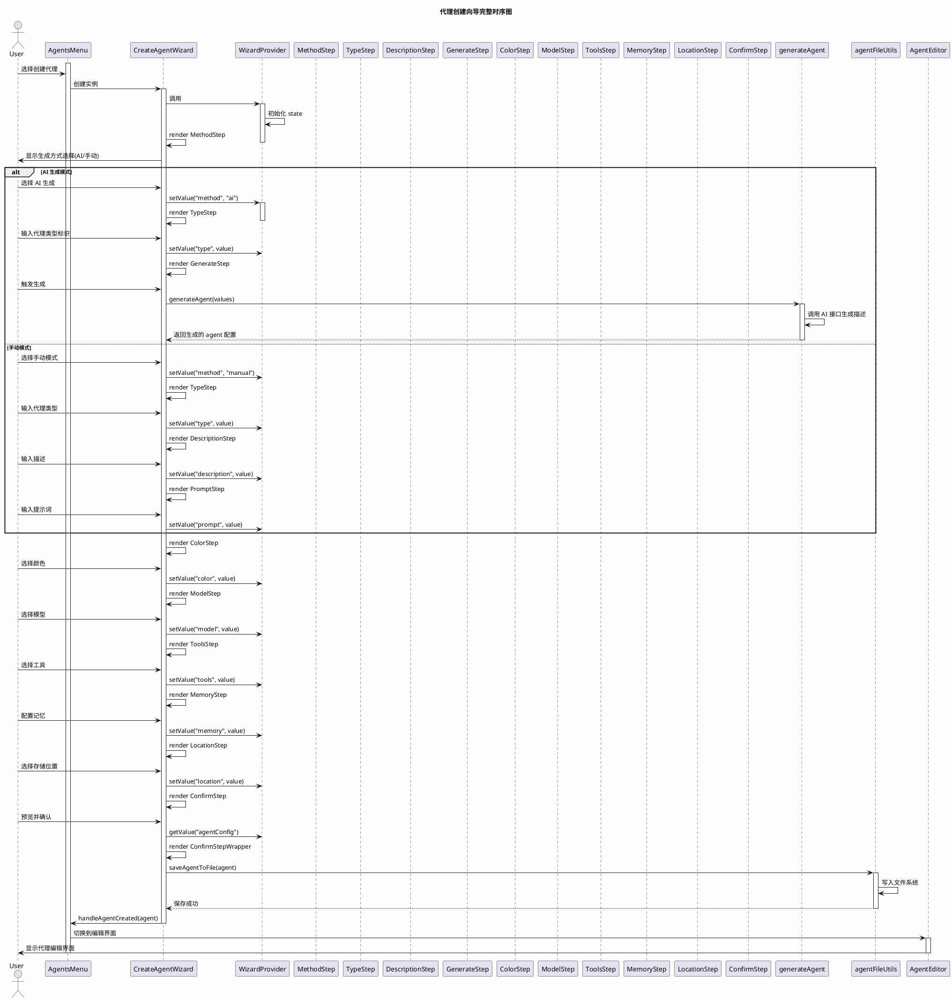
```plantuml
@startuml
skinparam backgroundColor #FEFEFE
skinparam participantSpacing 15
title 代理创建向导完整时序图

actor User
participant "AgentsMenu" as Menu
participant "CreateAgentWizard" as Wizard
participant "WizardProvider" as Provider
participant "MethodStep" as MethodStep
participant "TypeStep" as TypeStep
participant "DescriptionStep" as DescriptionStep
participant "GenerateStep" as GenerateStep
participant "ColorStep" as ColorStep
participant "ModelStep" as ModelStep
participant "ToolsStep" as ToolsStep
participant "MemoryStep" as MemoryStep
participant "LocationStep" as LocationStep
participant "ConfirmStep" as ConfirmStep
participant "generateAgent" as GenerateAgent
participant "agentFileUtils" as FileUtils
participant "AgentEditor" as Editor

activate Menu
User -> Menu : 选择创建代理
Menu -> Wizard : 创建实例
activate Wizard
Wizard -> Provider : 调用
activate Provider
Provider -> Provider : 初始化 state
Wizard -> Wizard : render MethodStep
deactivate Provider
Wizard -> User : 显示生成方式选择(AI/手动)

alt AI 生成模式
    User -> Wizard : 选择 AI 生成
    Wizard -> Provider : setValue("method", "ai")
    activate Provider
    Wizard -> Wizard : render TypeStep
    deactivate Provider
    User -> Wizard : 输入代理类型标识
    Wizard -> Provider : setValue("type", value)
    
    Wizard -> Wizard : render GenerateStep
    User -> Wizard : 触发生成
    Wizard -> GenerateAgent : generateAgent(values)
    activate GenerateAgent
    GenerateAgent -> GenerateAgent : 调用 AI 接口生成描述
    GenerateAgent --> Wizard : 返回生成的 agent 配置
    deactivate GenerateAgent
    
else 手动模式
    User -> Wizard : 选择手动模式
    Wizard -> Provider : setValue("method", "manual")
    Wizard -> Wizard : render TypeStep
    User -> Wizard : 输入代理类型
    Wizard -> Provider : setValue("type", value)
    
    Wizard -> Wizard : render DescriptionStep
    User -> Wizard : 输入描述
    Wizard -> Provider : setValue("description", value)
    
    Wizard -> Wizard : render PromptStep
    User -> Wizard : 输入提示词
    Wizard -> Provider : setValue("prompt", value)
end

Wizard -> Wizard : render ColorStep
User -> Wizard : 选择颜色
Wizard -> Provider : setValue("color", value)

Wizard -> Wizard : render ModelStep
User -> Wizard : 选择模型
Wizard -> Provider : setValue("model", value)

Wizard -> Wizard : render ToolsStep
User -> Wizard : 选择工具
Wizard -> Provider : setValue("tools", value)

Wizard -> Wizard : render MemoryStep
User -> Wizard : 配置记忆
Wizard -> Provider : setValue("memory", value)

Wizard -> Wizard : render LocationStep
User -> Wizard : 选择存储位置
Wizard -> Provider : setValue("location", value)

Wizard -> Wizard : render ConfirmStep
User -> Wizard : 预览并确认
Wizard -> Provider : getValue("agentConfig")

Wizard -> Wizard : render ConfirmStepWrapper
Wizard -> FileUtils : saveAgentToFile(agent)
activate FileUtils
FileUtils -> FileUtils : 写入文件系统
FileUtils --> Wizard : 保存成功
deactivate FileUtils

Wizard -> Menu : handleAgentCreated(agent)
deactivate Wizard
Menu -> Editor : 切换到编辑界面
activate Editor
Editor -> User : 显示代理编辑界面
deactivate Editor
deactivate Menu

@enduml
```

**时序图补充说明**：

1. **同步阻塞流程**：向导步骤之间是同步的，用户完成当前步骤后才能进入下一步。每个步骤通过 Provider 的 `setValue()` 方法保存数据。

2. **AI生成异步调用**：`generateAgent()` 是异步操作，在 `GenerateStep` 组件中调用，生成完成后返回完整配置。用户可以选择等待生成完成或手动编辑。

3. **两种模式分支**：代理创建支持 AI 生成和手动两种模式，主要区别在于描述和提示词的获取方式。AI 模式下由 `generateAgent` 自动生成，手动模式下由用户逐项输入。

4. **状态持久化时机**：数据在 Provider 中实时更新，但文件持久化只在最后 `ConfirmStepWrapper` 中一次性完成，采用 **延迟写入** 策略。

5. **完成后状态转换**：保存成功后，Menu 组件的 `handleAgentCreated` 回调触发状态机转换，从 create-agent 切换到 edit-agent 状态，显示编辑界面。

#### 场景：文件权限请求流程

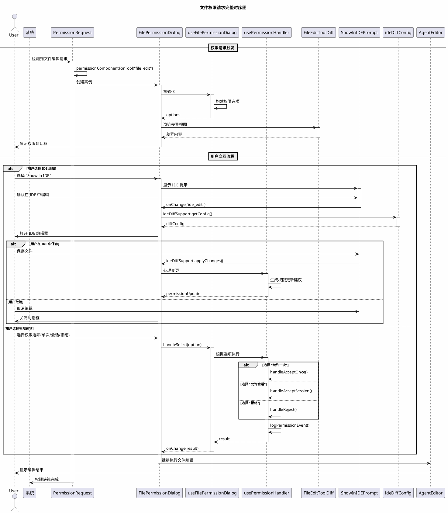
```plantuml
@startuml
skinparam backgroundColor #FEFEFE
skinparam participantSpacing 15
title 文件权限请求完整时序图

actor User
participant "系统" as System
participant "PermissionRequest" as RequestRouter
participant "FilePermissionDialog" as FileDialog
participant "useFilePermissionDialog" as DialogHook
participant "usePermissionHandler" as HandlerHook
participant "FileEditToolDiff" as DiffView
participant "ShowInIDEPrompt" as IDEPrompt
participant "ideDiffConfig" as IDEConfig
participant "AgentEditor" as Editor

== 权限请求触发 ==

System -> RequestRouter : 检测到文件编辑请求
activate RequestRouter
RequestRouter -> RequestRouter : permissionComponentForTool("file_edit")
RequestRouter -> FileDialog : 创建实例
activate FileDialog
FileDialog -> DialogHook : 初始化
activate DialogHook
DialogHook -> DialogHook : 构建权限选项
DialogHook --> FileDialog : options
deactivate DialogHook
FileDialog -> DiffView : 渲染差异视图
activate DiffView
DiffView --> FileDialog : 差异内容
deactivate DiffView
FileDialog -> User : 显示权限对话框
deactivate FileDialog

== 用户交互流程 ==

alt 用户选择 IDE 编辑
    User -> FileDialog : 选择 "Show in IDE"
    activate FileDialog
    FileDialog -> IDEPrompt : 显示 IDE 提示
    activate IDEPrompt
    User -> IDEPrompt : 确认在 IDE 中编辑
    IDEPrompt -> FileDialog : onChange("ide_edit")
    deactivate IDEPrompt
    FileDialog -> IDEConfig : ideDiffSupport.getConfig()
    activate IDEConfig
    IDEConfig --> FileDialog : diffConfig
    deactivate IDEConfig
    FileDialog -> User : 打开 IDE 编辑器
    
    alt 用户在 IDE 中保存
        User -> IDEPrompt : 保存文件
        IDEPrompt -> FileDialog : ideDiffSupport.applyChanges()
        FileDialog -> HandlerHook : 处理变更
        activate HandlerHook
        HandlerHook -> HandlerHook : 生成权限更新建议
        HandlerHook --> FileDialog : permissionUpdate
        deactivate HandlerHook
    else 用户取消
        User -> IDEPrompt : 取消编辑
        FileDialog -> User : 关闭对话框
    end
    
else 用户选择权限选项
    User -> FileDialog : 选择权限选项(单次/会话/拒绝)
    FileDialog -> DialogHook : handleSelect(option)
    activate DialogHook
    DialogHook -> HandlerHook : 根据选项执行
    activate HandlerHook
    
    alt 选择 "允许一次"
        HandlerHook -> HandlerHook : handleAcceptOnce()
    else 选择 "允许会话"
        HandlerHook -> HandlerHook : handleAcceptSession()
    else 选择 "拒绝"
        HandlerHook -> HandlerHook : handleReject()
    end
    
    HandlerHook -> HandlerHook : logPermissionEvent()
    HandlerHook --> DialogHook : result
    deactivate HandlerHook
    DialogHook --> FileDialog : onChange(result)
    deactivate DialogHook
end

FileDialog -> Editor : 继续执行文件编辑
deactivate FileDialog
Editor -> User : 显示编辑结果
deactivate Editor

RequestRouter -> System : 权限决策完成
deactivate RequestRouter

@enduml
```

**时序图补充说明**：

1. **路由分发机制**：`PermissionRequest.tsx` 作为中央路由器，根据工具类型返回对应的权限组件。本场景以 `file_edit` 为例，展示完整的权限处理流程。

2. **双向 Hook 协作**：
   - `useFilePermissionDialog` 负责选项构建和选择逻辑
   - `usePermissionHandler` 负责权限决策的执行和日志记录
   - 两者通过回调函数协作，体现了 **命令模式** 的决策与执行分离

3. **IDE 差异编辑集成**：`ideDiffConfig` 提供配置和变更应用接口，支持用户在 IDE 中编辑后自动应用变更。这种集成方式允许 **外部编辑器的协作编辑**。

4. **权限选项语义**：
   - "允许一次"：仅当前操作生效
   - "允许会话"：当前会话内持续生效
   - "IDE 编辑"：在 IDE 中编辑后应用变更

5. **日志记录**：`usePermissionHandler` 在每次权限决策时调用 `logPermissionEvent()` 记录分析事件，用于安全审计和用户体验分析。

#### 3.6.4.3 核心逻辑流程图

#### 场景：VirtualMessageList 搜索与高亮导航

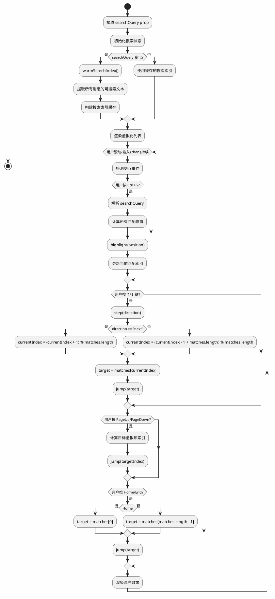
```plantuml
@startuml
skinparam backgroundColor #FEFEFE
skinparam activitySpacing 15
start

:接收 searchQuery prop;
:初始化搜索状态;

if (searchQuery 变化?) then (是)
  :warmSearchIndex();
  :提取所有消息的可搜索文本;
  :构建搜索索引缓存;
else (否)
  :使用缓存的搜索索引;
endif

:渲染虚拟化列表;

while (用户滚动/输入) then (持续)
  :检测交互事件;
  
  if (用户按 Ctrl+G?) then (是)
    :解析 searchQuery;
    :计算所有匹配位置;
    :highlight(position);
    :更新当前匹配索引;
  endif
  
  if (用户按 ↑/↓ 键?) then (是)
    :step(direction);
    
    if (direction == "next") then (是)
      :currentIndex = (currentIndex + 1) % matches.length;
    else (否)
      :currentIndex = (currentIndex - 1 + matches.length) % matches.length;
    endif
    
    :target = matches[currentIndex];
    :jump(target);
  endif
  
  if (用户按 PageUp/PageDown?) then (是)
    :计算目标虚拟项索引;
    :jump(targetIndex);
  endif
  
  if (用户按 Home/End?) then (是)
    if (Home) then (是)
      :target = matches[0];
    else (否)
      :target = matches[matches.length - 1];
    endif
    :jump(target);
  endif
  
  :渲染高亮效果;
end while

stop
@enduml
```

**流程图补充说明**：

1. **搜索索引预热**：`warmSearchIndex()` 在搜索 query 变化时异步构建搜索索引缓存，避免阻塞主线程。采用 **懒加载模式**，只在需要时初始化。

2. **增量搜索算法**：使用 **模糊匹配 (Fuzzy Matching)** 算法，支持子序列匹配。`isSubsequence()` 函数判断搜索词是否为文本的子序列。

3. **高亮定位机制**：
   - `highlight(position)` 在指定位置显示高亮标记
   - `jump(target)` 滚动到目标位置并触发扫描效果
   - 两者配合实现视觉反馈

4. **循环导航**：`step()` 函数支持循环遍历所有匹配项，当到达边界时自动循环到另一端，提供 **无限循环** 的导航体验。

5. **性能优化**：
   - 虚拟列表只渲染可视区域内的消息
   - 搜索索引只包含消息摘要，不包含完整内容
   - 高亮计算在渲染后异步执行

#### 3.6.4.4 实体关系图

根据代码分析，`src/components` 模块主要是前端 UI 组件库，**不涉及持久化实体或数据库操作**。实体关系主要体现在内存中的状态模型：

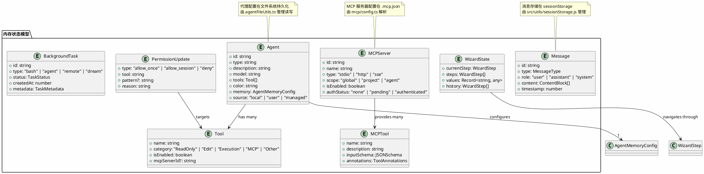
```plantuml
@startuml
skinparam backgroundColor #FEFEFE
skinparam entityStyle rectangle

package "内存状态模型" {
  entity "Agent" as Agent {
    +id: string
    +type: string
    +description: string
    +model: string
    +tools: Tool[]
    +color: string
    +memory: AgentMemoryConfig
    +source: "local" | "user" | "managed"
  }
  
  entity "Tool" as Tool {
    +name: string
    +category: "ReadOnly" | "Edit" | "Execution" | "MCP" | "Other"
    +isEnabled: boolean
    +mcpServerId?: string
  }
  
  entity "MCPServer" as MCPServer {
    +id: string
    +name: string
    +type: "stdio" | "http" | "sse"
    +scope: "global" | "project" | "agent"
    +isEnabled: boolean
    +authStatus: "none" | "pending" | "authenticated"
  }
  
  entity "MCPTool" as MCPTool {
    +name: string
    +description: string
    +inputSchema: JSONSchema
    +annotations: ToolAnnotations
  }
  
  entity "WizardState" as WizardState {
    +currentStep: WizardStep
    +steps: WizardStep[]
    +values: Record<string, any>
    +history: WizardStep[]
  }
  
  entity "PermissionUpdate" as PermissionUpdate {
    +type: "allow_once" | "allow_session" | "deny"
    +tool: string
    +pattern?: string
    +reason: string
  }
  
  entity "Message" as Message {
    +id: string
    +type: MessageType
    +role: "user" | "assistant" | "system"
    +content: ContentBlock[]
    +timestamp: number
  }
  
  entity "BackgroundTask" as BackgroundTask {
    +id: string
    +type: "bash" | "agent" | "remote" | "dream"
    +status: TaskStatus
    +createdAt: number
    +metadata: TaskMetadata
  }
}

Agent --> Tool : has many
Agent --> "1" AgentMemoryConfig : configures
MCPServer --> MCPTool : provides many
WizardState --> WizardStep : navigates through
PermissionUpdate --> Tool : targets

note top of Agent
  代理配置在文件系统持久化
  由 agentFileUtils.ts 管理读写
end note

note top of MCPServer
  MCP 服务器配置在 .mcp.json
  由 mcp/config.ts 解析
end note

note top of Message
  消息存储在 sessionStorage
  由 src/utils/sessionStorage.js 管理
end note

@enduml
```

**实体关系图补充说明**：

1. **Agent 实体**：代理是核心业务实体，包含类型标识、描述、模型配置、工具列表、颜色、记忆配置等信息。`source` 字段标识代理来源（本地/用户/托管）。

2. **Tool 实体**：工具按照功能分为五类（ReadOnly/Edit/Execution/MCP/Other），MCP 工具通过 `mcpServerId` 关联到对应服务器。

3. **MCPServer 实体**：MCP 服务器配置支持三种连接类型（stdio/http/sse），认证状态管理 OAuth 流程。

4. **WizardState**：向导状态通过 WizardProvider 管理，包含当前步骤、步骤列表、已收集的值和导航历史。

5. **PermissionUpdate**：权限更新决策用于后续自动决策，记录了授权类型、目标工具、匹配模式和决策原因。

6. **Message**：消息是对话历史的最小单元，支持多种内容类型（文本/工具调用/图片等）。

7. **BackgroundTask**：后台任务支持多种类型，包括 Bash 脚本、本地代理、远程会话、记忆整合等。

---

### 3.6.6. 接口设计

#### 3.6.6.1 对外接口

#### WizardProvider 组件

| 属性 | 值 |
|------|---|
| **文件位置** | `src/components/wizard/WizardProvider.tsx` |
| **功能概述** | 向导流程的状态提供者，管理步骤导航、历史记录、值存储 |
| **Props** | `steps: WizardStep[]`, `initialValues?: Record<string, any>`, `onComplete: (values: Record<string, any>) => void`, `onCancel?: () => void` |
| **返回值** | ReactNode (WizardContext 提供者) |
| **异常处理** | 无显式异常；内部通过 try-catch 处理导航边界 |

#### useWizard Hook

| 属性 | 值 |
|------|---|
| **文件位置** | `src/components/wizard/useWizard.ts` |
| **功能概述** | 提供向导上下文访问的类型安全 Hook |
| **返回值** | `{ currentStep, steps, values, setValue, goToStep, nextStep, prevStep, isFirstStep, isLastStep }` |
| **异常处理** | 抛出 WizardContext 未找到异常 |

#### useSelectNavigation Hook

| 属性 | 值 |
|------|---|
| **文件位置** | `src/components/CustomSelect/use-select-navigation.ts` |
| **功能概述** | 管理选项导航状态，处理焦点移动和页面滚动 |
| **返回值** | `{ visibleRange, focusedIndex, scrollTo, handleKeyDown }` |
| **异常处理** | 无显式异常；自动处理边界条件 |

#### agentFileUtils.saveAgentToFile

| 属性 | 值 |
|------|---|
| **文件位置** | `src/components/agents/agentFileUtils.ts` |
| **功能概述** | 将代理配置保存到文件系统 |
| **参数** | `agent: Agent`, `location?: SettingSource` |
| **返回值** | `Promise<void>` |
| **异常处理** | 抛出文件系统操作异常、路径解析异常 |

#### PermissionRequest.tsx 组件

| 属性 | 值 |
|------|---|
| **文件位置** | `src/components/permissions/PermissionRequest.tsx` |
| **功能概述** | 权限请求的中央路由器，根据工具类型分发到对应权限组件 |
| **Props** | `toolUse: ToolUse`, `onApprove: (update: PermissionUpdate) => void`, `onReject: () => void` |
| **返回值** | ReactNode (具体权限组件) |
| **异常处理** | 无显式异常；内部根据工具类型分发 |

#### ThemeProvider 组件

| 属性 | 值 |
|------|---|
| **文件位置** | `src/components/design-system/ThemeProvider.tsx` |
| **功能概述** | 主题上下文提供者，支持自动/手动主题切换 |
| **Props** | `children: ReactNode` |
| **上下文值** | `{ theme, setTheme, previewTheme, applyPreview, discardPreview }` |
| **异常处理** | 无显式异常 |

#### VirtualMessageList 组件

| 属性 | 值 |
|------|---|
| **文件位置** | `src/components/VirtualMessageList.tsx` |
| **功能概述** | 虚拟化消息列表，支持增量搜索和高亮定位 |
| **Props** | `messages: Message[]`, `searchQuery?: string`, `onJumpToMessage?: (messageId: string) => void` |
| **返回值** | ReactNode (虚拟化列表) |
| **异常处理** | 无显式异常；搜索索引构建失败时降级为无搜索 |

#### MCPSettings 组件

| 属性 | 值 |
|------|------|
| **文件位置** | `src/components/mcp/MCPSettings.tsx` |
| **功能概述** | MCP 设置主入口，协调列表/菜单/工具等视图切换 |
| **Props** | `onClose: () => void` |
| **返回值** | ReactNode |
| **异常处理** | 异步加载服务器信息失败时显示错误状态 |

#### 3.6.6.2 内部关键交互

#### 交互一：向导步骤导航

```
用户按 Tab/Enter
    ↓
WizardNavigationFooter 捕获按键
    ↓
useWizard.nextStep() 被调用
    ↓
WizardContext 更新 currentStep
    ↓
CreateAgentWizard 重新渲染新步骤组件
    ↓
新步骤组件请求用户输入
```

**关键性分析**：步骤导航是向导的核心交互，需要确保状态一致性（当前步骤、所有已收集值）、导航历史追踪（支持返回）、以及步骤验证（阻止无效前进）。

#### 交互二：权限请求分发

```
系统检测到工具执行请求
    ↓
PermissionRequest.permissionComponentForTool(type)
    ↓
返回对应的权限组件类型
    ↓
渲染对应权限组件 (FilePermissionDialog/BashPermissionRequest/etc.)
    ↓
用户完成交互并做出选择
    ↓
调用 onApprove(result) 或 onReject()
    ↓
父组件继续/取消工具执行
```

**关键性分析**：路由分发机制允许新增工具类型时只需添加对应权限组件，无需修改核心路由逻辑，实现了**开闭原则**。

#### 交互三：MCP 服务器认证

```
用户选择需要认证的服务器
    ↓
MCPRemoteServerMenu 渲染认证选项
    ↓
用户点击 "Authenticate"
    ↓
MCPRemoteServerMenu.handleAuthenticate()
    ↓
OAuth 流程启动 (跳转浏览器/显示授权码)
    ↓
回调处理授权码
    ↓
保存认证状态到配置
    ↓
更新 UI 显示认证成功
```

**关键性分析**：OAuth 认证涉及外部浏览器交互和多步骤状态管理，使用 Promise 链式处理认证回调，确保状态同步。

#### 交互四：消息虚拟化滚动

```
用户滚动鼠标滚轮
    ↓
ScrollKeybindingHandler.computeWheelStep()
    ↓
计算加速后的滚动步长
    ↓
ScrollBox 执行滚动
    ↓
VirtualMessageList 检测视口变化
    ↓
OffscreenFreeze 组件检测可见性
    ↓
离屏元素冻结缓存
    ↓
可视区域重新渲染
```

**关键性分析**：滚动性能优化的关键在于离屏冻结和增量渲染。OffscreenFreeze 组件通过 `isVisible` 属性判断是否需要重渲染，实现了 **性能优化模式**。

---

### 3.6.8. 关键数据结构与模型

#### 3.6.8.1 WizardState

| 属性 | 值 |
|------|---|
| **定义位置** | `src/components/wizard/WizardProvider.tsx` |
| **类型定义** | `interface WizardState { currentStep: WizardStep; steps: WizardStep[]; values: Record<string, any>; history: WizardStep[]; }` |
| **字段说明** | `currentStep` 当前步骤标识；`steps` 所有步骤列表；`values` 已收集的值映射；`history` 导航历史记录 |
| **核心作用** | 管理向导流程的完整状态，支持前进、后退、跳转等导航操作 |
| **数据流转** | 用户完成步骤 → setValue 更新 values → nextStep 更新 currentStep → 触发重新渲染 → 新步骤组件从 values 读取已有数据 |

#### 3.6.8.2 Agent

| 属性 | 值 |
|------|---|
| **定义位置** | `src/components/agents/types.ts` (推断) |
| **类型定义** | `interface Agent { id: string; type: string; description: string; model: string; tools: Tool[]; color: string; memory: AgentMemoryScope; source: SettingSource; }` |
| **字段说明** | `id` 唯一标识；`type` 类型标识符；`description` 描述文本；`model` 使用模型；`tools` 工具列表；`color` 显示颜色；`memory` 记忆配置；`source` 来源位置 |
| **核心作用** | 代理配置的核心数据模型，贯穿创建、编辑、持久化全流程 |
| **数据流转** | 创建向导收集 → WizardState.values → agentFileUtils.saveAgentToFile → 写入 JSON 文件 |

#### 3.6.8.3 ToolUse

| 属性 | 值 |
|------|---|
| **定义位置** | 外部 SDK (`@anthropic-ai/sdk`) |
| **类型定义** | `interface ToolUse { id: string; name: string; input: Record<string, any>; status: "queued" | "resolved" | "in_progress"; }` |
| **字段说明** | `id` 工具调用 ID；`name` 工具名称；`input` 输入参数；`status` 执行状态 |
| **核心作用** | 表示单次工具调用，用于权限请求和消息渲染 |
| **数据流转** | AI 响应 → PermissionRequest 捕获 → 用户授权 → 执行 → 渲染结果 |

#### 3.6.8.4 MCPServer

| 属性 | 值 |
|------|---|
| **定义位置** | `src/components/mcp/types.ts` (推断) |
| **类型定义** | `interface MCPServer { id: string; name: string; type: "stdio" | "http" | "sse"; scope: "global" | "project" | "agent"; isEnabled: boolean; authStatus: "none" | "pending" | "authenticated"; }` |
| **字段说明** | `id` 唯一标识；`name` 显示名称；`type` 连接类型；`scope` 配置作用域；`isEnabled` 是否启用；`authStatus` OAuth 认证状态 |
| **核心作用** | MCP 服务器配置模型，用于连接管理和认证 |
| **数据流转** | .mcp.json 配置文件 → MCPSettings 解析 → UI 展示 → 用户操作 → 更新配置 |

#### 3.6.8.5 PermissionUpdate

| 属性 | 值 |
|------|---|
| **定义位置** | `src/components/permissions/types.ts` (推断) |
| **类型定义** | `interface PermissionUpdate { type: "allow_once" | "allow_session" | "allow_always" | "deny"; tool: string; pattern?: string; reason: string; }` |
| **字段说明** | `type` 权限类型；`tool` 目标工具；`pattern` 匹配模式；`reason` 决策原因 |
| **核心作用** | 权限决策的数据载体，用于持久化和后续自动决策 |
| **数据流转** | 用户选择 → usePermissionHandler 生成 → 保存到权限规则配置 → 后续自动应用 |

#### 3.6.8.6 Message

| 属性 | 值 |
|------|---|
| **定义位置** | `src/components/messages/Message.tsx` (推断) |
| **类型定义** | `interface Message { id: string; type: MessageType; role: "user" | "assistant" | "system"; content: ContentBlock[]; timestamp: number; }` |
| **字段说明** | `id` 消息 ID；`type` 消息类型；`role` 角色；`content` 内容块列表；`timestamp` 时间戳 |
| **核心作用** | 对话消息的基本数据结构，支持多种内容类型 |
| **数据流转** | AI/用户输入 → 创建 Message → VirtualMessageList 渲染 → 持久化到 sessionStorage |

#### 3.6.8.7 OptionMap

| 属性 | 值 |
|------|---|
| **定义位置** | `src/components/CustomSelect/option-map.ts` |
| **类型定义** | `class OptionMap { private options: Map<string, OptionNode>; private head: OptionNode | null; private tail: OptionNode | null; }` |
| **字段说明** | `options` 选项节点映射；`head` 链表头；`tail` 链表尾 |
| **核心作用** | 提供高效的双向链表选项导航 |
| **数据流转** | 选项数组 → OptionMap 构造函数构建链表 → useSelectNavigation 调用 getNext/getPrev |

---

## 3.7. src/tools 模块实现设计文档

### 3.7.1. 模块介绍

#### 3.7.1.1 模块概述

`src/tools` 模块是 Claude Code CLI 工具链的核心实现模块，提供了一套完整的、可扩展的工具系统，使 AI Agent 能够通过这些工具与文件系统、Shell 环境、Git 仓库、网络资源等进行交互。该模块采用了工具注册与发现机制，支持内置工具、自定义工具和 MCP (Model Context Protocol) 工具的统一管理。

#### 3.7.1.2 模块定位

本模块在整个 Claude Code 系统中的定位如下：

```
┌─────────────────────────────────────────────────────────────────┐
│                      Claude Code CLI                            │
├─────────────────────────────────────────────────────────────────┤
│  ┌─────────────┐  ┌─────────────┐  ┌─────────────┐              │
│  │   Parser    │→ │  Executor   │→ │    UI       │              │
│  │   Layer     │  │   Engine    │  │   Renderer  │              │
│  └─────────────┘  └─────────────┘  └─────────────┘              │
│                        ↓                                        │
│  ┌─────────────────────────────────────────────────────────────┐│
│  │                    src/tools Module                         ││
│  │  (Agent, Bash, FileEdit, FileRead, WebSearch, etc.)       ││
│  └─────────────────────────────────────────────────────────────┘│
│                        ↓                                        │
│  ┌─────────────┐  ┌─────────────┐  ┌─────────────┐              │
│  │   Local     │  │    MCP      │  │   Network   │              │
│  │  FileSystem │  │   Server    │  │   Resource  │              │
│  └─────────────┘  └─────────────┘  └─────────────┘              │
└─────────────────────────────────────────────────────────────────┘
```

#### 3.7.1.3 主要职责

`src/tools` 模块承担以下核心职责：

- **工具定义与注册**：为每种操作类型定义标准化的工具接口，包括输入schema、输出schema和权限要求
- **命令执行与安全**：管理和执行 Bash/PowerShell 命令，提供安全验证、沙箱隔离和权限控制
- **文件系统操作**：封装文件读取、写入、编辑、搜索等操作，提供原子性和一致性保证
- **Agent 生命周期管理**：支持多 Agent 协作、任务分发、结果汇总和错误恢复
- **UI 渲染与反馈**：为每种工具提供统一的用户界面渲染组件，展示执行状态和结果
- **MCP 协议支持**：集成 MCP 服务器，扩展工具生态系统的能力边界

---

### 3.7.2. 功能描述

`src/tools` 模块提供的核心功能列表如下：

#### 3.7.2.1 Agent 管理功能

| 功能名称 | 实现文件 | 功能描述 |
|---------|---------|---------|
| 内置 Agent 定义 | `AgentTool/built-in/*.ts` | 定义 EXPLORE_AGENT、PLAN_AGENT、GENERAL_PURPOSE_AGENT 等内置代理类型 |
| Agent 加载与发现 | `AgentTool/loadAgentsDir.ts` | 从 markdown/JSON 文件加载 Agent 定义，支持插件扩展 |
| Agent 执行引擎 | `AgentTool/runAgent.ts` | 异步生成器实现 Agent 主循环，支持工具调用和消息处理 |
| Agent 内存管理 | `AgentTool/agentMemory.ts` | 管理 user/project/local 三种作用域的持久化内存 |
| Fork 子代理 | `AgentTool/forkSubagent.ts` | 支持实验性 fork 子代理功能，防止递归 fork |
| Agent 恢复 | `AgentTool/resumeAgent.ts` | 恢复后台代理执行，重建对话上下文 |

#### 3.7.2.2 Shell 命令执行功能

| 功能名称 | 实现文件 | 功能描述 |
|---------|---------|---------|
| Bash 命令执行 | `BashTool/BashTool.tsx` | 执行 Shell 命令，支持超时控制、后台任务和沙箱隔离 |
| 权限验证 | `BashTool/bashPermissions.ts` | 精确匹配/前缀匹配/通配符规则的多层权限检查 |
| 路径安全验证 | `BashTool/pathValidation.ts` | 验证命令路径安全性，过滤危险删除路径 |
| 只读操作检测 | `BashTool/readOnlyValidation.ts` | 检测 git 内部路径写入，验证 Windows UNC 路径 |
| Sed 命令验证 | `BashTool/sedValidation.ts` | 验证 sed 命令安全性，支持原地编辑解析 |
| 命令语义解释 | `BashTool/commandSemantics.ts` | 解释命令退出码语义，区分成功/失败/特殊状态 |
| 破坏性命令警告 | `BashTool/destructiveCommandWarning.ts` | 检测潜在破坏性命令，生成安全警告 |

#### 3.7.2.3 PowerShell 执行功能

| 功能名称 | 实现文件 | 功能描述 |
|---------|---------|---------|
| PowerShell 执行 | `PowerShellTool/PowerShellTool.tsx` | PowerShell 命令执行，支持自动后台化和阻塞检测 |
| 安全模式检测 | `PowerShellTool/powershellSecurity.ts` | AST-based 注入检测、下载 cradle、特权提升识别 |
| Git 路径保护 | `PowerShellTool/gitSafety.ts` | 防止 bare-repo 攻击和 .git/ 目录遍历 |
| 约束语言模式 | `PowerShellTool/clmTypes.ts` | 定义 PowerShell CLM 允许的类型集合 |

#### 3.7.2.4 文件系统操作功能

| 功能名称 | 实现文件 | 功能描述 |
|---------|---------|---------|
| 文件读取 | `FileReadTool/FileReadTool.ts` | 读取文本/图像/PDF/notebook，支持 token 预算控制 |
| 文件写入 | `FileWriteTool/FileWriteTool.ts` | 写入文件到本地文件系统 |
| 文件编辑 | `FileEditTool/FileEditTool.ts` | 执行字符串替换操作，生成 diff patch |
| Glob 搜索 | `GlobTool/GlobTool.ts` | 执行文件模式匹配搜索 |
| Grep 搜索 | `GrepTool/GrepTool.ts` | 在文件内容中执行正则表达式搜索 |

#### 3.7.2.5 代码智能功能

| 功能名称 | 实现文件 | 功能描述 |
|---------|---------|---------|
| LSP 通信 | `LSPTool/LSPTool.ts` | 与 LSP 服务器交互，提供代码跳转、引用查找、悬停信息 |
| 符号上下文 | `LSPTool/symbolContext.ts` | 提取符号位置信息用于代码分析 |
| 结果格式化 | `LSPTool/formatters.ts` | 格式化 LSP 操作结果为统一格式 |

#### 3.7.2.6 网络资源功能

| 功能名称 | 实现文件 | 功能描述 |
|---------|---------|---------|
| 网页抓取 | `WebFetchTool/WebFetchTool.ts` | 抓取网页内容并用 AI 模型处理 |
| 网络搜索 | `WebSearchTool/WebSearchTool.ts` | 执行网络搜索，处理搜索结果和引用 |

#### 3.7.2.7 团队协作功能

| 功能名称 | 实现文件 | 功能描述 |
|---------|---------|---------|
| 团队创建 | `TeamCreateTool/TeamCreateTool.ts` | 创建新团队和工作目录 |
| 团队删除 | `TeamDeleteTool/TeamDeleteTool.ts` | 清理团队和任务目录 |
| 消息发送 | `SendMessageTool/SendMessageTool.ts` | 向其他代理发送消息，支持团队广播 |
| 多代理生成 | `shared/spawnMultiAgent.ts` | 创建队友，支持 tmux/iTerm2/in-process 后端 |

#### 3.7.2.8 任务管理功能

| 功能名称 | 实现文件 | 功能描述 |
|---------|---------|---------|
| 任务创建 | `TaskCreateTool/TaskCreateTool.ts` | 创建新任务到任务列表 |
| 任务列表 | `TaskListTool/TaskListTool.ts` | 列出所有任务，过滤阻塞关系 |
| 任务更新 | `TaskUpdateTool/TaskUpdateTool.ts` | 更新任务字段，管理依赖关系 |
| 任务停止 | `TaskStopTool/TaskStopTool.ts` | 停止运行中的后台任务 |

#### 3.7.2.9 定时任务功能

| 功能名称 | 实现文件 | 功能描述 |
|---------|---------|---------|
| Cron 创建 | `ScheduleCronTool/CronCreateTool.ts` | 创建定时或一次性任务 |
| Cron 删除 | `ScheduleCronTool/CronDeleteTool.ts` | 删除定时任务 |
| Cron 列表 | `ScheduleCronTool/CronListTool.ts` | 列出所有定时任务 |

---

### 3.7.3. 模块的文件夹详细结构及功能介绍

```
src/tools/
├── AgentTool/                           # Agent 管理工具目录
│   ├── AgentTool.tsx                    # 主代理工具实现，处理同步/异步代理启动
│   ├── agentToolUtils.ts                # 代理工具结果处理、工具过滤和验证
│   ├── agentMemory.ts                   # 代理持久化内存目录管理
│   ├── agentMemorySnapshot.ts            # 代理内存快照同步管理
│   ├── loadAgentsDir.ts                 # 从 markdown/JSON 加载代理定义
│   ├── prompt.ts                        # 生成代理工具提示文本
│   ├── runAgent.ts                      # 运行代理的核心逻辑
│   ├── resumeAgent.ts                   # 恢复后台代理执行
│   ├── forkSubagent.ts                  # Fork 子代理实验管理
│   ├── agentDisplay.ts                  # 代理信息显示和覆盖解析
│   ├── agentColorManager.ts             # 管理代理颜色映射
│   ├── builtInAgents.ts                 # 内置代理工厂
│   ├── constants.ts                     # 代理工具常量定义
│   └── built-in/                        # 内置代理实现子目录
│       ├── exploreAgent.ts              # 探索代理定义
│       ├── generalPurposeAgent.ts       # 通用代理定义
│       ├── planAgent.ts                 # 计划代理定义
│       ├── claudeCodeGuideAgent.ts      # Claude 指南代理定义
│       ├── statuslineSetup.ts           # 状态栏设置代理定义
│       └── verificationAgent.ts          # 验证代理定义
│
├── BashTool/                            # Bash 命令执行工具目录
│   ├── BashTool.tsx                     # 主 Bash 工具实现
│   ├── BashToolResultMessage.tsx        # Bash 结果 UI 组件
│   ├── bashPermissions.ts               # Bash 权限检查核心逻辑
│   ├── bashSecurity.ts                  # Bash 安全验证
│   ├── bashCommandHelpers.ts             # 管道命令处理辅助函数
│   ├── commandSemantics.ts              # 命令退出码语义解释
│   ├── destructiveCommandWarning.ts      # 破坏性命令检测
│   ├── modeValidation.ts                # 根据权限模式验证命令
│   ├── pathValidation.ts                # 命令路径安全性验证
│   ├── readOnlyValidation.ts            # 只读操作验证
│   ├── sedEditParser.ts                 # sed 原地编辑命令解析
│   ├── sedValidation.ts                 # sed 命令安全性验证
│   ├── shouldUseSandbox.ts              # 沙箱使用决策
│   ├── UI.tsx                           # Bash 工具 UI 渲染
│   ├── utils.ts                         # 输出格式化和处理工具函数
│   ├── prompt.ts                        # Bash 工具提示生成
│   ├── commentLabel.ts                   # Bash 注释标签提取
│   └── toolName.ts                      # Bash 工具名称常量
│
├── PowerShellTool/                      # PowerShell 命令执行工具目录
│   ├── PowerShellTool.tsx               # 主 PowerShell 工具实现
│   ├── powershellPermissions.ts         # PowerShell 权限检查
│   ├── powershellSecurity.ts            # AST-based 安全模式检测
│   ├── modeValidation.ts                # PowerShell 权限模式验证
│   ├── pathValidation.ts                # PowerShell 路径验证
│   ├── readOnlyValidation.ts            # PowerShell 只读验证
│   ├── commandSemantics.ts              # PowerShell 命令语义解释
│   ├── gitSafety.ts                     # Git 内部路径写入防护
│   ├── destructiveCommandWarning.ts      # 破坏性命令检测
│   ├── clmTypes.ts                      # PowerShell CLM 允许类型
│   ├── commonParameters.ts               # PowerShell 通用参数定义
│   ├── UI.tsx                           # PowerShell UI 渲染
│   ├── prompt.ts                        # PowerShell 提示生成
│   └── toolName.ts                      # PowerShell 工具名称常量
│
├── FileEditTool/                        # 文件编辑工具目录
│   ├── FileEditTool.ts                 # 主文件编辑实现
│   ├── UI.tsx                          # 文件编辑 UI 渲染
│   ├── utils.ts                        # 文件编辑工具函数
│   ├── constants.ts                     # 编辑工具常量
│   ├── prompt.ts                       # 编辑工具描述
│   └── types.ts                        # 编辑工具类型定义
│
├── FileReadTool/                       # 文件读取工具目录
│   ├── FileReadTool.ts                 # 主文件读取实现
│   ├── UI.tsx                          # 文件读取 UI 渲染
│   ├── imageProcessor.ts                # 图像处理工具函数
│   ├── limits.ts                       # 文件读取限制配置
│   └── prompt.ts                       # 读取工具描述
│
├── FileWriteTool/                      # 文件写入工具目录
│   ├── FileWriteTool.ts                # 主文件写入实现
│   ├── UI.tsx                          # 文件写入 UI 渲染
│   └── prompt.ts                       # 写入工具描述
│
├── GlobTool/                           # Glob 搜索工具目录
│   ├── GlobTool.ts                     # 主 Glob 工具实现
│   ├── UI.tsx                          # Glob UI 渲染
│   └── prompt.ts                       # Glob 工具描述
│
├── GrepTool/                           # Grep 搜索工具目录
│   ├── GrepTool.ts                    # 主 Grep 工具实现
│   ├── UI.tsx                          # Grep UI 渲染
│   └── prompt.ts                       # Grep 工具描述
│
├── LSPTool/                            # 语言服务器协议工具目录
│   ├── LSPTool.ts                      # 主 LSP 工具实现
│   ├── UI.tsx                          # LSP UI 渲染
│   ├── formatters.ts                   # LSP 结果格式化
│   ├── symbolContext.ts                # 符号上下文提取
│   ├── schemas.ts                      # LSP schema 定义
│   └── prompt.ts                       # LSP 工具描述
│
├── MCPTool/                            # Model Context Protocol 工具目录
│   ├── MCPTool.ts                      # MCP 工具基类实现
│   ├── UI.tsx                          # MCP UI 渲染
│   ├── classifyForCollapse.ts          # MCP 工具分类
│   └── prompt.ts                       # MCP 工具描述
│
├── McpAuthTool/                        # MCP 认证工具目录
│   └── McpAuthTool.ts                  # MCP OAuth 认证流程
│
├── ListMcpResourcesTool/               # MCP 资源列表工具目录
│   ├── ListMcpResourcesTool.ts         # MCP 资源列表实现
│   ├── UI.tsx                          # 资源列表 UI 渲染
│   └── prompt.ts                       # 资源列表工具描述
│
├── ReadMcpResourceTool/               # MCP 资源读取工具目录
│   ├── ReadMcpResourceTool.ts          # MCP 资源读取实现
│   ├── UI.tsx                          # 资源读取 UI 渲染
│   └── prompt.ts                       # 资源读取工具描述
│
├── NotebookEditTool/                   # Jupyter Notebook 编辑工具目录
│   ├── NotebookEditTool.ts            # Notebook 单元格编辑实现
│   ├── UI.tsx                          # Notebook UI 渲染
│   ├── constants.ts                     # Notebook 工具常量
│   └── prompt.ts                       # Notebook 工具描述
│
├── EnterPlanModeTool/                  # 进入计划模式工具目录
│   ├── EnterPlanModeTool.ts            # 进入计划模式实现
│   ├── UI.tsx                          # 计划模式 UI 渲染
│   ├── constants.ts                     # 工具名称常量
│   └── prompt.ts                       # 计划模式工具描述
│
├── ExitPlanModeTool/                   # 退出计划模式工具目录
│   ├── ExitPlanModeV2Tool.ts          # 退出计划模式 V2 实现
│   ├── UI.tsx                          # 退出 UI 渲染
│   ├── constants.ts                     # 工具名称常量
│   └── prompt.ts                       # 退出工具描述
│
├── EnterWorktreeTool/                  # 进入 Git Worktree 工具目录
│   ├── EnterWorktreeTool.ts           # 进入工作树实现
│   ├── UI.tsx                          # 工作树 UI 渲染
│   ├── constants.ts                     # 工具名称常量
│   └── prompt.ts                       # 工作树工具描述
│
├── ExitWorktreeTool/                   # 退出 Git Worktree 工具目录
│   ├── ExitWorktreeTool.ts            # 退出工作树实现
│   ├── UI.tsx                          # 退出 UI 渲染
│   ├── constants.ts                     # 工具名称常量
│   └── prompt.ts                       # 退出工具描述
│
├── BriefTool/                          # 用户消息工具目录
│   ├── BriefTool.ts                   # 主消息工具实现
│   ├── UI.tsx                          # 消息 UI 渲染
│   ├── attachments.ts                  # 附件验证和处理
│   ├── upload.ts                       # 附件上传服务
│   └── prompt.ts                       # 消息工具描述
│
├── ConfigTool/                         # 配置工具目录
│   ├── ConfigTool.ts                  # 主配置工具实现
│   ├── UI.tsx                          # 配置 UI 渲染
│   ├── constants.ts                     # 工具名称常量
│   ├── prompt.ts                       # 配置工具描述
│   └── supportedSettings.ts           # 支持的设置项定义
│
├── SkillTool/                          # 技能工具目录
│   ├── SkillTool.ts                   # 主技能工具实现
│   ├── UI.tsx                          # 技能 UI 渲染
│   ├── constants.ts                     # 工具名称常量
│   └── prompt.ts                       # 技能工具描述
│
├── WebFetchTool/                       # 网页抓取工具目录
│   ├── WebFetchTool.ts                # 主抓取工具实现
│   ├── UI.tsx                          # 抓取 UI 渲染
│   ├── utils.ts                        # URL 获取和转换工具
│   ├── preapproved.ts                  # 预批准域名白名单
│   └── prompt.ts                       # 抓取工具描述
│
├── WebSearchTool/                      # 网络搜索工具目录
│   ├── WebSearchTool.ts                # 主搜索工具实现
│   ├── UI.tsx                          # 搜索 UI 渲染
│   └── prompt.ts                       # 搜索工具描述
│
├── RemoteTriggerTool/                  # 远程触发工具目录
│   ├── RemoteTriggerTool.ts           # CCR API 管理实现
│   ├── UI.tsx                          # 触发 UI 渲染
│   ├── constants.ts                     # 工具名称常量
│   └── prompt.ts                       # 触发工具描述
│
├── ScheduleCronTool/                   # 定时任务工具目录
│   ├── CronCreateTool.ts              # 定时任务创建实现
│   ├── CronDeleteTool.ts              # 定时任务删除实现
│   ├── CronListTool.ts                # 定时任务列表实现
│   ├── UI.tsx                          # Cron UI 渲染
│   └── prompt.ts                       # Cron 工具描述
│
├── SendMessageTool/                    # 消息发送工具目录
│   ├── SendMessageTool.ts             # 代理通信实现
│   ├── UI.tsx                          # 消息 UI 渲染
│   ├── constants.ts                     # 工具名称常量
│   └── prompt.ts                       # 消息工具描述
│
├── SyntheticOutputTool/                # 结构化输出工具目录
│   └── SyntheticOutputTool.ts         # JSON Schema 验证输出
│
├── TaskCreateTool/                     # 任务创建工具目录
│   ├── TaskCreateTool.ts              # 任务创建实现
│   ├── constants.ts                     # 工具名称常量
│   └── prompt.ts                       # 创建工具描述
│
├── TaskGetTool/                        # 任务获取工具目录
│   ├── TaskGetTool.ts                 # 任务获取实现
│   ├── constants.ts                     # 工具名称常量
│   └── prompt.ts                       # 获取工具描述
│
├── TaskListTool/                       # 任务列表工具目录
│   ├── TaskListTool.ts                # 任务列表实现
│   ├── constants.ts                     # 工具名称常量
│   └── prompt.ts                       # 列表工具描述
│
├── TaskOutputTool/                     # 任务输出工具目录
│   ├── TaskOutputTool.tsx             # 任务输出实现
│   ├── constants.ts                     # 工具名称常量
│   └── prompt.ts                       # 输出工具描述
│
├── TaskStopTool/                       # 任务停止工具目录
│   ├── TaskStopTool.ts                # 任务停止实现
│   ├── UI.tsx                          # 停止 UI 渲染
│   ├── constants.ts                     # 工具名称常量
│   └── prompt.ts                       # 停止工具描述
│
├── TaskUpdateTool/                     # 任务更新工具目录
│   ├── TaskUpdateTool.ts              # 任务更新实现
│   ├── constants.ts                     # 工具名称常量
│   └── prompt.ts                       # 更新工具描述
│
├── TeamCreateTool/                     # 团队创建工具目录
│   ├── TeamCreateTool.ts              # 团队创建实现
│   ├── UI.tsx                          # 创建 UI 渲染
│   ├── constants.ts                     # 工具名称常量
│   └── prompt.ts                       # 创建工具描述
│
├── TeamDeleteTool/                     # 团队删除工具目录
│   ├── TeamDeleteTool.ts              # 团队删除实现
│   ├── UI.tsx                          # 删除 UI 渲染
│   ├── constants.ts                     # 工具名称常量
│   └── prompt.ts                       # 删除工具描述
│
├── TodoWriteTool/                      # 待办事项工具目录
│   ├── TodoWriteTool.ts              # 待办管理实现
│   ├── constants.ts                     # 工具名称常量
│   └── prompt.ts                       # 待办工具描述
│
├── ToolSearchTool/                     # 工具搜索目录
│   ├── ToolSearchTool.ts              # 延迟加载工具搜索
│   ├── constants.ts                     # 工具名称常量
│   └── prompt.ts                       # 搜索工具描述
│
├── REPLTool/                           # REPL 模式工具目录
│   ├── constants.ts                     # REPL 模式配置
│   └── primitiveTools.ts                # 隐藏的原始工具列表
│
├── SleepTool/                          # 睡眠工具目录
│   └── prompt.ts                       # 睡眠工具描述
│
├── testing/                            # 测试工具目录
│   └── TestingPermissionTool.tsx       # 测试用权限工具
│
└── shared/                             # 共享工具目录
    ├── gitOperationTracking.ts          # Git 操作追踪
    └── spawnMultiAgent.ts              # 多代理生成管理
```

---

### 3.7.4. 架构与设计图谱

#### 3.7.4.1 类图


```plantuml
@startuml
skinparam backgroundColor #FEFEFE
skinparam classAttributeIconSize 0

package "Tool Base" {
    abstract class Tool {
        +name: string
        +inputSchema: ZodSchema
        +outputSchema: ZodSchema
        +call(input: any): Promise<any>
        +checkPermissions(): Promise<boolean>
        +validateInput(input: any): ValidationResult
        +mapToolResultToToolResultBlockParam(): ToolResultBlock
    }
    
    class FileEditTool extends Tool {
        +call(input: FileEditInput): Promise<FileEditOutput>
        +applyEditToFile(): PatchResult
        +getPatchForEdit(): DiffPatch
    }
    
    class FileReadTool extends Tool {
        +call(input: FileReadInput): Promise<FileReadOutput>
        +readImageWithTokenBudget(): ImageContent
        +validatePath(): PathValidation
    }
    
    class BashTool extends Tool {
        +call(input: BashInput): Promise<BashOutput>
        +runShellCommand(): AsyncGenerator<Output>
        +checkReadOnlyConstraints(): boolean
    }
    
    class PowerShellTool extends Tool {
        +call(input: PowerShellInput): Promise<PowerShellOutput>
        +runPowerShellCommand(): AsyncGenerator<Output>
        +validateASTCommand(): ASTValidation
    }
}

package "Agent System" {
    class AgentTool extends Tool {
        +call(input: AgentInput): Promise<AgentOutput>
        +spawnMultiAgent(): MultiAgentContext
        +runAgent(): AsyncGenerator<Message>
    }
    
    class LocalAgentTask {
        +agentId: string
        +id: string
        +status: AgentStatus
        +start(): void
        +stop(): void
        +getOutput(): AgentOutput
    }
    
    class RemoteAgentTask {
        +agentId: string
        +endpoint: string
        +status: AgentStatus
        +connect(): Promise<void>
        +disconnect(): void
    }
}

package "MCP Integration" {
    class MCPTool extends Tool {
        +serverName: string
        +toolName: string
        +call(input: MCPInput): Promise<MCPOutput>
    }
    
    class McpAuthTool extends Tool {
        +serverName: string
        +startOAuthFlow(): Promise<AuthResult>
        +handleCallback(): Promise<void>
    }
}

package "UI Components" {
    interface ToolRenderer {
        +renderToolUseMessage(): JSX.Element
        +renderToolResultMessage(): JSX.Element
        +renderToolUseErrorMessage(): JSX.Element
    }
    
    class BashToolUI implements ToolRenderer {
        +renderToolUseMessage(): JSX.Element
        +renderToolResultMessage(): JSX.Element
    }
    
    class FileEditToolUI implements ToolRenderer {
        +renderToolUseMessage(): JSX.Element
        +renderToolResultMessage(): JSX.Element
    }
}

package "Security" {
    class BashPermissions {
        +checkPermission(command: string): PermissionResult
        +checkExactMatch(): boolean
        +checkPrefixMatch(): boolean
    }
    
    class PathValidation {
        +validatePath(path: string): PathValidationResult
        +checkPathConstraints(): boolean
    }
    
    class ReadOnlyValidation {
        +isCommandReadOnly(): boolean
        +checkGitInternalPaths(): boolean
    }
}

Tool <|-- FileEditTool
Tool <|-- FileReadTool
Tool <|-- BashTool
Tool <|-- PowerShellTool
Tool <|-- AgentTool
Tool <|-- MCPTool

AgentTool --> LocalAgentTask : manages
AgentTool --> RemoteAgentTask : manages
BashTool --> BashPermissions : uses
BashTool --> PathValidation : uses
BashTool --> ReadOnlyValidation : uses

@enduml
```

**类图设计分析：**

- **单一职责原则 (SRP)**：每个工具类都专注于单一类型的操作。`FileEditTool` 仅负责文件编辑，`BashTool` 仅负责命令执行
- **开闭原则 (OCP)**：通过抽象 `Tool` 基类，新的工具类型只需继承并实现接口，无需修改现有代码
- **依赖倒置原则 (DIP)**：`BashTool` 依赖于抽象的权限验证接口，而非具体实现，便于安全策略的扩展

#### 3.7.4.2 关键时序图

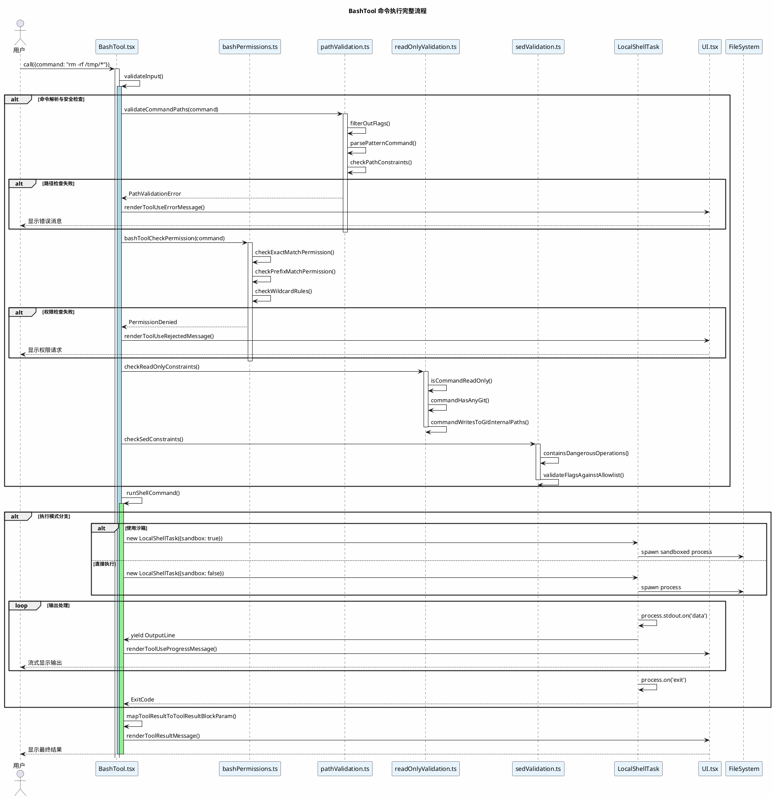
```plantuml
@startuml
skinparam backgroundColor #FEFEFE
skinparam sequenceParticipantBackgroundColor #E8F4FD

title BashTool 命令执行完整流程

actor User as "用户"
participant "BashTool.tsx" as BashTool
participant "bashPermissions.ts" as Permissions
participant "pathValidation.ts" as PathValidator
participant "readOnlyValidation.ts" as ReadOnlyValidator
participant "sedValidation.ts" as SedValidator
participant "LocalShellTask" as ShellTask
participant "UI.tsx" as UI
participant "FileSystem" as FS

User -> BashTool: call({command: "rm -rf /tmp/*"})
activate BashTool

BashTool -> BashTool: validateInput()
activate BashTool #LightBlue

alt 命令解析与安全检查
    BashTool -> PathValidator: validateCommandPaths(command)
    activate PathValidator
    PathValidator -> PathValidator: filterOutFlags()
    PathValidator -> PathValidator: parsePatternCommand()
    PathValidator -> PathValidator: checkPathConstraints()
    alt 路径检查失败
        PathValidator --> BashTool: PathValidationError
        BashTool -> UI: renderToolUseErrorMessage()
        UI --> User: 显示错误消息
    end
    deactivate PathValidator
    
    BashTool -> Permissions: bashToolCheckPermission(command)
    activate Permissions
    Permissions -> Permissions: checkExactMatchPermission()
    Permissions -> Permissions: checkPrefixMatchPermission()
    Permissions -> Permissions: checkWildcardRules()
    
    alt 权限检查失败
        Permissions --> BashTool: PermissionDenied
        BashTool -> UI: renderToolUseRejectedMessage()
        UI --> User: 显示权限请求
    end
    deactivate Permissions
    
    BashTool -> ReadOnlyValidator: checkReadOnlyConstraints()
    activate ReadOnlyValidator
    ReadOnlyValidator -> ReadOnlyValidator: isCommandReadOnly()
    ReadOnlyValidator -> ReadOnlyValidator: commandHasAnyGit()
    ReadOnlyValidator -> ReadOnlyValidator: commandWritesToGitInternalPaths()
    deactivate ReadOnlyValidator
    
    BashTool -> SedValidator: checkSedConstraints()
    activate SedValidator
    SedValidator -> SedValidator: containsDangerousOperations()
    SedValidator -> SedValidator: validateFlagsAgainstAllowlist()
    deactivate SedValidator
end

BashTool -> BashTool: runShellCommand()
activate BashTool #LightGreen

alt 执行模式分支
    alt 使用沙箱
        BashTool -> ShellTask: new LocalShellTask({sandbox: true})
        ShellTask -> FS: spawn sandboxed process
    else 直接执行
        BashTool -> ShellTask: new LocalShellTask({sandbox: false})
        ShellTask -> FS: spawn process
    end
    
    loop 输出处理
        ShellTask -> ShellTask: process.stdout.on('data')
        ShellTask -> BashTool: yield OutputLine
        BashTool -> UI: renderToolUseProgressMessage()
        UI --> User: 流式显示输出
    end
    
    ShellTask -> ShellTask: process.on('exit')
    ShellTask --> BashTool: ExitCode
end

BashTool -> BashTool: mapToolResultToToolResultBlockParam()
BashTool -> UI: renderToolResultMessage()
UI --> User: 显示最终结果

deactivate BashTool
deactivate BashTool

@enduml
```

**时序图交互分析：**

- **同步/异步模式**：`runShellCommand()` 返回异步生成器，实现命令输出的流式处理，提升用户体验
- **安全检查前置**：所有安全验证（路径、权限、只读、sed）在命令执行前完成，避免安全漏洞
- **分层渲染**：UI 更新与命令执行并行进行，用户可实时看到命令输出

#### 3.7.4.3 核心逻辑流程图

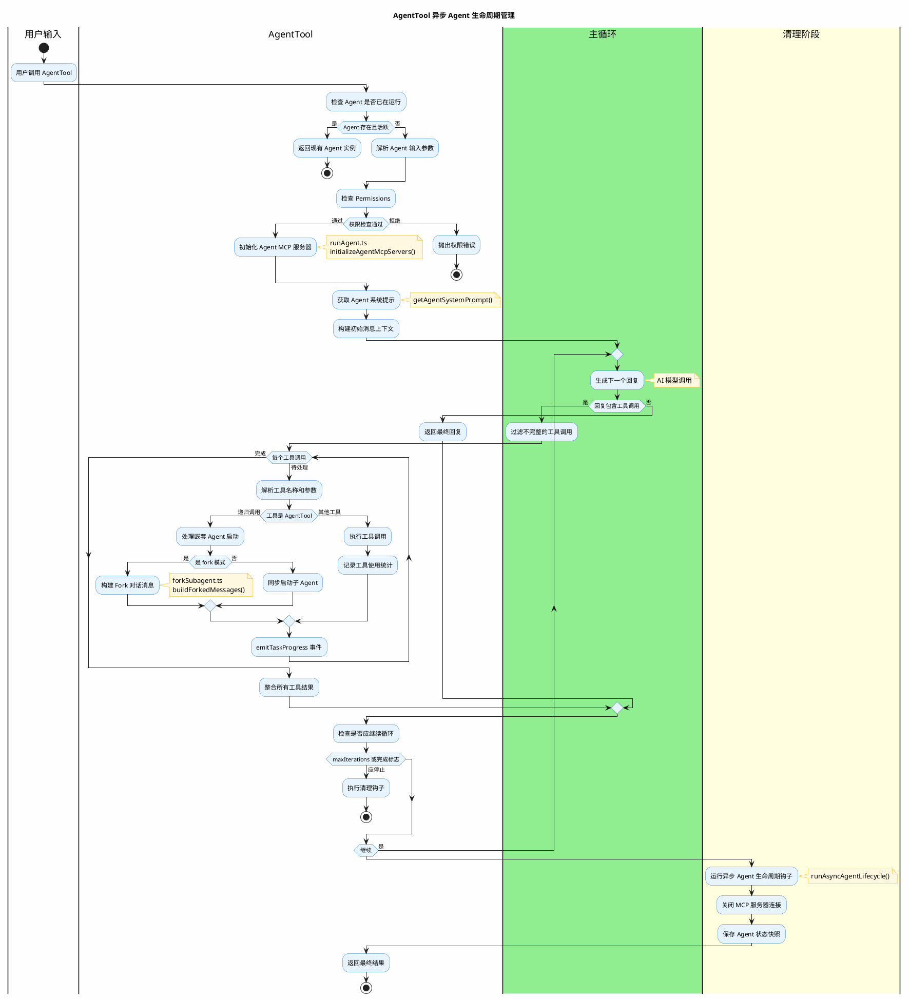
```plantuml
@startuml
skinparam backgroundColor #FEFEFE
skinparam activityBackgroundColor #E8F4FD
skinparam activityBorderColor #1976D2
skinparam noteBackgroundColor #FFF8E1
skinparam noteBorderColor #FFB300

title AgentTool 异步 Agent 生命周期管理

|用户输入|
start
:用户调用 AgentTool;

|AgentTool|
:检查 Agent 是否已在运行;
if (Agent 存在且活跃) then (是)
    :返回现有 Agent 实例;
    stop
else (否)
    :解析 Agent 输入参数;
endif

|AgentTool|
:检查 Permissions;

|AgentTool|
if (权限检查通过) then (通过)
    :初始化 Agent MCP 服务器;
    note right: runAgent.ts\ninitializeAgentMcpServers()
else (拒绝)
    :抛出权限错误;
    stop
endif

|AgentTool|
:获取 Agent 系统提示;
note right: getAgentSystemPrompt()

|AgentTool|
:构建初始消息上下文;

|#LightGreen|主循环|
repeat
    :生成下一个回复;
    note right: AI 模型调用
    
    if (回复包含工具调用) then (是)
        :过滤不完整的工具调用;
        
        |AgentTool|
        while (每个工具调用) is (待处理)
            :解析工具名称和参数;
            
            if (工具是 AgentTool) then (递归调用)
                :处理嵌套 Agent 启动;
                if (是 fork 模式) then (是)
                    :构建 Fork 对话消息;
                    note right: forkSubagent.ts\nbuildForkedMessages()
                else (否)
                    :同步启动子 Agent;
                endif
            else (其他工具)
                :执行工具调用;
                :记录工具使用统计;
            endif
            
            :emitTaskProgress 事件;
        endwhile (完成)
        
        :整合所有工具结果;
    else (否)
        :返回最终回复;
    endif
    
    :检查是否应继续循环;
    
    if (maxIterations 或完成标志) then (应停止)
        :执行清理钩子;
        stop
    endif
repeat while (继续) is (是)

|#LightYellow|清理阶段|
:运行异步 Agent 生命周期钩子;
note right: runAsyncAgentLifecycle()
:关闭 MCP 服务器连接;
:保存 Agent 状态快照;

|AgentTool|
:返回最终结果;

stop

@enduml
```

**流程图健壮性与效率分析：**

- **循环保护机制**：通过 `maxIterations` 限制防止无限循环
- **递归防护**：`forkSubagent.ts` 中的 `isInForkChild()` 防止 Agent 递归 fork
- **资源清理**：生命周期钩子确保 MCP 连接和临时资源被正确释放
- **快照机制**：`agentMemorySnapshot.ts` 支持 Agent 状态持久化，便于恢复

#### 3.7.4.4 实体关系图

```plantuml
@startuml
skinparam backgroundColor #FEFEFE
skinparam entityBackgroundColor #E3F2FD
skinparam entityBorderColor #1565C0
skinparam attributeBackgroundColor #BBDEFB
skinparam attributeBorderColor #1976D2

title src/tools 数据模型关系图

entity "AgentDefinition" as Agent {
    * id: string
    --
    * name: string
    * description: string
    * type: AgentType
    * tools: string[]
    * mcpServers: string[]
    * memoryScope: MemoryScope
    * systemPrompt: string
}

entity "AgentMemory" as Memory {
    * id: string
    --
    * agentId: string
    * scope: MemoryScope
    * content: string
    * timestamp: Date
}

entity "AgentSnapshot" as Snapshot {
    * id: string
    --
    * agentId: string
    * directory: string
    * lastSyncedAt: Date
    * hash: string
}

entity "ToolDefinition" as Tool {
    * id: string
    --
    * name: string
    * description: string
    * inputSchema: JSONSchema
    * outputSchema: JSONSchema
    * permissions: Permission[]
    * requiresApproval: boolean
}

entity "ToolUse" as ToolUse {
    * id: string
    --
    * toolId: string
    * agentId: string
    * input: JSON
    * output: JSON
    * status: ToolUseStatus
    * createdAt: Date
}

entity "Task" as Task {
    * id: string
    --
    * name: string
    * description: string
    * status: TaskStatus
    * priority: Priority
    * assignee: string
    * blockedBy: string[]
    * createdAt: Date
}

entity "Team" as Team {
    * id: string
    --
    * name: string
    * leaderId: string
    * memberIds: string[]
    * worktree: string
    * createdAt: Date
}

Agent ||--o{ Memory : "has"
Agent ||--o{ Snapshot : "creates"
Agent ||--o{ ToolUse : "uses"
Tool ||--o{ ToolUse : "recorded by"
Team ||--o{ Agent : "contains"
Task }o--|| Team : "belongs to"
Task ||--o{ Task : "depends on"

@enduml
```

**数据模型设计分析：**

- **AgentDefinition 与 ToolUse**：多对多关系，支持工具复用和审计追踪
- **MemoryScope 分层**：`user/project/local` 三层作用域支持不同生命周期的记忆管理
- **Task 依赖关系**：通过 `blockedBy` 字段实现任务依赖图，支持工作流编排
- **Snapshot 增量同步**：`hash` 字段支持差异同步，优化网络传输

---

### 3.7.6. 接口设计

#### 3.7.6.1 对外接口

##### 3.7.6.1.1 BashTool 命令执行接口

| 属性 | 详情 |
|------|------|
| **接口名称** | `BashTool` |
| **文件位置** | `src/tools/BashTool/BashTool.tsx` |
| **功能概述** | 提供安全的 Shell 命令执行能力，支持沙箱隔离、权限验证和输出格式化 |
| **参数列表** | `command: string` - 要执行的命令<br>`timeout: number` - 超时时间（毫秒）<br>`bg: boolean` - 是否后台执行 |
| **返回值** | `Promise<BashOutput>` - 包含 stdout、stderr、exitCode 的结果对象 |
| **异常处理** | `BashTimeoutError` - 命令超时<br>`BashPermissionError` - 权限被拒绝<br>`BashSecurityError` - 安全检查失败 |

##### 3.7.6.1.2 AgentTool 代理管理接口

| 属性 | 详情 |
|------|------|
| **接口名称** | `AgentTool` |
| **文件位置** | `src/tools/AgentTool/AgentTool.tsx` |
| **功能概述** | 管理 AI Agent 的创建、运行、恢复和团队协作 |
| **参数列表** | `agentType: string` - 代理类型（PLAN_AGENT、EXPLORE_AGENT 等）<br>`task: string` - 任务描述<br>`tools: string[]` - 可用工具列表 |
| **返回值** | `Promise<AgentOutput>` - 代理执行结果和生成的消息 |
| **异常处理** | `AgentNotFoundError` - 代理类型不存在<br>`AgentPermissionError` - 权限不足<br>`AgentRuntimeError` - 运行时错误 |

##### 3.7.6.1.3 FileEditTool 文件编辑接口

| 属性 | 详情 |
|------|------|
| **接口名称** | `FileEditTool` |
| **文件位置** | `src/tools/FileEditTool/FileEditTool.ts` |
| **功能概述** | 执行基于字符串匹配的文件编辑操作，生成标准 diff patch |
| **参数列表** | `file_path: string` - 文件路径<br>`oldstring: string` - 要替换的字符串<br>`newstring: string` - 替换后的字符串 |
| **返回值** | `Promise<FileEditOutput>` - 包含修改行数、diff patch 的结果 |
| **异常处理** | `FileNotFoundError` - 文件不存在<br>`StringNotFoundError` - 未找到匹配的字符串<br>`FileModifiedError` - 文件已被外部修改 |

##### 3.7.6.1.4 LSPTool 代码智能接口

| 属性 | 详情 |
|------|------|
| **接口名称** | `LSPTool` |
| **文件位置** | `src/tools/LSPTool/LSPTool.ts` |
| **功能概述** | 与语言服务器协议通信，提供代码跳转、引用查找、悬停信息等功能 |
| **参数列表** | `operation: LSPOperation` - 操作类型（gotoDefinition、findReferences 等）<br>`file_path: string` - 文件路径<br>`position: Position` - 位置信息 |
| **返回值** | `Promise<LSPResult>` - 包含定义位置、引用列表等结果 |
| **异常处理** | `LSPConnectionError` - 无法连接到 LSP 服务器<br>`LSPTimeoutError` - 操作超时 |

##### 3.7.6.1.5 TaskUpdateTool 任务更新接口

| 属性 | 详情 |
|------|------|
| **接口名称** | `TaskUpdateTool` |
| **文件位置** | `src/tools/TaskUpdateTool/TaskUpdateTool.ts` |
| **功能概述** | 更新任务状态、描述、所有者等信息，管理任务依赖关系 |
| **参数列表** | `id: string` - 任务 ID<br>`updates: TaskUpdates` - 更新字段对象<br>`blocks: string[]` - 阻塞任务 ID 列表 |
| **返回值** | `Promise<TaskUpdateResult>` - 包含更新后的任务信息 |
| **异常处理** | `TaskNotFoundError` - 任务不存在<br>`CircularDependencyError` - 循环依赖检测<br>`ValidationError` - 字段验证失败 |

#### 3.7.6.2 内部关键交互

##### 3.7.6.2.1 BashTool 安全验证链

```
BashTool.call()
    ↓
bashPermissions.bashToolCheckPermission()
    ↓ (通过)
pathValidation.validateCommandPaths()
    ↓ (通过)
readOnlyValidation.checkReadOnlyConstraints()
    ↓ (通过)
sedValidation.checkSedConstraints()
    ↓ (通过)
shouldUseSandbox.shouldUseSandbox()
    ↓
LocalShellTask.spawn()
```

**交互说明：** 这是典型的责任链模式（Chain of Responsibility），每个验证器独立检查，如果任一检查失败则立即返回错误，无需后续验证。

##### 3.7.6.2.2 AgentTool 工具调用路由

```
AgentTool.call()
    ↓
runAgent() [异步生成器]
    ↓
model.generate() [AI 模型]
    ↓
agentToolUtils.resolveAgentTools()
    ↓
filterToolsForAgent()
    ↓
executeTool()
    ↓
emitTaskProgress()
```

**交互说明：** 工具调用通过 `agentToolUtils` 统一路由，支持按代理类型过滤可用工具，确保代理只能访问其权限范围内的工具。

##### 3.7.6.2.3 MCP 工具调用流程

```
MCPTool.call()
    ↓
MCPClient.getToolSchema()
    ↓
MCPTool.call() [转发到 MCP 服务器]
    ↓
MCPTool.classifyForCollapse()
    ↓
UI.renderToolResultMessage()
```

**交互说明：** MCP 工具通过标准化协议与外部服务器通信，`classifyForCollapse` 用于判断结果是否可折叠显示。

---

### 3.7.8. 关键数据结构与模型

#### 3.7.8.1 AgentDefinition

**定义位置：** `src/tools/AgentTool/loadAgentsDir.ts`

```typescript
interface AgentDefinition {
    id: string;                    // 唯一标识符
    name: string;                  // 显示名称
    description: string;           // 功能描述
    type: AgentType;               // 代理类型枚举
    tools: string[];               // 可用工具列表
    mcpServers: string[];          // 需要的 MCP 服务器
    memoryScope: MemoryScope;     // 内存作用域 (user/project/local)
    systemPrompt: string;         // 系统提示词
    color?: string;                // UI 显示颜色
    builtin?: boolean;             // 是否内置代理
}
```

**核心作用：** 定义 Agent 的元数据和能力边界，是 Agent 加载和执行的基础。

#### 3.7.8.2 ToolDefinition

**定义位置：** `src/tools/shared/toolRegistry.ts` (隐含)

```typescript
interface ToolDefinition {
    name: string;                  // 工具名称
    description: string;           // 工具描述
    inputSchema: ZodSchema;        // 输入验证 Schema
    outputSchema: ZodSchema;       // 输出验证 Schema
    permissions: Permission[];      // 需要的权限列表
    requiresApproval: boolean;     // 是否需要用户确认
    hidden?: boolean;              // 是否对用户隐藏
    deferred?: boolean;            // 是否延迟加载
}
```

**核心作用：** 标准化工具接口定义，支持工具注册、发现和动态加载。

#### 3.7.8.3 PermissionRule

**定义位置：** `src/tools/BashTool/bashPermissions.ts`

```typescript
interface PermissionRule {
    type: 'exact' | 'prefix' | 'contains' | 'regex';
    pattern: string;
    action: 'allow' | 'deny' | 'prompt';
    reason?: string;
}
```

**核心作用：** 定义权限检查规则，支持多种匹配模式。

#### 3.7.8.4 Task

**定义位置：** `src/tools/TaskUpdateTool/TaskUpdateTool.ts`

```typescript
interface Task {
    id: string;
    name: string;
    description: string;
    status: 'pending' | 'in_progress' | 'completed' | 'blocked';
    priority: 'low' | 'medium' | 'high' | 'urgent';
    assignee?: string;
    blockedBy: string[];            // 依赖的任务 ID 列表
    blocks: string[];              // 被阻塞的任务 ID 列表
    createdAt: Date;
    updatedAt: Date;
}
```

**核心作用：** 表示工作单元，支持依赖关系管理，用于团队协作和进度跟踪。

#### 3.7.8.5 MCPToolInput

**定义位置：** `src/tools/MCPTool/MCPTool.ts`

```typescript
interface MCPToolInput {
    server: string;                // MCP 服务器名称
    tool: string;                  // 工具名称
    arguments: Record<string, any>; // 工具参数
}

interface MCPResourceInput {
    server: string;                // MCP 服务器名称
    uri: string;                   // 资源 URI
}
```

**核心作用：** 定义与 MCP 服务器交互的标准化输入格式。

---

## 3.8. Claude Code 核心服务模块实现设计文档

### 3.8.1. 模块介绍

#### 3.8.1.1 模块概述

本模块（Tenet Core Services Module）是Claude Code产品的核心服务层，承载了从API调用、工具执行到分析遥测、MCP协议支持、LSP服务器管理等关键功能。作为客户端应用与外部服务之间的桥梁，该模块负责管理API通信、对话压缩、记忆提取、事件追踪、插件系统及团队协作等核心业务逻辑。

#### 3.8.1.2 模块定位

```
┌─────────────────────────────────────────────────────────────┐
│                    Claude Code Application                   │
├─────────────────────────────────────────────────────────────┤
│  ┌─────────────────────────────────────────────────────┐   │
│  │           Tenet Core Services Module                  │   │
│  │  ┌─────────┐ ┌─────────┐ ┌─────────┐ ┌─────────┐    │   │
│  │  │   API   │ │  Tools  │ │Analytics│ │  MCP    │    │   │
│  │  │  Layer  │ │ Executor│ │  Sink   │ │ Client  │    │   │
│  │  └────┬────┘ └────┬────┘ └────┬────┘ └────┬────┘    │   │
│  │       └───────────┼───────────┼───────────┘         │   │
│  │                   ▼           ▼                     │   │
│  │  ┌─────────────────────────────────────────────┐    │   │
│  │  │  Compact │ Memory │ Settings │ Team Sync     │    │   │
│  │  └─────────────────────────────────────────────┘    │   │
│  └─────────────────────────────────────────────────────┘   │
├─────────────────────────────────────────────────────────────┤
│  External Services: Anthropic API │ Datadog │ Telemetry     │
└─────────────────────────────────────────────────────────────┘
```

#### 3.8.1.3 主要职责

| 职责域 | 具体描述 |
|--------|----------|
| **API通信管理** | 处理与Anthropic API的所有通信，包括流式/非流式请求、重试策略、错误分类 |
| **工具执行引擎** | 编排和执行各类工具（bash、文件操作、MCP工具等），管理权限和钩子 |
| **分析遥测** | 统一的事件日志管道，支持Datadog和1P事件双泄流，GrowthBook实验管理 |
| **对话压缩** | 消息历史压缩、微压缩、自动压缩触发及压缩后清理 |
| **MCP协议支持** | MCP客户端生命周期管理、OAuth认证、渠道通知、权限回调 |
| **LSP服务器管理** | 多LSP服务器实例管理、诊断跟踪、被动反馈 |
| **记忆系统** | 会话记忆提取、自动梦境合并、团队记忆同步 |
| **设置同步** | 用户设置跨环境同步、远程托管设置管理 |

#### 3.8.1.4 模块路径

根据摘要，模块核心路径为 `src/main/java/com/huawei/tenet/common`，包含以下主要子目录：
- `analytics/` - 分析遥测系统
- `api/` - API调用层
- `compact/` - 对话压缩系统
- `autoDream/` - 自动梦境系统
- `mcp/` - MCP协议客户端
- `lsp/` - LSP服务器管理
- `tools/` - 工具执行引擎
- `teamMemorySync/` - 团队记忆同步
- `SessionMemory/` - 会话记忆
- `PromptSuggestion/` - 提示建议
- `remoteManagedSettings/` - 远程托管设置
- `settingsSync/` - 设置同步

---

### 3.8.2. 功能描述

#### 3.8.2.1 核心功能列表

| 功能类别 | 功能名称 | 文件位置 | 核心标识 |
|---------|---------|---------|----------|
| **分析遥测** | Datadog事件追踪 | `analytics/datadog.ts` | trackDatadogEvent, initializeDatadog |
| | 1P事件日志管道 | `analytics/firstPartyEventLogger.ts` | logEventTo1P, initialize1PEventLogging |
| | 1P事件导出器 | `analytics/firstPartyEventLoggingExporter.ts` | export, sendEventsInBatches |
| | GrowthBook特性管理 | `analytics/growthbook.ts` | initializeGrowthBook, getFeatureValue_CACHED_MAY_BE_STALE |
| | 事件元数据收集 | `analytics/metadata.ts` | getEventMetadata, to1PEventFormat |
| | 分析泄流路由 | `analytics/sink.ts` | initializeAnalyticsSink, logEventImpl |
| | 泄流开关配置 | `analytics/sinkKillswitch.ts` | isSinkKilled |
| **API通信** | 核心API调用引擎 | `api/claude.ts` | queryModel, queryModelWithoutStreaming |
| | 多后端API客户端 | `api/client.ts` | getAnthropicClient, buildFetch |
| | 统一重试策略 | `api/withRetry.ts` | withRetry, getRetryDelay |
| | 错误分类映射 | `api/errors.ts` | getAssistantMessageFromError, classifyAPIError |
| | API日志记录 | `api/logging.ts` | logAPIQuery, logAPIError, logAPISuccess |
| | 提示缓存断裂检测 | `api/promptCacheBreakDetection.ts` | checkResponseForCacheBreak |
| | 会话持久化 | `api/sessionIngress.ts` | appendSessionLog, getSessionLogs |
| **对话压缩** | 全量压缩逻辑 | `compact/compact.ts` | compactConversation, streamCompactSummary |
| | 微型压缩 | `compact/microCompact.ts` | microcompactMessages, cachedMicrocompactPath |
| | 自动压缩触发 | `compact/autoCompact.ts` | shouldAutoCompact, autoCompactIfNeeded |
| | 会话记忆压缩 | `compact/sessionMemoryCompact.ts` | trySessionMemoryCompaction |
| | 压缩后清理 | `compact/postCompactCleanup.ts` | runPostCompactCleanup |
| | 时间基准微压缩 | `compact/timeBasedMCConfig.ts` | getTimeBasedMCConfig |
| **MCP协议** | MCP客户端管理 | `mcp/client.ts` | connectToServer, callMCPTool |
| | MCP认证流程 | `mcp/auth.ts` | performMCPOAuthFlow, ClaudeAuthProvider |
| | MCP配置管理 | `mcp/config.ts` | getMcpConfigsByScope, filterMcpServersByPolicy |
| | 渠道通知处理 | `mcp/channelNotification.ts` | wrapChannelMessage, gateChannelServer |
| | XAA跨应用认证 | `mcp/xaa.ts` | performCrossAppAccess |
| **LSP服务** | LSP服务器管理 | `lsp/LSPServerManager.ts` | initialize, getServerForFile |
| | LSP服务器实例 | `lsp/LSPServerInstance.ts` | start, stop, sendRequest |
| | LSP客户端封装 | `lsp/LSPClient.ts` | start, initialize, sendRequest |
| | 诊断注册表 | `lsp/LSPDiagnosticRegistry.ts` | registerPendingLSPDiagnostic |
| | 被动反馈处理 | `lsp/passiveFeedback.ts` | registerLSPNotificationHandlers |
| **工具执行** | 流式工具执行器 | `tools/StreamingToolExecutor.ts` | executeTool, processQueue |
| | 工具核心执行 | `tools/toolExecution.ts` | runToolUse, checkPermissionsAndCallTool |
| | 工具钩子管理 | `tools/toolHooks.ts` | runPreToolUseHooks, runPostToolUseHooks |
| | 工具编排器 | `tools/toolOrchestration.ts` | runTools, partitionToolCalls |
| **记忆系统** | 自动梦境执行 | `autoDream/autoDream.ts` | executeAutoDream, initAutoDream |
| | 合并锁管理 | `autoDream/consolidationLock.ts` | tryAcquireConsolidationLock |
| | 会话记忆提取 | `SessionMemory/sessionMemory.ts` | shouldExtractMemory, extractSessionMemory |
| | 团队记忆同步 | `teamMemorySync/index.ts` | syncTeamMemory, pullTeamMemory, pushTeamMemory |
| | 敏感信息扫描 | `teamMemorySync/secretScanner.ts` | scanForSecrets, redactSecrets |
| **设置同步** | 设置同步管理 | `settingsSync/index.ts` | uploadUserSettingsInBackground |
| | 远程托管设置 | `remoteManagedSettings/index.ts` | loadRemoteManagedSettings |
| **提示建议** | 提示生成 | `PromptSuggestion/promptSuggestion.ts` | generateSuggestion |
| | 推测执行 | `PromptSuggestion/speculation.ts` | startSpeculation, acceptSpeculation |

---

### 3.8.3. 模块文件夹详细结构及功能介绍

```
src/main/java/com/huawei/tenet/common/
├── analytics/                              # 分析遥测系统
│   ├── datadog.ts                         # Datadog事件追踪服务
│   ├── firstPartyEventLogger.ts           # 1P事件OTel日志管道
│   ├── firstPartyEventLoggingExporter.ts  # 1P事件批量导出驱动
│   ├── growthbook.ts                      # GrowthBook特性开关管理
│   ├── metadata.ts                        # 事件元数据收集工具
│   ├── sink.ts                            # 分析泄流统一入口
│   ├── sinkKillswitch.ts                  # 泄流动态开关配置
│   ├── index.ts                           # 统一事件日志API
│   ├── config.ts                          # 分析系统配置
│   └── emptyUsage.ts                      # 零初始化使用量常量
│
├── api/                                   # API调用层
│   ├── claude.ts                          # 核心API调用引擎（流式/非流式）
│   ├── client.ts                          # 多后端客户端封装
│   ├── withRetry.ts                       # 统一重试与退避策略
│   ├── errors.ts                          # 错误分类与用户消息映射
│   ├── logging.ts                         # API查询/成功/错误的分析事件
│   ├── sessionIngress.ts                  # 会话转录持久化
│   ├── promptCacheBreakDetection.ts       # 提示缓存断裂检测
│   ├── errorUtils.ts                      # API错误格式解析与SSL检测
│   ├── claudeAiLimits.ts                  # Claude AI订阅限额状态
│   ├── usage.ts                           # 订阅使用量与限额获取
│   ├── firstTokenDate.ts                  # 用户首次使用日期获取
│   ├── ultrareviewQuota.ts                # 超审核配额获取
│   ├── bootstrap.ts                       # 启动引导数据获取
│   ├── filesApi.ts                        # 文件上传下载管理
│   ├── grove.ts                           # Grove隐私设置管理
│   ├── referral.ts                        # 推荐/访客通行证管理
│   ├── adminRequests.ts                    # 组织管理员请求管理
│   ├── overageCreditGrant.ts              # 超额积分授予信息
│   └── metricsOptOut.ts                   # 指标日志选择退出
│
├── compact/                              # 对话压缩系统
│   ├── compact.ts                         # 全量压缩核心逻辑
│   ├── microCompact.ts                    # 微型压缩与缓存编辑
│   ├── autoCompact.ts                    # 自动压缩触发管理
│   ├── sessionMemoryCompact.ts           # 会话记忆压缩（实验性）
│   ├── postCompactCleanup.ts             # 压缩后缓存与状态清理
│   ├── timeBasedMCConfig.ts              # 时间基准微压缩配置
│   ├── apiMicrocompact.ts                # API端上下文管理策略
│   ├── grouping.ts                       # 消息按API轮次分组
│   ├── compactWarningState.ts            # 压缩警告抑制状态
│   ├── compactWarningHook.ts             # 压缩警告React Hook
│   └── awaySummary.ts                    # 用户离开摘要生成
│
├── autoDream/                           # 自动梦境系统
│   ├── autoDream.ts                      # 后台记忆合并服务
│   ├── consolidationPrompt.ts            # 记忆合并提示模板
│   ├── consolidationLock.ts              # 梦境合并PID锁管理
│   └── config.ts                         # 自动梦境功能开关
│
├── mcp/                                  # MCP协议客户端
│   ├── client.ts                         # MCP客户端生命周期管理
│   ├── auth.ts                           # OAuth认证与token管理
│   ├── config.ts                         # MCP配置多层级存储
│   ├── channelNotification.ts            # 渠道通知处理
│   ├── channelPermissions.ts             # 渠道权限回调机制
│   ├── channelAllowlist.ts               # MCP渠道白名单
│   ├── xaa.ts                            # RFC 8693/7523跨应用认证
│   ├── xaaIdpLogin.ts                    # 企业IdP登录流程
│   ├── normalization.ts                  # MCP名称规范化
│   ├── envExpansion.ts                   # 环境变量展开
│   ├── oauthPort.ts                      # OAuth重定向端口管理
│   ├── officialRegistry.ts                # 官方MCP服务器验证
│   ├── InProcessTransport.ts             # 进程内MCP传输
│   ├── useManageMCPConnections.tsx       # MCP连接状态React Hook
│   ├── MCPConnectionManager.tsx          # MCP连接上下文组件
│   ├── mcpServerApproval.tsx             # MCP服务器审批对话框
│   └── serverApproval.ts                 # 服务器审批逻辑
│
├── lsp/                                  # LSP服务器管理
│   ├── LSPServerManager.ts               # 多LSP服务器生命周期管理
│   ├── LSPServerInstance.ts              # 单个LSP服务器实例
│   ├── LSPClient.ts                      # vscode-jsonrpc stdio封装
│   ├── manager.ts                        # LSP管理器单例
│   ├── passiveFeedback.ts                # LSP被动反馈处理
│   ├── LSPDiagnosticRegistry.ts          # 诊断通知注册与去重
│   ├── diagnosticTracking.ts             # LSP诊断跟踪与差异检测
│   └── config.ts                         # LSP服务器配置加载
│
├── tools/                                # 工具执行引擎
│   ├── StreamingToolExecutor.ts         # 流式工具并发执行器
│   ├── toolExecution.ts                  # 核心工具执行逻辑
│   ├── toolHooks.ts                      # 工具前后置钩子
│   ├── toolOrchestration.ts              # 工具批处理与并发编排
│   ├── toolUseSummaryGenerator.ts       # 工具执行摘要生成
│   └── ...
│
├── teamMemorySync/                      # 团队记忆同步
│   ├── index.ts                         # 双向同步管理
│   ├── secretScanner.ts                  # 敏感信息扫描
│   ├── teamMemSecretGuard.ts            # 敏感信息守卫
│   └── watcher.ts                       # 文件变更监控
│
├── SessionMemory/                       # 会话记忆
│   ├── sessionMemory.ts                  # 会话笔记自动维护
│   └── prompts.ts                        # 记忆提取提示模板
│
├── PromptSuggestion/                    # 提示建议
│   ├── promptSuggestion.ts              # 提示生成与过滤
│   └── speculation.ts                    # 推测执行管理
│
├── remoteManagedSettings/              # 远程托管设置
│   ├── index.ts                         # 远程设置加载与轮询
│   ├── syncCacheState.ts                # 缓存状态管理
│   ├── securityCheck.tsx                # 安全性检查组件
│   └── types.ts                         # 远程托管设置类型
│
├── settingsSync/                       # 设置同步
│   ├── index.ts                         # 跨环境设置同步
│   └── types.ts                         # 设置同步类型
│
├── oauth/                              # OAuth认证
│   ├── client.ts                        # OAuth流程与token管理
│   ├── getOauthProfile.ts               # OAuth用户资料获取
│   └── crypto.ts                        # OAuth PKCE参数生成
│
├── policyLimits/                       # 策略限制
│   └── types.ts                         # 策略限制类型定义
│
├── tips/                               # 提示系统
│   ├── tipRegistry.ts                   # 提示定义与过滤注册表
│   ├── tipScheduler.ts                  # 提示选择与调度
│   └── tipHistory.ts                    # 提示历史管理
│
├── voice/                             # 语音功能
│   ├── voice.ts                         # 音频录制管理
│   ├── voiceStreamSTT.ts                # 语音流WebSocket转录
│   └── voiceKeyterms.ts                 # 语音识别关键词生成
│
├── vcr/                               # 响应录制回放
│   └── vcr.ts                           # API响应VCR管理
│
├── tokenEstimation.ts                 # Token数量计算工具
├── claudeAiLimitsHook.ts              # Claude AI限额React Hook
├── internalLogging.ts                 # 内部K8s日志记录
├── diagnosticTracking.ts              # 诊断跟踪服务
└── rateLimitMessages.ts               # 速率限制消息生成
```

---

### 3.8.4. 架构与设计图谱

#### 3.8.4.1 类图

```plantuml
@startuml
skinparam backgroundColor #FEFEFE
skinparam componentStyle rectangle

package "Analytics Module" {
    class AnalyticsSink {
        +initializeAnalyticsSink(): void
        +initializeAnalyticsGates(): void
        +logEventImpl(event): void
    }
    
    class FirstPartyEventLogger {
        +initialize1PEventLogging(): void
        +logEventTo1P(event): Promise<void>
        +logGrowthBookExperimentTo1P(experiment): void
        +shutdown1PEventLogging(): void
        +reinitialize1PEventLoggingIfConfigChanged(): void
        +is1PEventLoggingEnabled(): boolean
        +shouldSampleEvent(event): boolean
    }
    
    class FirstPartyEventLoggingExporter {
        +export(logs): Promise<void>
        +sendEventsInBatches(events): Promise<void>
        +queueFailedEvents(events): void
        +retryFailedEvents(): Promise<void>
        +retryFileInBackground(): void
        +transformLogsToEvents(logs): Event[]
    }
    
    class GrowthBookService {
        +initializeGrowthBook(): Promise<void>
        +getFeatureValue_CACHED_MAY_BE_STALE(key): any
        +checkGate_CACHED_OR_BLOCKING(key): boolean
        +refreshGrowthBookAfterAuthChange(): void
        +setGrowthBookConfigOverride(config): void
    }
    
    class DatadogService {
        +trackDatadogEvent(event): void
        +initializeDatadog(): void
        +shutdownDatadog(): void
        +getUserBucket(): string
    }
    
    class EventMetadataCollector {
        +getEventMetadata(): EventMetadata
        +to1PEventFormat(metadata): object
        +sanitizeToolNameForAnalytics(name): string
        +extractMcpToolDetails(name): McpToolDetails
    }
    
    AnalyticsSink --> FirstPartyEventLogger : uses
    AnalyticsSink --> DatadogService : uses
    AnalyticsSink --> GrowthBookService : uses
    FirstPartyEventLogger --> FirstPartyEventLoggingExporter : exports to
    FirstPartyEventLogger --> GrowthBookService : subscribes
    EventMetadataCollector --> FirstPartyEventLogger : provides metadata
}

package "API Layer" {
    class ClaudeAPIClient {
        +queryModel(params): AsyncGenerator<Response>
        +queryModelWithoutStreaming(params): Promise<Response>
        +verifyApiKey(): Promise<boolean>
        +getPromptCachingEnabled(): boolean
        +buildSystemPromptBlocks(): PromptBlock[]
        +updateUsage(delta): void
    }
    
    class APIClientWrapper {
        +getAnthropicClient(): AnthropicClient
        +buildFetch(url, options): Promise<Response>
    }
    
    class RetryStrategy {
        +withRetry(fn): Promise<T>
        +is529Error(error): boolean
        +getRetryDelay(attempt): number
        +parseMaxTokensContextOverflowError(error): OverflowDetails
    }
    
    class ErrorClassifier {
        +getAssistantMessageFromError(error): string
        +classifyAPIError(error): ErrorType
        +getPromptTooLongTokenGap(error): number
    }
    
    class PromptCacheBreakDetector {
        +recordPromptState(state): void
        +checkResponseForCacheBreak(response): CacheBreakResult
        +notifyCacheDeletion(): void
        +cleanupAgentTracking(): void
    }
    
    ClaudeAPIClient --> APIClientWrapper : uses
    ClaudeAPIClient --> RetryStrategy : uses
    RetryStrategy --> GrowthBookService : feature flags
    ClaudeAPIClient --> ErrorClassifier : uses
    ClaudeAPIClient --> PromptCacheBreakDetector : uses
}

package "Tool Execution" {
    class ToolOrchestrator {
        +runTools(calls): AsyncGenerator<Result>
        +partitionToolCalls(calls): ToolPartition
        +runToolsSerially(partition): AsyncGenerator<Result>
        +runToolsConcurrently(partition): AsyncGenerator<Result>
    }
    
    class StreamingToolExecutor {
        +addTool(tool): void
        +canExecuteTool(tool): boolean
        +processQueue(): void
        +executeTool(tool): Promise<Result>
        +getCompletedResults(): Result[]
        +getRemainingResults(): Promise<Result[]>
        +discard(): void
    }
    
    class ToolExecutor {
        +runToolUse(call): AsyncGenerator<Output>
        +checkPermissionsAndCallTool(call): Promise<Result>
        +classifyToolError(error): string
    }
    
    class ToolHooks {
        +runPreToolUseHooks(call): HookResult
        +runPostToolUseHooks(call, result): void
        +runPostToolUseFailureHooks(call, error): void
        +resolveHookPermissionDecision(decision): Permission
    }
    
    ToolOrchestrator --> StreamingToolExecutor : orchestrates
    ToolOrchestrator --> ToolExecutor : delegates
    ToolExecutor --> ToolHooks : uses hooks
}

package "Compact Module" {
    class ConversationCompactor {
        +compactConversation(): Promise<CompactResult>
        +partialCompactConversation(): Promise<CompactResult>
        +streamCompactSummary(): AsyncGenerator<string>
        +stripImagesFromMessages(): Message[]
        +buildPostCompactMessages(): Message[]
    }
    
    class MicroCompactor {
        +microcompactMessages(messages): Promise<Message[]>
        +cachedMicrocompactPath(): Promise<Message[]>
        +maybeTimeBasedMicrocompact(): Promise<Message[]>
        +evaluateTimeBasedTrigger(): boolean
    }
    
    class AutoCompactor {
        +shouldAutoCompact(): boolean
        +autoCompactIfNeeded(): Promise<void>
        +calculateTokenWarningState(): WarningState
        +getAutoCompactThreshold(): number
    }
    
    class PostCompactCleanup {
        +runPostCompactCleanup(): Promise<void>
    }
    
    AutoCompactor --> ConversationCompactor : triggers
    AutoCompactor --> MicroCompactor : uses
    ConversationCompactor --> PostCompactCleanup : cleanup
}

package "MCP Protocol" {
    class MCPClient {
        +connectToServer(config): Promise<void>
        +fetchToolsForClient(): Promise<Tool[]>
        +callMCPTool(tool, params): Promise<Result>
        +transformMCPResult(result): Result
        +ensureConnectedClient(): void
    }
    
    class MCPAuthProvider {
        +tokens: OAuthTokens
        +refreshAuthorization(): Promise<void>
    }
    
    class MCPConnectionManager {
        +connect(serverId): Promise<void>
        +disconnect(serverId): void
        +reconnect(serverId): Promise<void>
    }
    
    class XAAuthenticator {
        +performCrossAppAccess(): Promise<Token>
        +discoverProtectedResource(): ResourceMetadata
        +requestJwtAuthorizationGrant(): Promise<Grant>
    }
    
    MCPClient --> MCPAuthProvider : uses
    MCPClient --> MCPConnectionManager : manages
    MCPAuthProvider --> XAAuthenticator : uses for XAA
}

package "LSP Server" {
    class LSPServerManager {
        +initialize(): Promise<void>
        +getServerForFile(file): LSPServer
        +ensureServerStarted(server): Promise<void>
        +openFile(file): void
        +closeFile(file): void
    }
    
    class LSPServerInstance {
        +start(): Promise<void>
        +stop(): void
        +restart(): Promise<void>
        +sendRequest(method, params): Promise<Response>
        +isHealthy(): boolean
    }
    
    class LSPClient {
        +start(): void
        +initialize(): Promise<InitResult>
        +sendRequest(method, params): Promise<any>
        +sendNotification(method, params): void
        +onNotification(handler): void
    }
    
    class LSPDiagnosticRegistry {
        +registerPendingLSPDiagnostic(diagnostic): void
        +checkForLSPDiagnostics(): Diagnostic[]
        +deduplicateDiagnosticFiles(): Map<string, Diagnostic[]>
    }
    
    LSPServerManager --> LSPServerInstance : manages
    LSPServerInstance --> LSPClient : uses
    LSPClient --> LSPDiagnosticRegistry : reports to
}

package "Memory System" {
    class AutoDream {
        +executeAutoDream(): Promise<void>
        +initAutoDream(): DreamConfig
        +makeDreamProgressWatcher(): void
    }
    
    class ConsolidationLock {
        +tryAcquireConsolidationLock(): LockHandle | null
        +rollbackConsolidationLock(): void
        +listSessionsTouchedSince(time): Session[]
    }
    
    class SessionMemory {
        +shouldExtractMemory(): boolean
        +setupSessionMemoryFile(): void
        +extractSessionMemory(): Promise<Memory>
        +manuallyExtractSessionMemory(): Promise<Memory>
    }
    
    class TeamMemorySync {
        +syncTeamMemory(): Promise<SyncResult>
        +pullTeamMemory(): Promise<TeamMemory>
        +pushTeamMemory(): Promise<void>
        +batchDeltaByBytes(delta): Batch[]
    }
    
    class SecretScanner {
        +scanForSecrets(content): Secret[]
        +redactSecrets(secrets): string
        +getSecretLabel(rule): string
    }
    
    AutoDream --> ConsolidationLock : uses
    AutoDream --> SessionMemory : extracts
    TeamMemorySync --> SecretScanner : validates before push
}

@enduml
```

**类图分析说明：**

本模块采用了**分层架构**与**服务化设计**的混合模式：

1. **单一职责原则 (SRP)** 体现在每个类的职责边界清晰划分：
   - `FirstPartyEventLogger` 专司日志管道管理
   - `GrowthBookService` 专注特性开关评估
   - `ToolOrchestrator` 专注于工具调用的编排逻辑

2. **依赖倒置原则 (DIP)** 体现在核心类通过接口而非具体实现进行交互：
   - `ClaudeAPIClient` 依赖 `RetryStrategy` 抽象而非具体重试实现
   - `ToolOrchestrator` 通过 `StreamingToolExecutor` 抽象具体执行细节

3. **观察者模式**应用于事件系统：
   - `FirstPartyEventLogger` 观察 `GrowthBookService` 的配置变更
   - `LSPClient` 向 `LSPDiagnosticRegistry` 报告诊断变化

4. **工厂模式**应用于资源创建：
   - `APIClientWrapper.getAnthropicClient()` 根据配置创建不同的API客户端
   - `LSPServerManager.initialize()` 工厂化创建LSP服务器实例

---

#### 3.8.4.2 关键时序图

#### 场景：MCP工具调用的完整生命周期

```plantuml
@startuml
skinparam backgroundColor #FEFEFE
autonumber

participant "UI Layer" as UI
participant "ToolOrchestrator" as Orch
participant "StreamingToolExecutor" as Exec
participant "ToolExecutor" as Tool
participant "MCPTool" as MCP
participant "MCPClient" as Client
participant "MCPAuthProvider" as Auth
participant "Analytics" as Analytics
participant "Anthropic API" as API

== 工具调用发起 ==

UI -> Orch : runTools(toolCalls)
activate Orch

Orch -> Orch : partitionToolCalls(toolCalls)
note right: 分离并发安全与独占工具

alt 并发执行分支
    Orch -> Exec : addTool(concurrentTool)
    activate Exec
    
    Exec -> Tool : checkPermissionsAndCallTool(toolCall)
    activate Tool
    
    Tool -> Analytics : logEvent("tool_use_start")
    Analytics --> Tool : metadata
    
    Tool -> Client : ensureConnectedClient(serverId)
    activate Client
    
    alt 未连接状态
        Client -> Client : connectToServer(config)
        Client -> Auth : performMCPOAuthFlow()
        activate Auth
        
        Auth -> Auth : buildAuthUrl()
        Auth --> UI : OAuth Redirect
        UI -> Auth : handleCallback(code)
        Auth -> Auth : exchangeCodeForTokens()
        Auth --> Client : tokens
        
        deactivate Auth
        
        Client -> Client : fetchToolsForClient()
        Client --> Tool : tools
    end
    
    Tool -> MCP : callMCPTool(toolName, params)
    activate MCP
    
    MCP -> Client : transformMCPResult(rawResult)
    Client --> MCP : normalizedResult
    
    MCP --> Tool : result
    deactivate MCP
    
    Tool -> Tool : classifyToolError(result)
    Tool -> Analytics : logEvent("tool_use_end", metadata)
    
    Tool --> Exec : executionResult
    deactivate Tool
    
    Exec -> Exec : processQueue()
    
    Exec --> Orch : concurrentResults
    
else 串行执行分支
    Orch -> Tool : runToolUse(exclusiveTool)
    activate Tool
    
    Tool -> Tool : streamedCheckPermissionsAndCallTool()
    
    loop 每批次
        Tool -> Analytics : logProgress()
    end
    
    Tool --> Orch : serialResults
    deactivate Tool
end

== 结果聚合 ==

Orch -> Analytics : logEvent("tools_batch_complete", summary)
Orch --> UI : allResults

deactivate Orch

== 使用量更新 ==

Analytics -> API : fetchUtilization()
API --> Analytics : usage

note over Analytics
    根据使用量决定是否触发压缩
end

@enduml
```

**时序图分析：**

该时序图展示了MCP工具调用的完整生命周期，体现了以下设计考量：

1. **并发与串行的智能分区**：
   - `partitionToolCalls` 根据工具的并发安全性将其分为两组
   - 只读且无副作用的工具可并发执行，提高响应速度
   - 独占资源或可能冲突的工具串行执行，保证一致性

2. **延迟认证模式**：
   - MCP客户端采用"按需连接"策略
   - 只有在首次调用工具时才触发OAuth流程
   - 避免启动时的认证延迟

3. **流式进度反馈**：
   - 长时运行的工具通过 `logProgress()` 持续更新UI
   - `streamedCheckPermissionsAndCallTool` 支持流式输出

4. **完善的遥测覆盖**：
   - 每个关键节点都记录分析事件
   - 支持后续的性能分析和问题排查

---

#### 3.8.4.3 核心逻辑流程图

#### 场景：自动压缩触发与执行流程

```plantuml
@startuml
start
:用户发送消息或轮次结束;

:检查是否启用自动压缩;
note right: autoCompact.ts\nshouldAutoCompact()

if (启用自动压缩?) then (否)
  :跳过压缩流程;
  stop
else (是)
endif

:检查上下文窗口使用率;
note right: calculateTokenWarningState()

if (使用率 < 阈值?) then (是)
  :记录指标，跳过压缩;
  stop
else (否)
endif

:检查压缩熔断器状态;
note right: CircuitBreaker pattern

if (上次压缩失败 < 5分钟内?) then (是)
  :跳过本次压缩;
  stop
else (否)
endif

:选择压缩策略;

if (部分压缩条件满足?) then (是)
  note right
    保留最近N条消息
    适用于渐进式清理
  end note
  :执行partialCompactConversation();
else (否)
endif

:执行全量压缩;

fork
  :调用Claude API获取摘要;
  note right
    streamCompactSummary()
    支持流式输出
  end note
fork again
  :后台记录压缩开始事件;
  Analytics.logEvent()
end fork

if (摘要获取成功?) then (失败)
  :使用本地简略摘要;
  note right: 回退策略
  :记录压缩失败;
  :更新熔断器状态;
else (成功)
endif

:构建压缩后消息链;
note right
  buildPostCompactMessages()
  更新消息历史
end note

:执行压缩后清理;
fork
  :清理过期工具结果;
  :清理上下文缓存;
fork again
  :清理子代理跟踪状态;
  :重置压缩警告状态;
end fork

:记录压缩完成事件;
Analytics.logEvent()

:检查是否需要触发记忆提取;

if (长时间无记忆提取?) then (是)
  :触发后台记忆提取;
  executeExtractMemories()
endif

stop

@enduml
```

**流程图分析：**

自动压缩流程体现了以下设计考量：

1. **多层级防护机制**：
   - 功能开关检查 → 阈值检查 → 熔断器检查 → 三层防护
   - 避免不必要的API调用和资源消耗

2. **熔断器模式应用**：
   - 压缩失败后5分钟内不再次尝试
   - 防止连续失败导致的资源浪费
   - 状态自动随时间衰减

3. **渐进式回退策略**：
   - API调用失败时使用本地简略摘要
   - 保证对话不中断，用户体验平稳

4. **并行清理操作**：
   - 压缩后清理采用fork并行执行
   - 减少总清理时间，加快响应

5. **与记忆系统联动**：
   - 压缩后检查是否需要提取记忆
   - 利用压缩后的"安静窗口"执行后台任务

---

#### 3.8.4.4 实体关系图

根据代码分析，本模块主要涉及**内存状态管理**和**会话持久化**，无传统数据库实体。核心数据模型如下：

```plantuml
@startuml
skinparam backgroundColor #FEFEFE

package "Session State" {
    entity "MessageHistory" {
        * id: string
        * role: "user" | "assistant"
        * content: string
        * timestamp: number
        * metadata: MessageMetadata
        --
        belongs to Session
    }
    
    entity "Session" {
        * id: string
        * createdAt: number
        * updatedAt: number
        * model: string
        * apiRound: number
    }
    
    entity "ToolCall" {
        * id: string
        * toolName: string
        * input: object
        * output: object
        * status: "pending" | "running" | "completed" | "failed"
        * startedAt: number
        * completedAt: number
        --
        belongs to MessageHistory
    }
}

package "Configuration State" {
    entity "MCPConfig" {
        * id: string
        * scope: "project" | "user" | "local" | "enterprise"
        * serverType: "stdio" | "sse" | "http"
        * config: object
        * enabled: boolean
        * lastConnected: number
    }
    
    entity "MCPServerState" {
        * serverId: string
        * connectionStatus: "disconnected" | "connecting" | "connected"
        * tools: Tool[]
        * authTokens: OAuthTokens
        --
        references MCPConfig
    }
}

package "Sync State" {
    entity "TeamMemorySyncState" {
        * teamId: string
        * lastSyncedAt: number
        * pendingDeltas: Delta[]
        * conflictResolutions: ConflictResolution[]
    }
    
    entity "SettingsSyncState" {
        * lastSyncedAt: number
        * lastRemoteChecksum: string
        * localChecksum: string
        * syncDirection: "upload" | "download" | "bidirectional"
    }
    
    entity "RemoteManagedSettings" {
        * etag: string
        * settings: object
        * lastFetched: number
        * pollingInterval: number
    }
}

package "Analytics State" {
    entity "EventLog" {
        * id: string
        * eventType: string
        * timestamp: number
        * userId: string
        * sessionId: string
        * metadata: object
        * exported: boolean
    }
    
    entity "GrowthBookCache" {
        * key: string
        * value: any
        * fetchedAt: number
        * ttl: number
    }
}

MessageHistory "1" --> "N" ToolCall
Session "1" --> "N" MessageHistory
MCPConfig "1" --> "1" MCPServerState
Session "N" --> "1" TeamMemorySyncState

@enduml
```

**实体关系分析：**

1. **会话状态模型**：
   - `Session` 作为根实体，包含会话级别元数据
   - `MessageHistory` 通过 `apiRound` 实现消息分组
   - `ToolCall` 关联到具体消息，支持工具执行追溯

2. **MCP配置模型**：
   - 多层级作用域设计（project → user → local → enterprise）
   - 运行时状态与配置分离，便于热更新

3. **同步状态模型**：
   - 支持乐观锁和冲突解决
   - ETag机制支持增量同步

4. **分析状态模型**：
   - 本地事件缓冲区支持批量导出
   - 特性开关缓存支持TTL过期

---

### 3.8.6. 接口设计

#### 3.8.6.1 对外接口

##### 3.8.6.1.1 分析系统接口

| 接口名称 | `logEvent` |
|----------|------------|
| **文件位置** | `src/main/java/com/huawei/tenet/common/analytics/index.ts` |
| **功能概述** | 统一的事件记录入口，同步记录事件到所有已初始化的泄流 |
| **参数列表** | `eventName: string` - 事件名称<br>`properties?: Record<string, any>` - 事件属性 |
| **返回值** | `void` |
| **异常处理** | 内部捕获所有异常，确保一个泄流失败不影响其他泄流 |

| 接口名称 | `logEventAsync` |
|----------|------------|
| **文件位置** | `src/main/java/com/huawei/tenet/common/analytics/index.ts` |
| **功能概述** | 异步事件记录入口，用于不阻塞主流程的事件 |
| **参数列表** | `eventName: string`<br>`properties?: Record<string, any>` |
| **返回值** | `Promise<void>` |
| **异常处理** | 静默处理异常，仅记录日志 |

| 接口名称 | `attachAnalyticsSink` |
|----------|------------|
| **文件位置** | `src/main/java/com/huawei/tenet/common/analytics/index.ts` |
| **功能概述** | 绑定额外的分析后端泄流 |
| **参数列表** | `sink: AnalyticsSink` - 分析泄流实例 |
| **返回值** | `void` |

| 接口名称 | `trackDatadogEvent` |
|----------|------------|
| **文件位置** | `src/main/java/com/huawei/tenet/common/analytics/datadog.ts` |
| **功能概述** | 向Datadog发送结构化事件 |
| **参数列表** | `eventName: string`<br>`tags?: Record<string, string>`<br>`metadata?: Record<string, any>` |
| **返回值** | `void` |

| 接口名称 | `getFeatureValue_CACHED_MAY_BE_STALE` |
|----------|------------|
| **文件位置** | `src/main/java/com/huawei/tenet/common/analytics/growthbook.ts` |
| **功能概述** | 获取GrowthBook特性值，可能返回过期缓存 |
| **参数列表** | `featureKey: string`<br>`defaultValue?: T` |
| **返回值** | `T` - 特性值或默认值 |
| **异常处理** | 缓存过期时返回磁盘缓存值，网络完全失败时返回默认值 |

| 接口名称 | `checkGate_CACHED_OR_BLOCKING` |
|----------|------------|
| **文件位置** | `src/main/java/com/huawei/tenet/common/analytics/growthbook.ts` |
| **功能概述** | 阻塞获取特性门控值，用于关键路径决策 |
| **参数列表** | `gateKey: string` |
| **返回值** | `boolean` - 门控开启状态 |
| **异常处理** | 网络失败时默认关闭门控（保守策略） |

##### 3.8.6.1.2 API调用接口

| 接口名称 | `queryModel` |
|----------|------------|
| **文件位置** | `src/main/java/com/huawei/tenet/common/api/claude.ts` |
| **功能概述** | 主查询生成器，支持流式输出 |
| **参数列表** | `messages: Message[]`<br>`systemPrompt?: string`<br>`options?: QueryOptions` |
| **返回值** | `AsyncGenerator<StreamChunk>` - 流式响应块 |
| **异常处理** | 自动重试529错误，上下文溢出时抛出特定错误 |

| 接口名称 | `verifyApiKey` |
|----------|------------|
| **文件位置** | `src/main/java/com/huawei/tenet/common/api/claude.ts` |
| **功能概述** | 验证API密钥有效性 |
| **参数列表** | 无 |
| **返回值** | `Promise<boolean>` |
| **异常处理** | 网络错误返回false |

| 接口名称 | `withRetry` |
|----------|------------|
| **文件位置** | `src/main/java/com/huawei/tenet/common/api/withRetry.ts` |
| **功能概述** | 通用重试生成器封装 |
| **参数列表** | `fn: () => Promise<T>`<br>`options?: RetryOptions` |
| **返回值** | `Promise<T>` |
| **异常处理** | 最大重试次数后仍失败则抛出原错误 |

##### 3.8.6.1.3 工具执行接口

| 接口名称 | `runTools` |
|----------|------------|
| **文件位置** | `src/main/java/com/huawei/tenet/common/tools/toolOrchestration.ts` |
| **功能概述** | 主工具执行生成器，自动分区并发和串行工具 |
| **参数列表** | `calls: ToolCall[]`<br>`options?: RunToolsOptions` |
| **返回值** | `AsyncGenerator<ToolResult>` - 按执行顺序返回结果 |
| **异常处理** | 单个工具失败不影响其他工具，继续执行 |

| 接口名称 | `runToolUse` |
|----------|------------|
| **文件位置** | `src/main/java/com/huawei/tenet/common/tools/toolExecution.ts` |
| **功能概述** | 执行单个工具调用，含权限检查 |
| **参数列表** | `call: ToolCall`<br>`abortSignal?: AbortSignal` |
| **返回值** | `AsyncGenerator<ToolOutput>` |
| **异常处理** | 权限拒绝时返回权限错误结果 |

| 接口名称 | `runPreToolUseHooks` |
|----------|------------|
| **文件位置** | `src/main/java/com/huawei/tenet/common/tools/toolHooks.ts` |
| **功能概述** | 执行工具前钩子，可能返回延迟、执行或阻止决策 |
| **参数列表** | `call: ToolCall` |
| **返回值** | `AsyncGenerator<HookResult>` |
| **异常处理** | 钩子执行失败时默认允许执行 |

##### 3.8.6.1.4 MCP协议接口

| 接口名称 | `connectToServer` |
|----------|------------|
| **文件位置** | `src/main/java/com/huawei/tenet/common/mcp/client.ts` |
| **功能概述** | 连接单个MCP服务器 |
| **参数列表** | `config: MCPConfig` |
| **返回值** | `Promise<void>` |
| **异常处理** | 连接超时或认证失败时抛出错误 |

| 接口名称 | `callMCPTool` |
|----------|------------|
| **文件位置** | `src/main/java/com/huawei/tenet/common/mcp/client.ts` |
| **功能概述** | 调用MCP服务器提供的工具 |
| **参数列表** | `toolName: string`<br>`params: Record<string, any>`<br>`serverId?: string` |
| **返回值** | `Promise<ToolResult>` |
| **异常处理** | 工具执行失败时返回结构化错误结果 |

| 接口名称 | `performMCPOAuthFlow` |
|----------|------------|
| **文件位置** | `src/main/java/com/huawei/tenet/common/mcp/auth.ts` |
| **功能概述** | 执行完整的OAuth授权流程 |
| **参数列表** | `config: OAuthConfig` |
| **返回值** | `Promise<OAuthTokens>` |
| **异常处理** | 用户拒绝或流程失败时抛出错误 |

##### 3.8.6.1.5 压缩系统接口

| 接口名称 | `compactConversation` |
|----------|------------|
| **文件位置** | `src/main/java/com/huawei/tenet/common/compact/compact.ts` |
| **功能概述** | 全量压缩对话历史 |
| **参数列表** | `messages: Message[]`<br>`options?: CompactOptions` |
| **返回值** | `Promise<CompactResult>` - 包含压缩后的消息链 |
| **异常处理** | API调用失败时使用本地简略摘要回退 |

| 接口名称 | `shouldAutoCompact` |
|----------|------------|
| **文件位置** | `src/main/java/com/huawei/tenet/common/compact/autoCompact.ts` |
| **功能概述** | 判断是否应触发自动压缩 |
| **参数列表** | 无 |
| **返回值** | `boolean` |

| 接口名称 | `autoCompactIfNeeded` |
|----------|------------|
| **文件位置** | `src/main/java/com/huawei/tenet/common/compact/autoCompact.ts` |
| **功能概述** | 条件触发自动压缩，带熔断器保护 |
| **参数列表** | 无 |
| **返回值** | `Promise<void>` |

##### 3.8.6.1.6 记忆系统接口

| 接口名称 | `executeAutoDream` |
|----------|------------|
| **文件位置** | `src/main/java/com/huawei/tenet/common/autoDream/autoDream.ts` |
| **功能概述** | 执行自动梦境（后台记忆合并） |
| **参数列表** | 无 |
| **返回值** | `Promise<void>` |
| **异常处理** | 获取锁失败时静默跳过 |

| 接口名称 | `syncTeamMemory` |
|----------|------------|
| **文件位置** | `src/main/java/com/huawei/tenet/common/teamMemorySync/index.ts` |
| **功能概述** | 执行团队记忆的双向同步 |
| **参数列表** | `options?: SyncOptions` |
| **返回值** | `Promise<SyncResult>` |
| **异常处理** | 冲突时使用时间戳决定保留版本 |

#### 3.8.6.2 内部关键交互

#### 交互一：事件日志管道初始化

```
1. analytics/sink.ts::initializeAnalyticsSink()
   ↓ 调用
2. analytics/growthbook.ts::initializeGrowthBook()
   ↓ 完成后回调
3. analytics/firstPartyEventLogger.ts::initialize1PEventLogging()
   ↓ 创建导出器
4. analytics/firstPartyEventLoggingExporter.ts::export()
   ↓ 启动后台重试
5. firstPartyEventLoggingExporter.ts::retryFileInBackground()
```

**为何关键**：这个初始化链确保了分析系统各组件按依赖顺序启动，GrowthBook必须先初始化以获取特性开关。

#### 交互二：MCP工具调用的权限检查

```
1. tools/toolExecution.ts::checkPermissionsAndCallTool()
   ↓ 验证输入
2. tools/toolHooks.ts::runPreToolUseHooks()
   ↓ 可能返回延迟
3. mcp/channelNotification.ts::gateChannelServer()
   ↓ 验证渠道权限
4. mcp/client.ts::callMCPTool()
   ↓ 返回结果
5. tools/toolHooks.ts::runPostToolUseHooks()
   ↓ 后置处理
6. analytics/logging.ts::logAPIQuery/Success/Error()
```

**为何关键**：钩子系统允许在工具执行前进行拦截和修改，渠道权限检查确保MCP工具符合企业策略。

#### 交互三：自动压缩触发链

```
1. compact/autoCompact.ts::shouldAutoCompact()
   ↓ 检查阈值
2. compact/autoCompact.ts::autoCompactIfNeeded()
   ↓ 检查熔断器
3. compact/compact.ts::compactConversation()
   ↓ 调用API
4. api/claude.ts::queryModelWithoutStreaming()
   ↓ 处理结果
5. compact/postCompactCleanup.ts::runPostCompactCleanup()
   ↓ 清理
6. extractMemories/extractMemories.ts::executeExtractMemories()
```

**为何关键**：压缩是复杂的跨模块操作，涉及API调用、状态管理和后台任务调度。

---

### 3.8.8. 关键数据结构与模型

#### 3.8.8.1 核心数据结构

#### MCP配置结构

**定义位置**：`src/main/java/com/huawei/tenet/common/mcp/config.ts`

```typescript
interface MCPConfig {
    id: string;
    name: string;
    scope: 'project' | 'user' | 'local' | 'enterprise';
    serverType: 'stdio' | 'sse' | 'http' | 'websocket';
    command?: string;           // stdio类型需要
    args?: string[];            // 命令行参数
    env?: Record<string, string>;
    url?: string;               // HTTP/SSE类型需要
    headers?: Record<string, string>;
    enabled: boolean;
    auth?: MCPAuthConfig;
}

interface MCPAuthConfig {
    type: 'oauth' | 'api_key' | 'xaa';
    clientId?: string;
    clientSecret?: string;
    scopes?: string[];
    redirectUri?: string;
}
```

**字段说明**：
- `scope` 支持多层级配置，覆盖优先级：local > user > project > enterprise
- `serverType` 决定连接方式和连接参数
- `auth` 支持OAuth、API Key和XAA三种认证方式

#### 工具调用结构

**定义位置**：`src/main/java/com/huawei/tenet/common/tools/toolExecution.ts`

```typescript
interface ToolCall {
    id: string;
    name: string;
    input: Record<string, any>;
    type: 'tool' | 'mcp' | 'builtin';
    serverId?: string;           // MCP工具需要
    permissions?: ToolPermissions;
    flags?: ToolFlags;
    streaming?: boolean;
}

interface ToolPermissions {
    allowRule?: string;
    denyRule?: string;
    userOverride?: boolean;
    hookOverride?: boolean;
}

interface ToolFlags {
    READ_ONLY?: boolean;
    GLOBAL_EFFECT?: boolean;
    NETWORK_ACCESS?: boolean;
    FILE_WRITE?: boolean;
}

interface ToolResult {
    id: string;
    output: any;
    truncated?: boolean;
    truncatedBytes?: number;
    error?: ToolError;
    metadata?: ToolMetadata;
}

interface ToolError {
    code: string;
    message: string;
    recoverable: boolean;
}
```

**核心作用**：
- `ToolCall` 是工具执行的输入抽象，统一不同来源的工具调用
- `ToolFlags` 用于编排器判断并发安全性
- `ToolResult` 包含截断信息，支持大输出处理

#### 压缩结果结构

**定义位置**：`src/main/java/com/huawei/tenet/common/compact/compact.ts`

```typescript
interface CompactResult {
    originalMessageCount: number;
    compressedMessageCount: number;
    summaryMessage: Message;
    preservedMessages: Message[];
    discardedMessages: Message[];
    tokenReduction: number;
    compressionRatio: number;
}

interface Message {
    id: string;
    role: 'user' | 'assistant' | 'system';
    content: string | ContentBlock[];
    timestamp: number;
    metadata?: MessageMetadata;
}

interface MessageMetadata {
    apiRound?: number;
    compactRef?: string;        // 引用压缩前的消息ID
    toolsUsed?: string[];
    model?: string;
}
```

**数据流转**：
1. 压缩前记录 `originalMessageCount` 和所有消息
2. 调用API获取摘要
3. 构建 `summaryMessage` 作为压缩后的历史
4. 计算 `compressionRatio` 用于分析

#### 事件日志结构

**定义位置**：`src/main/java/com/huawei/tenet/common/analytics/metadata.ts`

```typescript
interface EventMetadata {
    userId: string;
    sessionId: string;
    connectionId?: string;
    timestamp: number;
    clientVersion: string;
    platform: 'mac' | 'windows' | 'linux';
    model?: string;
    subscriptionTier?: string;
}

interface AnalyticsEvent {
    event: string;
    properties: Record<string, any>;
    metadata: EventMetadata;
    userBucket?: string;
    timestamp: number;
}

interface FirstPartyEvent {
    event_type: string;          // snake_case格式
    event_properties: Record<string, any>;
    user_id: string;
    session_id: string;
    client_version: string;
    platform: string;
    timestamp: string;           // ISO 8601格式
}
```

**格式转换**：从camelCase的 `AnalyticsEvent` 转换为snake_case的 `FirstPartyEvent`

---

## 3.9. Tasks 模块实现设计文档

### 3.9.1. 模块介绍

`src/tasks` 模块是 Claude Code 应用中统一的任务管理与执行框架，负责协调和监控多种类型的异步后台任务。该模块采用了**统一的 Task 接口模式**，将原本分散的异步执行实现（如 AsyncAgent、BackgroundRemoteSession 等）整合到同一个任务注册与生命周期管理框架中。


### 模块主要职责

1. **任务注册与生命周期管理**：统一管理任务的创建、状态更新、完成/失败/终止等生命周期事件
2. **状态通知机制**：通过消息队列向 UI 层推送任务状态变更
3. **资源清理与回收**：确保任务终止时正确释放资源，防止僵尸进程
4. **磁盘持久化**：将任务输出写入文件系统，供 TaskOutput 组件消费

### 模块路径

`src/tasks`

---

### 3.9.2. 功能描述

#### 3.9.2.1 任务类型注册与工厂模式

| 功能 | 实现文件 | 关键代码位置 |
|------|---------|-------------|
| 统一任务注册 | [types.ts](./types.ts) | `TaskState` 联合类型定义 |
| 任务工厂查找 | [utils/task/framework.js](../utils/task/framework.js) | `getTaskByType()` 函数 |

**功能说明**：通过 `TaskState` 联合类型和 `getTaskByType()` 工厂函数，将 7 种异构任务（Shell、LocalAgent、RemoteAgent、InProcessTeammate、LocalWorkflow、MonitorMcp、Dream）统一到同一个框架下管理。

#### 3.9.2.2 任务状态不可变更新

| 功能 | 实现文件 | 关键代码位置 |
|------|---------|-------------|
| 原子性状态更新 | [utils/task/framework.js](../utils/task/framework.js) | `updateTaskState()` 函数 |
| 状态转换验证 | 各 Task 实现 | `kill()` 方法中的 `status !== 'running'` 检查 |

**功能说明**：所有任务状态更新通过 `updateTaskState()` 函数实现，该函数接收一个纯函数作为 updater，确保状态更新的原子性和可追溯性。

#### 3.9.2.3 后台任务通知机制

| 功能 | 实现文件 | 关键代码位置 |
|------|---------|-------------|
| 通知入队 | [utils/messageQueueManager.js](../utils/messageQueueManager.js) | `enqueuePendingNotification()` |
| XML 消息构造 | 各 Task 实现 | `enqueueAgentNotification()` 等函数 |

**功能说明**：任务完成/失败时，通过构造特定格式的 `<task_notification>` XML 消息并入队，UI 层在下一轮渲染时消费这些消息。

#### 3.9.2.4 主会话后台化 (LocalMainSessionTask)

| 功能 | 实现文件 | 关键代码位置 |
|------|---------|-------------|
| 后台会话启动 | [LocalMainSessionTask.ts](./LocalMainSessionTask.ts) | `startBackgroundSession()` 函数 |
| 消息持久化 | [utils/sessionStorage.js](../utils/sessionStorage.js) | `recordSidechainTranscript()` |

**功能说明**：支持用户将正在运行的查询后台化（Ctrl+B），将主会话查询挂起到后台继续执行，UI 切换到新提示符。

#### 3.9.2.5 远程任务轮询 (RemoteAgentTask)

| 功能 | 实现文件 | 关键代码位置 |
|------|---------|-------------|
| 会话轮询 | [RemoteAgentTask.tsx](./RemoteAgentTask/RemoteAgentTask.tsx) | `startRemoteSessionPolling()` 函数 |
| 元数据持久化 | [utils/sessionStorage.js](../utils/sessionStorage.js) | `writeRemoteAgentMetadata()` |

**功能说明**：通过定时轮询 `pollRemoteSessionEvents()` API 获取远程 Claude.ai 会话的状态更新，支持 `--resume` 恢复断开的会话。

#### 3.9.2.6 Shell 任务 Stall 检测

| 功能 | 实现文件 | 关键代码位置 |
|------|---------|-------------|
| 交互式输入检测 | [LocalShellTask.tsx](./LocalShellTask/LocalShellTask.tsx) | `startStallWatchdog()` 函数、`looksLikePrompt()` 函数 |
| 后台进程清理 | [killShellTasks.ts](./LocalShellTask/killShellTasks.ts) | `killShellTasksForAgent()` 函数 |

**功能说明**：监控长时间无输出的 Shell 任务，检测是否在等待交互式输入（如 `y/n` 提示），防止任务假死。

#### 3.9.2.7 进程内队友管理 (InProcessTeammateTask)

| 功能 | 实现文件 | 关键代码位置 |
|------|---------|-------------|
| 队友消息注入 | [InProcessTeammateTask.tsx](./InProcessTeammateTask/InProcessTeammateTask.tsx) | `injectUserMessageToTeammate()` |
| 关机请求 | 同上 | `requestTeammateShutdown()` |

**功能说明**：管理在同一 Node.js 进程内运行的 AI 队友，支持通过 AsyncLocalStorage 实现隔离，支持查看队友对话历史。

#### 3.9.2.8 梦境任务 (DreamTask)

| 功能 | 实现文件 | 关键代码位置 |
|------|---------|-------------|
| 任务注册 | [DreamTask.ts](./DreamTask/DreamTask.ts) | `registerDreamTask()` |
| 阶段追踪 | 同上 | `addDreamTurn()` |

**功能说明**：管理自动梦境（记忆整合）子代理的生命周期，使其输出在 UI 层可见。

#### 3.9.2.9 任务停止机制

| 功能 | 实现文件 | 关键代码位置 |
|------|---------|-------------|
| 统一停止入口 | [stopTask.ts](./stopTask.ts) | `stopTask()` 函数 |
| 类型特定实现 | 各 Task 实现 | `kill()` 方法 |

**功能说明**：`stopTask()` 作为统一的任务停止入口，分发到具体 Task 实现的 `kill()` 方法。

---

### 3.9.3. 模块文件夹详细结构及功能介绍

```
src/tasks/
├── DreamTask/
│   └── DreamTask.ts              # 梦境（记忆整合）子代理的任务实现
├── InProcessTeammateTask/
│   ├── InProcessTeammateTask.tsx  # 进程内 AI 队友的任务管理
│   └── types.ts                  # 进程内队友任务的状态类型定义
├── LocalAgentTask/
│   └── LocalAgentTask.tsx        # 本地后台 Agent 任务实现
├── LocalMainSessionTask.ts       # 主会话后台化任务实现
├── LocalShellTask/
│   ├── guards.ts                # Shell 任务类型守卫与状态定义
│   ├── killShellTasks.ts        # Shell 任务清理工具函数
│   └── LocalShellTask.tsx       # Shell 任务的核心实现
├── RemoteAgentTask/
│   └── RemoteAgentTask.tsx      # 远程 Claude.ai 会话任务实现
├── pillLabel.ts                 # UI 页脚药丸标签文字生成
├── stopTask.ts                  # 统一的任务停止逻辑
└── types.ts                    # 任务状态联合类型与守卫函数
```

### 详细文件功能描述

#### `types.ts`
任务状态的根联合类型定义，包含 `TaskState` 和 `BackgroundTaskState` 两种联合类型，以及 `isBackgroundTask()` 守卫函数。

#### `pillLabel.ts`
根据当前运行的背景任务集合，生成 UI 底部药丸标签的显示文字，如 "3 shells, 1 monitor"。

#### `stopTask.ts`
统一的 `StopTaskError` 异常类和 `stopTask()` 函数，封装了任务查找、状态验证和 kill 调用的通用流程。

#### `LocalMainSessionTask.ts`
实现了主会话后台化的 `registerMainSessionTask()`、`startBackgroundSession()`、`completeMainSessionTask()`、`foregroundMainSessionTask()` 等函数。

---

### 3.9.4. 架构与设计图谱

#### 3.9.4.1 类图 (Class Diagram)

```plantuml
@startuml
' 核心接口与基类
interface Task {
    +name: string
    +type: string
    +kill(id: string, setAppState: SetAppState): Promise<void>
}

interface TaskStateBase {
    +id: string
    +type: string
    +status: 'pending' | 'running' | 'completed' | 'failed' | 'killed'
    +description: string
    +startTime: number
    +endTime?: number
    +notified: boolean
}

' 各类型状态
class LocalShellTaskState {
    +command: string
    +result?: { code: number, interrupted: boolean }
    +shellCommand: ShellCommand | null
    +isBackgrounded: boolean
    +agentId?: AgentId
    +kind?: BashTaskKind
}

class LocalAgentTaskState {
    +agentId: string
    +prompt: string
    +selectedAgent?: AgentDefinition
    +abortController?: AbortController
    +progress?: AgentProgress
    +isBackgrounded: boolean
    +retain: boolean
    +diskLoaded: boolean
}

class RemoteAgentTaskState {
    +remoteTaskType: RemoteTaskType
    +sessionId: string
    +command: string
    +title: string
    +log: SDKMessage[]
    +isUltraplan?: boolean
    +ultraplanPhase?: UltraplanPhase
}

class InProcessTeammateTaskState {
    +identity: TeammateIdentity
    +prompt: string
    +messages?: Message[]
    +pendingUserMessages: string[]
    +isIdle: boolean
    +shutdownRequested: boolean
}

class DreamTaskState {
    +phase: DreamPhase
    +sessionsReviewing: number
    +filesTouched: string[]
    +turns: DreamTurn[]
    +abortController?: AbortController
}

' Task 实现
class LocalShellTask {
    +name: 'LocalShellTask'
    +type: 'local_bash'
    +kill(taskId, setAppState)
}

class LocalAgentTask {
    +name: 'LocalAgentTask'
    +type: 'local_agent'
    +kill(taskId, setAppState)
}

class RemoteAgentTask {
    +name: 'RemoteAgentTask'
    +type: 'remote_agent'
    +kill(taskId, setAppState)
}

class DreamTask {
    +name: 'DreamTask'
    +type: 'dream'
    +kill(taskId, setAppState)
}

' 继承关系
TaskStateBase <|-- LocalShellTaskState
TaskStateBase <|-- LocalAgentTaskState
TaskStateBase <|-- RemoteAgentTaskState
TaskStateBase <|-- InProcessTeammateTaskState
TaskStateBase <|-- DreamTaskState

Task <|.. LocalShellTask
Task <|.. LocalAgentTask
Task <|.. RemoteAgentTask
Task <|.. DreamTask

' 关键关联
LocalAgentTaskState *-- AgentDefinition
LocalAgentTaskState *-- AgentProgress
InProcessTeammateTaskState *-- TeammateIdentity
RemoteAgentTaskState *-- SDKMessage

note right of TaskStateBase
    所有具体状态类型都扩展此基类，
    提供通用字段：taskId, status, notified 等
    不可变更新模式确保状态可追溯
end note

note bottom of LocalAgentTaskState
    使用 AsyncLocalStorage 隔离的子代理
    支持 diskLoaded 边链引导
    retain 标志阻止 UI 驱逐
end note

note right of RemoteAgentTaskState
    通过轮询 pollRemoteSessionEvents()
    获取远程会话的实时状态
    支持 ultraplan 交互式审批
end note
@enduml
```

**设计原则分析**：

1. **单一职责原则 (SRP)**：每个具体 Task 类只负责一种任务类型的行为，如 `LocalShellTask` 专门处理 Bash 命令，`RemoteAgentTask` 专门处理远程会话。

2. **开闭原则 (OCP)**：新增任务类型只需实现 `Task` 接口，无需修改现有代码。如需添加新任务类型，只需新增文件并实现 `kill()` 方法。

3. **依赖倒置 (DIP)**：框架层通过 `Task` 接口依赖具体实现，而不是具体实现依赖框架。

4. **组合优于继承**：各状态类型通过组合（如 `AgentDefinition`、`ShellCommand`）而非继承来扩展功能。

---

#### 3.9.4.2 关键时序图 (Key Sequence Diagram)

##### 3.9.4.2.1 远程任务完整生命周期

```plantuml
@startuml
title 远程任务完整生命周期时序图

actor User as "用户"
participant "AgentTool" as AgentTool
participant "RemoteAgentTask" as RemoteAgentTask
participant "pollRemoteSessionEvents" as PollAPI
participant "AppState.tasks" as State
participant "enqueuePendingNotification" as Notify
participant "LLM" as "本地模型"

== 任务创建与注册 ==

User -> AgentTool: 使用 Remote Agent 工具
AgentTool -> RemoteAgentTask: registerRemoteAgentTask(options)
activate RemoteAgentTask
RemoteAgentTask -> RemoteAgentTask: generateTaskId('remote_agent')
RemoteAgentTask -> RemoteAgentTask: initTaskOutput(taskId)
RemoteAgentTask -> State: registerTask(taskState, setAppState)
RemoteAgentTask -> RemoteAgentTask: persistRemoteAgentMetadata(meta)
RemoteAgentTask -> RemoteAgentTask: startRemoteSessionPolling(taskId, context)
RemoteAgentTask --> AgentTool: { taskId, sessionId, cleanup }
deactivate RemoteAgentTask

== 轮询循环 ==

loop 每 1 秒轮询
    RemoteAgentTask -> PollAPI: pollRemoteSessionEvents(sessionId, lastEventId)
    PollAPI --> RemoteAgentTask: { newEvents, sessionStatus, lastEventId }
    
    alt 有新事件
        RemoteAgentTask -> RemoteAgentTask: appendTaskOutput(deltaText)
        RemoteAgentTask -> RemoteAgentTask: accumulatedLog += newEvents
        RemoteAgentTask -> State: updateTaskState(taskId, ...log)
    end
    
    alt 会话结束/结果就绪
        RemoteAgentTask -> Notify: enqueuePendingNotification(message)
        Notify -> LLM: 传递任务完成通知
    end
end

== 任务停止 ==

User -> AgentTool: /stop 或 TaskStopTool
AgentTool -> RemoteAgentTask: stopTask(taskId, context)
activate RemoteAgentTask
RemoteAgentTask -> State: updateTaskState(taskId, status='killed')
RemoteAgentTask -> PollAPI: archiveRemoteSession(sessionId)
RemoteAgentTask -> State: evictTaskOutput(taskId)
RemoteAgentTask -> State: removeRemoteAgentMetadata(taskId)
RemoteAgentTask --> AgentTool: StopTaskResult
deactivate RemoteAgentTask

note over RemoteAgentTask
    停止后轮询循环检测到
    status !== 'running' 立即退出
end note
@enduml
```

**交互模式分析**：

1. **同步/异步划分**：`registerRemoteAgentTask()` 是同步函数，立即返回任务 ID；而 `startRemoteSessionPolling()` 启动的轮询循环是异步的，使用 `setTimeout` 驱动下一轮轮询。

2. **职责划分**：
   - `RemoteAgentTask` 负责状态管理和 API 封装
   - `pollRemoteSessionEvents` 负责网络通信
   - `enqueuePendingNotification` 负责消息传递

3. **性能考量**：
   - 轮询间隔 1 秒（`POLL_INTERVAL_MS = 1000`）
   - 稳定空闲需要 5 次连续无输出才认为任务完成（`STABLE_IDLE_POLLS = 5`），防止误判快速工具调用期间的短暂空闲

##### 3.9.4.2.2 本地 Shell 任务生命周期

```plantuml
@startuml
title 本地 Shell 任务生命周期

participant "BashTool" as BashTool
participant "LocalShellTask" as LST
participant "ShellCommand" as SC
participant "TaskOutput" as TO
participant "AppState" as State
participant "flushAndCleanup" as Flush
participant "enqueueShellNotification" as Notify

== 任务创建 ==

BashTool -> LST: spawnShellTask(input, context)
activate LST
LST -> SC: shellCommand.background(taskId)
LST -> LST: startStallWatchdog(taskId, ...)
LST -> SC.result.then: 设置完成处理器
LST -> State: registerTask(taskState)
LST --> BashTool: TaskHandle
deactivate LST

== Stall 检测循环 (并行) ==

loop 每 5 秒
    alt 输出文件无增长超过 45 秒
        LST -> TO: tailFile(outputPath, 1024)
        alt looksLikePrompt(tail) == true
            LST -> Notify: enqueuePendingNotification(stall_warning)
        end
    end
end

== 命令完成 ==

SC -> Flush: await flushAndCleanup(shellCommand)
activate Flush
Flush -> TO: flush()
Flush -> SC: cleanup()
deactivate Flush

SC -> LST: result (fulfilled)
LST -> State: updateTaskState(status, result)
LST -> Notify: enqueueShellNotification(status)
LST -> State: evictTaskOutput(taskId)

note over LST
    如果 stallWatchdog 仍在运行，
    会在此时被 cancelStallWatchdog() 取消
end note
@enduml
```

---

#### 3.9.4.3 核心逻辑流程图/活动图 (Activity Diagram)

##### 3.9.4.3.1 任务状态更新流程 (updateTaskState)

```plantuml
@startuml
title updateTaskState 不可变状态更新流程

start
:调用 updateTaskState(taskId, setAppState, updater);

if (updater 是否返回新状态?) then (否)
    :**早期返回**;
    :prevTask 引用计数 +1;
    :跳过 AppState 重建;
    stop
else (是)
    :构造新状态对象 {...prevTask, ...newFields};
    
    if (新状态 === prevTask?) then (相同引用)
        :**早期返回**;
        :prevTask 引用计数 +1;
        stop
    else (确实有变化)
        :setAppState(prev => ({
            ...prev,
            tasks: {
                ...prev.tasks,
                [taskId]: newTask
            }
        }));
        
        if (有 18 个订阅者?) then (是)
            :**批量通知**;
            note right
                AppState.tasks 是单一数据源，
                所有订阅者共享同一引用，
                避免了 N×M 订阅开销
            end note
        end
        stop
    end
end

@enduml
```

**健壮性和效率分析**：

1. **引用相等检查**：通过 `新状态 === prevTask` 快速跳过无变化更新
2. **批量订阅通知**：React 组件通过单一 `tasks` 对象订阅，状态更新触发批量重新渲染
3. **不可变性**：从不直接修改 `task` 对象，确保历史状态可追溯

---

#### 3.9.4.4 实体关系图 (ER Diagram)

```plantuml
@startuml
' 任务状态 ER 图

entity "TaskState (联合类型)" as Task {
    * id: string (PK)
    * type: TaskType
    * status: TaskStatus
    * description: string
    * startTime: number
    * endTime: number?
    * notified: boolean
}

entity "LocalShellTaskState" as Shell {
    * id: string (FK)
    * command: string
    * result: { code, interrupted }
    * isBackgrounded: boolean
    * agentId: AgentId?
}

entity "LocalAgentTaskState" as Agent {
    * id: string (FK)
    * agentId: string
    * prompt: string
    * progress: AgentProgress
    * isBackgrounded: boolean
    * retain: boolean
    * diskLoaded: boolean
}

entity "RemoteAgentTaskState" as Remote {
    * id: string (FK)
    * sessionId: string
    * remoteTaskType: RemoteTaskType
    * log: SDKMessage[]
    * isUltraplan: boolean
}

entity "InProcessTeammateTaskState" as Teammate {
    * id: string (FK)
    * identity: TeammateIdentity
    * messages: Message[]
    * pendingUserMessages: string[]
    * isIdle: boolean
}

entity "DreamTaskState" as Dream {
    * id: string (FK)
    * phase: DreamPhase
    * filesTouched: string[]
    * turns: DreamTurn[]
}

entity "AgentProgress" as Progress {
    * toolUseCount: number
    * tokenCount: number
    * lastActivity: ToolActivity
    * recentActivities: ToolActivity[]
    * summary: string?
}

entity "ToolActivity" as Activity {
    * toolName: string
    * input: Record
    * activityDescription: string?
    * isSearch: boolean?
    * isRead: boolean?
}

entity "TeammateIdentity" as Identity {
    * agentId: string
    * agentName: string
    * teamName: string
    * color: string?
    * planModeRequired: boolean
}

' 关系
Task -- Shell : 1:1
Task -- Agent : 1:1
Task -- Remote : 1:1
Task -- Teammate : 1:1
Task -- Dream : 1:1
Agent "1" o-- "1" Progress : 聚合
Progress "1" o-- "0..5" Activity : 聚合
Teammate "1" o-- "1" Identity : 组合

note right of Task
    TaskState 是联合类型，
    每个具体任务只有一种状态子类型
    关系通过 taskId 外键关联
end note

note bottom of Agent
    AgentProgress 存储在 AgentState 内部，
    不单独持久化
end note

note bottom of Remote
    RemoteAgentTaskState.log 存储完整 SDK 消息流，
    用于支持 --resume 和会话重放
end note
@enduml
```

**数据库设计考量**：

根据代码分析，该模块**不涉及传统数据库持久化**，但有以下数据持久化机制：

1. **磁盘文件持久化**：
   - 任务输出写入 `~/.claude/tasks/{taskId}/output.jsonl`
   - 远程任务元数据写入 session sidecar 目录

2. **内存 + 磁盘混合模式**：
   - 活跃状态存储在 `AppState.tasks`
   - 完整日志通过 `sidechainTranscript` 持久化

---

### 3.9.6. 接口设计

#### 3.9.6.1 对外接口 (Public APIs)

#### `registerRemoteAgentTask()`

| 属性 | 值 |
|------|-----|
| **文件位置** | [RemoteAgentTask.tsx](./RemoteAgentTask/RemoteAgentTask.tsx) |
| **功能概述** | 注册远程 agent 任务，创建输出文件，初始化状态，启动轮询循环 |
| **参数列表** | |
| — `options.remoteTaskType` | `RemoteTaskType` (必需) 任务子类型 |
| — `options.session` | `{ id, title }` (必需) 远程会话信息 |
| — `options.command` | `string` (必需) 执行的命令 |
| — `options.context` | `TaskContext` (必需) 包含 setAppState, getAppState |
| — `options.toolUseId` | `string?` (可选) 调用者工具 ID |
| — `options.isRemoteReview` | `boolean?` (可选) 是否为代码审查任务 |
| — `options.isUltraplan` | `boolean?` (可选) 是否为 ultraplan 模式 |
| **返回值** | `{ id: string, sessionId: string, cleanup: () => void }` |
| **异常处理** | 网络错误由调用者处理，本函数内部使用 try-catch 吞掉持久化错误 |

#### `startBackgroundSession()`

| 属性 | 值 |
|------|-----|
| **文件位置** | [LocalMainSessionTask.ts](./LocalMainSessionTask.ts) |
| **功能概述** | 启动后台主会话，使用独立 query() 调用，后台运行时可继续接收消息 |
| **参数列表** | |
| — `messages` | `Message[]` (必需) 会话消息历史 |
| — `queryParams` | `Omit<QueryParams, 'messages'>` (必需) 查询参数 |
| — `description` | `string` (必需) 任务描述 |
| — `setAppState` | `SetAppState` (必需) 状态更新函数 |
| — `agentDefinition` | `AgentDefinition?` (可选) 使用的 agent 定义 |
| **返回值** | `string` (taskId) |
| **异常处理** | 异常通过 `logError()` 记录，调用 `completeMainSessionTask(taskId, false, ...)` |

#### `spawnShellTask()`

| 属性 | 值 |
|------|-----|
| **文件位置** | [LocalShellTask.tsx](./LocalShellTask/LocalShellTask.tsx) |
| **功能概述** | 启动 shell 任务，创建任务状态，启动 stall 看门狗，监听完成事件 |
| **参数列表** | |
| — `input` | `LocalShellSpawnInput & { shellCommand: ShellCommand }` (必需) 包含命令、描述等 |
| — `context` | `TaskContext` (必需) 包含 setAppState, getAppState |
| **返回值** | `Promise<TaskHandle>` 其中 `TaskHandle = { taskId, cleanup }` |
| **异常处理** | shell 命令异常通过 `shellCommand.result.then()` 捕获并更新状态 |

#### `stopTask()`

| 属性 | 值 |
|------|-----|
| **文件位置** | [stopTask.ts](./stopTask.ts) |
| **功能概述** | 统一的任务停止入口，验证状态后调用对应 Task.kill() |
| **参数列表** | |
| — `taskId` | `string` (必需) 任务 ID |
| — `context` | `{ getAppState, setAppState }` (必需) 状态访问接口 |
| **返回值** | `Promise<StopTaskResult>` 包含 taskId, taskType, command |
| **异常处理** | 抛出 `StopTaskError`，code 可能为 `not_found`, `not_running`, `unsupported_type` |

#### `updateTaskState()`

| 属性 | 值 |
|------|-----|
| **文件位置** | [utils/task/framework.js](../utils/task/framework.js) |
| **功能概述** | 不可变方式更新任务状态，触发 AppState 重建 |
| **参数列表** | |
| — `taskId` | `string` (必需) 任务 ID |
| — `setAppState` | `(f: (prev: AppState) => AppState) => void` (必需) |
| — `updater` | `(prevTask: TaskStateBase) => TaskStateBase` (必需) 纯函数 |
| **返回值** | `void` (直接调用 setAppState) |
| **异常处理** | 若 taskId 不存在，updater 接收 undefined，需调用者保证 |

#### `getPillLabel()`

| 属性 | 值 |
|------|-----|
| **文件位置** | [pillLabel.ts](./pillLabel.ts) |
| **功能概述** | 根据背景任务集合生成 UI 页脚药丸标签文字 |
| **参数列表** | |
| — `tasks` | `BackgroundTaskState[]` (必需) 背景任务数组 |
| **返回值** | `string` 如 "3 shells, 1 monitor" 或 "dreaming" |
| **异常处理** | 无异常路径 |

---

#### 3.9.6.2 内部关键交互 (Key Internal Interactions)

#### 交互 1: 任务完成通知链

```
LocalAgentTask.tsx (Agent 完成)
  ↓
enqueueAgentNotification()
  ↓
enqueuePendingNotification()
  ↓
messageQueueManager (消息队列)
  ↓
App 渲染循环消费消息
  ↓
LLM/UI 收到 <task_notification>
```

**关键原因**：这是任务与 UI/模型通信的核心路径，确保异步任务完成后及时通知用户。

#### 交互 2: Stall 看门狗与任务状态

```
LocalShellTask.tsx (spawnShellTask)
  ↓
startStallWatchdog() 启动定时器
  ↓
每 5 秒检查 output.jsonl 文件大小
  ↓
若 45 秒无增长，tailFile 读取最后 1024 字节
  ↓
looksLikePrompt() 检测交互式提示
  ↓
enqueuePendingNotification(stall_warning)
```

**关键原因**：防止后台 shell 命令假死在交互式提示上，用户无法感知。

#### 交互 3: 队友消息注入

```
用户 (在队友视图中输入消息)
  ↓
injectUserMessageToTeammate(taskId, message, setAppState)
  ↓
更新 pendingUserMessages 队列
  ↓
更新 messages (UI 立即显示)
  ↓
inProcessRunner 消费 pendingUserMessages
  ↓
消息送达队友 agent
```

**关键原因**：支持用户在查看队友对话时实时交互，类似 Chat 的消息注入。

---

### 3.9.8. 关键数据结构与模型

#### 3.9.8.1 TaskStateBase

| 属性 | 值 |
|------|-----|
| **定义位置** | [Task.js](../Task.js) - 导入自此模块 |
| **字段说明** | |
| — `id` | 任务唯一标识符 |
| — `type` | 任务类型，如 `'local_bash'`, `'remote_agent'` |
| — `status` | `'pending'` \| `'running'` \| `'completed'` \| `'failed'` \| `'killed'` |
| — `description` | 人类可读的任务描述 |
| — `startTime` | Unix 时间戳（毫秒） |
| — `endTime` | 完成时间戳（可选） |
| — `notified` | 是否已发送通知（防止重复） |
| — `toolUseId` | 触发任务的工具调用 ID（可选） |
| **核心作用** | 所有具体任务状态类型的基类，定义通用字段 |
| **数据流转** | 通过 `registerTask()` 创建 → 通过 `updateTaskState()` 更新 → 通过 `evictTaskOutput()` 清理 |

#### 3.9.8.2 LocalAgentTaskState

| 属性 | 值 |
|------|-----|
| **定义位置** | [LocalAgentTask.tsx](./LocalAgentTask/LocalAgentTask.tsx) |
| **字段说明** | |
| — `agentId` | Agent 的唯一标识 |
| — `prompt` | Agent 的系统提示 |
| — `selectedAgent` | Agent 定义对象 |
| — `abortController` | AbortController 用于取消执行 |
| — `progress` | `AgentProgress` 包含工具使用数、token 数、摘要等 |
| — `isBackgrounded` | 是否已后台化 |
| — `retain` | UI 是否持有该任务（阻止驱逐） |
| — `diskLoaded` | 是否已从磁盘加载边链日志 |
| — `evictAfter` | 驱逐截止时间戳（`status === 'running'` 时为 undefined） |
| **核心作用** | 管理本地后台 Agent 的完整生命周期状态 |
| **数据流转** | `registerAsyncAgent()` 创建 → `updateAgentProgress()` 更新进度 → `completeAgentTask()` 或 `failAgentTask()` 终结 |

#### 3.9.8.3 RemoteAgentTaskState

| 属性 | 值 |
|------|-----|
| **定义位置** | [RemoteAgentTask.tsx](./RemoteAgentTask/RemoteAgentTask.tsx) |
| **字段说明** | |
| — `remoteTaskType` | `'remote-agent'` \| `'ultraplan'` \| `'ultrareview'` 等 |
| — `sessionId` | 远程会话 ID（用于 API 调用） |
| — `command` | 执行的命令 |
| — `title` | 会话标题 |
| — `log` | SDK 消息数组（用于 UI 重放） |
| — `isUltraplan` | 是否为 ultraplan 模式 |
| — `ultraplanPhase` | `'plan_ready'` \| `'needs_input'` \| undefined |
| — `pollStartedAt` | 轮询开始时间（用于超时检测） |
| — `reviewProgress` | 代码审查进度 `{ stage, bugsFound, bugsVerified, bugsRefuted }` |
| **核心作用** | 管理远程 Claude.ai 会话的轮询状态 |
| **数据流转** | `registerRemoteAgentTask()` 创建 → `startRemoteSessionPolling()` 轮询更新 `log` → 完成时 `enqueueRemoteNotification()` |

#### 3.9.8.4 InProcessTeammateTaskState

| 属性 | 值 |
|------|-----|
| **定义位置** | [types.ts](./InProcessTeammateTask/types.ts) |
| **字段说明** | |
| — `identity` | `TeammateIdentity` 包含 agentId, agentName, teamName 等 |
| — `messages` | 对话历史（用于 zoomed 视图显示） |
| — `pendingUserMessages` | 待送达的用户消息队列 |
| — `isIdle` | 队友是否空闲 |
| — `shutdownRequested` | 是否已请求关机 |
| — `awaitingPlanApproval` | 是否在等待 plan mode 审批 |
| — `inProgressToolUseIDs` | 正在执行的工具调用 ID 集合（用于动画） |
| **核心作用** | 管理进程内队友的状态和通信 |
| **数据流转** | `spawnInProcess()` 创建 → `appendTeammateMessage()` 追加消息 → `injectUserMessageToTeammate()` 注入消息 |

#### 3.9.8.5 ShellCommand (外部依赖)

| 属性 | 值 |
|------|-----|
| **定义位置** | [utils/ShellCommand.js](../utils/ShellCommand.js) |
| **关键方法** | |
| — `background(taskId)` | 将进程后台化 |
| — `kill()` | 终止进程 |
| — `cleanup()` | 清理资源 |
| — `result` | Promise<Result> 命令执行结果 |
| **核心作用** | Shell 命令执行的实际承担者 |

#### 3.9.8.6 TeammateIdentity

| 属性 | 值 |
|------|-----|
| **定义位置** | [types.ts](./InProcessTeammateTask/types.ts) |
| **字段说明** | |
| — `agentId` | 格式如 `"researcher@my-team"` |
| — `agentName` | 队友名称，如 `"researcher"` |
| — `teamName` | 团队名称 |
| — `color` | UI 显示颜色 |
| — `planModeRequired` | 是否需要 plan mode |
| — `parentSessionId` | 领导者会话 ID |
| **核心作用** | 标识进程内队友的身份，用于路由消息 |

---

## 3.10. State 模块实现设计文档

### 3.10.1. 模块介绍

#### 3.10.1.1 模块概述

`src/state` 模块是整个应用的状态管理层，负责集中管理 React 应用的全应用状态（Application State）。该模块采用自定义的状态管理模式，基于 `useSyncExternalStore` Hook 实现高效的响应式状态订阅机制，为整个应用提供统一的状态访问接口。

#### 3.10.1.2 模块定位

该模块在系统架构中扮演**状态中心枢纽**的角色：

```
┌─────────────────────────────────────────────────────────────┐
│                      React Application                       │
├─────────────────────────────────────────────────────────────┤
│  ┌─────────────────────────────────────────────────────┐    │
│  │              AppStateProvider (入口)                 │    │
│  │  ┌───────────────┬──────────────────────────────┐    │    │
│  │  │ MailboxProvider │     VoiceProvider         │    │    │
│  │  └───────────────┴──────────────────────────────┘    │    │
│  └─────────────────────────────────────────────────────┘    │
├─────────────────────────────────────────────────────────────┤
│                    AppStateStore (核心)                      │
│  ┌──────────┬──────────┬──────────┬──────────┬──────────┐   │
│  │ Settings │  Tasks  │   MCP    │ Plugins  │  Team    │   │
│  │          │          │          │          │ Context  │   │
│  └──────────┴──────────┴──────────┴──────────┴──────────┘   │
├─────────────────────────────────────────────────────────────┤
│                    External Systems                          │
│  ┌──────────┬──────────┬──────────┬──────────┬──────────┐   │
│  │   CCR    │ Settings │   Auth   │  Config  │ Analytics│   │
│  └──────────┴──────────┴──────────┴──────────┴──────────┘   │
└─────────────────────────────────────────────────────────────┘
```

#### 3.10.1.3 主要职责

| 职责类别 | 具体描述 |
|---------|---------|
| **状态存储** | 提供中央化的状态存储，支持 getState/setState 操作 |
| **状态订阅** | 实现高效的细粒度订阅机制，只订阅需要的状态切片 |
| **状态同步** | 监听外部设置变更（文件监听器）并同步到应用状态 |
| **副作用处理** | 在状态变更时执行必要的副作用（配置持久化、权限同步等） |
| **上下文提供** | 通过 React Context 向组件树提供状态访问能力 |

#### 3.10.1.4 模块路径

`src/state`

---

### 3.10.2. 功能描述

#### 3.10.2.1 核心功能列表

| 功能名称 | 文件位置 | 功能描述 |
|---------|---------|---------|
| **状态存储管理** | [store.ts](./store.ts) | 创建和管理应用状态的中央存储，支持订阅/发布模式 |
| **状态类型定义** | [AppStateStore.ts](./AppStateStore.ts) | 定义完整的 `AppState` 类型结构，包含所有业务领域的状态 |
| **React 上下文提供** | [AppState.tsx](./AppState.tsx) | 通过 `AppStateProvider` 向组件树提供状态访问上下文 |
| **细粒度状态订阅** | [AppState.tsx](./AppState.tsx) | 提供 `useAppState` hook，支持通过选择器函数订阅状态切片 |
| **状态更新能力** | [AppState.tsx](./AppState.tsx) | 提供 `useSetAppState` hook，返回稳定的状态更新函数引用 |
| **外部设置监听** | [AppState.tsx](./AppState.tsx) | 集成 `useSettingsChange` hook，监听文件系统中的设置变更 |
| **状态变更副作用** | [onChangeAppState.ts](./onChangeAppState.ts) | 在状态变更时执行副作用（权限同步、配置持久化等） |
| **视图切换辅助** | [teammateViewHelpers.ts](./teammateViewHelpers.ts) | 提供进入/退出队友视图的辅助函数 |
| **状态选择器** | [selectors.ts](./selectors.ts) | 提供派生状态的选择器函数 |
| **默认值初始化** | [AppStateStore.ts](./AppStateStore.ts) | 提供 `getDefaultAppState()` 函数生成初始状态 |

#### 3.10.2.2 关键代码片段索引

| 功能 | 代码位置 | 关键代码行 |
|------|---------|-----------|
| Store 创建 | [store.ts:18-37](./store.ts#L18-L37) | `createStore` 工厂函数 |
| Provider 渲染 | [AppState.tsx:65-95](./AppState.tsx#L65-L95) | `AppStateProvider` 组件实现 |
| 状态订阅 | [AppState.tsx:109-136](./AppState.tsx#L109-L136) | `useAppState` hook |
| 状态类型定义 | [AppStateStore.ts:48-370](./AppStateStore.ts#L48-L370) | `AppState` 类型声明 |
| 副作用处理 | [onChangeAppState.ts:32-120](./onChangeAppState.ts#L32-L120) | `onChangeAppState` 函数 |

---

### 3.10.3. 模块的文件夹详细结构及功能介绍

```
src/state/
├── AppState.tsx              # React 上下文提供者与 Hooks
├── AppStateStore.ts          # 状态类型定义与默认值工厂
├── onChangeAppState.ts      # 状态变更副作用处理器
├── selectors.ts             # 派生状态选择器
├── store.ts                 # 状态存储核心实现
└── teammateViewHelpers.ts    # 队友视图切换辅助函数
```

#### 3.10.3.1 各文件功能详解

##### 3.10.3.1.1 [store.ts](./store.ts)
**功能**: 状态存储的核心实现

这是模块中最底层的文件，提供了通用的状态存储工厂函数 `createStore<T>`。采用 Set 数据结构存储监听器，确保每个订阅者的唯一性。核心特性包括：

- **不可变性保证**: `setState` 方法使用 `Object.is` 比较新旧状态，避免不必要的更新
- **变更通知**: 支持注册 `onChange` 回调，在状态变更后执行副作用
- **订阅管理**: 返回取消订阅函数，便于组件卸载时清理

##### 3.10.3.1.2 [AppStateStore.ts](./AppStateStore.ts)
**功能**: 状态类型定义与默认值生成

该文件定义了应用状态的完整类型系统：

- **`AppState`**: 应用状态的根类型，包含 60+ 个字段
- **`AppStateStore`**: Store 的类型别名
- **`SpeculationState`**: 推测执行状态
- **`CompletionBoundary`**: 完成边界类型
- **`getDefaultAppState()`**: 返回完全初始化的默认状态对象

状态领域涵盖：设置、MCP、插件、团队、任务、权限、UI 状态等。

##### 3.10.3.1.3 [AppState.tsx](./AppState.tsx)
**功能**: React 集成层

该文件是状态模块的 React 适配层，包含：

- **`AppStateProvider`**: 主提供者组件，嵌套 MailboxProvider 和 VoiceProvider
- **`useAppState<T>(selector)`**: 选择器订阅 Hook，基于 `useSyncExternalStore`
- **`useSetAppState()`**: 返回稳定的状态更新函数引用
- **`useAppStateStore()`**: 直接返回 store 实例
- **`useAppStateMaybeOutsideOfProvider()`**: 安全版本，支持在 Provider 外调用

##### 3.10.3.1.4 [onChangeAppState.ts](./onChangeAppState.ts)
**功能**: 状态变更副作用处理器

该文件实现了一个关键的状态变更监听器，用于同步状态变更到外部系统：

- **权限模式同步**: 将权限模式变更同步到 CCR（Cloud Code Review）
- **模型设置持久化**: 将 `mainLoopModel` 变更写入配置文件
- **UI 状态持久化**: 将 `expandedView`、`verbose` 等 UI 状态保存到全局配置
- **认证缓存清理**: 当设置变更时清除 API Key 和云凭证缓存

##### 3.10.3.1.5 [selectors.ts](./selectors.ts)
**功能**: 派生状态选择器

提供纯函数形式的状态选择器：

- **`getViewedTeammateTask()`**: 获取当前正在查看的队友任务
- **`getActiveAgentForInput()`**: 确定用户输入应路由到哪个 Agent

##### 3.10.3.1.6 [teammateViewHelpers.ts](./teammateViewHelpers.ts)
**功能**: 队友视图切换辅助

管理队友视图的生命周期：

- **`enterTeammateView()`**: 进入队友视图，设置 `viewingAgentTaskId`
- **`exitTeammateView()`**: 退出队友视图，恢复到主视图
- **`stopOrDismissAgent()`**: 停止或关闭 Agent 任务

---

### 3.10.4. 架构与设计图谱

#### 3.10.4.1 类图 (Class Diagram)

```plantuml
@startuml
skinparam backgroundColor #FEFEFE
skinparam componentStyle rectangle

package "State Module Core" {
    class Store<T> {
        - state: T
        - listeners: Set<Listener>
        + getState(): T
        + setState(updater: (prev: T) => T): void
        + subscribe(listener: Listener): () => void
    }
    
    note right of Store::setState
        使用 Object.is(next, prev) 
        确保不可变性
    end note
    
    class AppStateStore {
        = Store<AppState>
    }
    
    Store <|-- AppStateStore : extends
    
    class AppState {
        + settings: SettingsJson
        + tasks: { [id: string]: TaskState }
        + mcp: MCPState
        + plugins: PluginState
        + toolPermissionContext: ToolPermissionContext
        + expandedView: 'none' | 'tasks' | 'teammates'
        + speculation: SpeculationState
        + teamContext?: TeamContext
        + {static} IDLE_SPECULATION_STATE
    }
    
    class SpeculationState {
        + status: 'idle' | 'active'
        + id: string
        + abort(): void
        + boundary: CompletionBoundary | null
    }
    
    class CompletionBoundary {
        + type: 'complete' | 'bash' | 'edit' | 'denied_tool'
        + completedAt: number
        + outputTokens?: number
    }
    
    AppState *-- SpeculationState
    SpeculationState *-- CompletionBoundary
}

package "React Integration" {
    class AppStateProvider {
        + children: ReactNode
        + initialState?: AppState
        + onChangeAppState?: Callback
    }
    
    class AppStoreContext {
        = React.Context<AppStateStore | null>
    }
    
    class HasAppStateContext {
        = React.Context<boolean>
    }
    
    AppStateProvider --> AppStoreContext
    AppStateProvider --> HasAppStateContext
    
    interface "<<hook>>" {
        + useAppState<T>(selector): T
        + useSetAppState(): Setter
        + useAppStateStore(): AppStateStore
        + useAppStateMaybeOutsideOfProvider<T>(): T | undefined
    }
    
    AppStateProvider ..> "<<hook>>"
}

package "Helpers" {
    class onChangeAppState {
        + {static} onChangeAppState(args): void
        + {static} externalMetadataToAppState(metadata): Updater
    }
    
    class selectors {
        + {static} getViewedTeammateTask(appState): InProcessTeammateTaskState | undefined
        + {static} getActiveAgentForInput(appState): ActiveAgentForInput
    }
    
    class teammateViewHelpers {
        + {static} enterTeammateView(taskId, setAppState): void
        + {static} exitTeammateView(setAppState): void
        + {static} stopOrDismissAgent(taskId, setAppState): void
    }
}

package "External Dependencies" {
    class SettingsManager
    class CCRClient
    class GlobalConfig
    class AuthCache
    
    onChangeAppState --> SettingsManager
    onChangeAppState --> CCRClient
    onChangeAppState --> GlobalConfig
    onChangeAppState --> AuthCache
}

@enduml
```

**设计原则分析**：

| 设计原则 | 体现方式 |
|---------|---------|
| **单一职责原则 (SRP)** | Store 仅负责状态存储，`onChangeAppState` 负责副作用，选择器仅做数据提取 |
| **开闭原则 (OCP)** | `createStore<T>` 是泛型工厂，可扩展新状态类型而不修改现有代码 |
| **依赖倒置 (DIP)** | React Hooks 依赖抽象的 `AppStateStore` 接口，而非具体实现 |
| **接口隔离** | `useSetAppState` 返回最小接口（仅 setter），避免暴露完整 store |

#### 3.10.4.2 关键时序图 (Key Sequence Diagram)

#### 场景：用户通过 UI 更改权限模式

```plantuml
@startuml
autonumber
skinparam backgroundColor #FEFEFE
skinparam sequenceGroupBackgroundColor #F0F8FF

participant "Component" as Comp
participant "useSetAppState" as Hook
participant "AppStateStore" as Store
participant "onChangeAppState" as SideEffect
participant "CCR Client" as CCR
participant "SDK Stream" as SDK

Comp -> Hook : 调用 setAppState
note right of Hook
    返回的 setter 函数
end note

Hook -> Store : store.setState(updater)
note right of Store
    1. 获取 prev state
    2. 执行 updater(prev)
    3. Object.is(next, prev) 检查
end note

Store -> SideEffect : onChange({ newState, oldState })
activate SideEffect

SideEffect -> SideEffect : 比较 prevMode !== newMode
note right of SideEffect
    检测权限模式变更
end note

alt 外部模式发生变更
    SideEffect -> CCR : notifySessionMetadataChanged()
    activate CCR
    CCR --> SideEffect : 完成
    deactivate CCR
    
    SideEffect -> SDK : notifyPermissionModeChanged(newMode)
    activate SDK
    SDK --> SideEffect : 完成
    deactivate SDK
end

SideEffect --> Store : 完成
deactivate SideEffect

Store -> Comp : 触发订阅者重渲染
note right of Store
    遍历 listeners Set
    调用每个 listener()
end note

@enduml
```

**交互模式分析**：

| 阶段 | 交互类型 | 职责划分 |
|------|---------|---------|
| 状态更新 | 同步 | 组件调用 setter，store 同步更新状态 |
| 副作用触发 | 同步 | onChange 在状态更新后同步执行 |
| CCR 同步 | 异步 | 网络调用，不阻塞状态更新 |
| 重渲染 | React 调度 | 使用 `useSyncExternalStore` 触发 |

#### 3.10.4.3 核心逻辑流程图/活动图

#### 场景：`useAppState` 细粒度订阅机制

```plantuml
@startuml
start
:组件调用 useAppState(selector);

partition "选择器创建" {
    :检查缓存 ($[0], $[1])?;
    
    if (selector 或 store 引用变化?) then (是)
        :重新创建 get 函数;
        :更新缓存 [$[0], $[1]];
    else (否)
        :复用缓存的 get 函数;
    endif
}

partition "订阅初始化" {
    :调用 useSyncExternalStore;
    
    fork
        :store.subscribe(listener);
        note right
            注册监听器到 Set
            返回取消订阅函数
        end note
    fork again
        :get 函数作为 getSnapshot;
        note right
            返回 selector(store.getState())
        end note
    end fork
}

partition "状态变更流程" {
    :外部调用 setAppState;
    
    :store.setState(updater);
    
    if (Object.is(next, prev)?) then (相同)
        :直接返回，不触发更新;
        stop
    else (不同)
        :更新内部 state;
        
        :执行 onChange 回调;
        
        :遍历 listeners Set;
        
        while (还有监听器?) is (是)
            :调用 listener();
            note right
                触发组件重渲染
            end note
        endwhile (否)
    endif
}

partition "组件重渲染" {
    :组件重新执行 useAppState;
    
    :调用 get 函数;
    
    :selector(store.getState());
    
    if (返回值变化 (Object.is)?) then (变化)
        :组件重渲染;
    else (未变化)
        :跳过重渲染;
        note right
            React 优化：Object.is 比较
        end note
    endif
}

stop
@enduml
```

**健壮性与效率分析**：

| 优化点 | 实现方式 | 效果 |
|-------|---------|-----|
| **选择器缓存** | 使用 `$` 数组缓存 selector 和 store 引用 | 避免每次渲染创建新函数 |
| **Object.is 比较** | 在 setState 和订阅层双重比较 | 消除不必要的状态更新 |
| **Set 存储监听器** | 使用 Set 而非数组 | O(1) 的订阅/取消订阅操作 |
| **函数式更新** | setState 接收 updater 函数 | 确保基于最新状态计算 |

#### 3.10.4.4 实体关系图 (ER Diagram)

根据代码分析，`src/state` 模块**不涉及持久化实体**（如数据库、ORM 模型）。该模块的状态是内存中的 JavaScript 对象，通过以下方式管理生命周期：

- **内存存储**: 状态存储在 `store.ts` 的闭包变量中
- **配置持久化**: `onChangeAppState.ts` 负责将关键状态写入文件系统（`~/.config`）
- **无数据库**: 不使用任何数据库或 ORM

因此，本模块无 ER 图。

---

### 3.10.6. 接口设计

#### 3.10.6.1 对外接口 (Public APIs)

##### 3.10.6.1.1 React 组件

##### `AppStateProvider`

| 属性 | 描述 |
|------|------|
| **文件位置** | [AppState.tsx](./AppState.tsx) |
| **功能概述** | 应用状态的主提供者组件，嵌套多个子 Provider |
| **Props** | |

| 参数名 | 类型 | 是否必需 | 描述 |
|-------|------|---------|------|
| children | React.ReactNode | 是 | 子组件 |
| initialState | AppState | 否 | 初始状态，默认为 `getDefaultAppState()` |
| onChangeAppState | function | 否 | 状态变更回调，用于副作用处理 |

**使用限制**：
- 不能嵌套使用（会抛出 `Error`）

---

##### 3.10.6.1.2 React Hooks

##### `useAppState<T>`

| 属性 | 描述 |
|------|------|
| **文件位置** | [AppState.tsx](./AppState.tsx#L109-L136) |
| **功能概述** | 订阅 AppState 的特定切片，仅在选择值变化时触发重渲染 |
| **参数** | |

| 参数名 | 类型 | 是否必需 | 描述 |
|-------|------|---------|------|
| selector | `(state: AppState) => T` | 是 | 选择器函数，返回要订阅的状态切片 |

| 返回值 | 类型 | 描述 |
|-------|------|------|
| 订阅值 | T | 选择器返回的当前值 |

**注意事项**：
- ⚠️ **禁止**在选择器中返回新对象：`Object.is` 会将其视为变化
- ✅ 正确做法：返回现有引用，如 `s.promptSuggestion`
- ❌ 错误做法：`s => ({ ...s })` 或 `s => ({ a: s.a, b: s.b })`

**使用示例**：
```typescript
// ✅ 正确：返回现有引用
const suggestion = useAppState(s => s.promptSuggestion)

// ❌ 错误：返回新对象会每次都触发重渲染
const { text } = useAppState(s => ({ text: s.promptSuggestion.text }))
```

---

##### `useSetAppState`

| 属性 | 描述 |
|------|------|
| **文件位置** | [AppState.tsx](./AppState.tsx#L138-L144) |
| **功能概述** | 获取状态更新函数，返回稳定引用，不触发订阅重渲染 |
| **参数** | 无 |
| **返回值** | `(updater: (prev: AppState) => AppState) => void` |

**特性**：
- 返回稳定引用，组件使用此 Hook 不会因状态变更而重渲染
- 适用于只需要更新状态但不关心状态值的组件

---

##### `useAppStateStore`

| 属性 | 描述 |
|------|------|
| **文件位置** | [AppState.tsx](./AppState.tsx#L146-L149) |
| **功能概述** | 获取原始 store 实例，用于非 React 代码 |
| **返回值** | AppStateStore |
| **使用场景** | 将 getState/setState 传递给非 React 代码（如工具函数） |

---

##### `useAppStateMaybeOutsideOfProvider<T>`

| 属性 | 描述 |
|------|------|
| **文件位置** | [AppState.tsx](./AppState.tsx#L159-L170) |
| **功能概述** | 安全版本，可在 Provider 外调用，返回 `undefined` |
| **参数** | |

| 参数名 | 类型 | 是否必需 | 描述 |
|-------|------|---------|------|
| selector | `(state: AppState) => T` | 是 | 选择器函数 |

| 返回值 | 类型 | 描述 |
|-------|------|------|
| 订阅值或 undefined | T \| undefined | Provider 外调用时返回 undefined |

---

##### 3.10.6.1.3 工具函数

##### `getDefaultAppState()`

| 属性 | 描述 |
|------|------|
| **文件位置** | [AppStateStore.ts](./AppStateStore.ts#L372-L434) |
| **功能概述** | 生成完全初始化的默认应用状态 |
| **返回值** | AppState |

**特殊逻辑**：
- 检测是否为 teammate 模式且需要 plan_mode_required，设置初始权限模式

---

##### `createStore<T>`

| 属性 | 描述 |
|------|------|
| **文件位置** | [store.ts](./store.ts#L18-L37) |
| **功能概述** | 创建通用状态存储 |
| **参数** | |

| 参数名 | 类型 | 是否必需 | 描述 |
|-------|------|---------|------|
| initialState | T | 是 | 初始状态 |
| onChange | `OnChange<T>` | 否 | 状态变更回调 |

| 返回值 | 类型 | 描述 |
|-------|------|------|
| Store 实例 | Store<T> | 包含 getState/setState/subscribe 的对象 |

---

##### `onChangeAppState`

| 属性 | 描述 |
|------|------|
| **文件位置** | [onChangeAppState.ts](./onChangeAppState.ts#L32-L120) |
| **功能概述** | 状态变更副作用处理器，同步状态到外部系统 |
| **参数** | |

| 参数名 | 类型 | 是否必需 | 描述 |
|-------|------|---------|------|
| args.newState | AppState | 是 | 新状态 |
| args.oldState | AppState | 是 | 旧状态 |

---

#### 3.10.6.2 内部关键交互

#### 交互 1: Provider 初始化流程

```
AppStateProvider 挂载
    │
    ├─→ 检查嵌套（HasAppStateContext）
    │
    ├─→ 创建 Store（useState 稳定引用）
    │       │
    │       └─→ createStore(initialState, onChangeAppState)
    │
    ├─→ 注册 settings 监听（useSettingsChange）
    │       │
    │       └─→ applySettingsChange(source, store.setState)
    │
    └─→ 渲染嵌套 Provider
            │
            ├─→ HasAppStateContext.Provider
            ├─→ AppStoreContext.Provider
            ├─→ MailboxProvider
            └─→ VoiceProvider
```

#### 交互 2: 状态更新 → 副作用 → 重新订阅流程

```
组件调用 setAppState
    │
    └─→ store.setState(updater)
            │
            ├─→ 比较 Object.is(next, prev)
            │
            ├─→ 更新 state = next
            │
            ├─→ 执行 onChange({ newState, oldState })
            │       │
            │       ├─→ 权限模式变更 → CCR 同步
            │       ├─→ 模型变更 → 持久化设置
            │       └─→ UI 状态 → 持久化配置
            │
            └─→ 通知所有监听器
                    │
                    └─→ listener() // 触发 useSyncExternalStore
```

---

### 3.10.8. 关键数据结构与模型

#### 3.10.8.1 AppState

| 属性 | 描述 |
|------|------|
| **定义位置** | [AppStateStore.ts](./AppStateStore.ts) |
| **类型** | `DeepImmutable<{ ... }> & { tasks, agentNameRegistry, mcp, ... }` |

**核心字段分类**:

| 类别 | 字段 | 类型 | 描述 |
|------|-----|------|------|
| **设置** | settings | SettingsJson | 用户和项目配置 |
| | mainLoopModel | ModelSetting | 当前使用的模型 |
| **任务** | tasks | `{ [id: string]: TaskState }` | 所有任务状态 |
| | foregroundedTaskId | string | 当前前台任务 ID |
| **MCP** | mcp.clients | MCPServerConnection[] | MCP 服务器连接 |
| | mcp.tools | Tool[] | 可用 MCP 工具 |
| | mcp.resources | Record | MCP 资源 |
| **插件** | plugins.enabled | LoadedPlugin[] | 已启用插件 |
| | plugins.errors | PluginError[] | 插件错误 |
| **权限** | toolPermissionContext | ToolPermissionContext | 工具权限上下文 |
| **UI 状态** | expandedView | 'none' \| 'tasks' \| 'teammates' | 展开视图 |
| | footerSelection | FooterItem \| null | 底部选择项 |
| **推测执行** | speculation | SpeculationState | 推测执行状态 |
| **团队** | teamContext | TeamContext | 团队上下文 |
| | inbox | InboxState | 收件箱消息 |

**数据流转**:
```
初始化 → getDefaultAppState()
    │
    ├─→ AppStateProvider 创建 Store
    │
    ├─→ useAppState 订阅状态切片
    │
    ├─→ setAppState 更新状态
    │       │
    │       └─→ onChangeAppState 副作用
    │
    └─→ 状态持久化到配置文件
```

---

#### 3.10.8.2 Store<T>

| 属性 | 描述 |
|------|------|
| **定义位置** | [store.ts:6-11](./store.ts#L6-L11) |
| **类型定义** | TypeScript interface |

```typescript
export type Store<T> = {
  getState: () => T           // 获取当前状态
  setState: (updater: (prev: T) => T) => void  // 更新状态
  subscribe: (listener: Listener) => () => void // 订阅变更
}
```

---

#### 3.10.8.3 SpeculationState

| 属性 | 描述 |
|------|------|
| **定义位置** | [AppStateStore.ts:40-58](./AppStateStore.ts#L40-L58) |

```typescript
export type SpeculationState =
  | { status: 'idle' }
  | {
      status: 'active'
      id: string
      abort: () => void
      startTime: number
      messagesRef: { current: Message[] }  // 避免每次消息追加创建新数组
      writtenPathsRef: { current: Set<string> }  // 相对路径集合
      boundary: CompletionBoundary | null
      suggestionLength: number
      toolUseCount: number
      isPipelined: boolean
      contextRef: { current: REPLHookContext }
      pipelinedSuggestion?: PipelinedSuggestion | null
    }
```

**设计考量**:
- 使用 `Ref` 模式（`{ current: T }`）避免不必要的引用重建
- `abort()` 函数允许取消进行中的推测

---

#### 3.10.8.4 CompletionBoundary

| 属性 | 描述 |
|------|------|
| **定义位置** | [AppStateStore.ts:26-37](./AppStateStore.ts#L26-L37) |

```typescript
export type CompletionBoundary =
  | { type: 'complete'; completedAt: number; outputTokens: number }
  | { type: 'bash'; command: string; completedAt: number }
  | { type: 'edit'; toolName: string; filePath: string; completedAt: number }
  | { type: 'denied_tool'; toolName: string; detail: string; completedAt: number }
```

**判别联合**: 四种完成类型，通过 `type` 字段区分。

---

## 3.11. Commands 模块实现设计文档

### 3.11.1. 模块介绍

#### 3.11.1.1 模块用途

**Commands 模块**是Claude Code的核心命令处理子系统，位于`src/commands`目录下，负责解析、执行和管理用户通过命令行输入的各种指令。该模块是用户与Claude Code交互的主要入口，涵盖了从简单的会话管理（如清空、退出）到复杂的系统配置（如插件管理、GitHub集成）的完整功能谱系。

作为CLI应用的核心层，Commands模块承担着将用户意图转化为系统行为的桥梁角色，是整个应用程序命令体系的中枢神经系统。

#### 3.11.1.2 模块定位

```
┌─────────────────────────────────────────────────────────────┐
│                      Claude Code CLI                        │
├─────────────────────────────────────────────────────────────┤
│  ┌─────────────┐    ┌─────────────┐    ┌─────────────┐     │
│  │   Parser    │ -> │  Commands   │ -> │  Services   │     │
│  │  (输入解析)  │    │  (本模块)    │    │  (业务逻辑)  │     │
│  └─────────────┘    └─────────────┘    └─────────────┘     │
│                         │                                    │
│                    状态管理 ←───────────────────── Bootstrap │
└─────────────────────────────────────────────────────────────┘
```

Commands模块位于命令解析层与业务服务层之间，向上接收命令行参数解析器的输入，向下调用各类业务服务完成具体功能，同时与Bootstrap状态管理子系统紧密协作以维护应用状态。

#### 3.11.1.3 模块主要职责

Commands模块的核心职责可以从以下维度进行阐述：

**命令定义与管理**：为每条命令定义元数据（标识符、别名、描述），建立命令注册机制，支持命令的动态发现和执行路由。

**用户交互界面渲染**：为交互式命令提供React/Ink组件支持，渲染终端UI界面，处理用户输入和键盘事件，实现复杂的多步骤交互流程。

**业务流程编排**：协调多个子系统完成复杂任务，如GitHub App安装流程涉及OAuth认证、工作流文件创建、密钥配置等多个环节的串联。

**状态管理协作**：与Bootstrap状态子系统交互，读取和修改应用状态，响应状态变化触发UI更新。

#### 3.11.1.4 模块路径

模块根路径为`src/commands`，所有文件路径均相对于此路径进行组织。

---

### 3.11.2. 功能描述

Commands模块提供的核心功能可归纳为以下几大类：

#### 3.11.2.1 会话管理类命令

| 功能名称 | 标识符 | 文件位置 | 功能描述 |
|---------|--------|----------|----------|
| 清空会话 | `clear` | `clear/index.ts`, `clear/clear.ts` | 清除当前会话历史，支持保留后台任务缓存 |
| 退出应用 | `exit`, `quit` | `exit/index.ts`, `exit/exit.tsx` | 处理应用退出流程，清理资源 |
| 会话恢复 | `resume` | `resume/index.ts`, `resume/resume.tsx` | 按ID或标题搜索并恢复历史会话 |
| 会话重命名 | `rename` | `rename/index.ts`, `rename/rename.ts` | 修改会话显示名称并持久化 |
| 会话标签 | `tag` | `tag/index.ts`, `tag/tag.tsx` | 添加、移除、切换会话标签 |
| 会话回退 | `rewind` | `rewind/index.ts`, `rewind/rewind.ts` | 打开消息选择器恢复历史状态 |
| 会话信息 | `session` | `session/index.ts`, `session/session.tsx` | 显示远程会话URL和二维码 |

#### 3.11.2.2 版本控制类命令

| 功能名称 | 标识符 | 文件位置 | 功能描述 |
|---------|--------|----------|----------|
| 分支创建 | `branch` | `branch/index.ts`, `branch/branch.ts` | 创建当前对话的分支副本，支持fork和恢复 |
| Git提交 | `commit` | `commit.ts` | 执行Git提交操作 |
| 提交推送PR | `commit-push-pr` | `commit-push-pr.ts` | 执行Git提交、推送和创建PR的完整流程 |
| 差异查看 | `diff` | `diff/index.ts`, `diff/diff.tsx` | 渲染差异对话框查看代码变更 |
| PR评论 | `pr_comments` | `pr_comments/index.ts` | 获取GitHub PR评论 |

#### 3.11.2.3 系统配置类命令

| 功能名称 | 标识符 | 文件位置 | 功能描述 |
|---------|--------|----------|----------|
| 配置面板 | `config`, `settings` | `config/index.ts`, `config/config.tsx` | 渲染配置面板组件 |
| 颜色设置 | `color` | `color/index.ts`, `color/color.ts` | 处理颜色配置逻辑 |
| 主题切换 | `theme` | `theme/index.ts`, `theme/theme.tsx` | 渲染主题选择器 |
| 快捷键配置 | `keybindings` | `keybindings/index.ts`, `keybindings/keybindings.ts` | 生成并编辑快捷键配置模板 |
| 权限管理 | `permissions`, `allowed-tools` | `permissions/index.ts`, `permissions/permissions.tsx` | 管理工具权限规则 |
| 隐私设置 | `privacy-settings` | `privacy-settings/index.ts`, `privacy-settings/privacy-settings.tsx` | 隐私设置对话框与Grove集成 |
| 终端设置 | `terminal-setup` | `terminalSetup/index.ts`, `terminalSetup/terminalSetup.tsx` | 为多种终端安装快捷键绑定 |

#### 3.11.2.4 插件与扩展类命令

| 功能名称 | 标识符 | 文件位置 | 功能描述 |
|---------|--------|----------|----------|
| 插件管理 | `plugin` | `plugin/index.tsx`, `plugin/plugin.tsx` | 插件管理入口，渲染PluginSettings组件 |
| 市场浏览 | - | `plugin/BrowseMarketplace.tsx` | 浏览与安装市场插件 |
| 插件发现 | - | `plugin/DiscoverPlugins.tsx` | 跨市场搜索和发现插件 |
| 市场管理 | - | `plugin/ManageMarketplaces.tsx` | 管理已配置的插件市场 |
| 插件选项 | - | `plugin/PluginOptionsDialog.tsx` | 插件配置对话框，支持多字段表单 |
| 插件验证 | - | `plugin/ValidatePlugin.tsx` | 验证插件manifest文件 |
| MCP服务器 | `mcp` | `mcp/index.ts`, `mcp/mcp.tsx` | MCP服务器管理 |
| 重新加载插件 | `reload-plugins` | `reload-plugins/index.ts`, `reload-plugins/reload-plugins.ts` | 执行插件刷新与计数报告 |

#### 3.11.2.5 外部集成类命令

| 功能名称 | 标识符 | 文件位置 | 功能描述 |
|---------|--------|----------|----------|
| GitHub App安装 | `install-github-app` | `install-github-app/index.ts` | 设置Claude GitHub Actions |
| Slack App安装 | `install-slack-app` | `install-slack-app/index.ts` | 打开Slack应用安装页面 |
| 远程设置 | `web-setup` | `remote-setup/index.ts`, `remote-setup/remote-setup.tsx` | Web设置向导UI |
| Chrome扩展 | `chrome` | `chrome/index.ts`, `chrome/chrome.tsx` | Claude in Chrome扩展设置 |
| 远程控制 | `remote-control`, `rc` | `bridge/index.ts`, `bridge/bridge.tsx` | 远程控制桥接连接管理 |

#### 3.11.2.6 模型与推理类命令

| 功能名称 | 标识符 | 文件位置 | 功能描述 |
|---------|--------|----------|----------|
| 模型切换 | `model` | `model/index.ts`, `model/model.tsx` | 管理AI模型选择和处理切换验证 |
| 努力级别 | `effort` | `effort/index.ts`, `effort/effort.tsx` | 管理模型的推理努力级别 |
| 顾问模式 | `advisor` | `advisor.ts` | 配置顾问模型和功能验证 |
| 快速模式 | `fast` | `fast/fast.tsx` | 切换快速模式状态和冷却管理 |
| 计划模式 | `plan` | `plan/index.ts`, `plan/plan.tsx` | 管理计划模式状态和显示 |

#### 3.11.2.7 分析与诊断类命令

| 功能名称 | 标识符 | 文件位置 | 功能描述 |
|---------|--------|----------|----------|
| 诊断工具 | `doctor` | `doctor/index.ts`, `doctor/doctor.tsx` | 渲染医生诊断组件 |
| 上下文可视化 | `context` | `context/index.ts` | 可视化当前上下文使用情况 |
| 使用洞察 | `insights` | `insights.ts` | 生成使用分析报告，支持远程数据收集 |
| 成本显示 | `cost` | `cost/index.ts`, `cost/cost.ts` | 获取并显示会话成本 |
| 统计信息 | `stats` | `stats/index.ts`, `stats/stats.tsx` | 渲染统计面板 |
| 状态显示 | `status` | `status/index.ts`, `status/status.tsx` | 渲染设置页状态标签 |
| 诊断信息 | `ultrareview` | `review/ultrareviewCommand.tsx` | Ultrareview命令管理 |

#### 3.11.2.8 认证与账户类命令

| 功能名称 | 标识符 | 文件位置 | 功能描述 |
|---------|--------|----------|----------|
| 用户登录 | `login` | `login/index.ts`, `login/login.tsx` | 处理OAuth登录流程和状态刷新 |
| 用户登出 | `logout` | `logout/index.ts`, `logout/logout.tsx` | 执行登出并清除认证缓存 |
| 用量查询 | `usage` | `usage/index.ts`, `usage/usage.tsx` | 渲染用量设置标签 |
| 额外用量 | `extra-usage` | `extra-usage/index.ts`, `extra-usage/extra-usage.tsx` | 配置额外用量设置 |
| 速率限制 | `rate-limit-options` | `rate-limit-options/index.ts` | 速率限制达届时提供升级选项 |
| 升级 | `upgrade` | `upgrade/index.ts`, `upgrade/upgrade.tsx` | 渲染升级/登录界面 |

#### 3.11.2.9 其他功能类命令

| 功能名称 | 标识符 | 文件位置 | 功能描述 |
|---------|--------|----------|----------|
| 帮助信息 | `help` | `help/index.ts`, `help/help.tsx` | 渲染帮助组件 |
| 版本信息 | `version` | `version.ts` | 显示版本信息 |
| 复制响应 | `copy` | `copy/index.ts`, `copy/copy.tsx` | 复制AI响应到剪贴板，支持代码块选择 |
| 导出 | `export` | `export/index.ts` | 导出功能 |
| 初始化工俱 | `init` | `init.ts` | 初始化CLAUDE.md文件 |
| 验证器初始化 | `init-verifiers` | `init-verifiers.ts` | 创建验证器技能 |
| 技能列表 | `skills` | `skills/index.ts`, `skills/skills.tsx` | 渲染技能菜单 |
| 内存编辑 | `memory` | `memory/index.ts`, `memory/memory.tsx` | 记忆文件选择和编辑器集成 |
| 后台任务 | `tasks` | `tasks/index.ts`, `tasks/tasks.tsx` | 渲染后台任务对话框 |
| 语音模式 | `voice` | `voice/index.ts`, `voice/voice.ts` | 切换语音模式 |
| Vim模式 | `vim` | `vim/index.ts`, `vim/vim.ts` | 切换编辑器Vim模式 |
| 堆转储 | `heapdump` | `heapdump/index.ts` | 生成堆转储文件 |
| 贴纸订购 | `stickers` | `stickers/index.ts`, `stickers/stickers.ts` | 打开贴纸订购页面 |
| 思考回顾 | `think-back` | `thinkback/index.ts`, `thinkback/thinkback.tsx` | 年度回顾功能 |
| 思考回放 | `thinkback-play` | `thinkback-play/index.ts` | 播放thinkback动画 |
| 上下文压缩 | `compact` | `compact/index.ts`, `compact/compact.ts` | 执行对话上下文压缩 |
| 沙箱开关 | `sandbox` | `sandbox-toggle/index.ts` | 沙箱模式切换 |
| 桌面模式 | `desktop`, `app` | `desktop/index.ts` | 桌面模式入口 |
| 推荐码 | `passes` | `passes/index.ts`, `passes/passes.tsx` | 显示推荐码和剩余次数 |
| IDE集成 | `ide` | `ide/index.ts`, `ide/ide.tsx` | 管理IDE连接状态和自动连接 |
| 快速提问 | `btw` | `btw/index.ts`, `btw/btw.tsx` | 在侧边对话中获取AI回答 |
| 发布日志 | `release-notes` | `release-notes/index.ts` | 获取并格式化版本发布说明 |
| 远程环境 | `remote-env` | `remote-env/index.ts` | 远程环境配置入口 |

---

### 3.11.3. 模块的文件夹详细结构及功能介绍

```
src/commands/
├──
├── add-dir/
│   ├── index.ts              # 命令元数据定义
│   ├── add-dir.tsx           # 目录添加UI组件和处理逻辑
│   └── validation.ts         # 目录路径验证工具
├── advisor.ts                 # 顾问模型配置命令
├── agents/
│   ├── index.ts              # 代理配置管理命令
│   └── agents.tsx            # 代理菜单组件渲染
├── branch/
│   ├── index.ts              # 分支创建命令
│   └── branch.ts              # 会话fork和恢复核心逻辑
├── bridge/
│   ├── index.ts              # 远程控制命令
│   └── bridge.tsx            # 桥接连接管理UI组件
├── bridge-kick.ts             # 桥接故障注入调试工具
├── btw/
│   ├── index.ts              # 快速提问命令
│   └── btw.tsx               # 附带问题组件和缓存处理
├── chrome/
│   ├── index.ts              # Chrome扩展设置命令
│   └── chrome.tsx            # Chrome菜单组件
├── clear/
│   ├── index.ts              # 清空会话命令
│   ├── clear.ts              # 清空执行组件
│   ├── caches.ts             # 缓存清除服务
│   └── conversation.ts       # 会话清理核心逻辑
├── color/
│   ├── index.ts              # 颜色设置命令
│   └── color.ts              # 颜色处理逻辑
├── commit.ts                  # Git提交命令
├── commit-push-pr.ts          # 提交推送PR完整流程
├── compact/
│   ├── index.ts              # 上下文压缩命令
│   └── compact.ts            # 压缩流程核心逻辑
├── context/
│   ├── index.ts              # 上下文可视化命令
│   └── context-noninteractive.ts  # 非交互模式上下文收集
├── copy/
│   ├── index.ts              # 复制响应命令
│   └── copy.tsx              # 复制选择器组件
├── cost/
│   ├── index.ts              # 成本显示命令
│   └── cost.ts               # 会话成本获取逻辑
├── desktop/
│   └── index.ts              # 桌面模式命令
├── diff/
│   ├── index.ts              # 差异查看命令
│   └── diff.tsx              # 差异对话框渲染
├── doctor/
│   ├── index.ts              # 诊断命令
│   └── doctor.tsx            # 诊断组件
├── effort/
│   ├── index.ts              # 努力级别命令
│   └── effort.tsx            # 努力级别设置组件
├── exit/
│   ├── index.ts              # 退出命令
│   └── exit.tsx              # 退出流程处理
├── export/
│   └── index.ts              # 导出命令
├── extra-usage/
│   ├── index.ts              # 额外用量命令
│   ├── extra-usage.tsx       # 用量设置UI组件
│   └── extra-usage-core.ts   # 用量配置核心逻辑
├── fast/
│   └── fast.tsx              # 快速模式切换组件
├── feedback/
│   └── index.ts              # 反馈命令
├── files/
│   ├── index.ts              # 文件列表命令
│   └── files.ts              # 上下文文件列出逻辑
├── heapdump/
│   └── index.ts              # 堆转储命令
├── help/
│   ├── index.ts              # 帮助命令
│   └── help.tsx              # 帮助组件
├── hooks/
│   ├── index.ts              # 钩子配置命令
│   └── hooks.tsx             # 钩子配置菜单组件
├── ide/
│   ├── index.ts              # IDE集成命令
│   └── ide.tsx               # IDE连接管理组件
├── init.ts                    # CLAUDE.md初始化命令
├── init-verifiers.ts          # 验证器技能创建命令
├── insights.ts                # 使用分析报告生成服务
├── install-github-app/
│   ├── index.ts              # GitHub App安装命令
│   ├── CheckGitHubStep.tsx   # GitHub CLI状态检查步骤
│   ├── CreatingStep.tsx      # 工作流创建进度步骤
│   ├── ErrorStep.tsx         # 错误信息展示步骤
│   ├── InstallAppStep.tsx    # GitHub App安装引导步骤
│   ├── ApiKeyStep.tsx        # API密钥选择/输入步骤
│   ├── CheckExistingSecretStep.tsx  # 现有密钥检查步骤
│   ├── ChooseRepoStep.tsx    # 仓库选择步骤
│   ├── ExistingWorkflowStep.tsx     # 已存在工作流处理步骤
│   ├── InstallGitHubApp.tsx  # 安装主流程组件
│   ├── OAuthFlowStep.tsx     # OAuth认证流程步骤
│   ├── SuccessStep.tsx       # 安装成功步骤
│   ├── WarningsStep.tsx      # 警告信息步骤
│   └── setupGitHubActions.ts # GitHub Actions设置工具
├── install-slack-app/
│   ├── index.ts              # Slack安装命令
│   └── install-slack-app.ts  # Slack安装页面打开逻辑
├── keybindings/
│   ├── index.ts              # 快捷键配置命令
│   └── keybindings.ts        # 快捷键模板生成和编辑
├── login/
│   ├── index.ts              # 登录命令
│   └── login.tsx             # OAuth登录对话框
├── logout/
│   ├── index.ts              # 登出命令
│   └── logout.tsx            # 登出执行和缓存清除
├── mcp/
│   ├── index.ts              # MCP服务器管理命令
│   ├── mcp.tsx              # MCP设置UI组件
│   ├── addCommand.ts         # mcp add子命令注册
│   └── xaaIdpCommand.ts      # XAA IdP连接配置命令
├── memory/
│   ├── index.ts              # 记忆文件编辑命令
│   └── memory.tsx            # 记忆文件选择器组件
├── mobile/
│   ├── index.ts              # 移动端应用命令
│   └── mobile.tsx            # 移动端二维码渲染组件
├── model/
│   ├── index.ts              # 模型切换命令
│   └── model.tsx             # 模型选择器和验证逻辑
├── output-style/
│   ├── index.ts              # 输出样式命令（已废弃）
│   └── output-style.tsx      # 废弃提示组件
├── passes/
│   ├── index.ts              # 推荐码命令
│   └── passes.tsx            # 推荐码显示组件
├── permissions/
│   ├── index.ts              # 权限管理命令
│   └── permissions.tsx        # 权限规则列表组件
├── plan/
│   ├── index.ts              # 计划模式命令
│   └── plan.tsx              # 计划内容显示组件
├── plugin/
│   ├── index.tsx             # 插件命令入口
│   ├── plugin.tsx            # 插件设置主组件
│   ├── BrowseMarketplace.tsx # 市场浏览和插件安装组件
│   ├── DiscoverPlugins.tsx   # 插件发现和搜索组件
│   ├── ManageMarketplaces.tsx # 市场管理组件
│   ├── ManagePlugins.tsx     # 插件和MCP服务器管理组件
│   ├── PluginOptionsDialog.tsx # 插件选项配置对话框
│   ├── PluginOptionsFlow.tsx # 插件安装后配置流程
│   ├── PluginSettings.tsx    # 插件设置主界面
│   ├── UnifiedInstalledCell.tsx # 已安装插件统一渲染单元格
│   ├── ValidatePlugin.tsx    # 插件验证组件
│   ├── PluginErrors.tsx      # 插件错误格式化工具
│   ├── PluginTrustWarning.tsx # 插件信任警告组件
│   ├── parseArgs.ts          # 插件参数解析器
│   ├── pluginDetailsHelpers.tsx # 插件详情视图辅助工具
│   ├── AddMarketplace.tsx    # 添加marketplace源组件
│   └── usePagination.ts      # 分页Hook
├── pr_comments/
│   └── index.ts              # PR评论获取命令
├── privacy-settings/
│   ├── index.ts              # 隐私设置命令
│   └── privacy-settings.tsx   # 隐私设置对话框
├── rate-limit-options/
│   ├── index.ts              # 速率限制选项命令
│   └── rate-limit-options.tsx # 速率限制选项菜单
├── release-notes/
│   ├── index.ts              # 发布日志命令
│   └── release-notes.tsx      # 发布说明格式化组件
├── reload-plugins/
│   ├── index.ts              # 重新加载插件命令
│   └── reload-plugins.ts     # 插件刷新执行逻辑
├── remote-env/
│   ├── index.ts              # 远程环境配置命令
│   └── remote-env.tsx        # 远程环境对话框
├── remote-setup/
│   ├── index.ts              # Web设置命令
│   ├── remote-setup.tsx      # 远程设置向导UI
│   └── api.ts                # 远程设置API模块
├── rename/
│   ├── index.ts              # 会话重命名命令
│   ├── rename.ts             # 重命名执行逻辑
│   └── generateSessionName.ts # Haiku会话名称生成
├── resume/
│   ├── index.ts              # 恢复对话命令
│   └── resume.tsx            # 会话恢复选择器组件
├── review/
│   ├── review.ts             # 本地review命令定义
│   ├── ultrareviewEnabled.ts # Ultrareview功能开关
│   ├── ultrareviewCommand.tsx # Ultrareview命令模块
│   ├── ultrareviewOverageDialog.tsx # 超额使用对话框
│   └── reviewRemote.ts       # 远程代码审查启动逻辑
├── rewind/
│   ├── index.ts              # 回退命令
│   └── rewind.ts             # 消息选择器恢复逻辑
├── sandbox-toggle/
│   └── index.ts              # 沙箱开关命令
├── security-review.ts         # 安全审查提示词生成
├── session/
│   ├── index.ts              # 远程会话URL命令
│   └── session.tsx           # 会话信息和二维码组件
├── skills/
│   ├── index.ts              # 技能列表命令
│   └── skills.tsx            # 技能菜单组件
├── stats/
│   ├── index.ts              # 统计信息命令
│   └── stats.tsx             # 统计面板组件
├── status/
│   ├── index.ts              # 状态显示命令
│   └── status.tsx            # 状态标签组件
├── statusline.tsx             # 状态行UI命令
├── stickers/
│   ├── index.ts              # 贴纸订购命令
│   └── stickers.ts            # 贴纸页面打开逻辑
├── tag/
│   ├── index.ts              # 会话标签命令
│   └── tag.tsx               # 标签管理组件
├── tasks/
│   ├── index.ts              # 后台任务管理命令
│   └── tasks.tsx             # 后台任务对话框
├── terminalSetup/
│   ├── index.ts              # 终端设置命令
│   └── terminalSetup.tsx     # 多终端快捷键绑定工具
├── theme/
│   ├── index.ts              # 主题切换命令
│   └── theme.tsx             # 主题选择器组件
├── thinkback/
│   ├── index.ts              # 年度回顾命令
│   └── thinkback.tsx         # thinkback管理组件
├── thinkback-play/
│   ├── index.ts              # 动画播放命令
│   └── thinkback-play.ts     # 动画播放执行逻辑
├── ultraplan.tsx              # Ultraplan多智能体会话管理
├── upgrade/
│   ├── index.ts              # 升级命令
│   └── upgrade.tsx            # 升级/登录界面
├── usage/
│   ├── index.ts              # 用量查询命令
│   └── usage.tsx             # 用量设置标签组件
├── version.ts                 # 版本信息显示命令
├── vim/
│   ├── index.ts              # Vim模式命令
│   └── vim.ts                # Vim模式切换执行
└── voice/
    ├── index.ts              # 语音模式命令
    └── voice.ts              # 语音模式切换执行
```

---

### 3.11.4. 架构与设计图谱

#### 3.11.4.1 类图

```plantuml
@startuml
skinparam backgroundColor #FEFEFE
skinparam componentStyle uml2

' 命令元数据接口
interface Command {
    + identifier: string
    + aliases: string[]
    + description: string
}

' 命令组件接口
interface CommandComponent {
    + call(props: CommandProps): Promise<void>
}

' 命令执行器接口
interface CommandExecutor {
    + execute(args: string[]): Promise<Result>
}

' 工厂函数类型
class CommandFactory {
    + createCommand(config: CommandConfig): Command
}

' 命令注册表
class CommandRegistry {
    - commands: Map<string, Command>
    + register(command: Command): void
    + get(identifier: string): Command
    + resolve(input: string): Command
}

' 命令执行上下文
class CommandContext {
    + args: string[]
    + options: CommandOptions
    + appState: AppState
    + sessionStorage: SessionStorage
}

' 插件命令
class PluginCommand {
    + source: PluginSource
    + manifest: PluginManifest
    + instances: CommandInstance[]
}

' MCP服务器配置
class McpServerConfig {
    + id: string
    + name: string
    + command: string
    + args: string[]
    + env: Record<string, string>
}

' 市场源
class MarketplaceSource {
    + id: string
    + url: string
    + name: string
    + plugins: Plugin[]
}

' 插件实体
class Plugin {
    + id: string
    + name: string
    + version: string
    + source: MarketplaceSource
    + scope: PluginScope
    + enabled: boolean
}

' 实现关系
Command <|.. PluginCommand
CommandComponent <|.. CommandExecutor

' 聚合关系
CommandRegistry o-- Command : contains
CommandContext --> AppState : references
PluginCommand --> Plugin : manages
PluginCommand --> McpServerConfig : configures
MarketplaceSource o-- Plugin : contains

' 组合关系
CommandRegistry --> CommandFactory : uses

note right of CommandRegistry
    命令注册表负责维护所有已注册命令
    提供命令解析、别名解析、动态发现等功能
end note

note bottom of CommandContext
    命令执行上下文贯穿整个命令执行生命周期
    包含参数解析结果、应用状态、会话存储等
end note

@enduml
```

**类图设计分析**：

本模块采用**命令模式**（Command Pattern）作为核心设计模式，将每条命令封装为独立的执行单元。`Command`接口定义命令的元数据标识，`CommandComponent`接口定义交互式命令的UI渲染能力，`CommandExecutor`接口定义命令的执行逻辑。

`CommandRegistry`作为命令注册表采用**单例模式**维护所有命令的注册与查询，采用`Map`数据结构实现O(1)时间复杂度的命令解析。`CommandContext`封装命令执行所需的完整上下文信息，体现了**上下文对象模式**（Context Object Pattern）的设计理念。

`PluginCommand`类继承`Command`接口但持有插件生命周期管理职责，体现了**组合模式**（Composite Pattern）的思想，支持插件内多个命令实例的管理。`McpServerConfig`和`MarketplaceSource`作为配置实体类，体现了**配置对象模式**的设计思想。

#### 3.11.4.2 关键时序图

##### 3.11.4.2.1 GitHub App 安装完整流程

```plantuml
@startuml
skinparam backgroundColor #FEFEFE
skinparam participantSpacing 15
skinparam sequenceStyle uml2

actor User
participant "install-github-app/index.ts\n(Commander)" as CLI
participant "InstallGitHubApp.tsx\n(主流程组件)" as MainFlow
participant "CheckGitHubStep.tsx" as CheckStep
participant "OAuthFlowStep.tsx" as OAuthStep
participant "ChooseRepoStep.tsx" as RepoStep
participant "InstallAppStep.tsx" as InstallStep
participant "setupGitHubActions.ts" as SetupTool
participant "GitHub API" as GHAPI
participant "Workflow File" as Workflow

User -> CLI: /install-github-app
CLI -> MainFlow: call()
activate MainFlow

group 步骤1: GitHub CLI检查
    MainFlow -> CheckStep: render()
    CheckStep -> GHAPI: gh auth status
    GHAPI --> CheckStep: auth status
    CheckStep --> MainFlow: checked
end

group 步骤2: OAuth认证
    alt 未认证
        MainFlow -> OAuthStep: render()
        OAuthStep -> GHAPI: OAuth flow
        GHAPI --> OAuthStep: token
        OAuthStep --> MainFlow: authenticated
    else 已认证
        MainFlow -> MainFlow: skip OAuth
    end
end

group 步骤3: 仓库选择
    MainFlow -> RepoStep: render()
    RepoStep -> GHAPI: gh repo list
    GHAPI --> RepoStep: repo list
    User -> RepoStep: select repos
    RepoStep --> MainFlow: selected repos
end

group 步骤4: GitHub App安装
    MainFlow -> InstallStep: render()
    User -> InstallStep: confirm install
    InstallStep -> GHAPI: open install URL
    GHAPI --> InstallStep: installed
    InstallStep --> MainFlow: app installed
end

group 步骤5: 工作流设置
    MainFlow -> SetupTool: setupGitHubActions()
    SetupTool -> Workflow: create .github/workflows/
    SetupTool -> GHAPI: create secret
    GHAPI --> SetupTool: secret created
    SetupTool --> MainFlow: workflow configured
end

MainFlow --> User: Installation Complete

deactivate MainFlow

note across
    整个流程采用**状态机模式**管理步骤流转
    每个步骤组件独立渲染，MainFlow协调状态转换
end note

@enduml
```

**时序图分析**：

GitHub App安装流程是模块内最复杂的交互流程之一，完整流程跨越5个主要步骤。采用**状态机模式**管理步骤流转，`MainFlow`组件作为状态协调器，根据用户交互和API响应决定下一步骤。

**异步交互模式分析**：
- `gh auth status`和`gh repo list`调用采用**同步阻塞式**等待，确保CLI状态检查完成后再进入下一步
- OAuth流程采用**异步非阻塞式**处理，通过回调机制处理授权结果
- GitHub App安装采用**外部跳转模式**，打开浏览器让用户在Web界面完成安装

**性能考量**：
- 仓库列表获取采用**懒加载**策略，仅在用户进入选择步骤时才发起API请求
- 工作流文件创建采用**幂等设计**，支持重复执行不会覆盖用户自定义配置

##### 3.11.4.2.2 插件安装流程

```plantuml
@startuml
skinparam backgroundColor #FEFEFE
participant "User Input" as User
participant "plugin/index.tsx" as PluginCmd
participant "PluginSettings.tsx" as Settings
participant "BrowseMarketplace.tsx" as Browse
participant "DiscoverPlugins.tsx" as Discover
participant "pluginOperations" as Operations
participant "pluginLoader" as Loader
participant "File System" as FS

User -> PluginCmd: /plugin
PluginCmd -> Settings: render()
User -> Settings: select Discover tab
Settings -> Discover: loadAllPlugins()
Discover -> Loader: load all marketplace data
Loader -> FS: read marketplace configs
FS --> Loader: marketplace list
Loader --> Discover: aggregated plugins
Discover --> User: display plugin list

User -> Discover: select plugin to install
Discover -> Operations: installSelectedPlugins(plugin, scope)
Operations -> Loader: download plugin
Loader -> FS: write to plugin directory
Operations -> Settings: update plugin state
Settings --> User: installation complete

note across
    支持三种安装作用域：user/project/local
    批量安装通过Promise.all并发执行
end note

@enduml
```

#### 3.11.4.3 核心逻辑流程图/活动图

##### 3.11.4.3.1 会话分支创建流程

```plantuml
@startuml
skinparam backgroundColor #FEFEFE
skinparam activityShape diamond
skinparam conditionStyle diamond

start
:执行 /branch 命令;
:加载当前会话Transcript;
if (存在进行中的消息?) then (是)
    :剥离未完成的AssistantMessage;
endif
:提取首条用户消息作为标题;
:生成唯一分支名称;
note right
    使用crypto生成UUID
    格式: branch-{timestamp}-{uuid}
end note
if (分支名称已存在?) then (是)
    :递归生成新名称;
endif
:复制Transcript到新分支;
:创建会话索引记录;
:更新会话存储;
:显示新分支信息;
stop

@enduml
```

**流程图分析**：

会话分支创建是模块内数据一致性要求最高的操作之一。核心设计考量包括：

**健壮性保障**：
- 进行中消息剥离机制确保新分支不包含不完整的AI响应
- 唯一名称生成采用**冲突检测+递归重试**策略，避免命名冲突
- Transcript复制采用**深拷贝**语义，确保分支数据独立

**效率优化**：
- 首条消息提取作为标题采用**流式处理**，无需完整加载会话数据
- 会话索引采用**增量更新**，仅记录分支关联关系而非完整数据复制

##### 3.11.4.3.2 上下文压缩流程

```plantuml
@startuml
skinparam backgroundColor #FEFEFE
partition "触发阶段" {
    :用户执行 /compact 命令;
    :或自动触发阈值检查;
}

partition "收集阶段" {
    :收集当前会话消息列表;
    :计算Token使用量;
    :识别可压缩消息段;
}

partition "压缩策略选择" {
    if (压缩模式) then (反应式压缩)
        :使用microCompact服务;
        :构建消息摘要;
    else (传统压缩)
        :消息合并重组;
    endif
}

partition "执行阶段" {
    :生成压缩后的上下文;
    :更新会话状态;
    :记录压缩事件日志;
}

partition "反馈阶段" {
    :显示压缩统计;
    :构建显示文本;
    :渲染压缩结果;
}

@enduml
```

#### 3.11.4.4 实体关系图

根据代码分析，Commands模块涉及以下数据实体和关系：

```plantuml
@startuml
skinparam backgroundColor #FEFEFE
skinparam entityAttributeStyle font:monospace

entity "CommandMetadata" as Cmd {
    * identifier: string
    * aliases: string[]
    * description: string
    * category: CommandCategory
}

entity "PluginManifest" as Manifest {
    * id: string
    * name: string
    * version: string
    * commands: CommandDefinition[]
    * agents: AgentDefinition[]
    * skills: SkillDefinition[]
    * hooks: HookDefinition[]
}

entity "McpServer" as Mcp {
    * id: string
    * name: string
    * command: string
    * transport: TransportType
    * enabled: boolean
}

entity "MarketplaceSource" as Market {
    * id: string
    * name: string
    * url: string
    * autoUpdate: boolean
    * lastSync: timestamp
}

entity "SessionBranch" as Branch {
    * id: string
    * parentId: string
    * title: string
    * createdAt: timestamp
    * messageCount: number
}

entity "SessionTag" as Tag {
    * id: string
    * name: string
    * color: string
    * sessionId: string
}

Cmd ||--o{ Manifest : defines
Manifest ||--o{ Mcp : may include
Market ||--o{ Manifest : provides
Session ||--o{ Branch : branches
Session ||--o{ Tag : tagged

@enduml
```

**实体关系分析**：

- `CommandMetadata`与`PluginManifest`为一对多关系，一个插件清单可定义多条命令
- `McpServer`作为独立实体，可独立于插件存在也可由插件引入
- `MarketplaceSource`与`PluginManifest`为多对多关系，同一插件可从多个市场获取
- `SessionBranch`通过`parentId`自引用实现会话树结构
- `SessionTag`与会话为多对多关系，支持同一标签应用于多个会话

---

### 3.11.6. 接口设计

#### 3.11.6.1 对外接口

##### 3.11.6.1.1 命令入口接口

| 接口名称 | 文件位置 | 功能概述 |
|---------|----------|----------|
| `add-dir` | `add-dir/index.ts` | 添加工作目录命令元数据 |
| `agents` | `agents/index.ts` | 代理配置管理命令入口 |
| `branch` | `branch/index.ts` | 分支创建命令入口 |
| `bridge` | `bridge/index.ts` | 远程控制命令入口 |
| `btw` | `btw/index.ts` | 快速提问命令入口 |
| `chrome` | `chrome/index.ts` | Chrome设置命令入口 |
| `clear` | `clear/index.ts` | 清空会话命令入口 |
| `color` | `color/index.ts` | 颜色设置命令入口 |
| `commit` | `commit.ts` | Git提交命令入口 |
| `compact` | `compact/index.ts` | 上下文压缩命令入口 |
| `config` | `config/index.ts` | 配置面板命令入口 |
| `context` | `context/index.ts` | 上下文可视化命令入口 |
| `copy` | `copy/index.ts` | 复制响应命令入口 |
| `cost` | `cost/index.ts` | 成本显示命令入口 |
| `desktop` | `desktop/index.ts` | 桌面模式命令入口 |
| `diff` | `diff/index.ts` | 差异查看命令入口 |
| `doctor` | `doctor/index.ts` | 诊断命令入口 |
| `effort` | `effort/index.ts` | 努力级别命令入口 |
| `exit` | `exit/index.ts` | 退出命令入口 |
| `export` | `export/index.ts` | 导出命令入口 |
| `extra-usage` | `extra-usage/index.ts` | 额外用量命令入口 |
| `feedback` | `feedback/index.ts` | 反馈命令入口 |
| `files` | `files/index.ts` | 文件列表命令入口 |
| `heapdump` | `heapdump/index.ts` | 堆转储命令入口 |
| `help` | `help/index.ts` | 帮助命令入口 |
| `hooks` | `hooks/index.ts` | 钩子配置命令入口 |
| `ide` | `ide/index.ts` | IDE集成命令入口 |
| `install-github-app` | `install-github-app/index.ts` | GitHub App安装命令入口 |
| `init` | `init.ts` | 初始化命令入口 |
| `init-verifiers` | `init-verifiers.ts` | 验证器初始化命令入口 |
| `insights` | `insights.ts` | 使用洞察命令入口 |
| `install-slack-app` | `install-slack-app/index.ts` | Slack App安装命令入口 |
| `keybindings` | `keybindings/index.ts` | 快捷键配置命令入口 |
| `login` | `login/index.ts` | 登录命令入口 |
| `logout` | `logout/index.ts` | 登出命令入口 |
| `mcp` | `mcp/index.ts` | MCP服务器管理命令入口 |
| `memory` | `memory/index.ts` | 记忆文件编辑命令入口 |
| `mobile` | `mobile/index.ts` | 移动端应用命令入口 |
| `model` | `model/index.ts` | 模型切换命令入口 |
| `output-style` | `output-style/index.ts` | 输出样式命令入口（已废弃） |
| `passes` | `passes/index.ts` | 推荐码命令入口 |
| `permissions` | `permissions/index.ts` | 权限管理命令入口 |
| `plan` | `plan/index.ts` | 计划模式命令入口 |
| `plugin` | `plugin/index.tsx` | 插件命令入口 |
| `privacy-settings` | `privacy-settings/index.ts` | 隐私设置命令入口 |
| `rate-limit-options` | `rate-limit-options/index.ts` | 速率限制选项命令入口 |
| `release-notes` | `release-notes/index.ts` | 发布日志命令入口 |
| `reload-plugins` | `reload-plugins/index.ts` | 重新加载插件命令入口 |
| `remote-env` | `remote-env/index.ts` | 远程环境配置命令入口 |
| `remote-setup` | `remote-setup/index.ts` | Web设置命令入口 |
| `rename` | `rename/index.ts` | 会话重命名命令入口 |
| `resume` | `resume/index.ts` | 恢复对话命令入口 |
| `review` | `review/review.ts` | 代码审查命令入口 |
| `rewind` | `rewind/index.ts` | 回退命令入口 |
| `sandbox` | `sandbox-toggle/index.ts` | 沙箱开关命令入口 |
| `session` | `session/index.ts` | 远程会话URL命令入口 |
| `skills` | `skills/index.ts` | 技能列表命令入口 |
| `stats` | `stats/index.ts` | 统计信息命令入口 |
| `status` | `status/index.ts` | 状态显示命令入口 |
| `stickers` | `stickers/index.ts` | 贴纸订购命令入口 |
| `tag` | `tag/index.ts` | 会话标签命令入口 |
| `tasks` | `tasks/index.ts` | 后台任务管理命令入口 |
| `terminalSetup` | `terminalSetup/index.ts` | 终端设置命令入口 |
| `theme` | `theme/index.ts` | 主题切换命令入口 |
| `think-back` | `thinkback/index.ts` | 年度回顾命令入口 |
| `thinkback-play` | `thinkback-play/index.ts` | 动画播放命令入口 |
| `upgrade` | `upgrade/index.ts` | 升级命令入口 |
| `usage` | `usage/index.ts` | 用量查询命令入口 |
| `version` | `version.ts` | 版本信息命令入口 |
| `vim` | `vim/index.ts` | Vim模式切换命令入口 |
| `voice` | `voice/index.ts` | 语音模式命令入口 |

##### 3.11.6.1.2 核心组件接口详表

| 接口名称 | 文件位置 | 功能概述 | 参数列表 | 返回值 | 异常处理 |
|---------|----------|----------|---------|--------|----------|
| `AddDir.call` | `add-dir/add-dir.tsx` | 处理添加目录逻辑 | `props: CommandProps` | `Promise<void>` | 目录不存在、权限不足 |
| `Branch.createFork` | `branch/branch.ts` | 创建分支核心逻辑 | `parentSession: Session` | `Promise<Fork>` | 存储空间不足、权限错误 |
| `Bridge.checkBridgePrerequisites` | `bridge/bridge.tsx` | 检查桥接前置条件 | - | `Promise<PrerequisiteResult>` | 网络不可用、认证失败 |
| `Compact.compactViaReactive` | `compact/compact.ts` | 反应式压缩路径 | `session: Session` | `Promise<CompactResult>` | Token计数错误 |
| `Copy.collectRecentAssistantTexts` | `copy/copy.tsx` | 收集最近的助手文本 | `count: number` | `string[]` | 会话为空 |
| `Ide.findCurrentIDE` | `ide/ide.tsx` | 查找当前连接的IDE | - | `IDE \| null` | IDE服务未启动 |
| `Insights.generateUsageReport` | `insights.ts` | 生成使用报告 | `options: ReportOptions` | `Promise<Report>` | 数据读取失败 |
| `InstallGitHubApp` | `install-github-app/InstallGitHubApp.tsx` | GitHub App安装主流程 | `props: InstallProps` | `Promise<void>` | GitHub CLI未安装、权限不足 |
| `Login.call` | `login/login.tsx` | 登录命令入口 | `props: CommandProps` | `Promise<void>` | OAuth流程中断、网络错误 |
| `Logout.performLogout` | `logout/logout.tsx` | 执行登出 | `props: CommandProps` | `Promise<void>` | 登出失败 |
| `Mcp.useMcpToggleEnabled` | `mcp/mcp.tsx` | MCP启用/禁用逻辑 | `serverId: string` | `Promise<void>` | 服务器配置错误 |
| `Model.validateModel` | `model/model.tsx` | 验证模型有效性 | `modelId: string` | `ValidationResult` | 模型不存在 |
| `Plan.call` | `plan/plan.tsx` | 计划模式切换 | `props: CommandProps` | `Promise<void>` | 计划文件解析错误 |
| `PluginOptionsDialog.buildFinalValues` | `plugin/PluginOptionsDialog.tsx` | 构建最终配置值 | `options: FormOptions` | `PluginConfig` | 表单验证失败 |
| `Resume.call` | `resume/resume.tsx` | 会话恢复入口 | `props: CommandProps` | `Promise<void>` | 会话不存在、状态不一致 |
| `SessionInfo` | `session/session.tsx` | 会话信息组件 | `props: SessionProps` | `ReactNode` | QR码生成失败 |
| `Tag.ToggleTagAndClose` | `tag/tag.tsx` | 标签切换核心逻辑 | `tag: Tag, action: Action` | `Promise<void>` | 标签操作失败 |
| `Thinkback.playAnimation` | `thinkback/thinkback.tsx` | 执行动画播放 | `animationId: string` | `Promise<void>` | 动画文件缺失 |
| `Ultraplan.launchUltraplan` | `ultraplan.tsx` | 启动Ultraplan会话 | `config: LaunchConfig` | `Promise<Session>` | 配额超限、模型不可用 |
| `Voice.call` | `voice/voice.ts` | 语音模式切换 | `props: CommandProps` | `Promise<void>` | 麦克风权限不足 |

#### 3.11.6.2 内部关键交互

##### 3.11.6.2.1 插件安装内部交互序列

```plantuml
@startuml
skinparam backgroundColor #FEFEFE
skinparam arrowColor #333333

box "用户交互层"
participant "DiscoverPlugins" as Discover
participant "ManagePlugins" as Manage
end box

box "操作层"
participant "pluginOperations" as Ops
participant "pluginLoader" as Loader
end box

box "存储层"
participant "FileSystem" as FS
participant "AppState" as State
end box

Discover -> Ops: installSelectedPlugins()
Ops -> Loader: downloadPlugin(plugin)
Loader -> FS: write plugin files
FS --> Loader: written
Ops -> Loader: loadPlugin()
Loader -> FS: read manifest
FS --> Loader: manifest
Loader --> Ops: loaded plugin
Ops -> State: update plugin state
Ops --> Discover: installation complete

note across
    关键交互点：pluginOperations作为协调者
    分离下载、加载、状态更新三个阶段
end note

@enduml
```

##### 3.11.6.2.2 会话分支创建交互序列

```plantuml
@startuml
skinparam backgroundColor #FEFEFE

participant "branch.ts" as Branch
participant "sessionStorage" as Storage
participant "LogOption" as Log
participant "AppState" as State

Branch -> Log: getCurrentTranscript()
Log --> Branch: transcript data
Branch -> Branch: deriveFirstPrompt()
Branch -> Branch: getUniqueForkName()
Branch -> Storage: save branch metadata
Storage --> Branch: saved
Branch -> State: update branch state
Branch --> User: fork created

@enduml
```

---

### 3.11.8. 关键数据结构与模型

#### 3.11.8.1 命令相关数据结构

##### 3.11.8.1.1 CommandMetadata

```typescript
// 类型定义（位于各命令的index.ts文件）
interface Command {
    identifier: string;      // 主标识符，如 "plugin"
    aliases?: string[];       // 别名数组，如 ["settings"]
    description?: string;     // 命令描述
    category?: CommandCategory; // 命令分类
}
```

| 字段 | 类型 | 说明 |
|------|------|------|
| `identifier` | string | 命令的唯一标识符，用于命令解析和路由 |
| `aliases` | string[] | 命令的别名列表，提供快捷访问方式 |
| `description` | string | 命令的简短描述，显示在帮助信息中 |
| `category` | CommandCategory | 命令所属分类，用于命令组织 |

##### 3.11.8.1.2 CommandProps

```typescript
// 命令执行时的上下文属性
interface CommandProps {
    args: string[];           // 命令参数列表
    options: Record<string, unknown>; // 命令选项
    appContext: AppContext;   // 应用上下文引用
}
```

#### 3.11.8.2 插件相关数据结构

##### 3.11.8.2.1 PluginManifest

```typescript
// plugin/pluginDetailsHelpers.tsx
interface PluginManifest {
    id: string;
    name: string;
    version: string;
    description?: string;
    author?: string;
    commands?: CommandDefinition[];
    agents?: AgentDefinition[];
    skills?: SkillDefinition[];
    hooks?: HookDefinition[];
    mcpServers?: McpServerDefinition[];
}
```

| 字段 | 类型 | 说明 |
|------|------|------|
| `id` | string | 插件唯一标识符，通常为npm包名或GitHub仓库名 |
| `name` | string | 插件显示名称 |
| `version` | string | 插件版本号，遵循semver规范 |
| `commands` | CommandDefinition[] | 插件提供的命令定义 |
| `agents` | AgentDefinition[] | 插件提供的代理定义 |
| `skills` | SkillDefinition[] | 插件提供的技能定义 |
| `hooks` | HookDefinition[] | 插件提供的钩子定义 |
| `mcpServers` | McpServerDefinition[] | 插件提供的MCP服务器配置 |

##### 3.11.8.2.2 MarketplaceSource

```typescript
// plugin/ManageMarketplaces.tsx
interface MarketplaceSource {
    id: string;
    name: string;
    url: string;
    type: 'github' | 'npm' | 'local';
    autoUpdate: boolean;
    lastSync?: Date;
}
```

#### 3.11.8.3 会话相关数据结构

##### 3.11.8.3.1 SessionBranch

```typescript
// branch/branch.ts
interface Fork {
    id: string;
    parentId: string;
    title: string;
    createdAt: number;
    messageCount: number;
}
```

| 字段 | 类型 | 说明 |
|------|------|------|
| `id` | string | 分支唯一标识符 |
| `parentId` | string | 父会话ID，形成会话树结构 |
| `title` | string | 分支标题，派生自首条用户消息 |
| `createdAt` | number | 创建时间戳 |
| `messageCount` | number | 分支中的消息数量 |

##### 3.11.8.3.2 SessionTag

```typescript
// tag/tag.tsx
interface Tag {
    id: string;
    name: string;
    color?: string;
    sessionId: string;
}
```

#### 3.11.8.4 MCP相关数据结构

##### 3.11.8.4.1 McpServerConfig

```typescript
// mcp/mcp.tsx
interface McpServerConfig {
    id: string;
    name: string;
    command: string;
    args: string[];
    env: Record<string, string>;
    transport: 'stdio' | 'sse' | 'http';
    enabled: boolean;
}
```

| 字段 | 类型 | 说明 |
|------|------|------|
| `id` | string | 服务器唯一标识符 |
| `name` | string | 服务器显示名称 |
| `command` | string | 启动命令（如npx、node等） |
| `args` | string[] | 命令行参数 |
| `env` | Record | 环境变量配置 |
| `transport` | TransportType | 通信协议类型 |
| `enabled` | boolean | 是否启用状态 |

---

## 3.12. Permissions模块实现设计文档

### 3.12.1. 模块介绍

#### 3.12.1.1 模块概述

`src/utils/permissions` 模块是Claude Code CLI工具的**权限管理核心模块**，负责控制和审计所有工具（Tool）的使用权限。该模块实现了基于规则的权限控制系统，支持多种权限模式，并引入了基于AI分类器的自动决策机制。

#### 3.12.1.2 定位与职责

该模块在整个系统中扮演**安全门卫**的角色：
- **权限决策中心**：所有工具调用必须经过权限检查
- **规则管理中枢**：管理allow/deny/ask三种行为规则
- **自动模式引擎**：集成AI分类器实现智能权限决策
- **安全审计员**：检测危险的权限配置和被遮挡的规则

#### 3.12.1.3 核心设计思想

模块采用**分层决策架构**，从高优先级到低优先级依次检查：
1. 显式拒绝规则（deny）→ 2. 显式询问规则（ask）→ 3. 工具特定检查 → 4. 模式允许 → 5. 规则允许 → 6. 默认询问

---

### 3.12.2. 功能描述

#### 3.12.2.1 核心功能列表

| 功能 | 文件位置 | 描述 |
|------|---------|------|
| 权限检查 | [`permissions.ts`](./permissions.ts) | `hasPermissionsToUseTool` - 核心权限决策入口 |
| 权限模式管理 | [`PermissionMode.ts`](./PermissionMode.ts) | 支持default/acceptEdits/plan/bypassPermissions/auto/dontAsk模式 |
| 规则解析与序列化 | [`permissionRuleParser.ts`](./permissionRuleParser.ts) | 解析`Bash(npm:*)`格式规则 |
| 文件系统权限检查 | [`filesystem.ts`](./filesystem.ts) | 路径安全验证、危险文件检测 |
| 路径验证 | [`pathValidation.ts`](./pathValidation.ts) | glob模式、UNC路径、shell扩展检测 |
| Shell命令匹配 | [`shellRuleMatching.ts`](./shellRuleMatching.ts) | 前缀/通配符/精确匹配 |
| 规则加载与持久化 | [`permissionsLoader.ts`](./permissionsLoader.ts) | 从磁盘加载和保存规则 |
| 自动模式AI分类器 | [`yoloClassifier.ts`](./yoloClassifier.ts) | 两阶段XML分类器决策 |
| 拒绝状态跟踪 | [`denialTracking.ts`](./denialTracking.ts) | 连续拒绝计数，防止分类器误判 |
| 危险规则检测 | [`dangerousPatterns.ts`](./permissionSetup.ts) | 检测`Bash(*)`等危险规则 |
| 阴影规则检测 | [`shadowedRuleDetection.ts`](./shadowedRuleDetection.ts) | 发现被高优先级规则遮挡的规则 |
| 权限说明生成 | [`permissionExplainer.ts`](./permissionExplainer.ts) | 生成人类可读的权限解释 |
| 自动模式状态管理 | [`autoModeState.ts`](./autoModeState.ts) | auto模式激活状态和熔断器 |

---

### 3.12.3. 模块文件夹详细结构

```
src/utils/permissions/
├── 核心入口与模式
│   ├── permissions.ts              # 主入口 hasPermissionsToUseTool
│   ├── PermissionMode.ts           # 权限模式枚举与配置
│   └── getNextPermissionMode.ts    # Shift+Tab模式切换
│
├── 权限规则定义
│   ├── PermissionRule.ts           # 规则类型定义
│   ├── PermissionRule.ts           # 规则值结构
│   └── permissionRuleParser.ts     # 规则字符串解析
│
├── 权限更新操作
│   ├── PermissionUpdate.ts         # 更新操作apply/persist
│   └── PermissionUpdateSchema.ts   # Zod验证schema
│
├── 权限结果
│   ├── PermissionResult.ts         # allow/deny/ask决策结果
│   └── PermissionPromptToolResultSchema.ts  # MCP工具结果schema
│
├── 文件系统权限
│   ├── filesystem.ts               # 路径检查、危险文件检测
│   └── pathValidation.ts           # 路径验证、UNC检测
│
├── Shell规则匹配
│   └── shellRuleMatching.ts         # 前缀/通配符匹配逻辑
│
├── 权限加载器
│   └── permissionsLoader.ts        # 磁盘加载/保存
│
├── 权限设置初始化
│   └── permissionSetup.ts          # 初始化、危险规则检测
│
├── AI分类器 (Auto Mode)
│   ├── yoloClassifier.ts           # 两阶段XML分类器
│   ├── bashClassifier.ts           # Bash命令分类器(stub)
│   ├── classifierDecision.ts      # 工具白名单
│   ├── classifierShared.ts        # 共享类型和工具
│   └── autoModeState.ts            # 自动模式状态
│
├── 安全检测
│   ├── dangerousPatterns.ts         # 危险模式列表
│   └── shadowedRuleDetection.ts    # 阴影规则检测
│
├── 拒绝跟踪
│   └── denialTracking.ts            # 拒绝状态
│
├── 绕过检查
│   └── bypassPermissionsKillswitch.ts  # Statsig门控
│
└── 辅助功能
    └── permissionExplainer.ts     # 权限解释生成
```

---

### 3.12.4. 架构与设计图谱

#### 3.12.4.1 类图 (Class Diagram)

```plantuml
@startuml
' 权限模式枚举
class PermissionMode <<enumeration>> {
    + default
    + acceptEdits
    + plan
    + bypassPermissions
    + dontAsk
    + auto
}

' 权限行为枚举  
class PermissionBehavior <<enumeration>> {
    + allow
    + deny
    + ask
}

' 权限规则源
class PermissionRuleSource <<enumeration>> {
    + userSettings
    + projectSettings
    + localSettings
    + policySettings
    + flagSettings
    + cliArg
    + command
    + session
}

' 权限规则值
class PermissionRuleValue {
    + toolName: string
    + ruleContent: string | undefined
}

' 权限规则
class PermissionRule {
    + source: PermissionRuleSource
    + ruleBehavior: PermissionBehavior
    + ruleValue: PermissionRuleValue
}

' 权限决策结果
class PermissionDecision {
    + behavior: 'allow' | 'deny' | 'ask'
    + message?: string
    + updatedInput?: Record<string, unknown>
    + suggestions?: PermissionUpdate[]
    + decisionReason?: PermissionDecisionReason
}

' 权限上下文
class ToolPermissionContext {
    + mode: PermissionMode
    + additionalWorkingDirectories: Map<string, AdditionalWorkingDirectory>
    + alwaysAllowRules: Record<PermissionRuleSource, string[]>
    + alwaysDenyRules: Record<PermissionRuleSource, string[]>
    + alwaysAskRules: Record<PermissionRuleSource, string[]>
    + isBypassPermissionsModeAvailable: boolean
    + isAutoModeAvailable: boolean
    + strippedDangerousRules?: ToolPermissionRulesBySource
    + prePlanMode?: string
}

' 权限更新
class PermissionUpdate {
    + type: 'setMode' | 'addRules' | 'replaceRules' | 'removeRules' | 'addDirectories' | 'removeDirectories'
    + destination: PermissionUpdateDestination
}

' 拒绝跟踪状态
class DenialTrackingState {
    + consecutiveDenials: number
    + totalDenials: number
}

' YOLO分类器结果
class YoloClassifierResult {
    + shouldBlock: boolean
    + reason: string
    + model: string
    + unavailable?: boolean
    + transcriptTooLong?: boolean
    + usage?: ClassifierUsage
    + durationMs?: number
}

' 关系
PermissionRule o-- PermissionRuleValue
PermissionRule o-- PermissionRuleSource
PermissionRule o-- PermissionBehavior

ToolPermissionContext "1" *-- "many" PermissionRule
PermissionDecision "1" *-- "1" PermissionRule

PermissionUpdate <|-- setMode
PermissionUpdate <|-- addRules
PermissionUpdate <|-- replaceRules
PermissionUpdate <|-- removeRules

DenialTrackingState ..> DenialTrackingState : recordDenial()\nrecordSuccess()
@enduml
```

**设计原则分析：**

- **单一职责**：`PermissionRule`仅存储规则数据，`ToolPermissionContext`管理所有上下文
- **开闭原则**：通过`PermissionUpdate`联合类型扩展新操作，无需修改已有代码
- **依赖倒置**：权限检查逻辑依赖抽象的`PermissionRule`接口，而非具体实现

---

#### 3.12.4.2 关键时序图 (Sequence Diagram)

**场景：工具调用权限检查流程**

```plantuml
@startuml
title 工具权限检查完整流程

actor User
participant "Tool" as T
participant "permissions.ts\nhasPermissionsToUseTool" as P
participant "filesystem.ts\ncheckWritePermissionForTool" as FS
participant "yoloClassifier.ts\nclassifyYoloAction" as YOLO
participant "permissionsLoader.ts" as PL
participant "AppState" as AS

User -> T: execute tool with input
T -> P: hasPermissionsToUseTool(tool, input, context)
P -> P: 1a. check deny rules

alt tool denied by rule
    P --> T: return {behavior: 'deny'}
end

P -> P: 1b. check ask rules
P -> T: tool.checkPermissions(input, context)
T -> FS: checkWritePermissionForTool(path)
FS -> FS: check deny rules
FS -> FS: check safety (dangerous files)
FS -> FS: check working directory
FS --> T: PermissionDecision
T --> P: PermissionDecision

alt tool denied/ask
    P --> T: return decision
end

P -> AS: getAppState()
AS --> P: toolPermissionContext

alt mode === 'bypassPermissions'
    P --> T: return {behavior: 'allow'}
end

alt mode === 'auto' and behavior === 'ask'
    P -> YOLO: classifyYoloAction(messages, action)
    YOLO -> YOLO: build system prompt
    YOLO -> YOLO: build transcript
    YOLO -> YOLO: stage 1 (fast) API call
    alt stage 1 blocked
        YOLO -> YOLO: stage 2 (thinking) API call
    end
    YOLO --> P: YoloClassifierResult
    P -> P: check denial limits
    P --> T: allow/deny decision
end

alt behavior === 'ask' and shouldAvoidPermissionPrompts
    P --> T: return {behavior: 'deny', type: 'asyncAgent'}
end

T --> User: tool execution result
@enduml
```

**交互模式分析：**

1. **同步决策**：规则检查、文件系统检查均为同步
2. **异步分类**：AI分类器调用是唯一的异步操作
3. **状态依赖**：通过`getAppState()`获取最新上下文
4. **熔断保护**：拒绝限制防止分类器连续误判

---

#### 3.12.4.3 核心逻辑流程图 (Activity Diagram)

**场景：文件写入权限检查 (`checkWritePermissionForTool`)**

```plantuml
@startuml
title 文件写入权限检查流程

|#wheat|checkWritePermissionForTool|

start

:获取tool的path输入;

:获取pathsToCheck (原始+符号链接解析);

note right
  getPathsForPermissionCheck()
  返回 [原始路径, realpath路径]
end note

partition "Step 1: 拒绝规则检查" {
    :遍历 pathsToCheck;
    while (存在未检查的路径?) is (是)
        :matchingRuleForInput(path, 'edit', 'deny');
        if (存在deny规则?) then (是)
            :返回 {behavior: 'deny'};
            stop
        endif
    endwhile
}

partition "Step 1.5: 内部路径检查" {
    :checkEditableInternalPath(path);
    if (是内部可编辑路径?) then (是)
        :允许plan文件/scratchpad/job目录等;
        :返回 {behavior: 'allow'};
        stop
    endif
}

partition "Step 1.6: .claude文件夹会话规则" {
    :matchingRuleForInput(path, 'edit', 'allow', session-only);
    if (匹配.claude/**规则?) then (是)
        :返回 {behavior: 'allow'};
        stop
    endif
}

partition "Step 1.7: 安全检查" {
    :checkPathSafetyForAutoEdit(path, pathsToCheck);
    if (包含可疑Windows路径?) then (是)
        :返回 {behavior: 'ask', classifierApprovable: false};
        stop
    endif
    if (是Claude配置文件?) then (是)
        :返回 {behavior: 'ask', classifierApprovable: true};
        stop
    endif
    if (是危险文件/目录?) then (是)
        :返回 {behavior: 'ask', classifierApprovable: true};
        stop
    endif
}

partition "Step 2: 询问规则检查" {
    :遍历 pathsToCheck;
    while (存在未检查的路径?) is (是)
        :matchingRuleForInput(path, 'edit', 'ask');
        if (存在ask规则?) then (是)
            :返回 {behavior: 'ask'};
            stop
        endif
    endwhile
}

partition "Step 3: acceptEdits模式" {
    if (mode === 'acceptEdits') then (是)
        if (路径在工作目录内?) then (是)
            :返回 {behavior: 'allow'};
            stop
        endif
    endif
}

partition "Step 4: 允许规则检查" {
    :matchingRuleForInput(path, 'edit', 'allow');
    if (存在allow规则?) then (是)
        :返回 {behavior: 'allow'};
        stop
    endif
}

:返回 {behavior: 'ask', suggestions};

stop
@enduml
```

**健壮性分析：**

- **防御性编程**：每个步骤都考虑多种边界情况
- **分层检查**：从高优先级到低优先级，避免遗漏
- **对称检查**：同时检查原始路径和符号链接解析路径
- **建议生成**：无法自动决策时提供用户可选建议

---

#### 3.12.4.4 实体关系图 (ER Diagram)

```plantuml
@startuml
' 权限模型ER图

entity "ToolPermissionContext" as TPC {
    * mode: PermissionMode
    * additionalWorkingDirectories: Map
    * alwaysAllowRules: Record<Source, Rule[]>
    * alwaysDenyRules: Record<Source, Rule[]>
    * alwaysAskRules: Record<Source, Rule[]>
    * isBypassPermissionsModeAvailable: boolean
    * isAutoModeAvailable: boolean
    * strippedDangerousRules: Record<Source, Rule[]>
    * prePlanMode: PermissionMode
}

entity "PermissionRule" as PR {
    * source: PermissionRuleSource
    * ruleBehavior: PermissionBehavior
    * ruleValue: PermissionRuleValue
}

entity "PermissionRuleValue" as PRV {
    * toolName: string
    * ruleContent: string | null
}

entity "PermissionUpdate" as PU {
    * type: UpdateType
    * rules: PermissionRuleValue[]
    * behavior: PermissionBehavior
    * destination: PermissionUpdateDestination
    * mode: PermissionMode
    * directories: string[]
}

entity "DenialTrackingState" as DTS {
    * consecutiveDenials: number
    * totalDenials: number
}

entity "YoloClassifierResult" as YCR {
    * shouldBlock: boolean
    * reason: string
    * model: string
    * unavailable: boolean
    * transcriptTooLong: boolean
}

entity "DangerousPermission" as DP {
    * ruleValue: PermissionRuleValue
    * source: PermissionRuleSource
    * ruleDisplay: string
    * sourceDisplay: string
}

' 关系
TPC "1" *-- "n" PR : contains rules
PR "1" *-- "1" PRV : contains value
PR "1" o-- "1" DTS : tracks denials
TPC "1" o-- "n" DP : detects dangerous
YCR "1" --> "1" DTS : updates

note right of TPC
  运行时上下文
  存储在AppState中
end note

note bottom of PR
  从磁盘加载的规则
  或CLI参数
end note

note bottom of PU
  内存中的更新操作
  可持久化到磁盘
end note
@enduml
```

**设计考量：**

- **非持久化设计**：大部分数据存储在内存中，通过AppState管理
- **规则聚合**：按source分组存储，便于权限优先级管理
- **状态追踪**：拒绝状态独立管理，支持分类器熔断

---

### 3.12.6. 接口设计

#### 3.12.6.1 对外接口 (Public APIs)

#### `hasPermissionsToUseTool`

| 属性 | 详情 |
|------|------|
| **文件位置** | [`permissions.ts`](permissions.ts#L1) |
| **功能概述** | 核心权限检查函数，协调所有检查步骤返回最终决策 |
| **签名** | `async (tool, input, context, assistantMessage, toolUseID) => Promise<PermissionDecision>` |
| **参数** | `tool: Tool` - 被检查的工具<br>`input: Record<string, unknown>` - 工具输入<br>`context: ToolUseContext` - 执行上下文<br>`assistantMessage: AssistantMessage` - 对应的助手消息<br>`toolUseID: string` - 工具调用ID |
| **返回值** | `PermissionDecision`: {behavior: 'allow'\|'deny'\|'ask', message?, updatedInput?, suggestions?, decisionReason?} |
| **异常处理** | `AbortError` - 中止信号触发<br>`APIUserAbortError` - API用户中止 |

#### `applyPermissionUpdate`

| 属性 | 详情 |
|------|------|
| **文件位置** | [`PermissionUpdate.ts`](./PermissionUpdate.ts) |
| **功能概述** | 应用单个权限更新到上下文，返回新上下文（不可变） |
| **签名** | `(context: ToolPermissionContext, update: PermissionUpdate) => ToolPermissionContext` |
| **支持的update类型** | `setMode`, `addRules`, `replaceRules`, `removeRules`, `addDirectories`, `removeDirectories` |

#### `checkWritePermissionForTool`

| 属性 | 详情 |
|------|------|
| **文件位置** | [`filesystem.ts`](./filesystem.ts#L500) |
| **功能概述** | 检查文件写入权限，返回allow/ask/deny决策 |
| **签名** | `<Input>(tool, input, context, precomputedPathsToCheck?) => PermissionDecision` |
| **返回值** | 包含`decisionReason`说明拒绝原因，可包含`suggestions`建议用户操作 |

#### `validatePath`

| 属性 | 详情 |
|------|------|
| **文件位置** | [`pathValidation.ts`](./pathValidation.ts#L150) |
| **功能概述** | 验证路径安全性，检测UNC/tilde/glob/shell扩展 |
| **签名** | `(path, cwd, context, operationType) => ResolvedPathCheckResult` |

#### `classifyYoloAction`

| 属性 | 详情 |
|------|------|
| **文件位置** | [`yoloClassifier.ts`](./yoloClassifier.ts#L500) |
| **功能概述** | AI分类器判断动作是否应被阻止 |
| **签名** | `async (messages, action, tools, context, signal) => Promise<YoloClassifierResult>` |
| **返回值** | `{shouldBlock, reason, model, unavailable?, transcriptTooLong?}` |

---

#### 3.12.6.2 内部关键交互

#### 交互1：规则匹配流程

```
matchingRuleForInput(path, toolType, behavior)
    ├── getPatternsByRoot(context, toolType, behavior)
    │       └── 遍历所有规则，按source分组
    ├── patternWithRoot(pattern, source)
    │       └── 解析/、~/、//前缀
    └── ignore().test(relativePath)
            └── gitignore风格匹配
```

#### 交互2：分类器两阶段决策

```
classifyYoloActionXml()
    ├── Stage 1 (Fast)
    │   └── max_tokens=64, stop_sequences=['</block>']
    │       └── 返回allow → 完成
    │
    └── Stage 2 (Thinking)
        └── max_tokens=4096, chain-of-thought
            └── XML解析 <block>yes/no</block>
```

#### 交互3：权限模式切换

```
transitionPermissionMode(fromMode, toMode, context)
    ├── handlePlanModeTransition()
    ├── handleAutoModeTransition()
    ├── if (toMode === 'auto')
    │   ├── stripDangerousPermissionsForAutoMode()
    │   └── setAutoModeActive(true)
    └── if (fromMode === 'auto')
        ├── restoreDangerousPermissions()
        └── setAutoModeActive(false)
```

---

### 3.12.8. 关键数据结构与模型

#### 3.12.8.1 ToolPermissionContext

| 字段 | 类型 | 说明 |
|------|------|------|
| **定义位置** | [`../../Tool.js`](../../Tool.js) |
| mode | PermissionMode | 当前权限模式 |
| additionalWorkingDirectories | Map | 额外允许的工作目录 |
| alwaysAllowRules | Record<Source, string[]> | 允许规则(按源分组) |
| alwaysDenyRules | Record<Source, string[]> | 拒绝规则 |
| alwaysAskRules | Record<Source, string[]> | 询问规则 |
| isBypassPermissionsModeAvailable | boolean | bypass模式是否可用 |
| isAutoModeAvailable | boolean | auto模式是否可用 |
| strippedDangerousRules | Record<Source, string[]> | auto模式剥离的危险规则 |
| prePlanMode | PermissionMode | 进入plan前的模式 |

#### 3.12.8.2 PermissionRule

| 字段 | 类型 | 说明 |
|------|------|------|
| **定义位置** | [`PermissionRule.ts`](./PermissionRule.ts) |
| source | PermissionRuleSource | 规则来源(settings/cli/session) |
| ruleBehavior | 'allow' \| 'deny' \| 'ask' | 行为 |
| ruleValue | {toolName, ruleContent?} | 工具名+可选内容 |

#### 3.12.8.3 YoloClassifierResult

| 字段 | 类型 | 说明 |
|------|------|------|
| **定义位置** | [`yoloClassifier.ts`](./yoloClassifier.ts) |
| shouldBlock | boolean | 是否应阻止 |
| reason | string | 决策原因 |
| model | string | 使用的模型 |
| unavailable | boolean | API是否不可用 |
| transcriptTooLong | boolean | 转录本过长 |
| usage | ClassifierUsage | API使用量 |
| durationMs | number | 耗时 |

#### 3.12.8.4 数据流转

```
磁盘(JSON) → permissionsLoader.loadAllPermissionRulesFromDisk()
         → PermissionRule[]
         → ToolPermissionContext.alwaysAllowRules等
         → hasPermissionsToUseTool()
         → 返回PermissionDecision
         → 用户决策
         → PermissionUpdate
         → applyPermissionUpdate(内存上下文)
         → persistPermissionUpdate(磁盘)
```

---

## 3.13. Claude Code Plugins 模块实现设计文档

### 3.13.1. 模块介绍

本模块 (`src/utils/plugins`) 是 Claude Code 的核心插件系统，负责插件的发现、加载、安装、更新和生命周期管理。插件系统使 Claude Code 能够通过第三方扩展来增强功能，包括自定义命令、智能体（Agents）、技能（Skills）、输出样式、LSP 服务器和 MCP 服务器。

**模块定位**：插件系统位于 Claude Code 的中间层，向上对接用户交互层（CLI/REPL），向下管理文件系统、网络 I/O 和各类服务集成。

**主要职责**：
- 管理插件的安装源（市场平台）
- 解析和验证插件依赖关系
- 加载插件的各种组件（命令、智能体、Hooks、MCP/LSP 服务器）
- 处理插件配置和用户选项
- 管理插件缓存和版本

### 3.13.2. 功能描述

核心功能列表：

| 功能 | 文件位置 | 描述 |
|------|----------|------|
| 插件加载器 | [pluginLoader.ts](./pluginLoader.ts) | 核心插件发现和加载引擎 |
| 市场平台管理 | [marketplaceManager.ts](./marketplaceManager.ts) | 管理插件市场的注册和缓存 |
| 依赖解析 | [dependencyResolver.ts](./dependencyResolver.ts) | 解析插件依赖闭包，支持跨市场依赖 |
| 插件安装 | [pluginInstallationHelpers.ts](./pluginInstallationHelpers.ts) | 核心安装逻辑和设置写入 |
| Hook 系统 | [loadPluginHooks.ts](./loadPluginHooks.ts) | 生命周期事件钩子 |
| MCP 集成 | [mcpPluginIntegration.ts](./mcpPluginIntegration.ts) | MCP 服务器配置管理 |
| LSP 集成 | [lspPluginIntegration.ts](./lspPluginIntegration.ts) | LSP 服务器配置管理 |
| 配置存储 | [pluginOptionsStorage.ts](./pluginOptionsStorage.ts) | 用户配置和安全存储 |
| 版本管理 | [pluginVersioning.ts](./pluginVersioning.ts) | 插件版本计算 |
| ZIP 缓存 | [zipCache.ts](./zipCache.ts) | 容器环境的插件缓存 |
| 插件验证 | [validatePlugin.ts](./validatePlugin.ts) | 插件清单验证 |

### 3.13.3. 模块文件夹结构及功能介绍

```
src/utils/plugins/
├── addDirPluginSettings.ts    # 解析 --add-dir 目录的插件设置
├── cacheUtils.ts             # 缓存管理和孤立版本清理
├── dependencyResolver.ts      # 依赖闭包解析（DFS + 循环检测）
├── fetchTelemetry.ts         # 网络请求遥测
├── gitAvailability.ts        # Git 可用性检查
├── headlessPluginInstall.ts  # 无头模式插件安装
├── hintRecommendation.ts     # 插件推荐提示
├── installCounts.ts         # 插件安装计数获取
├── installedPluginsManager.ts # installed_plugins.json 管理
├── loadPluginAgents.ts      # 加载插件智能体
├── loadPluginCommands.ts    # 加载插件命令/技能
├── loadPluginHooks.ts      # 加载插件生命周期钩子
├── loadPluginOutputStyles.ts # 加载输出样式
├── lspPluginIntegration.ts  # LSP 服务器集成
├── lspRecommendation.ts    # LSP 插件推荐
├── managedPlugins.ts        # 管理插件名称读取
├── marketplaceHelpers.ts    # 市场平台工具函数
├── marketplaceManager.ts     # 市场平台管理器（核心）
├── mcpbHandler.ts           # MCP Bundle 文件处理
├── mcpPluginIntegration.ts  # MCP 服务器集成
├── officialMarketplace.ts   # 官方市场常量
├── officialMarketplaceGcs.ts # 官方市场 GCS 镜像
├── officialMarketplaceStartupCheck.ts # 官方市场启动检查
├── orphanedPluginFilter.ts   # 孤立插件过滤（grep 排除）
├── parseMarketplaceInput.ts  # 市场输入解析
├── performStartupChecks.tsx  # 启动检查入口
├── pluginAutoupdate.ts      # 插件自动更新
├── pluginBlocklist.ts       # 插件黑名单处理
├── pluginDirectories.ts     # 插件目录路径管理
├── pluginFlagging.ts       # 标记插件追踪
├── pluginIdentifier.ts      # 插件 ID 解析
├── pluginInstallationHelpers.ts # 安装帮助函数
├── pluginLoader.ts          # **核心** 插件加载器
├── pluginOptionsStorage.ts   # 用户选项存储
├── pluginPolicy.ts          # 插件策略检查
├── pluginStartupCheck.ts    # 插件启动检查
├── pluginVersioning.ts      # 版本计算
├── reconciler.ts           # 市场平台对账
├── refresh.ts              # 插件刷新入口
├── schemas.ts               # Zod 数据模式定义
├── validatePlugin.ts        # 插件验证
├── walkPluginMarkdown.ts    # 遍历插件 Markdown 文件
├── zipCache.ts              # ZIP 缓存管理
└── zipCacheAdapters.ts     # ZIP 缓存适配器
```

### 3.13.4. 架构与设计图谱

#### 3.13.4.1 类图 (Class Diagram)

```plantuml
@startuml
package "Core Types" {
  class LoadedPlugin {
    +name: string
    +manifest: PluginManifest
    +path: string
    +source: string
    +enabled: boolean
    +commandsPath?: string
    +agentsPath?: string
    +hooksConfig?: HooksSettings
    +mcpServers?: Record<string, McpServerConfig>
    +lspServers?: Record<string, LspServerConfig>
  }

  class PluginManifest {
    +name: string
    +version?: string
    +description?: string
    +dependencies?: string[]
    +userConfig?: UserConfigSchema
    +channels?: PluginManifestChannel[]
    +mcpServers?: McpServerConfig
    +lspServers?: LspServerConfig
  }

  class PluginMarketplaceEntry {
    +name: string
    +source: PluginSource
    +category?: string
    +strict: boolean
  }
}

package "Storage" {
  class InstalledPluginsFileV2 {
    +version: 2
    +plugins: Record<string, PluginInstallationEntry[]>
  }

  class PluginInstallationEntry {
    +scope: PluginScope
    +installPath: string
    +version?: string
    +installedAt: string
    +gitCommitSha?: string
  }

  class KnownMarketplacesFile {
    +Record<marketplaceName, KnownMarketplace>
  }
}

package "Loaders" {
  class PluginLoader {
    +loadAllPlugins(): Promise<PluginLoadResult>
    +loadAllPluginsCacheOnly(): Promise<PluginLoadResult>
    +createPluginFromPath(): Promise<LoadedPlugin>
    +mergePluginSources(): PluginResult
  }

  class MarketplaceManager {
    +getMarketplace(name): Promise<PluginMarketplace>
    +addMarketplaceSource(source): Promise<void>
    +refreshMarketplace(name): Promise<void>
  }
}

LoadedPlugin --> PluginManifest : contains
LoadedPlugin --> "many" PluginInstallationEntry
PluginMarketplaceEntry --> PluginManifest : extends
InstalledPluginsFileV2 --> "many" PluginInstallationEntry
KnownMarketplacesFile --> PluginMarketplaceEntry
PluginLoader --> LoadedPlugin
PluginLoader --> MarketplaceManager
@enduml
```

**设计原则分析**：

- **单一职责**：每类仅负责单一领域（LoadedPlugin 状态管理、PluginManifest 数据结构）
- **开闭原则**：通过 PluginSource 联合类型支持新源类型，无需修改加载器
- **依赖倒置**：加载器依赖抽象的 PluginMarketplaceEntry，而非具体实现

#### 3.13.4.2 关键时序图 (Key Sequence Diagram)

插件加载流程（最核心场景）：

```plantuml
@startuml
actor User
participant "REPL/App" as App
participant "performStartupChecks" as Startup
participant "loadAllPlugins" as Loader
participant "loadPluginsFromMarketplaces" as Marketplaces
participant "loadPluginFromMarketplaceEntry" as Entry
participant "cachePlugin" as Cache
participant "installedPluginsManager" as Installed

User -> App: Start Claude Code
App -> Startup: performStartupChecks()
Startup -> Loader: loadAllPlugins()

group 加载市场平台插件
  Loader -> Marketplaces: loadPluginsFromMarketplaces()
  Marketplaces -> Marketplaces: 合并 enabledPlugins 设置
  Marketplaces -> Marketplaces: 验证企业策略
  
  loop 每个插件
    Marketplaces -> Entry: loadPluginFromMarketplaceEntry()
    
    alt 本地插件
      Entry -> Cache: copyPluginToVersionedCache()
    else 外部插件
      Entry -> Cache: cachePlugin(source)
      Cache -> Cache: installFromGit/GitHub/NPM
    end
    
    Entry -> Entry: createPluginFromPath()
    Entry -> Entry: 加载 manifest/commands/agents/hooks
  end
end

group 合并来源
  Loader -> Loader: mergePluginSources()
  Loader -> Loader: verifyAndDemote() 检查依赖
end

Loader --> App: PluginLoadResult
App -> App: 注册 Commands/Agents/MCP/LSP
@enduml
```

**交互模式分析**：
- **同步加载**：大部分加载是同步的，cachePlugin 可能阻塞（git clone）
- **异步混合**：`loadAllPlugins` 使用 `Promise.all` 并行处理市场平台
- **缓存优先**：使用 lodash memoize 避免重复加载

#### 3.13.4.3 核心逻辑流程图

依赖解析算法（resolveDependencyClosure）：

```plantuml
@startuml
start
:resolveDependencyClosure(rootId)

partition "初始化" {
  :closure = []
  :visited = new Set()
  :stack = []
}

:walk(id, requiredBy)

if (id != rootId && alreadyEnabled.has(id)) then (是)
  :return null (跳过)
  detach
else (否)
endif

partition "跨市场检查" {
  :idMarketplace = parse(id)
  if (idMarketplace != rootMarketplace) then (跨市场)
    if (allowedCrossMarketplaces.has(idMarketplace)) then (不在白名单)
      :return cross-marketplace 错误
      detach
    endif
  endif
}

if (stack.includes(id)) then (循环)
  :return cycle 错误
  detach
endif

if (visited.has(id)) then (已访问)
  :return null
  detach
endif

:visited.add(id)
:entry = await lookup(id)

if (entry == null) then (未找到)
  :return not-found 错误
  detach
endif

:stack.push(id)

loop 遍历每个依赖
  :rawDep = entry.dependencies[i]
  :dep = qualifyDependency(rawDep, id)
  :err = await walk(dep, id)
  if (err != null) then
    :return err
    detach
  endif
end loop

:stack.pop()
:closure.push(id)

if (stack.length == 0) then (完成)
  :return {ok: true, closure}
else (继续)
  :return null (继续遍历)
endif

stop
@enduml
```

**健壮性分析**：
- **循环检测**：使用 stack 实现 DFS 路径追踪
- **跨市场隔离**：安全边界，防止未授权来源
- **幂等性**：已启用依赖跳过，避免意外设置写入

#### 3.13.4.4 实体关系图 (ER Diagram)

```plantuml
@startuml
entity "PluginMarketplace" {
  * name: string (PK)
  --
  * owner: PluginAuthor
  * plugins: PluginMarketplaceEntry[]
  * forceRemoveDeletedPlugins: boolean
  * allowCrossMarketplaceDependenciesOn: string[]
}

entity "PluginMarketplaceEntry" {
  * name: string (PK in marketplace)
  --
  * source: PluginSource
  * category: string
  * strict: boolean
}

entity "PluginManifest" {
  * name: string (PK)
  --
  * version: string
  * description: string
  * dependencies: string[]
  * userConfig: UserConfigSchema
  * mcpServers: McpServerConfig
  * lspServers: LspServerConfig
}

entity "InstalledPluginsFile" {
  * version: 1 | 2
  --
  * plugins: Map<pluginId, InstallationEntry[]>
}

entity "PluginInstallationEntry" {
  * scope: PluginScope
  * installPath: string (PK)
  --
  * version: string
  * installedAt: string
  * lastUpdated: string
  * gitCommitSha: string
  * projectPath: string?
}

entity "KnownMarketplacesFile" {
  * marketplaceName: string (PK)
  --
  * source: MarketplaceSource
  * installLocation: string
  * lastUpdated: string
  * autoUpdate: boolean
}

PluginMarketplace ||--o{ PluginMarketplaceEntry : contains
PluginMarketplaceEntry ||--|| PluginManifest : extends
InstalledPluginsFile ||--o{ PluginInstallationEntry : contains
KnownMarketplacesFile ||--|| PluginMarketplace : references
PluginInstallationEntry ||--|| PluginManifest : references
@enduml
```

**设计考量**：
- **版本化存储**：`installed_plugins.json` 支持 V1→V2 迁移，每个插件可有多个 scope 安装
- **隔离设计**：Marketplace 与 Installation 分离，支持多市场共存

### 3.13.6. 接口设计

#### 3.13.6.1 对外接口 (Public APIs)

#### `loadAllPlugins()`

| 属性 | 内容 |
|------|------|
| **文件位置** | [pluginLoader.ts#L2474](./pluginLoader.ts#L2474) |
| **功能概述** | 主插件加载入口，返回所有已发现插件（启用/禁用分类） |
| **参数列表** | 无 |
| **返回值** | `Promise<PluginLoadResult>`: `{ enabled: LoadedPlugin[], disabled: LoadedPlugin[], errors: PluginError[] }` |
| **异常处理** | 捕获所有加载错误，汇总到 `errors` 数组，不阻断其他插件 |

#### `resolveDependencyClosure()`

| 属性 | 内容 |
|------|------|
| **文件位置** | [dependencyResolver.ts#L67](./dependencyResolver.ts#L67) |
| **功能概述** | 计算插件的传递依赖闭包 |
| **参数列表** | `rootId: PluginId`, `lookup: (id) => Promise<DependencyLookupResult \| null>`, `alreadyEnabled: ReadonlySet<PluginId>`, `allowedCrossMarketplaces?: ReadonlySet<string>` |
| **返回值** | `ResolutionResult`: `{ ok: true, closure: PluginId[] }` 或错误变体 |
| **异常处理** | 返回结构化错误：`cycle | not-found | cross-marketplace` |

#### `installResolvedPlugin()`

| 属性 | 内容 |
|------|------|
| **文件位置** | [pluginInstallationHelpers.ts#L162](./pluginInstallationHelpers.ts#L162) |
| **功能概述** | 核心安装逻辑：设置写入 → 依赖解析 → 缓存注册 |
| **参数列表** | `{ pluginId, entry, scope, marketplaceInstallLocation? }` |
| **返回值** | `InstallCoreResult`: `{ ok: true, closure, depNote }` 或错误变体 |
| **异常处理** | 企业策略检查、依赖解析失败、设置写入失败 |

#### 3.13.6.2 内部关键交互

1. **插件加载 ↔ 市场平台**：通过 `getMarketplace()` 和 `getPluginById()` 获取清单
2. **安装 ↔ 已安装插件**：通过 `installedPluginsManager.ts` 维护 `installed_plugins.json`
3. **Hooks ↔ 状态管理**：通过 `STATE.registeredHooks` 全局注册表
4. **选项存储 ↔ 安全存储**：敏感值存 keychain，非敏感值存 settings.json

### 3.13.8. 关键数据结构与模型

#### 3.13.8.1 PluginManifest

**定义位置**：[schemas.ts#L400-L450](./schemas.ts#L400)

```typescript
type PluginManifest = {
  name: string                    // 插件唯一标识
  version?: string                // 语义版本
  description?: string            // 用户可见描述
  dependencies?: string[]         // 依赖 "plugin@marketplace" 格式
  userConfig?: UserConfigSchema   // 用户配置选项
  mcpServers?: McpServerConfig   // MCP 服务器定义
  lspServers?: LspServerConfig   // LSP 服务器定义
  hooks?: HooksSettings          // 生命周期钩子
  commands?: CommandPath[]         // 命令文件路径
  agents?: AgentPath[]            // 智能体文件路径
  skills?: SkillPath[]            // 技能目录路径
  outputStyles?: OutputStylePath[]// 输出样式路径
}
```

**数据流转**：
1. `cachePlugin()` 从源（git/npm）下载
2. `loadPluginManifest()` 从 `.claude-plugin/plugin.json` 解析
3. `createPluginFromPath()` 创建 `LoadedPlugin` 对象
4. 存储在内存缓存中供后续使用

#### 3.13.8.2 MarketplaceSource

**定义位置**：[schemas.ts#L700-L800](./schemas.ts#L700)

支持多种市场来源：
- `github`: GitHub 仓库（`owner/repo`）
- `git`: 任意 git URL
- `url`: 直接 marketplace.json URL
- `npm`: NPM 包
- `file`: 本地 JSON 文件
- `directory`: 本地目录
- `settings`: 内联设置

#### 3.13.8.3 PluginScope 枚举

**定义位置**：[schemas.ts#L1040-L1050](./schemas.ts#L1040)

| Scope | 含义 | 持久化 |
|-------|------|--------|
| `managed` | 企业策略锁定 | 否 |
| `user` | 用户全局 | 是 |
| `project` | 项目级 | 是 |
| `local` | 项目本地 | 是 |
| `flag` | 命令行标志 | 否 |

## 3.14. Hooks模块实现设计文档

### 3.14.1. 模块介绍

#### 3.14.1.1 模块概述

`src/utils/hooks` 模块是 Claude Code 项目中负责**钩子（Hook）系统**的核心实现模块。该模块提供了一套完整的、可扩展的钩子生命周期管理框架，允许在 Claude Code 的关键执行节点插入自定义逻辑，从而实现对系统行为的深度定制和扩展。

#### 3.14.1.2 定位与职责

本模块在系统中扮演**横切关注点（Cross-Cutting Concerns）**的角色，为整个应用提供了 AOP（面向切面编程）风格的扩展能力。模块的核心职责包括：

- **钩子配置管理**：从多种配置源（用户设置、项目设置、本地设置、策略设置、插件）加载和合并钩子配置
- **钩子类型执行**：支持命令型、提示型、代理型、HTTP型和函数型等多种钩子执行方式
- **异步钩子追踪**：管理异步命令钩子的执行状态、进度和响应收集
- **事件广播系统**：提供钩子执行事件的发布-订阅机制
- **安全防护**：实现 SSRF 防护，防止 HTTP 钩子访问内部网络资源
- **会话级钩子**：支持 agent 和 skill 的 frontmatter 中定义的临时性会话级钩子

#### 3.14.1.3 模块路径

模块根路径：`src/utils/hooks`

---

### 3.14.2. 功能描述

#### 3.14.2.1 核心功能列表

| 序号 | 功能名称 | 文件位置 | 功能描述 |
|------|----------|----------|----------|
| 1 | **多源钩子配置管理** | [hooksConfigManager.ts](./src/utils/hooks/hooksConfigManager.ts), [hooksConfigSnapshot.ts](./src/utils/hooks/hooksConfigSnapshot.ts) | 从用户/项目/本地/策略/插件等多源加载并合并钩子配置，支持快照机制 |
| 2 | **命令型钩子执行** | [AsyncHookRegistry.ts](./src/utils/hooks/AsyncHookRegistry.ts) | 执行 shell 命令类型的钩子，支持异步执行、进度追踪和响应收集 |
| 3 | **提示型钩子执行** | [execPromptHook.ts](./src/utils/hooks/execPromptHook.ts) | 使用 LLM 模型评估条件是否满足 |
| 4 | **代理型钩子执行** | [execAgentHook.ts](./src/utils/hooks/execAgentHook.ts) | 启动完整的多轮 agent 执行复杂验证逻辑 |
| 5 | **HTTP钩子执行** | [execHttpHook.ts](./src/utils/hooks/execHttpHook.ts) | POST 请求执行远程 webhook，支持环境变量插值和沙箱代理 |
| 6 | **函数型钩子注册** | [sessionHooks.ts](./src/utils/hooks/sessionHooks.ts) | 注册内存中的 TypeScript 回调函数作为钩子 |
| 7 | **文件变更监控** | [fileChangedWatcher.ts](./src/utils/hooks/fileChangedWatcher.ts) | 使用 chokidar 监控文件变化并触发钩子 |
| 8 | **工作目录变更处理** | [fileChangedWatcher.ts](./src/utils/hooks/fileChangedWatcher.ts) | 响应 CWD 变化事件，重新初始化文件监控 |
| 9 | **钩子事件广播** | [hookEvents.ts](./src/utils/hooks/hookEvents.ts) | 发布-订阅模式的钩子执行事件系统 |
| 10 | **SSRF安全防护** | [ssrfGuard.ts](./src/utils/hooks/ssrfGuard.ts) | 阻止 HTTP 钩子访问私有/链路本地 IP 地址 |
| 11 | **会话级钩子管理** | [sessionHooks.ts](./src/utils/hooks/sessionHooks.ts) | 管理 agent/skill 的会话级临时钩子生命周期 |
| 12 | **frontmatter钩子注册** | [registerFrontmatterHooks.ts](./src/utils/hooks/registerFrontmatterHooks.ts) | 将 agent/skill frontmatter 中的钩子注册为会话钩子 |
| 13 | **技能改进分析** | [skillImprovement.ts](./src/utils/hooks/skillImprovement.ts) | 周期性分析用户交互，自动识别技能定义改进建议 |
| 14 | **后采样钩子** | [postSamplingHooks.ts](./src/utils/hooks/postSamplingHooks.ts) | 在模型采样完成后执行的内部钩子机制 |

---

### 3.14.3. 模块文件夹详细结构及功能介绍

```
src/utils/hooks/
├── apiQueryHookHelper.ts          # API查询钩子工厂函数，定义通用LLM调用模式
├── AsyncHookRegistry.ts           # 异步命令钩子注册表，管理pending状态的shell命令
├── execAgentHook.ts               # Agent型钩子执行器，启动多轮agent验证条件
├── execHttpHook.ts                # HTTP型钩子执行器，POST请求并处理响应
├── execPromptHook.ts              # Prompt型钩子执行器，单轮LLM评估条件
├── fileChangedWatcher.ts          # 文件变更监控，使用chokidar监视文件变化
├── hookEvents.ts                 # 钩子事件系统，发布-订阅hook执行事件
├── hookHelpers.ts                 # 钩子辅助工具，结构化输出工具和参数替换
├── hooksConfigManager.ts          # 钩子配置管理器，聚合多源配置和元数据
├── hooksConfigSnapshot.ts         # 钩子配置快照，缓存初始化配置状态
├── hooksSettings.ts              # 钩子设置工具函数，获取和比较钩子
├── postSamplingHooks.ts           # 后采样钩子注册表，内部机制
├── registerFrontmatterHooks.ts    # frontmatter钩子注册器
├── registerSkillHooks.ts         # 技能钩子注册器，支持once执行模式
├── sessionHooks.ts                # 会话钩子状态管理，支持Map结构优化
├── skillImprovement.ts            # 技能改进分析器，周期性检测改进建议
└── ssrfGuard.ts                  # SSRF防护，检查IP地址安全性
```

### 各文件功能详解

**配置管理层**
- [hooksConfigManager.ts](./src/utils/hooks/hooksConfigManager.ts)：核心配置聚合器，提供 `getHookEventMetadata()` 缓存元数据，`groupHooksByEventAndMatcher()` 分组管理
- [hooksConfigSnapshot.ts](./src/utils/hooks/hooksConfigSnapshot.ts)：配置快照机制，支持 `captureHooksConfigSnapshot()` 和 `updateHooksConfigSnapshot()`
- [hooksSettings.ts](./src/utils/hooks/hooksSettings.ts)：设置文件读取和钩子比较工具

**钩子执行层**
- [AsyncHookRegistry.ts](./src/utils/hooks/AsyncHookRegistry.ts)：异步命令钩子的全局注册表，使用 `Map<processId, PendingAsyncHook>` 追踪
- [execAgentHook.ts](./src/utils/hooks/execAgentHook.ts)：Agent 钩子执行，支持最多 50 轮对话验证
- [execPromptHook.ts](./src/utils/hooks/execPromptHook.ts)：Prompt 钩子执行，单轮 LLM 评估，默认 30 秒超时
- [execHttpHook.ts](./src/utils/hooks/execHttpHook.ts)：HTTP 钩子执行，支持环境变量插值和沙箱代理

**事件与监控层**
- [hookEvents.ts](./src/utils/hooks/hookEvents.ts)：事件广播系统，支持 started/progress/response 三种事件类型
- [fileChangedWatcher.ts](./src/utils/hooks/fileChangedWatcher.ts)：chokidar 文件监控，支持静态匹配器和动态路径

**会话与注册层**
- [sessionHooks.ts](./src/utils/hooks/sessionHooks.ts)：会话级钩子状态管理，使用 `Map<string, SessionStore>` 优化并发场景
- [registerFrontmatterHooks.ts](./src/utils/hooks/registerFrontmatterHooks.ts)：agent frontmatter 钩子注册
- [registerSkillHooks.ts](./src/utils/hooks/registerSkillHooks.ts)：skill frontmatter 钩子注册，支持 `once: true` 单次执行

**辅助与安全层**
- [hookHelpers.ts](./src/utils/hooks/hookHelpers.ts)：共享工具，`hookResponseSchema()`、`createStructuredOutputTool()`、`addArgumentsToPrompt()`
- [ssrfGuard.ts](./src/utils/hooks/ssrfGuard.ts)：SSRF 防护，检查 IPv4/IPv6 地址范围
- [skillImprovement.ts](./src/utils/hooks/skillImprovement.ts)：技能改进分析器
- [postSamplingHooks.ts](./src/utils/hooks/postSamplingHooks.ts)：后采样钩子注册表
- [apiQueryHookHelper.ts](./src/utils/hooks/apiQueryHookHelper.ts)：API 查询钩子工厂

---

### 3.14.4. 架构与设计图谱

#### 3.14.4.1 类图 (Class Diagram)

```plantuml
@startuml
skinparam backgroundColor #FEFEFE
skinparam componentStyle uml2

package "配置管理层" {
  class "hooksConfigManager" as ConfigManager {
    +getHookEventMetadata(toolNames: string[]): Record<HookEvent, HookEventMetadata>
    +groupHooksByEventAndMatcher(appState, toolNames): Record<HookEvent, Record<string, IndividualHookConfig[]>>
    +getSortedMatchersForEvent(hooksByEventAndMatcher, event): string[]
  }
  
  class "hooksConfigSnapshot" as ConfigSnapshot {
    -initialHooksConfig: HooksSettings | null
    +captureHooksConfigSnapshot(): void
    +updateHooksConfigSnapshot(): void
    +getHooksConfigFromSnapshot(): HooksSettings | null
    +shouldAllowManagedHooksOnly(): boolean
  }
  
  class "hooksSettings" as Settings {
    +getAllHooks(appState): IndividualHookConfig[]
    +getHooksForEvent(appState, event): IndividualHookConfig[]
    +isHookEqual(a, b): boolean
  }
}

package "执行层" {
  class "AsyncHookRegistry" as AsyncRegistry {
    -pendingHooks: Map<string, PendingAsyncHook>
    +registerPendingAsyncHook(params): void
    +checkForAsyncHookResponses(): Promise<Array<...>>
    +finalizePendingAsyncHooks(): Promise<void>
  }
  
  class "execAgentHook" as AgentExecutor {
    +execAgentHook(hook, hookName, ...): Promise<HookResult>
  }
  
  class "execPromptHook" as PromptExecutor {
    +execPromptHook(hook, hookName, ...): Promise<HookResult>
  }
  
  class "execHttpHook" as HttpExecutor {
    +execHttpHook(hook, ...): Promise<{ok, statusCode, body, error}>
  }
}

package "事件系统" {
  class "hookEvents" as Events {
    -pendingEvents: HookExecutionEvent[]
    -eventHandler: HookEventHandler | null
    +emitHookStarted(hookId, hookName, hookEvent): void
    +emitHookProgress(data): void
    +emitHookResponse(data): void
    +startHookProgressInterval(params): () => void
  }
}

package "会话管理" {
  class "sessionHooks" as SessionMgr {
    +addSessionHook(setAppState, sessionId, event, ...): void
    +addFunctionHook(setAppState, sessionId, event, ...): string
    +removeSessionHook(setAppState, sessionId, event, hook): void
    +clearSessionHooks(setAppState, sessionId): void
  }
  
  class "SessionStore" as SessionStore {
    hooks: { [event in HookEvent]?: SessionHookMatcher[] }
  }
  
  class "FunctionHook" as FuncHook {
    type: 'function'
    id?: string
    timeout?: number
    callback: FunctionHookCallback
    errorMessage: string
  }
}

package "监控层" {
  class "fileChangedWatcher" as FileWatcher {
    -watcher: FSWatcher | null
    -dynamicWatchPaths: string[]
    +initializeFileChangedWatcher(cwd): void
    +onCwdChangedForHooks(oldCwd, newCwd): Promise<void>
    +updateWatchPaths(paths): void
  }
}

package "安全层" {
  class "ssrfGuard" as SSRFGuard {
    +ssrfGuardedLookup(hostname, options, callback): void
    +isBlockedAddress(address): boolean
  }
}

package "辅助工具" {
  class "hookHelpers" as Helpers {
    +hookResponseSchema(): z.ZodSchema
    +createStructuredOutputTool(): Tool
    +addArgumentsToPrompt(prompt, jsonInput): string
    +registerStructuredOutputEnforcement(setAppState, sessionId): void
  }
  
  class "apiQueryHookHelper" as ApiHelper {
    +createApiQueryHook<TResult>(config): (context) => Promise<void>
  }
}

package "注册器" {
  class "registerFrontmatterHooks" as FrontmatterReg {
    +registerFrontmatterHooks(setAppState, sessionId, hooks, sourceName, isAgent): void
  }
  
  class "registerSkillHooks" as SkillReg {
    +registerSkillHooks(setAppState, sessionId, hooks, skillName, skillRoot): void
  }
  
  class "postSamplingHooks" as PostSamplingReg {
    -postSamplingHooks: PostSamplingHook[]
    +registerPostSamplingHook(hook): void
    +executePostSamplingHooks(...): Promise<void>
  }
}

package "技能改进" {
  class "skillImprovement" as SkillImprove {
    +initSkillImprovement(): void
    +applySkillImprovement(skillName, updates): Promise<void>
  }
}

' 关系定义
ConfigSnapshot --> Settings : 读取配置
ConfigManager --> Settings : 聚合钩子
AsyncRegistry --> Events : 发送事件
FileWatcher --> Events : 发送事件
SessionMgr --> SessionStore : 管理状态
SessionStore --> FuncHook : 包含
AgentExecutor --> Helpers : 使用工具
PromptExecutor --> Helpers : 使用工具
ApiHelper --> PostSamplingReg : 注册钩子
SkillImprove --> ApiHelper : 创建钩子
FrontmatterReg --> SessionMgr : 添加会话钩子
SkillReg --> SessionMgr : 添加会话钩子
HttpExecutor --> SSRFGuard : SSRF防护

@enduml
```

**设计原则分析：**

1. **单一职责原则（SRP）**：每个文件专注于一个功能领域，如 `ssrfGuard.ts` 专门处理 SSRF 安全防护，`AsyncHookRegistry.ts` 专门管理异步钩子状态。

2. **开闭原则（OCP）**：通过 `HookCommand` 联合类型和策略模式，新增钩子类型只需实现对应执行器，无需修改现有代码。

3. **依赖倒置原则（DIP）**：高层模块（如 `execAgentHook`）依赖抽象的 `hookResponseSchema()`，而非具体实现。

4. **接口隔离原则（ISP）**：将不同类型的钩子执行分离到独立文件，避免单一执行器过于臃肿。

#### 3.14.4.2 关键时序图 (Key Sequence Diagram)

##### 3.14.4.2.1 HTTP 钩子执行时序

```plantuml
@startuml
skinparam backgroundColor #FEFEFE
participant "调用者" as Caller
participant "execHttpHook" as HttpExec
participant "settingsModule" as Settings
participant "ssrfGuard" as SSRF
participant "SandboxManager" as Sandbox
participant "axios" as Axios
participant "hookEvents" as Events

autonumber

Caller -> HttpExec : execHttpHook(hook, hookEvent, jsonInput, signal)
activate HttpExec

HttpExec -> Settings : getHttpHookPolicy()
activate Settings
Settings -> Settings : getInitialSettings()
Settings --> HttpExec : { allowedUrls, allowedEnvVars }
deactivate Settings

alt URL不在白名单
  HttpExec -> Events : emitHookResponse(..., outcome: 'error')
  HttpExec --> Caller : { ok: false, error: msg }
end

HttpExec -> HttpExec : interpolateEnvVars(headerValue, allowedEnvVars)

HttpExec -> Sandbox : SandboxManager.isSandboxingEnabled()
activate Sandbox
alt 沙箱启用
  Sandbox -> Sandbox : waitForNetworkInitialization()
  Sandbox --> HttpExec : proxyPort
else 沙箱未启用
  Sandbox --> HttpExec : undefined
end
deactivate Sandbox

HttpExec -> Axios : axios.post(url, jsonInput, config)
activate Axios

alt 无代理
  Axios -> SSRF : ssrfGuardedLookup(hostname, options, callback)
  activate SSRF
  SSRF -> SSRF : dnsLookup(hostname)
  SSRF -> SSRF : isBlockedAddress(address)
  alt 地址被阻止
    SSRF --> Axios : Error(ERR_HTTP_HOOK_BLOCKED_ADDRESS)
  end
  SSRF --> Axios : address
  deactivate SSRF
end

Axios --> HttpExec : response
deactivate Axios

HttpExec -> Events : emitHookResponse(..., outcome)
HttpExec --> Caller : { ok, statusCode, body }

deactivate HttpExec

@enduml
```

**交互模式分析：**

1. **同步+异步混合**：URL 白名单检查和配置解析是同步的，但 HTTP 请求本身是异步的。

2. **职责划分**：
   - `execHttpHook` 负责流程编排和环境变量插值
   - `ssrfGuard` 专注 DNS 解析和地址安全验证
   - `hookEvents` 负责结果广播

3. **性能考量**：
   - SSRF 防护的 `lookup` 选项直接在 axios 层面验证 IP，避免验证与连接之间的绑定窗口（time-of-check to time-of-use）

##### 3.14.4.2.2 异步命令钩子响应收集时序

```plantuml
@startuml
skinparam backgroundColor #FEFEFE
participant "主循环" as MainLoop
participant "AsyncHookRegistry" as Registry
participant "ShellCommand" as Shell
participant "hookEvents" as Events
participant "store" as Store

autonumber

== 钩子启动 ==

MainLoop -> Registry : registerPendingAsyncHook(params)
activate Registry
Registry -> Registry : startHookProgressInterval(intervalMs: 1000)
Registry -> Registry : pendingHooks.set(processId, hook)
deactivate Registry

== 异步执行中 ==

loop 定期轮询
  Events -> Registry : setInterval callback
  Registry -> Shell : taskOutput.getStdout()
  Shell --> Registry : stdout
  Registry -> Events : emitHookProgress(stdout, stderr)
end

== 响应收集 ==

MainLoop -> Registry : checkForAsyncHookResponses()
activate Registry

Registry -> Registry : Promise.allSettled(hooks.map(async...))

par 并行处理每个钩子
  Registry -> Shell : shellCommand.status
  alt status === 'completed'
    Registry -> Shell : result
    Registry -> Registry : jsonParse(stdout)
    Registry -> Events : finalizeHook(exitCode, outcome)
  else status === 'killed'
    Registry -> Shell : cleanup()
    Registry -> Events : finalizeHook(1, 'cancelled')
  end
end

Registry -> Registry : pendingHooks.delete(processId)

alt sessionStartCompleted
  Registry -> Store : invalidateSessionEnvCache()
end

Registry --> MainLoop : responses[]
deactivate Registry

MainLoop -> MainLoop : 处理响应

@enduml
```

**关键设计点：**

1. **`Promise.allSettled`**：隔离失败，确保一个钩子的错误不影响其他钩子处理。

2. **进度间隔**：每 1 秒收集一次 stdout，避免频繁 I/O。

3. **会话环境缓存失效**：`SessionStart` 钩子完成后必须失效会话环境缓存，确保后续命令读取最新环境。

#### 3.14.4.3 核心逻辑流程图/活动图 (Core Logic Flowchart)

##### 3.14.4.3.1 Agent 钩子执行流程

```plantuml
@startuml
skinparam backgroundColor #FEFEFE
|Agent Hook 执行流程|

start

:接收 hook、hookName、hookEvent、jsonInput;

:创建 hookAbortController;

note right
  默认超时 60 秒
  可通过 hook.timeout 配置
end note

:创建 combinedSignal;

partition "准备阶段" {
  :替换 $ARGUMENTS 占位符;
  :创建 userMessage;
  :过滤禁用工具;
  :创建 structuredOutputTool;
  :构建 agentToolUseContext;
  :注册 StructuredOutputEnforcement;
}

partition "多轮执行循环" {
  :for await message of query() {
    while (message.type === 'assistant') is (未超限)
      :turnCount++;
      if (turnCount >= 50) then (是)
        :hitMaxTurns = true;
        :abort;
        stop
      endif
    endwhile (否)
    
    if (message 是 structured_output) then (是)
      :解析结果;
      :abort;
      stop
    endif
  }
}

partition "结果处理" {
  if (structuredOutputResult === null) then (是)
    if (hitMaxTurns) then (是)
      :记录 'tengu_agent_stop_hook_max_turns';
      :返回 { outcome: 'cancelled' };
    else
      :记录 'tengu_agent_stop_hook_error';
      :返回 { outcome: 'cancelled' };
    endif
  else (否)
    if (ok === false) then (是)
      :记录 'tengu_agent_stop_hook_success';
      :返回 { outcome: 'blocking', blockingError };
    else (否)
      :记录 'tengu_agent_stop_hook_success';
      :返回 { outcome: 'success' };
    endif
  endif
}

:清理 sessionHooks;

stop

@enduml
```

**健壮性和效率分析：**

1. **最大轮次限制（50轮）**：防止 agent 进入无限循环。
2. **超时机制**：双重保护——combined signal 支持外部 signal 和内部超时。
3. **结构化输出强制**：通过 `registerStructuredOutputEnforcement` 确保 agent 必须返回结构化结果。
4. **会话隔离**：每个 agent hook 使用独立的 `hookAgentId`，避免与主 agent 混淆。

#### 3.14.4.4 实体关系图 (ER Diagram)

```plantuml
@startuml
skinparam backgroundColor #FEFEFE
skinparam entityBackgroundColor #E8F4FD
skinparam arrowColor #2C3E50

entity "HooksSettings" as HS {
  *hooks: HooksSettings
}

entity "IndividualHookConfig" as IHC {
  *event: HookEvent
  *config: HookCommand
  *matcher?: string
  *source: HookSource
  *pluginName?: string
}

entity "HookCommand (Union)" as HC {
  Command: command, shell, timeout, env, allowedEnvVars
  Prompt: prompt, model, timeout
  Agent: prompt, model, timeout
  Http: url, method, headers, allowedEnvVars, timeout
  Function: (session-only, not persisted)
}

entity "HookEvent" as HE {
  *name: string
  *description: string
  *matcherMetadata?: MatcherMetadata
}

entity "PendingAsyncHook" as PAH {
  *processId: string
  *hookId: string
  *hookName: string
  *hookEvent: HookEvent
  *toolName?: string
  *pluginId?: string
  *startTime: number
  *timeout: number
  *command: string
  *responseAttachmentSent: boolean
}

entity "SessionStore" as SS {
  *sessionId: string
  hooks: Map<HookEvent, SessionHookMatcher[]>
}

entity "SessionHookMatcher" as SHM {
  *matcher: string
  *skillRoot?: string
  *hooks: Array<{hook, onHookSuccess}>
}

entity "HookExecutionEvent" as HEE {
  type: 'started' | 'progress' | 'response'
  hookId: string
  hookName: string
  hookEvent: string
  output?: string
  exitCode?: number
  outcome?: string
}

entity "ApiQueryHookConfig" as AQHC {
  *name: QuerySource
  *shouldRun: (context) => Promise<boolean>
  *buildMessages: (context) => Message[]
  *parseResponse: (content, context) => TResult
  *logResult: (result, context) => void
  *getModel: (context) => string
  systemPrompt?: string
  useTools?: boolean
}

' 关系
HS ||--o{ IHC : contains
IHC }o--|| HC : config is
IHC }o--|| HE : triggers
IHC }o--|| HS : from source

PAH ||--|| HC : executes
PAH ||--|| SHM : maps to

SS ||--o{ SHM : contains
SHM ||--o{ IHC : wraps

HEE ||--|| PAH : tracks

AQHC ..|> HC : creates hook pattern

@enduml
```

**数据库设计考量：**

1. **非持久化设计**：钩子系统主要依赖内存状态（`SessionStore`、`PendingAsyncHook`），配置通过文件系统持久化。

2. **联合类型设计**：`HookCommand` 使用 TypeScript 联合类型而非继承树，简化类型系统。

3. **Map 替代 Record**：`SessionHooksState` 使用 `Map<string, SessionStore>` 而非 `Record<string, SessionStore>`，避免高频更新时的引用问题。

---

### 3.14.6. 接口设计

#### 3.14.6.1 对外接口 (Public APIs)

#### 接口 1：`createApiQueryHook<TResult>()`

| 属性 | 内容 |
|------|------|
| **文件位置** | [apiQueryHookHelper.ts](./src/utils/hooks/apiQueryHookHelper.ts#L41-L115) |
| **功能概述** | 工厂函数，创建 API 查询钩子执行的通用模式封装 |
| **参数列表** | `config: ApiQueryHookConfig<TResult>` — 包含 `name`、`shouldRun`、`buildMessages`、`parseResponse`、`logResult`、`getModel` 等配置 |
| **返回值** | `(context: ApiQueryHookContext) => Promise<void>` — 异步函数 |
| **异常处理** | 内部捕获所有异常并通过 `logError` 记录，不会向上抛出 |

#### 接口 2：`execAgentHook()`

| 属性 | 内容 |
|------|------|
| **文件位置** | [execAgentHook.ts](./src/utils/hooks/execAgentHook.ts#L32-L213) |
| **功能概述** | 执行代理型钩子，启动多轮 agent 验证条件 |
| **参数列表** | `hook: AgentHook`、`hookName: string`、`hookEvent: HookEvent`、`jsonInput: string`、`signal: AbortSignal`、`toolUseContext: ToolUseContext`、`toolUseID?: string`、`_messages: Message[]`、`agentName?: string` |
| **返回值** | `Promise<HookResult>` — 包含 `outcome: 'success' \| 'blocking' \| 'cancelled' \| 'non_blocking_error'` |
| **异常处理** | 捕获错误，记录日志，返回 `non_blocking_error` 结果 |

#### 接口 3：`execHttpHook()`

| 属性 | 内容 |
|------|------|
| **文件位置** | [execHttpHook.ts](./src/utils/hooks/execHttpHook.ts#L80-L177) |
| **功能概述** | 执行 HTTP 钩子请求，支持环境变量插值和 SSRF 防护 |
| **参数列表** | `hook: HttpHook`、`_hookEvent: HookEvent`、`jsonInput: string`、`signal?: AbortSignal` |
| **返回值** | `Promise<{ ok: boolean; statusCode?: number; body: string; error?: string; aborted?: boolean }>` |
| **异常处理** | 信号中止返回 `aborted: true`，网络错误返回 `error` 描述 |

#### 接口 4：`execPromptHook()`

| 属性 | 内容 |
|------|------|
| **文件位置** | [execPromptHook.ts](./src/utils/hooks/execPromptHook.ts#L24-L130) |
| **功能概述** | 执行提示型钩子，单轮 LLM 评估 |
| **参数列表** | `hook: PromptHook`、`hookName: string`、`hookEvent: HookEvent`、`jsonInput: string`、`signal: AbortSignal`、`toolUseContext: ToolUseContext`、`messages?: Message[]`、`toolUseID?: string` |
| **返回值** | `Promise<HookResult>` |
| **异常处理** | JSON 解析失败或 schema 验证失败返回 `non_blocking_error` |

#### 接口 5：`registerFrontmatterHooks()`

| 属性 | 内容 |
|------|------|
| **文件位置** | [registerFrontmatterHooks.ts](./src/utils/hooks/registerFrontmatterHooks.ts#L18-L64) |
| **功能概述** | 将 agent/skill frontmatter 中的钩子注册为会话级钩子 |
| **参数列表** | `setAppState`、`sessionId`、`hooks: HooksSettings`、`sourceName`、`isAgent?: boolean` |
| **返回值** | `void` |
| **异常处理** | 无 — 纯注册操作 |

#### 接口 6：`addSessionHook()`

| 属性 | 内容 |
|------|------|
| **文件位置** | [sessionHooks.ts](./src/utils/hooks/sessionHooks.ts#L73-L96) |
| **功能概述** | 添加命令或函数钩子到会话状态 |
| **参数列表** | `setAppState`、`sessionId`、`event: HookEvent`、`matcher: string`、`hook: HookCommand`、`onHookSuccess?: OnHookSuccess`、`skillRoot?: string` |
| **返回值** | `void` |
| **异常处理** | 无 — 状态更新操作 |

#### 3.14.6.2 内部关键交互

#### 关键交互 1：异步命令钩子生命周期

```
注册阶段: 外部调用 → registerPendingAsyncHook()
     ↓
追踪阶段: startHookProgressInterval() → 定期 emitHookProgress()
     ↓
收集阶段: checkForAsyncHookResponses() → finalizeHook() → emitHookResponse()
     ↓
清理阶段: removeDeliveredAsyncHooks() → pendingHooks.delete()
```

#### 关键交互 2：配置加载与快照

```
启动: captureHooksConfigSnapshot()
     ↓
读取: getHooksConfigFromSnapshot() → getAllHooks()
     ↓
更新: updateHooksConfigSnapshot() → resetSettingsCache()
     ↓
重置: resetHooksConfigSnapshot() (测试用)
```

---

### 3.14.8. 关键数据结构与模型

#### 3.14.8.1 核心数据结构

#### 数据结构 1：`ApiQueryHookConfig<TResult>`

| 属性 | 内容 |
|------|------|
| **定义位置** | [apiQueryHookHelper.ts#L11-L35](./src/utils/hooks/apiQueryHookHelper.ts#L11-L35) |
| **字段说明** | `name: QuerySource` — 钩子名称<br>`shouldRun: (context) => Promise<boolean>` — 执行条件判断<br>`buildMessages: (context) => Message[]` — 构建消息列表<br>`systemPrompt?: string` — 可选系统提示覆盖<br>`useTools?: boolean` — 是否使用工具（默认 true）<br>`parseResponse: (content, context) => TResult` — 响应解析<br>`logResult: (result, context) => void` — 结果记录<br>`getModel: (context) => string` — 模型选择 |
| **核心作用** | 定义 API 查询钩子的完整执行配置，支持灵活的 LLM 调用模式 |
| **数据流转** | 由 `createApiQueryHook()` 消费，创建执行函数 |

#### 数据结构 2：`PendingAsyncHook`

| 属性 | 内容 |
|------|------|
| **定义位置** | [AsyncHookRegistry.ts#L11-L25](./src/utils/hooks/AsyncHookRegistry.ts#L11-L25) |
| **字段说明** | `processId: string` — 进程标识<br>`hookId: string` — 钩子标识<br>`hookName: string` — 钩子名称<br>`hookEvent: HookEvent` — 触发事件<br>`toolName?: string` — 工具名称<br>`pluginId?: string` — 插件标识<br>`startTime: number` — 开始时间<br>`timeout: number` — 超时时间<br>`command: string` — 执行命令<br>`responseAttachmentSent: boolean` — 响应是否已发送<br>`shellCommand?: ShellCommand` — Shell 命令实例<br>`stopProgressInterval: () => void` — 停止进度间隔 |
| **核心作用** | 追踪异步命令钩子的执行状态 |
| **数据流转** | `registerPendingAsyncHook()` 创建 → `checkForAsyncHookResponses()` 收集 → `finalizeHook()` 清理 |

#### 数据结构 3：`SessionStore`

| 属性 | 内容 |
|------|------|
| **定义位置** | [sessionHooks.ts#L44-L47](./src/utils/hooks/sessionHooks.ts#L44-L47) |
| **字段说明** | `hooks: { [event in HookEvent]?: SessionHookMatcher[] }` — 按事件分组的匹配器 |
| **核心作用** | 存储会话级钩子状态 |
| **数据流转** | `addSessionHook()` 添加 → `getSessionHooks()` 读取 → `clearSessionHooks()` 清理 |

#### 数据结构 4：`FunctionHook`

| 属性 | 内容 |
|------|------|
| **定义位置** | [sessionHooks.ts#L35-L43](./src/utils/hooks/sessionHooks.ts#L35-L43) |
| **字段说明** | `type: 'function'` — 类型标识<br>`id?: string` — 唯一标识<br>`timeout?: number` — 超时时间<br>`callback: FunctionHookCallback` — 回调函数<br>`errorMessage: string` — 错误消息 |
| **核心作用** | 内存中 TypeScript 回调函数钩子，仅会话期间有效 |

#### 数据结构 5：`HookExecutionEvent`

| 属性 | 内容 |
|------|------|
| **定义位置** | [hookEvents.ts#L21-L48](./src/utils/hooks/hookEvents.ts#L21-L48) |
| **字段说明** | `type: 'started' | 'progress' | 'response'` — 事件类型<br>`hookId: string`、`hookName: string`、`hookEvent: string` — 标识信息<br>`stdout/stderr/output?: string` — 输出内容<br>`exitCode?: number`、`outcome?: string` — 执行结果 |
| **核心作用** | 事件广播系统的事件载体 |

---

## 3.15. Swarm 模块实现设计文档

### 3.15.1. 模块介绍

#### 3.15.1.1 用途与定位

`src/utils/swarm` 模块是 Claude Code 的核心多智能体协作引擎，负责实现 Agent Swarm（智能体蜂群）功能。该模块使得主智能体（Leader）能够协调多个队友智能体（Teammates）并行工作，共同完成复杂任务。

在 Claude Code 系统中，swarm 模块扮演着**协作编排层**的角色，它：
- 位于 CLI 入口和核心 Agent 执行逻辑之间
- 封装了与终端多路复用器（tmux/iTerm2）的交互
- 提供了进程内和进程外两种队友执行模式
- 实现了智能体间基于文件邮箱的消息传递机制

#### 3.15.1.2 主要职责

1. **队友生命周期管理**：创建、启动、监控、终止队友智能体
2. **执行环境适配**：根据运行环境自动选择 tmux、iTerm2 或进程内执行模式
3. **上下文隔离**：确保多智能体环境下的状态隔离和安全
4. **通信机制**：提供可靠的智能体间消息传递能力
5. **权限协调**：管理智能体间的权限请求和审批流程

#### 3.15.1.3 模块路径
```
src/utils/swarm
```

---

### 3.15.2. 功能描述

#### 3.15.2.1 核心功能列表

1. **多执行模式支持**
   - 进程内执行（In-Process）：队友运行在主进程内，通过 AsyncLocalStorage 隔离
   - tmux 分窗格执行：队友运行在 tmux 窗格中
   - iTerm2 原生分屏执行：队友运行在 iTerm2 分屏中

2. **智能体编排**
   - 队友创建与初始化
   - 任务分发与协调
   - 状态同步与监控

3. **通信机制**
   - 基于文件的邮箱系统
   - 权限请求/响应同步
   - 空闲通知传递

4. **环境检测与适配**
   - 运行时环境检测（tmux/iTerm2/普通终端）
   - 后端自动选择
   - 安装引导（it2 CLI）

5. **团队管理**
   - 团队配置文件管理
   - Git Worktree 隔离环境创建
   - 会话清理与资源回收

#### 3.15.2.2 关键代码位置

| 功能 | 实现文件 |
|------|----------|
| 后端注册与选择 | [backends/registry.ts](./src/utils/swarm/backends/registry.ts) |
| 进程内队友执行 | [inProcessRunner.ts](./src/utils/swarm/inProcessRunner.ts) |
| 进程内队友创建 | [spawnInProcess.ts](./src/utils/swarm/spawnInProcess.ts) |
| tmux 分窗格管理 | [backends/TmuxBackend.ts](./src/utils/swarm/backends/TmuxBackend.ts) |
| iTerm2 分屏管理 | [backends/ITermBackend.ts](./src/utils/swarm/backends/ITermBackend.ts) |
| 邮箱消息传递 | `src/utils/teammateMailbox.ts` (外部模块) |
| 权限同步协调 | [permissionSync.ts](./src/utils/swarm/permissionSync.ts) |
| 团队配置管理 | [teamHelpers.ts](./src/utils/swarm/teamHelpers.ts) |

---

### 3.15.3. 模块的文件夹详细结构及功能介绍

```
src/utils/swarm/
├── backends/
│   ├── detection.ts          # 环境检测：tmux、iTerm2 检测
│   ├── InProcessBackend.ts   # 进程内执行后端实现
│   ├── it2Setup.ts          # it2 CLI 安装与验证逻辑
│   ├── ITermBackend.ts       # iTerm2 分屏后端实现
│   ├── PaneBackendExecutor.ts # 分窗格后端执行器适配器
│   ├── registry.ts           # 后端注册与选择中心
│   ├── teammateModeSnapshot.ts # 队友模式快照管理
│   ├── TmuxBackend.ts        # tmux 分窗格后端实现
│   └── types.ts              # 类型定义（PaneBackend、TeammateExecutor等）
├── constants.ts               # 常量定义（团队名、会话名等）
├── inProcessRunner.ts        # 进程内队友执行器（核心循环）
├── It2SetupPrompt.tsx        # iTerm2 安装引导 UI 组件
├── leaderPermissionBridge.ts  # Leader 权限确认队列桥接
├── permissionSync.ts         # 权限请求同步系统
├── reconnection.ts           # 队友上下文恢复
├── spawnInProcess.ts         # 进程内队友创建
├── spawnUtils.ts             # 队友生成共享工具
├── teamHelpers.ts            # 团队配置读写和工作树管理
├── teammateInit.ts           # 队友初始化钩子
├── teammateLayoutManager.ts   # 队友窗格布局管理
├── teammateModel.ts          # 队友默认模型获取
└── teammatePromptAddendum.ts # 队友系统提示词附录
```

#### 3.15.3.1 backends/ 文件夹功能详解

| 文件 | 功能描述 |
|------|----------|
| `detection.ts` | 检测运行环境：tmux 会话、iTerm2 应用、it2 CLI 可用性。使用环境变量（TMUX、TERM_PROGRAM、ITERM_SESSION_ID）和命令检测。 |
| `InProcessBackend.ts` | 实现 TeammateExecutor 接口，在同一进程内运行队友。通过 AbortController 控制生命周期，使用文件邮箱通信。 |
| `ITermBackend.ts` | 通过 it2 CLI 与 iTerm2 交互，创建和管理分屏会话。实现 PaneBackend 接口。 |
| `PaneBackendExecutor.ts` | 将 PaneBackend 适配为 TeammateExecutor 接口，统一进程内和分窗格执行的 API。 |
| `registry.ts` | **核心组件**：后端注册中心。根据环境自动选择 tmux/iTerm2/进程内模式，支持后端类型缓存。 |
| `teammateModeSnapshot.ts` | 捕获会话启动时的队友模式配置（auto/tmux/in-process），防止运行时配置变更影响。 |
| `TmuxBackend.ts` | 与 tmux 交互，创建 swarm 会话、管理窗格、设置边框颜色标题。实现 PaneBackend 接口。 |
| `types.ts` | 定义 PaneBackend、TeammateExecutor、TeammateSpawnConfig 等核心类型。 |

---

### 3.15.4. 架构与设计图谱

#### 3.15.4.1 类图 (Class Diagram)

```plantuml
@startuml
skinparam backgroundColor #FEFEFE
skinparam classAttributeIconSize 0

' ==== 核心接口定义 ====
interface TeammateExecutor {
    +type: BackendType
    +isAvailable(): Promise<boolean>
    +spawn(config: TeammateSpawnConfig): Promise<TeammateSpawnResult>
    +sendMessage(agentId: string, message: TeammateMessage): Promise<void>
    +terminate(agentId: string, reason?: string): Promise<boolean>
    +kill(agentId: string): Promise<boolean>
    +isActive(agentId: string): Promise<boolean>
}

interface PaneBackend {
    +type: BackendType
    +displayName: string
    +supportsHideShow: boolean
    +isAvailable(): Promise<boolean>
    +isRunningInside(): Promise<boolean>
    +createTeammatePaneInSwarmView(name, color): Promise<CreatePaneResult>
    +sendCommandToPane(paneId, command, useExternalSession?): Promise<void>
    +setPaneBorderColor(paneId, color, useExternalSession?): Promise<void>
    +setPaneTitle(paneId, name, color, useExternalSession?): Promise<void>
    +enablePaneBorderStatus(windowTarget?, useExternalSession?): Promise<void>
    +rebalancePanes(windowTarget, hasLeader): Promise<void>
    +killPane(paneId, useExternalSession?): Promise<boolean>
    +hidePane(paneId, useExternalSession?): Promise<boolean>
    +showPane(paneId, targetWindowOrPane, useExternalSession?): Promise<boolean>
}

' ==== 核心实现类 ====
class InProcessBackend implements TeammateExecutor {
    -context: ToolUseContext | null
    +setContext(context: ToolUseContext): void
    +isAvailable(): Promise<boolean>
    +spawn(config: TeammateSpawnConfig): Promise<TeammateSpawnResult>
    +sendMessage(agentId, message): Promise<void>
    +terminate(agentId, reason?): Promise<boolean>
    +kill(agentId: string): Promise<boolean>
    +isActive(agentId: string): Promise<boolean>
}

class PaneBackendExecutor implements TeammateExecutor {
    -backend: PaneBackend
    -context: ToolUseContext | null
    -spawnedTeammates: Map<string, {paneId, insideTmux}>
    +setContext(context: ToolUseContext): void
    +isAvailable(): Promise<boolean>
    +spawn(config: TeammateSpawnConfig): Promise<TeammateSpawnResult>
    +sendMessage(agentId, message): Promise<void>
    +terminate(agentId, reason?): Promise<boolean>
    +kill(agentId: string): Promise<boolean>
    +isActive(agentId: string): Promise<boolean>
}

class TmuxBackend implements PaneBackend {
    -firstPaneUsedForExternal: boolean
    -cachedLeaderWindowTarget: string | null
    -paneCreationLock: Promise<void>
    +isAvailable(): Promise<boolean>
    +isRunningInside(): Promise<boolean>
    +createTeammatePaneInSwarmView(name, color): Promise<CreatePaneResult>
    +sendCommandToPane(paneId, command, useExternalSession?): Promise<void>
    +setPaneBorderColor(paneId, color, useExternalSession?): Promise<void>
    +setPaneTitle(paneId, name, color, useExternalSession?): Promise<void>
    +enablePaneBorderStatus(windowTarget?, useExternalSession?): Promise<void>
    +rebalancePanes(windowTarget, hasLeader): Promise<void>
    +killPane(paneId, useExternalSession?): Promise<boolean>
    +hidePane(paneId, useExternalSession?): Promise<boolean>
    +showPane(paneId, targetWindowOrPane, useExternalSession?): Promise<boolean>
    -getCurrentPaneId(): Promise<string | null>
    -getCurrentWindowTarget(): Promise<string | null>
    -createTeammatePaneWithLeader(name, color): Promise<CreatePaneResult>
    -createTeammatePaneExternal(name, color): Promise<CreatePaneResult>
}

class ITermBackend implements PaneBackend {
    -teammateSessionIds: string[]
    -firstPaneUsed: boolean
    -paneCreationLock: Promise<void>
    +isAvailable(): Promise<boolean>
    +isRunningInside(): Promise<boolean>
    +createTeammatePaneInSwarmView(name, color): Promise<CreatePaneResult>
    +sendCommandToPane(paneId, command, useExternalSession?): Promise<void>
    +setPaneBorderColor(paneId, color, useExternalSession?): Promise<void>
    +setPaneTitle(paneId, name, color, useExternalSession?): Promise<void>
    +enablePaneBorderStatus(windowTarget?, useExternalSession?): Promise<void>
    +rebalancePanes(windowTarget, hasLeader): Promise<void>
    +killPane(paneId, useExternalSession?): Promise<boolean>
    +hidePane(paneId, useExternalSession?): Promise<boolean>
    +showPane(paneId, targetWindowOrPane, useExternalSession?): Promise<boolean>
}

' ==== 工厂与注册 ====
class BackendRegistry {
    -cachedBackend: PaneBackend | null
    -cachedDetectionResult: BackendDetectionResult | null
    -cachedInProcessBackend: TeammateExecutor | null
    -cachedPaneBackendExecutor: TeammateExecutor | null
    -inProcessFallbackActive: boolean
    +ensureBackendsRegistered(): Promise<void>
    +detectAndGetBackend(): Promise<BackendDetectionResult>
    +getBackendByType(type): PaneBackend
    +isInProcessEnabled(): boolean
    +getTeammateExecutor(preferInProcess?): Promise<TeammateExecutor>
    +resetBackendDetection(): void
}

' ==== 关系连线 ====
PaneBackendExecutor o-- PaneBackend : wraps
PaneBackendExecutor ..|> TeammateExecutor : implements
InProcessBackend ..|> TeammateExecutor : implements
TmuxBackend ..|> PaneBackend : implements
ITermBackend ..|> PaneBackend : implements
BackendRegistry --> InProcessBackend : creates
BackendRegistry --> PaneBackendExecutor : creates
BackendRegistry --> TmuxBackend : registers
BackendRegistry --> ITermBackend : registers

' ==== 标注 ====
note top of BackendRegistry
  单一职责：后端选择与生命周期管理
  使用注册表模式避免循环依赖
  支持后端类型缓存优化性能
end note

note bottom of InProcessBackend
  进程内执行：共享资源，AsyncLocalStorage 隔离
  适合低延迟通信和资源受限环境
end note

note bottom of TmuxBackend
  tmux 执行：独立进程，完整进程隔离
  支持嵌套 tmux（用户 tmux 内运行 Claude）
end note

@enduml
```

**类图设计分析：**

1. **接口分离原则（ISP）**：将 `TeammateExecutor`（生命周期管理）和 `PaneBackend`（窗格操作）分离，允许不同执行模式灵活组合。

2. **适配器模式**：`PaneBackendExecutor` 将 `PaneBackend` 适配为 `TeammateExecutor` 接口，统一了进程内和分窗格执行的 API 表面。

3. **注册表模式**：`BackendRegistry` 避免循环依赖，通过自注册机制让各后端主动注册，同时提供后端类型缓存。

4. **策略模式**：不同后端实现相同接口，允许运行时根据环境选择最优策略。

#### 3.15.4.2 关键时序图 (Sequence Diagram)

#### 场景：进程内队友创建与执行流程

```plantuml
@startuml
skinparam backgroundColor #FEFEFE
skinparam sequenceParticipantBackgroundColor #E8F4FD
skinparam sequenceParticipantBorderColor #1890FF

actor User as "用户"
participant "AgentTool" as AgentTool
participant "InProcessBackend" as Backend
participant "spawnInProcess" as Spawner
participant "InProcessRunner" as Runner
participant "runAgent" as Agent
participant "AppState" as State
participant "TeammateMailbox" as Mailbox

' ==== 启动阶段 ====
User -> AgentTool: 创建队友 (TeamCreateTool)
AgentTool -> Backend: spawn(config)
Backend -> Spawner: spawnInProcessTeammate(config, context)

note over Spawner
  1. 生成 agentId (name@team)
  2. 创建 AbortController
  3. 创建 TeammateContext (AsyncLocalStorage)
  4. 注册任务到 AppState
end note

Spawner -> State: registerTask(taskState)
Spawner --> Backend: {agentId, taskId, abortController, teammateContext}

Backend -> Runner: startInProcessTeammate(config)
Runner -> Agent: runAgent(agentDefinition, promptMessages, ...)

note over Agent
  在 TeammateContext (AsyncLocalStorage) 中执行
  隔离主 Agent 的上下文
end note

' ==== 运行循环 ====
loop 主循环 (abortController 未终止)
    Agent -> Agent: 执行 Agent Loop
    Agent -> Mailbox: 检查待处理消息
    Agent -> State: 更新进度
    
    alt 权限请求
        Agent -> Backend: 权限请求
        Backend -> AgentTool: 转发到 ToolUseConfirm 队列
        AgentTool -> User: 显示权限确认 UI
        User --> AgentTool: 批准/拒绝
        AgentTool --> Agent: 权限结果
    end
end

' ==== 空闲通知 ====
Agent -> Mailbox: writeToMailbox(TEAM_LEAD_NAME, idleNotification)
Agent -> State: 更新任务状态 (isIdle: true)

' ==== 终止流程 ====
User -> AgentTool: 终止队友
AgentTool -> Backend: terminate(agentId)
Backend -> Mailbox: writeToMailbox(shutdownRequest)
Backend -> State: requestTeammateShutdown(taskId)

note over Agent
  在下一轮 poll 中检测到 shutdown_request
  模型决定是否批准
end note

Agent -> State: 更新任务状态 (status: completed)
Agent --> Runner: return {success, messages}

@enduml
```

**时序图分析：**

1. **异步非阻塞**：主要操作都是异步的，用户可以同时与多个队友交互。

2. **上下文隔离**：使用 `AsyncLocalStorage` 确保每个队友有独立的上下文，避免状态泄露。

3. **轮询机制**：`waitForNextPromptOrShutdown()` 每 500ms 检查一次邮箱，支持动态消息注入。

4. **双层 AbortController**：
   - `abortController`：生命周期控制（终止队友）
   - `currentWorkAbortController`：当前工作控制（Escape 暂停）

#### 3.15.4.3 核心逻辑流程图/活动图

#### 场景：后端检测与选择流程

```plantuml
@startuml
skinparam activityBackgroundColor #F5F5F5
skinparam activityBorderColor #D9D9D9
skinparam activityDiamondBackgroundColor #FFF7E6
skinparam activityDiamondBorderColor #FA8C16

start

:获取队友模式快照 (teammateMode);

if (teammateMode == 'in-process') then (是)
    :返回 InProcessBackend;
    stop
endif

if (teammateMode == 'tmux') then (是)
    :返回 tmux 后端;
    stop
endif

:'auto' 模式 - 环境检测;

:检测 TMUX 环境变量;

if (process.env.TMUX != null) then (是)
    :使用 tmux 后端 (原生模式);
    note right
      用户已在 tmux 中运行 Claude
      队友将创建在用户 tmux 会话内
    end note
    stop
endif

:检测 TERM_PROGRAM == 'iTerm.app' 或 ITERM_SESSION_ID;

if (在 iTerm2 中运行) then (是)
    :检查 it2 CLI 是否可用;
    
    if (isIt2CliAvailable()) then (是)
        :使用 iTerm2 后端;
        stop
    else (否)
        :检查用户偏好;
        
        if (preferTmuxOverIterm2) then (是)
            :跳过 iTerm2 检测;
        else (否)
            :返回需要 it2 安装提示;
        endif
    endif
    
    :检查 tmux 是否可用作为回退;
    
    if (tmux 可用) then (是)
        :使用 tmux 后端 (回退模式);
        note right
          提示用户安装 it2 以获得原生体验
        end note
        stop
    else (否)
        :抛出错误 - 需要 it2 安装;
        stop
    endif
endif

:检查 tmux 是否可用 (外部会话模式);

if (tmux 可用) then (是)
    :使用 tmux 后端 (外部会话);
    note right
      创建独立的 claude-swarm 会话
      适用于普通终端环境
    end note
    stop
else (否)
    :启用进程内回退;
    :标记 inProcessFallbackActive;
    :返回 InProcessBackend;
    stop
endif

@enduml
```

**活动图分析：**

1. **优先级清晰**：tmux > iTerm2 > 外部 tmux > 进程内，避免歧义。

2. **缓存优化**：一旦选择后端，整个会话生命周期内不会改变（除非显式重置）。

3. **优雅降级**：it2 不可用时自动回退到 tmux，提供最佳可用体验。

4. **用户偏好尊重**：`preferTmuxOverIterm2` 配置项允许用户永久选择 tmux。

#### 3.15.4.4 实体关系图 (ER Diagram)

根据代码分析，`swarm` 模块不涉及传统数据库实体，但存在重要的配置文件结构：

```plantuml
@startuml
skinparam backgroundColor #FEFEFE
skinparam entityBackgroundColor #F0F5FF
skinparam entityBorderColor #1890FF

entity TeamFile as "TeamFile\n(config.json)" {
    * name: string
    * description: string
    * createdAt: number
    * leadAgentId: string
    * leadSessionId: string
    * hiddenPaneIds: string[]
    * teamAllowedPaths: TeamAllowedPath[]
    --
    * members: Member[]
}

entity Member as "Member\n(团队成员)" {
    * agentId: string
    * name: string
    * agentType: string
    * model: string
    * color: string
    * planModeRequired: boolean
    * joinedAt: number
    * tmuxPaneId: string
    * cwd: string
    * worktreePath: string
    * sessionId: string
    * subscriptions: string[]
    * backendType: BackendType
    * isActive: boolean
    * mode: PermissionMode
}

entity TeamAllowedPath as "TeamAllowedPath\n(团队共享路径)" {
    * path: string
    * toolName: string
    * addedBy: string
    * addedAt: number
}

entity SwarmPermissionRequest as "SwarmPermissionRequest\n(权限请求)" {
    * id: string
    * workerId: string
    * workerName: string
    * workerColor: string
    * teamName: string
    * toolName: string
    * toolUseId: string
    * description: string
    * input: Record
    * permissionSuggestions: unknown[]
    * status: enum
    * resolvedBy: enum
    * resolvedAt: number
    * feedback: string
    * updatedInput: Record
    * permissionUpdates: unknown[]
    * createdAt: number
}

TeamFile ||--|| TeamAllowedPath : "0..* provides"
TeamFile ||--|| Member : "1..* contains"
Member ||--o| SwarmPermissionRequest : "submits"

note right of TeamFile
  存储位置：
  ~/.claude/teams/{teamName}/config.json
  每个团队一个目录
end note

note bottom of Member
  tmuxPaneId 标识：
  - tmux: "%1", "%2" 等窗格 ID
  - iTerm2: UUID 会话标识符
  - in-process: "in-process" 占位符
end note

note bottom of SwarmPermissionRequest
  存储位置：
  ~/.claude/teams/{team}/permissions/
  ├── pending/{id}.json
  └── resolved/{id}.json
end note

@enduml
```

**实体关系分析：**

1. **文件系统持久化**：使用 JSON 文件而非数据库，简化部署和调试。

2. **扁平化设计**：所有实体在单一 JSON 文件中，便于复制和迁移。

3. **权限分层**：
   - `teamAllowedPaths`：团队级别共享的免确认路径
   - `Member.mode`：成员级别权限模式覆盖

---

### 3.15.6. 接口设计

#### 3.15.6.1 对外接口 (Public APIs)

#### TeammateExecutor 接口

| 属性 | 详情 |
|------|------|
| 接口名称 | `TeammateExecutor` |
| 文件位置 | [backends/types.ts](./src/utils/swarm/backends/types.ts) |
| 功能概述 | 统一的队友生命周期管理接口，抽象进程内和分窗格执行差异 |
| 类型定义 | `type TeammateExecutor = { ... }` |

| 方法 | `spawn(config: TeammateSpawnConfig): Promise<TeammateSpawnResult>` |
|------|------|
| 功能 | 创建并启动新队友 |
| 参数 | `config`: TeammateSpawnConfig 对象，包含 name, teamName, prompt, color 等 |
| 返回 | `TeammateSpawnResult`: 包含 success, agentId, taskId/abortController/paneId |
| 异常 | spawn 失败时返回 `success: false` 和 `error` 字段 |

| 方法 | `terminate(agentId: string, reason?: string): Promise<boolean>` |
|------|------|
| 功能 | 请求队友优雅关闭 |
| 参数 | `agentId`: 队友 ID，`reason`: 终止原因 |
| 返回 | `boolean`: 是否成功发送关闭请求 |

| 方法 | `kill(agentId: string): Promise<boolean>` |
|------|------|
| 功能 | 强制终止队友 |
| 参数 | `agentId`: 队友 ID |
| 返回 | `boolean`: 是否成功终止 |

#### PaneBackend 接口

| 属性 | 详情 |
|------|------|
| 接口名称 | `PaneBackend` |
| 文件位置 | [backends/types.ts](./src/utils/swarm/backends/types.ts) |
| 功能概述 | 窗格管理后端接口，统一 tmux 和 iTerm2 的窗格操作 |

| 方法 | `createTeammatePaneInSwarmView(name: string, color: AgentColorName): Promise<CreatePaneResult>` |
|------|------|
| 功能 | 创建队友窗格 |
| 参数 | `name`: 队友名称，`color`: 边框颜色 |
| 返回 | `CreatePaneResult`: { paneId, isFirstTeammate } |

| 方法 | `sendCommandToPane(paneId: PaneId, command: string, useExternalSession?: boolean): Promise<void>` |
|------|------|
| 功能 | 向窗格发送命令 |
| 参数 | `paneId`: 窗格 ID，`command`: 命令字符串 |

| 方法 | `killPane(paneId: PaneId, useExternalSession?: boolean): Promise<boolean>` |
|------|------|
| 功能 | 关闭窗格 |
| 参数 | `paneId`: 窗格 ID |
| 返回 | `boolean`: 是否成功关闭 |

#### 3.15.6.2 内部关键交互

#### 交互 1：后端选择流程

```
BackendRegistry.detectAndGetBackend()
    │
    ├──> detection.ts: isInsideTmux()
    ├──> detection.ts: isInITerm2()
    └──> 动态导入 TmuxBackend.ts / ITermBackend.ts
              │
              ├──> registry.ts: registerTmuxBackend() / registerITermBackend()
              └──> 创建后端实例
```

**关键性**：后端选择是整个 swarm 系统的入口决策点，决定后续所有操作的基础设施。

#### 交互 2：进程内队友创建

```
InProcessBackend.spawn()
    │
    ├──> spawnInProcess.ts: spawnInProcessTeammate()
    │         │
    │         ├──> teammateContext.ts: createTeammateContext() (AsyncLocalStorage)
    │         ├──> AppState: registerTask()
    │         └──> 返回 { agentId, taskId, abortController, teammateContext }
    │
    └──> inProcessRunner.ts: startInProcessTeammate()
              │
              ├──> runWithTeammateContext() (设置 AsyncLocalStorage)
              └──> runAgent() (执行 Agent 循环)
```

**关键性**：上下文隔离和任务注册是进程内执行的核心，确保多队友环境下的状态安全。

#### 交互 3：权限请求协调

```
Teammate (in-process) 需要权限
    │
    ├──> inProcessRunner.ts: createInProcessCanUseTool()
    │         │
    │         ├──> leaderPermissionBridge.ts: getLeaderToolUseConfirmQueue()
    │         │         │
    │         │         └──> UI 队列（由 REPL 注册）
    │         │
    │         └──> 或: permissionSync.ts: sendPermissionRequestViaMailbox()
    │
    └──> Leader UI 显示确认对话框
              │
              └──> 用户批准/拒绝
                       │
                       └──> 权限写回/响应发送
```

**关键性**：权限协调确保多智能体环境下的安全性，防止队友执行未授权的危险操作。

---

### 3.15.8. 关键数据结构与模型

#### 3.15.8.1 TeammateSpawnConfig

**定义位置**：[backends/types.ts](./src/utils/swarm/backends/types.ts)

```typescript
export type TeammateSpawnConfig = TeammateIdentity & {
  prompt: string              // 初始提示
  cwd: string                 // 工作目录
  model?: string              // 模型覆盖
  systemPrompt?: string       // 系统提示覆盖
  systemPromptMode?: 'default' | 'replace' | 'append'
  worktreePath?: string       // Git Worktree 路径
  parentSessionId: string     // 父会话 ID
  permissions?: string[]      // 允许的工具列表
  allowPermissionPrompts?: boolean
}
```

**核心作用**：封装创建队友所需的全部配置信息。

**数据流转**：
1. `AgentTool` 创建配置 → `TeammateExecutor.spawn()`
2. `spawn()` 提取字段构建具体执行请求
3. 不同后端根据配置调整行为

#### 3.15.8.2 TeammateContext

**定义位置**：`src/utils/teammateContext.ts` (外部模块)

**核心作用**：通过 `AsyncLocalStorage` 存储队友身份信息，实现上下文隔离。

**数据流转**：
1. `spawnInProcessTeammate()` 创建上下文
2. `runWithTeammateContext()` 设置到当前执行流
3. `runAgent()` 从上下文中读取身份信息

#### 3.15.8.3 InProcessTeammateTaskState

**定义位置**：`src/tasks/InProcessTeammateTask/types.ts` (外部模块)

**核心作用**：AppState 中队友任务的状态镜像。

**关键字段**：
- `status`: 'pending' | 'running' | 'completed' | 'failed' | 'killed'
- `identity`: 队友身份
- `abortController`: 生命周期控制
- `isIdle`: 是否空闲
- `shutdownRequested`: 是否收到关闭请求

#### 3.15.8.4 BackendDetectionResult

**定义位置**：[backends/types.ts](./src/utils/swarm/backends/types.ts)

```typescript
export type BackendDetectionResult = {
  backend: PaneBackend
  isNative: boolean           // 是否原生环境
  needsIt2Setup?: boolean     // 是否需要安装 it2
}
```

**核心作用**：封装后端检测结果，携带元数据供 UI 使用。

#### 3.15.8.5 TeamFile

**定义位置**：[teamHelpers.ts](./src/utils/swarm/teamHelpers.ts)

```typescript
export type TeamFile = {
  name: string
  description?: string
  createdAt: number
  leadAgentId: string
  leadSessionId?: string
  hiddenPaneIds?: string[]
  teamAllowedPaths?: TeamAllowedPath[]
  members: Member[]
}
```

**核心作用**：团队配置的持久化格式。

**数据流转**：
1. `TeamCreateTool` 创建团队 → `writeTeamFile()`
2. 运行时读取 → `readTeamFile()`
3. 成员变更 → 更新后写回

#### 3.15.8.6 SwarmPermissionRequest

**定义位置**：[permissionSync.ts](./src/utils/swarm/permissionSync.ts)

```typescript
export type SwarmPermissionRequest = {
  id: string
  workerId: string
  workerName: string
  workerColor?: string
  teamName: string
  toolName: string
  toolUseId: string
  description: string
  input: Record<string, unknown>
  status: 'pending' | 'approved' | 'rejected'
  // ... 其他字段
}
```

**核心作用**：权限请求的持久化格式，支持断点续传。

**数据流转**：
1. 队友发起请求 → `writePermissionRequest()` → `pending/`
2. Leader 审批 → `resolvePermission()` → `resolved/`
3. 队友读取 → `readResolvedPermission()`
4. 清理旧请求 → `cleanupOldResolutions()`

---

## 3.16. Remote模块实现设计文档

### 3.16.1. 模块介绍

#### 3.16.1.1 模块概述

`src/remote` 模块是 Claude CLI 与远程 Claude Code Runner (CCR) 容器之间的通信核心模块。该模块负责建立和管理与远程运行环境的 WebSocket 连接，转换 SDK 消息格式，并协调远程会话的生命周期，包括权限请求处理、中断信号发送等关键功能。

#### 3.16.1.2 在系统中的定位

该模块在整个 Claude CLI 架构中扮演着**远程通信层**的关键角色：

```
┌─────────────────────────────────────────────────────────────────────┐
│                           Claude CLI                                │
├─────────────────────────────────────────────────────────────────────┤
│  ┌─────────────┐  ┌─────────────────┐  ┌─────────────────────────┐   │
│  │   CLI UI    │  │   Session Mgmt  │  │      Remote Module     │   │
│  │   (REPL)    │◄─┤   (Orchestrate) │◄─┤  (WebSocket + Adapter) │   │
│  └─────────────┘  └─────────────────┘  └───────────┬─────────────┘   │
└────────────────────────────────────────────────────┼─────────────────┘
                                                     │ WebSocket
                                                     ▼
                              ┌─────────────────────────────────────────┐
                              │         CCR Container (Remote)         │
                              │   - Tool Execution                      │
                              │   - LLM Interaction                    │
                              │   - Permission Control                  │
                              └─────────────────────────────────────────┘
```

#### 3.16.1.3 主要职责

| 职责 | 描述 |
|------|------|
| **WebSocket 连接管理** | 建立、维持、重连与 CCR 容器的 WebSocket 连接 |
| **消息格式转换** | 将 SDK 格式消息转换为 REPL 内部消息格式 |
| **会话生命周期管理** | 启动、监控、取消远程会话 |
| **权限请求桥接** | 在本地 UI 和远程 CCR 之间转发权限请求/响应 |
| **工具存根创建** | 为远程存在但本地未加载的工具创建兼容存根 |

#### 3.16.1.4 模块路径

```
src/remote/
```

---

### 3.16.2. 功能描述

#### 3.16.2.1 核心功能列表

| 功能名称 | 功能描述 | 关键实现位置 |
|---------|---------|-------------|
| **远程会话连接** | 通过 WebSocket 连接到 CCR 容器并建立订阅 | [SessionsWebSocket.ts](./SessionsWebSocket.ts) - `connect()` |
| **消息转换适配** | 将 SDK 格式消息转换为 REPL 可渲染的内部消息 | [sdkMessageAdapter.ts](./sdkMessageAdapter.ts) - `convertSDKMessage()` |
| **权限请求处理** | 接收远程权限请求并转发给本地用户决策 | [RemoteSessionManager.ts](./RemoteSessionManager.ts) - `handleControlRequest()` |
| **权限响应发送** | 将用户决策（允许/拒绝）发送回 CCR 容器 | [RemoteSessionManager.ts](./RemoteSessionManager.ts) - `respondToPermissionRequest()` |
| **中断信号发送** | 向远程 CCR 发送 Ctrl+C/Escape 中断信号 | [RemoteSessionManager.ts](./RemoteSessionManager.ts) - `cancelSession()` |
| **自动重连机制** | 在连接断开后自动尝试重连（支持临时性错误如 4001） | [SessionsWebSocket.ts](./SessionsWebSocket.ts) - `handleClose()` |
| **合成消息创建** | 为远程权限请求创建兼容的 AssistantMessage 格式 | [remotePermissionBridge.ts](./remotePermissionBridge.ts) - `createSyntheticAssistantMessage()` |
| **工具存根生成** | 为本地未知的远程工具（MCP 工具等）创建兼容存根 | [remotePermissionBridge.ts](./remotePermissionBridge.ts) - `createToolStub()` |
| **用户消息发送** | 通过 HTTP POST 向远程会话发送用户消息 | [RemoteSessionManager.ts](./RemoteSessionManager.ts) - `sendMessage()` |
| **会话状态监控** | 监控连接状态变化（已连接、断开、重连中） | [SessionsWebSocket.ts](./SessionsWebSocket.ts) - `handleClose()` |

---

### 3.16.3. 模块的文件夹详细结构及功能介绍

```
src/remote/
├── remotePermissionBridge.ts    # 权限桥接：创建合成消息和工具存根
├── RemoteSessionManager.ts      # 远程会话管理器：协调 WebSocket 和回调
├── sdkMessageAdapter.ts         # SDK 消息适配器：格式转换
└── SessionsWebSocket.ts         # WebSocket 客户端：连接和通信
```

#### 3.16.3.1 各文件功能详解

#### `SessionsWebSocket.ts`
**功能**: WebSocket 客户端实现，负责与 CCR 容器的底层通信。

**核心能力**:
- 支持 Bun 环境原生 WebSocket 和 Node.js `ws` 库双运行时兼容
- 自动重连机制，包含针对临时性错误（4001 会话未找到）的特殊处理
- 心跳保活机制（30 秒 ping/pong）
- 控制消息发送（interrupt、permission response）

#### `RemoteSessionManager.ts`
**功能**: 远程会话的中央协调器，封装 WebSocket 并提供高层会话管理 API。

**核心能力**:
- 管理 `pendingPermissionRequests` 映射跟踪待处理权限请求
- 协调消息分发（SDK 消息 vs 控制消息）
- 提供会话生命周期管理（连接、断开、重连、取消）

#### `sdkMessageAdapter.ts`
**功能**: 消息格式转换器，将 CCR 发来的 SDK 格式消息转换为 REPL 内部消息类型。

**核心能力**:
- 支持多种 SDK 消息类型到 REPL 消息的转换
- 处理 `convertToolResults` 和 `convertUserTextMessages` 选项
- 识别会话结束和成功结果

#### `remotePermissionBridge.ts`
**功能**: 权限请求桥接工具，为远程权限请求创建兼容的数据结构。

**核心能力**:
- 创建符合 `ToolUseConfirm` 类型要求的合成 `AssistantMessage`
- 为远程存在但本地未知的工具创建最小化 `Tool` 存根

---

### 3.16.4. 架构与设计图谱

#### 3.16.4.1 类图 (Class Diagram)

```plantuml
@startuml
skinparam backgroundColor #FEFEFE
skinparam componentStyle rectangle

' ===== 类型定义 =====
class "RemoteSessionConfig" as RSC {
    +sessionId: string
    +getAccessToken: () => string
    +orgUuid: string
    +hasInitialPrompt?: boolean
    +viewerOnly?: boolean
}

class "RemoteSessionCallbacks" as RSCallbacks {
    +onMessage: (message: SDKMessage) => void
    +onPermissionRequest: (request, requestId) => void
    +onPermissionCancelled?: (requestId, toolUseId) => void
    +onConnected?: () => void
    +onDisconnected?: () => void
    +onReconnecting?: () => void
    +onError?: (error: Error) => void
}

class "RemotePermissionResponse" <<type>> as RPR {
    +behavior: 'allow' | 'deny'
    +updatedInput?: Record<string, unknown>
    +message?: string
}

class "SessionsWebSocketCallbacks" <<interface>> as WSCallbacks {
    +onMessage: (message: SessionsMessage) => void
    +onClose?: () => void
    +onError?: (error: Error) => void
    +onConnected?: () => void
    +onReconnecting?: () => void
}

' ===== 核心类 =====
class SessionsWebSocket {
    -sessionId: string
    -orgUuid: string
    -getAccessToken: () => string
    -callbacks: SessionsWebSocketCallbacks
    -ws: WebSocketLike | null
    -state: WebSocketState
    -reconnectAttempts: number
    -sessionNotFoundRetries: number
    -pingInterval: NodeJS.Timeout | null
    -reconnectTimer: NodeJS.Timeout | null
    ..
    +connect(): Promise<void>
    +close(): void
    +reconnect(): void
    +sendControlResponse(response): void
    +sendControlRequest(request): void
    +isConnected(): boolean
    -handleMessage(data): void
    -handleClose(closeCode): void
    -scheduleReconnect(delay, label): void
    -startPingInterval(): void
    -stopPingInterval(): void
}

class RemoteSessionManager {
    -config: RemoteSessionConfig
    -callbacks: RemoteSessionCallbacks
    -websocket: SessionsWebSocket | null
    -pendingPermissionRequests: Map<string, SDKControlPermissionRequest>
    ..
    +connect(): void
    +disconnect(): void
    +sendMessage(content, opts?): Promise<boolean>
    +respondToPermissionRequest(requestId, result): void
    +cancelSession(): void
    +reconnect(): void
    +isConnected(): boolean
    +getSessionId(): string
    -handleMessage(message): void
    -handleControlRequest(request): void
}

class SdkMessageAdapter {
    +convertSDKMessage(msg, opts?): ConvertedMessage
    +isSessionEndMessage(msg): boolean
    +isSuccessResult(msg): boolean
    +getResultText(msg): string | null
}

class RemotePermissionBridge {
    +createSyntheticAssistantMessage(request, requestId): AssistantMessage
    +createToolStub(toolName): Tool
}

' ===== 关系定义 =====
RemoteSessionManager --> SessionsWebSocket : "creates & manages"
RemoteSessionManager --> RSC : "uses config"
RemoteSessionManager --> RSCallbacks : "implements/calls"
RemoteSessionManager --> RPR : "sends responses"

SessionsWebSocket ..|> WSCallbacks : "implements"
SessionsWebSocket --> RPR : "sends via WS"

RemoteSessionManager o-- "many" SDKControlPermissionRequest : "pending"

note "RemoteSessionManager 是门面类\n封装 WebSocket 细节和权限流程" as N1
RemoteSessionManager .. N1

note "Bun 环境使用 native WebSocket\nNode 环境动态导入 ws" as N2
SessionsWebSocket .. N2

note "适配器模式：解耦 SDK 格式\n与内部消息格式" as N3
SdkMessageAdapter .. N3
@enduml
```

**类图分析**:

1. **门面模式 (Facade Pattern)**: `RemoteSessionManager` 作为门面，封装了 `SessionsWebSocket` 的复杂交互细节，为上层提供简洁的会话管理 API。这符合**开闭原则**，上层无需了解 WebSocket 的重连机制、消息解析等细节。

2. **观察者模式 (Observer Pattern)**: 通过回调接口 (`RemoteSessionCallbacks`、`SessionsWebSocketCallbacks`)，实现了消息订阅和状态变化的被动通知机制。

3. **单例但非全局**: 每个 `RemoteSessionManager` 实例管理一个独立的远程会话，`SessionsWebSocket` 也是按会话粒度创建的，这种设计支持多会话并行。

4. **策略模式隐式应用**: `convertSDKMessage` 根据消息类型分发到不同的转换函数，类似于策略模式的思想，便于扩展新的消息类型。

#### 3.16.4.2 关键时序图 (Key Sequence Diagram)

**场景**: 用户响应一个远程工具执行权限请求

```plantuml
@startuml
skinparam backgroundColor #FEFEFE
autonumber
participant "CLI/REPL" as CLI
participant "RemoteSessionManager" as RSM
participant "SessionsWebSocket" as WS
participant "CCR Container" as CCR

' Step 1-3: CCR 发送权限请求
CCR -> WS: WebSocket: {type: "control_request", request: {subtype: "can_use_tool", tool_name: "..."}}
activate WS

WS -> WS: handleMessage(data)
WS -> RSM: handleMessage(message)
activate RSM

RSM -> RSM: handleControlRequest(request)
RSM -> RSM: pendingPermissionRequests.set(request_id, request)

RSM -> CLI: onPermissionRequest(request, request_id)
deactivate RSM

CLI -> CLI: 显示权限确认 UI
CLI -> CLI: 用户点击"允许"

' Step 4: 用户响应
CLI -> RSM: respondToPermissionRequest(requestId, {behavior: "allow", updatedInput: {...}})
activate RSM

RSM -> RSM: pendingPermissionRequests.delete(requestId)

RSM -> WS: sendControlResponse(response)
activate WS
WS -> WS: jsonStringify(response)
WS -> CCR: WebSocket: {type: "control_response", ...}
deactivate WS

RSM --> CLI: (void)
deactivate RSM

' Step 5: CCR 执行工具并发送结果
CCR -> WS: WebSocket: {type: "assistant", message: {...}}
WS -> RSM: onMessage(message)
activate RSM
RSM -> CLI: onMessage(sdkMessage)
deactivate RSM
deactivate WS

note right of CCR
    工具执行结果通过
    同一个 WebSocket 通道
    作为 assistant 消息发送
end note

@enduml
```

**时序图分析**:

1. **双通道通信模式**: 
   - **WebSocket 通道** (推送): CCR → CLI，用于接收来自 CCR 的事件流
   - **HTTP POST** (拉取/推送混合): CLI → CCR，用于发送用户消息和权限响应
   
   这种设计结合了实时推送的低延迟和 HTTP 的可靠性。

2. **异步非阻塞**: `respondToPermissionRequest` 是同步方法，消息发送是异步的，不会阻塞用户界面。这符合**事件驱动架构**的特点。

3. **请求-响应匹配**: 通过 `request_id` 关联权限请求和响应，确保响应的正确路由。这是**可靠性设计**的体现。

#### 3.16.4.3 核心逻辑流程图/活动图 (Core Logic Flowchart)

**场景**: WebSocket 连接关闭处理与重连决策

```plantuml
@startuml
skinparam backgroundColor #FEFEFE
|WebSocket|
start
:连接打开或收到消息;

|处理消息|
:接收 WebSocket close 事件;
note right
    closeCode 决定后续流程
end note

if (连接已处于 closed 状态?) then (是)
    :忽略重复 close 事件;
    stop
else (否)

    :停止心跳 ping;
    :清空 WebSocket 引用;

    if (closeCode 在 PERMANENT_CLOSE_CODES 中?) then (是, e.g. 4003)
        :记录日志;
        :触发 onClose 回调;
        stop
    else (否)
        if (closeCode === 4001?) then (是, session not found)
            :sessionNotFoundRetries++;
            if (超过 MAX_SESSION_NOT_FOUND_RETRIES?) then (是)
                :触发 onClose 回调;
                stop
            else (否)
                :计算退避延迟 (2000ms * 重试次数);
                :触发 onReconnecting 回调;
                :scheduleReconnect(delay);
                stop
            endif
        else (否, 其他临时错误)
            if (之前处于 connected 状态?) then (是)
                if (reconnectAttempts < MAX_RECONNECT_ATTEMPTS?) then (是)
                    :reconnectAttempts++;
                    :触发 onReconnecting 回调;
                    :scheduleReconnect(2000ms);
                    stop
                else (否)
                    :触发 onClose 回调;
                    stop
                endif
            else (否)
                :触发 onClose 回调;
                stop
            endif
        endif
    endif
endif

:scheduleReconnect;
fork
    :触发 onReconnecting 回调;
fork again
    :设置 setTimeout(delay);
    :调用 connect();
end fork

@enduml
```

**活动图分析**:

1. **幂等性设计**: `if (this.state === 'closed') return;` 确保重复的 close 事件不会导致状态混乱，这是**防御式编程**的体现。

2. **分层错误处理**:
   - **永久性错误** (4003 unauthorized): 立即停止，不重试
   - **临时性错误** (4001 session not found): 有限重试，支持指数退避
   - **一般错误**: 标准重试流程

3. **重试预算**: `MAX_RECONNECT_ATTEMPTS = 5` 和 `MAX_SESSION_NOT_FOUND_RETRIES = 3` 防止无限重试，这是**有限状态机**的正确应用。

4. **状态转换清晰**: 从 `connecting` 或 `connected` 状态都可以转换到 `closed`，但重连逻辑仅在 `connected` 状态下触发，避免不必要的重连尝试。

#### 3.16.4.4 实体关系图 (ER Diagram)

根据代码分析，`src/remote` 模块**不涉及持久化实体**。该模块的所有数据都是内存中的临时状态：

- `pendingPermissionRequests`: Map<string, SDKControlPermissionRequest> — 内存 Map
- `SessionsWebSocket.state`: 枚举类型状态 — 内存状态
- `RemoteSessionConfig`: 配置对象 — 内存对象

**结论**: 无需生成 ER 图。该模块是一个纯内存通信层，不涉及数据库、ORM 或任何形式的持久化存储。

---

### 3.16.6. 接口设计

#### 3.16.6.1 对外接口 (Public APIs)

#### `RemoteSessionManager` 类

---

**接口**: `new RemoteSessionManager(config, callbacks)`

| 属性 | 类型 | 描述 |
|------|------|------|
| 文件位置 | — | [RemoteSessionManager.ts](./RemoteSessionManager.ts) |
| 功能概述 | — | 创建远程会话管理器实例，建立 WebSocket 连接 |

| 参数列表 | | |
|---------|---|---|
| 名称 | 类型 | 描述 |
| `config` | `RemoteSessionConfig` | 会话配置，包含 sessionId、orgUuid 等 |
| `callbacks` | `RemoteSessionCallbacks` | 回调函数集合，处理消息和状态变化 |

| 返回值 | 描述 |
|--------|------|
| `RemoteSessionManager` | 新创建的会话管理器实例 |

---

**接口**: `connect()`

| 属性 | 描述 |
|------|------|
| 文件位置 | [RemoteSessionManager.ts](./RemoteSessionManager.ts) |
| 功能概述 | 建立与远程 CCR 的 WebSocket 连接 |

| 参数列表 | | |
|---------|---|---|
| 名称 | 类型 | 描述 |
| — | — | 无参数 |

| 返回值 | 描述 |
|--------|------|
| `void` | 同步返回，连接建立是异步的 |

---

**接口**: `sendMessage(content, opts?)`

| 属性 | 描述 |
|------|------|
| 文件位置 | [RemoteSessionManager.ts](./RemoteSessionManager.ts) |
| 功能概述 | 发送用户消息到远程会话 |

| 参数列表 | | |
|---------|---|---|
| 名称 | 类型 | 描述 |
| `content` | `RemoteMessageContent` | 消息内容 |
| `opts?.uuid` | `string` | 可选的消息 UUID |

| 返回值 | 描述 |
|--------|------|
| `Promise<boolean>` | 发送成功返回 `true`，失败返回 `false` |

---

**接口**: `respondToPermissionRequest(requestId, result)`

| 属性 | 描述 |
|------|------|
| 文件位置 | [RemoteSessionManager.ts](./RemoteSessionManager.ts) |
| 功能概述 | 响应来自 CCR 的权限请求 |

| 参数列表 | | |
|---------|---|---|
| 名称 | 类型 | 描述 |
| `requestId` | `string` | 权限请求的唯一标识符 |
| `result` | `RemotePermissionResponse` | 用户决策，包含 behavior (allow/deny) |

| 返回值 | 描述 |
|--------|------|
| `void` | — |

---

**接口**: `cancelSession()`

| 属性 | 描述 |
|------|------|
| 文件位置 | [RemoteSessionManager.ts](./RemoteSessionManager.ts) |
| 功能概述 | 向远程 CCR 发送中断信号 |

| 参数列表 | | |
|---------|---|---|
| 名称 | 类型 | 描述 |
| — | — | 无参数 |

| 返回值 | 描述 |
|--------|------|
| `void` | — |

---

**接口**: `isConnected()`

| 属性 | 描述 |
|------|------|
| 文件位置 | [RemoteSessionManager.ts](./RemoteSessionManager.ts) |
| 功能概述 | 检查当前是否已连接到远程会话 |

| 参数列表 | | |
|---------|---|---|
| 名称 | 类型 | 描述 |
| — | — | 无参数 |

| 返回值 | 描述 |
|--------|------|
| `boolean` | 已连接返回 `true`，否则返回 `false` |

---

**接口**: `disconnect()`

| 属性 | 描述 |
|------|------|
| 文件位置 | [RemoteSessionManager.ts](./RemoteSessionManager.ts) |
| 功能概述 | 关闭 WebSocket 连接并清理资源 |

| 参数列表 | | |
|---------|---|---|
| 名称 | 类型 | 描述 |
| — | — | 无参数 |

| 返回值 | 描述 |
|--------|------|
| `void` | — |

---

**接口**: `reconnect()`

| 属性 | 描述 |
|------|------|
| 文件位置 | [RemoteSessionManager.ts](./RemoteSessionManager.ts) |
| 功能概述 | 强制重新建立 WebSocket 连接 |

| 参数列表 | | |
|---------|---|---|
| 名称 | 类型 | 描述 |
| — | — | 无参数 |

| 返回值 | 描述 |
|--------|------|
| `void` | — |

---

#### `SessionsWebSocket` 类

---

**接口**: `new SessionsWebSocket(sessionId, orgUuid, getAccessToken, callbacks)`

| 属性 | 描述 |
|------|------|
| 文件位置 | [SessionsWebSocket.ts](./SessionsWebSocket.ts) |
| 功能概述 | 创建 WebSocket 客户端实例 |

| 参数列表 | | |
|---------|---|---|
| 名称 | 类型 | 描述 |
| `sessionId` | `string` | 远程会话 ID |
| `orgUuid` | `string` | 组织 UUID |
| `getAccessToken` | `() => string` | 获取 OAuth 访问令牌的函数 |
| `callbacks` | `SessionsWebSocketCallbacks` | 回调函数集合 |

---

**接口**: `sendControlResponse(response)`

| 属性 | 描述 |
|------|------|
| 文件位置 | [SessionsWebSocket.ts](./SessionsWebSocket.ts) |
| 功能概述 | 发送控制响应（如权限响应）到 CCR |

| 参数列表 | | |
|---------|---|---|
| 名称 | 类型 | 描述 |
| `response` | `SDKControlResponse` | 控制响应消息 |

---

**接口**: `sendControlRequest(request)`

| 属性 | 描述 |
|------|------|
| 文件位置 | [SessionsWebSocket.ts](./SessionsWebSocket.ts) |
| 功能概述 | 发送控制请求（如中断）到 CCR |

| 参数列表 | | |
|---------|---|---|
| 名称 | 类型 | 描述 |
| `request` | `SDKControlRequestInner` | 控制请求内容 |

---

#### `SdkMessageAdapter` 函数

---

**接口**: `convertSDKMessage(msg, opts?)`

| 属性 | 描述 |
|------|------|
| 文件位置 | [sdkMessageAdapter.ts](./sdkMessageAdapter.ts) |
| 功能概述 | 将 SDK 格式消息转换为 REPL 内部消息格式 |

| 参数列表 | | |
|---------|---|---|
| 名称 | 类型 | 描述 |
| `msg` | `SDKMessage` | SDK 格式消息 |
| `opts?.convertToolResults` | `boolean` | 是否转换工具结果 |
| `opts?.convertUserTextMessages` | `boolean` | 是否转换用户文本消息 |

| 返回值 | 描述 |
|--------|------|
| `ConvertedMessage` | 转换后的消息或 `{type: 'ignored'}` |

---

#### `RemotePermissionBridge` 函数

---

**接口**: `createSyntheticAssistantMessage(request, requestId)`

| 属性 | 描述 |
|------|------|
| 文件位置 | [remotePermissionBridge.ts](./remotePermissionBridge.ts) |
| 功能概述 | 为远程权限请求创建合成 AssistantMessage |

| 参数列表 | | |
|---------|---|---|
| 名称 | 类型 | 描述 |
| `request` | `SDKControlPermissionRequest` | 权限请求 |
| `requestId` | `string` | 请求 ID |

| 返回值 | 描述 |
|--------|------|
| `AssistantMessage` | 合成的助手消息，用于 UI 显示 |

---

**接口**: `createToolStub(toolName)`

| 属性 | 描述 |
|------|------|
| 文件位置 | [remotePermissionBridge.ts](./remotePermissionBridge.ts) |
| 功能概述 | 为未知工具创建兼容存根 |

| 参数列表 | | |
|---------|---|---|
| 名称 | 类型 | 描述 |
| `toolName` | `string` | 工具名称 |

| 返回值 | 描述 |
|--------|------|
| `Tool` | 最小化工具存根 |

---

#### 3.16.6.2 内部关键交互 (Key Internal Interactions)

#### 交互 1: 权限请求流程

```
┌─────────────┐     handleControlRequest      ┌─────────────────┐
│   CCR       │ ─────────────────────────────▶│ RemoteSession   │
│  Container  │                                │ Manager         │
└─────────────┘                                └────────┬────────┘
                                                       │
                    pendingPermissionRequests.set()    │
                                                       │
                                               ┌───────▼─────────┐
                                               │ onPermission    │
                                               │ Request(callback)
                                               └───────┬─────────┘
                                                       │
                                               用户点击"允许"
                                                       │
                                               ┌───────▼─────────────────────┐
                                               │ respondToPermissionRequest() │
                                               └───────┬─────────────────────┘
                                                       │
                        sendControlResponse()          │
                                                       │
                                               ┌───────▼─────────┐
                                               │ Sessions        │
                                               │ WebSocket       │
                                               └───────┬─────────┘
                                                       │
                                               WebSocket.send()
                                                       │
                                               ┌───────▼─────────┐
                                               │ CCR Container   │
                                               └─────────────────┘
```

**为何关键**: 权限请求是安全相关的关键流程，必须确保请求-响应的正确匹配和可靠传输。

---

#### 交互 2: 消息转换流程

```
┌─────────────┐                              ┌──────────────────────┐
│   CCR       │  WebSocket: SDKMessage       │  SdkMessageAdapter   │
│  Container  │ ─────────────────────────────▶│                      │
└─────────────┘                              └──────────┬───────────┘
                                                         │
                                              convertSDKMessage()
                                                         │
                                              switch(msg.type)
                                                         │
                              ┌──────────────────────────┼──────────────────────────┐
                              │                          │                          │
                              ▼                          ▼                          ▼
                    ┌─────────────────┐      ┌───────────────────┐      ┌─────────────────┐
                    │ convertAssistant│      │ convertToolProgress│      │  other types... │
                    │ Message()       │      │ ()                 │      │                 │
                    └────────┬────────┘      └─────────┬─────────┘      └─────────────────┘
                             │                       │
                             ▼                       ▼
                    ┌─────────────────┐      ┌───────────────────┐
                    │ AssistantMessage │      │   SystemMessage   │
                    └────────┬────────┘      └─────────┬─────────┘
                             │                       │
                             └───────────┬───────────┘
                                         │
                                ┌────────▼────────┐
                                │  CLI/REPL UI    │
                                │  (render)       │
                                └─────────────────┘
```

**为何关键**: 消息转换是解耦 SDK 格式和 UI 格式的关键环节，使得 CCR 和 CLI 可以独立演进。

---

### 3.16.8. 关键数据结构与模型

#### 3.16.8.1 RemoteSessionConfig

**定义位置**: [RemoteSessionManager.ts](./RemoteSessionManager.ts)

```typescript
export type RemoteSessionConfig = {
    sessionId: string
    getAccessToken: () => string
    orgUuid: string
    hasInitialPrompt?: boolean
    viewerOnly?: boolean
}
```

**字段说明**:

| 字段 | 类型 | 说明 |
|------|------|------|
| `sessionId` | `string` | 远程会话的唯一标识符 |
| `getAccessToken` | `() => string` | 函数式注入，获取当前有效的 OAuth 令牌 |
| `orgUuid` | `string` | 组织 UUID，用于 API 请求 |
| `hasInitialPrompt` | `boolean?` | 是否包含初始提示词 |
| `viewerOnly` | `boolean?` | 纯查看者模式，不发送中断信号 |

**核心作用**: 作为 `RemoteSessionManager` 的配置项，封装所有连接远程会话所需的参数。

**数据流转**: 
```
创建 → 传递给 RemoteSessionManager 构造函数
     → 用于构建 WebSocket URL 和认证 headers
```

---

#### 3.16.8.2 RemotePermissionResponse

**定义位置**: [RemoteSessionManager.ts](./RemoteSessionManager.ts)

```typescript
export type RemotePermissionResponse =
    | { behavior: 'allow'; updatedInput: Record<string, unknown> }
    | { behavior: 'deny'; message: string }
```

**字段说明**:

| 字段 | 类型 | 说明 |
|------|------|------|
| `behavior` | `'allow' \| 'deny'` | 用户决策 |
| `updatedInput` | `Record<string, unknown>?` | 仅 `allow` 时有效，允许修改工具输入 |
| `message` | `string?` | 仅 `deny` 时有效，拒绝原因 |

**核心作用**: 表示用户对权限请求的决策，用于构建控制响应消息。

**数据流转**:
```
用户点击 → RemotePermissionResponse
         → RemoteSessionManager.respondToPermissionRequest()
         → SDKControlResponse
         → WebSocket.sendControlResponse()
         → CCR 容器
```

---

#### 3.16.8.3 ConvertedMessage

**定义位置**: [sdkMessageAdapter.ts](./sdkMessageAdapter.ts)

```typescript
export type ConvertedMessage =
    | { type: 'message'; message: Message }
    | { type: 'stream_event'; event: StreamEvent }
    | { type: 'ignored' }
```

**字段说明**:

| 字段 | 类型 | 说明 |
|------|------|------|
| `type` | `'message' \| 'stream_event' \| 'ignored'` | 转换结果类型 |
| `message` | `Message?` | 转换后的消息，仅 `type='message'` 时存在 |
| `event` | `StreamEvent?` | 转换后的事件，仅 `type='stream_event'` 时存在 |

**核心作用**: `convertSDKMessage` 的返回类型，支持三种结果状态。

**数据流转**:
```
SDKMessage → convertSDKMessage()
           → ConvertedMessage
           → CLI/REPL 根据 type 分发处理
```

---

#### 3.16.8.4 SessionsMessage (联合类型)

**定义位置**: [SessionsWebSocket.ts](./SessionsWebSocket.ts)

```typescript
type SessionsMessage =
    | SDKMessage
    | SDKControlRequest
    | SDKControlResponse
    | SDKControlCancelRequest
```

**字段说明**:

| 成员 | 来源 | 说明 |
|------|------|------|
| `SDKMessage` | agentSdkTypes.js | 标准 SDK 消息 (assistant, user, result 等) |
| `SDKControlRequest` | controlTypes.js | 控制请求 (can_use_tool, interrupt) |
| `SDKControlResponse` | controlTypes.js | 控制响应 (permission result) |
| `SDKControlCancelRequest` | controlTypes.js | 服务器取消待处理请求 |

**核心作用**: 定义 WebSocket 可接收的所有消息类型的联合。

---

#### 3.16.8.5 RemoteSessionCallbacks

**定义位置**: [RemoteSessionManager.ts](./RemoteSessionManager.ts)

```typescript
export type RemoteSessionCallbacks = {
    onMessage: (message: SDKMessage) => void
    onPermissionRequest: (request: SDKControlPermissionRequest, requestId: string) => void
    onPermissionCancelled?: (requestId: string, toolUseId: string | undefined) => void
    onConnected?: () => void
    onDisconnected?: () => void
    onReconnecting?: () => void
    onError?: (error: Error) => void
}
```

**字段说明**:

| 字段 | 类型 | 说明 |
|------|------|------|
| `onMessage` | `(SDKMessage) => void` | SDK 消息到达回调 (**必需**) |
| `onPermissionRequest` | `(request, requestId) => void` | 权限请求到达回调 (**必需**) |
| `onPermissionCancelled` | `(requestId, toolUseId) => void` | 服务器取消权限请求 |
| `onConnected` | `() => void` | 连接建立 |
| `onDisconnected` | `() => void` | 连接永久关闭 |
| `onReconnecting` | `() => void` | 临时断开，正在重连 |
| `onError` | `(Error) => void` | 发生错误 |

**核心作用**: 定义 `RemoteSessionManager` 与上层之间的回调接口。

---

## 3.17 其他重要模块概览

以下模块在代码仓库中承担重要职责，但未在上述章节中详细展开。

### 3.17.1 核心引擎 (src/QueryEngine.ts, src/query.ts)

| 项目 | 说明 |
|------|------|
| **文件** | `QueryEngine.ts` (~47K 行), `query.ts` (~70K 行), `query/` (4 个文件) |
| **职责** | LLM API 交互核心：流式请求、工具调用循环、thinking 模式、重试逻辑、token 计数、上下文构建与 token 预算管理 |
| **设计要点** | 单文件超大模块，是整个 CLI 的"大脑"，所有用户对话和工具执行最终都通过此引擎驱动 |

### 3.17.2 工具基础类型 (src/Tool.ts)

| 项目 | 说明 |
|------|------|
| **文件** | `Tool.ts` (~29K 行) |
| **职责** | 所有工具的基础类型定义：输入 schema、权限模型、进度状态、ToolUseContext 等 |
| **设计要点** | 接口驱动设计，新增工具只需实现 Tool 接口 |

### 3.17.3 全局 Hooks (src/hooks/)

| 项目 | 说明 |
|------|------|
| **文件** | 85+ 个文件，含 `notifs/`、`toolPermission/` 子目录 |
| **职责** | 全局 React hooks 库，提供 useVoice、useSettings、useTerminalSize 等应用级 hooks；权限检查 hooks (toolPermission/)；通知系统 (notifs/) |
| **与 src/utils/hooks 的区别** | src/hooks/ 是 React hooks（UI 层）；src/utils/hooks/ 是生命周期钩子系统（业务层） |

### 3.17.4 内存目录系统 (src/memdir/)

| 项目 | 说明 |
|------|------|
| **文件** | 9 个文件：memdir.ts、findRelevantMemories.ts、paths.ts、prompts.ts 等 |
| **职责** | 持久化记忆系统，支持自动记忆提取、相关记忆检索、团队记忆同步 |

### 3.17.5 React Context 提供者 (src/context/)

| 项目 | 说明 |
|------|------|
| **文件** | 8 个文件：notifications、voice、modal、overlay、mailbox、stats、FPS、prompt 等 Context |
| **职责** | 全局 React Context 提供者，为组件树注入通知、语音、模态框等跨组件共享状态 |

### 3.17.6 系统常量 (src/constants/)

| 项目 | 说明 |
|------|------|
| **文件** | 17 个文件：apiLimits、prompts、keys、messages、tools 等 |
| **职责** | 集中管理 API 限制、系统提示词、快捷键定义、工具列表等全局常量 |

### 3.17.7 多智能体协调 (src/coordinator/)

| 项目 | 说明 |
|------|------|
| **文件** | coordinatorMode.ts |
| **职责** | Coordinator 模式配置，用于多智能体编排场景，受 `COORDINATOR_MODE` feature flag 控制 |

### 3.17.8 技能系统 (src/skills/)

| 项目 | 说明 |
|------|------|
| **文件** | 3 个文件 + `bundled/` 子目录 |
| **职责** | 可复用工作流定义，通过 SkillTool 执行。bundled/ 存放内置技能 |

### 3.17.9 SDK 入口 (src/entrypoints/)

| 项目 | 说明 |
|------|------|
| **文件** | 4 个文件 + `sdk/` 子目录：agentSdkTypes、init、mcp、sandbox |
| **职责** | Agent SDK 的外部入口点定义，供第三方 SDK 集成使用 |

### 3.17.10 其他模块

| 模块 | 文件数 | 职责 |
|------|--------|------|
| `src/server/` | 3 | Direct Connect 会话/服务器管理 |
| `src/screens/` | 3 | 顶层页面组件：Doctor、REPL、ResumeConversation |
| `src/vim/` | 5 | Vim 模式：键绑定、动作、文本对象、状态转换 |
| `src/voice/` | 1 | 语音模式启用，受 `VOICE_MODE` feature flag 控制 |
| `src/buddy/` | 6 | 伴侣精灵 UI 系统 |
| `src/schemas/` | - | Schema 定义 |
| `src/types/` | - | TypeScript 类型定义，含 `generated/` 子目录 |
| `src/keybindings/` | - | 键绑定配置 |
| `src/migrations/` | - | 数据迁移脚本 |
| `src/outputStyles/` | - | 输出样式定义 |
| `src/native-ts/` | - | 原生 TypeScript 实现：color-diff、file-index、yoga-layout |


---

## 4. 接口设计

### 4.1 总体设计

Claude Code CLI 的接口策略分为以下几个层次：

#### 4.1.1 用户接口层

用户通过终端命令行与系统交互，主要接口为子命令系统：

```typescript
// 命令注册示例 (src/commands)
export const commitCommand: Command = {
    identifier: 'commit',
    aliases: [],
    description: 'Execute git commit',
    async call(props: CommandProps) {
        // 命令执行逻辑
    }
}

// 命令解析 (src/cli/handlers)
mcpListHandler()      // claude mcp list
pluginInstallHandler() // claude plugin install
```

#### 4.1.2 SDK 协议接口

IDE 插件和其他外部消费者通过 SDK 协议与 Claude Code 通信：

```typescript
// src/cli/structuredIO.ts
export class StructuredIO {
    readonly structuredInput: AsyncGenerator<StdinMessage | SDKMessage>
    readonly outbound: Stream<StdoutMessage>
    
    async sendRequest(request: SDKRequest): Promise<SDKResponse>
    handleElicitation(serverName, message, requestedSchema?): Promise<ElicitResult>
}

// SDK 协议消息类型
type SDKMessage = 
    | { type: 'control_request', request: ControlRequest }
    | { type: 'user', message: UserMessage }
    | { type: 'assistant', message: AssistantMessage }
    | { type: 'result', result: ToolResult }
```

#### 4.1.3 内部服务接口

核心业务逻辑通过以下接口进行交互：

```typescript
// 状态管理接口
interface AppStateStore {
    getState(): AppState
    setState(updater: (prev: AppState) => AppState): void
    subscribe(listener: () => void): () => void
}

// 任务执行接口
interface Task {
    name: string
    type: string
    kill(id: string, setAppState: SetAppState): Promise<void>
}

// 工具执行接口
interface Tool {
    name: string
    inputSchema: ZodSchema
    outputSchema: ZodSchema
    call(input: unknown): Promise<unknown>
    checkPermissions(): Promise<boolean>
}
```

### 4.2 核心接口清单

#### 4.2.1 状态管理接口

| 接口名称 | 文件位置 | 功能概述 | 签名 |
|----------|----------|----------|------|
| `useAppState<T>` | src/state/AppState.tsx | 细粒度状态订阅 | `(selector: (s: AppState) => T) => T` |
| `useSetAppState` | src/state/AppState.tsx | 状态更新函数 | `() => (updater: (prev: AppState) => AppState) => void` |
| `updateTaskState` | src/utils/task/framework.js | 不可变任务状态更新 | `(taskId, setAppState, updater) => void` |

#### 4.2.2 工具执行接口

| 接口名称 | 文件位置 | 功能概述 | 签名 |
|----------|----------|----------|------|
| `BashTool.call` | src/tools/BashTool/BashTool.tsx | Shell 命令执行 | `(input: BashInput) => Promise<BashOutput>` |
| `AgentTool.call` | src/tools/AgentTool/AgentTool.tsx | Agent 任务执行 | `(input: AgentInput) => Promise<AgentOutput>` |
| `hasPermissionsToUseTool` | src/utils/permissions/permissions.ts | 权限检查 | `(tool, input, context) => Promise<PermissionDecision>` |

#### 4.2.3 远程通信接口

| 接口名称 | 文件位置 | 功能概述 | 签名 |
|----------|----------|----------|------|
| `RemoteSessionManager.connect` | src/remote/RemoteSessionManager.ts | 建立远程会话连接 | `() => void` |
| `RemoteSessionManager.sendMessage` | src/remote/RemoteSessionManager.ts | 发送用户消息 | `(content, opts?) => Promise<boolean>` |
| `initBridgeCore` | src/bridge/replBridge.ts | 初始化远程桥接 | `(params) => Promise<BridgeCoreHandle>` |

#### 4.2.4 MCP 协议接口

| 接口名称 | 文件位置 | 功能概述 | 签名 |
|----------|----------|----------|------|
| `connectToServer` | src/services/mcp/client.ts | 连接 MCP 服务器 | `(config: MCPConfig) => Promise<void>` |
| `callMCPTool` | src/services/mcp/client.ts | 调用 MCP 工具 | `(toolName, params) => Promise<ToolResult>` |
| `performMCPOAuthFlow` | src/services/mcp/auth.ts | OAuth 认证流程 | `(config: OAuthConfig) => Promise<OAuthTokens>` |

#### 4.2.5 插件系统接口

| 接口名称 | 文件位置 | 功能概述 | 签名 |
|----------|----------|----------|------|
| `loadAllPlugins` | src/utils/plugins/pluginLoader.ts | 加载所有插件 | `() => Promise<PluginLoadResult>` |
| `installResolvedPlugin` | src/utils/plugins/pluginInstallationHelpers.ts | 安装插件 | `(options) => Promise<InstallCoreResult>` |
| `resolveDependencyClosure` | src/utils/plugins/dependencyResolver.ts | 解析依赖闭包 | `(rootId, lookup) => Promise<ResolutionResult>` |

#### 4.2.6 Hook 机制接口

| 接口名称 | 文件位置 | 功能概述 | 签名 |
|----------|----------|----------|------|
| `execAgentHook` | src/utils/hooks/execAgentHook.ts | Agent 型钩子执行 | `(hook, hookName, ...) => Promise<HookResult>` |
| `execHttpHook` | src/utils/hooks/execHttpHook.ts | HTTP 钩子执行 | `(hook, ...) => Promise<{ok, statusCode, body}>` |
| `addSessionHook` | src/utils/hooks/sessionHooks.ts | 添加会话钩子 | `(setAppState, sessionId, event, ...) => void` |

#### 4.2.7 Swarm 多智能体接口

| 接口名称 | 文件位置 | 功能概述 | 签名 |
|----------|----------|----------|------|
| `TeammateExecutor.spawn` | src/utils/swarm/backends/types.ts | 创建队友智能体 | `(config) => Promise<TeammateSpawnResult>` |
| `TeammateExecutor.terminate` | src/utils/swarm/backends/types.ts | 请求队友关闭 | `(agentId, reason?) => Promise<boolean>` |
| `BackendRegistry.detectAndGetBackend` | src/utils/swarm/backends/registry.ts | 检测并选择后端 | `() => Promise<BackendDetectionResult>` |

---

## 5. 数据模型

### 5.1 设计目标

Claude Code CLI 的数据模型设计遵循以下目标：

| 目标 | 说明 |
|------|------|
| **内存优先** | 大部分运行时状态存储在内存中，通过文件系统持久化关键配置 |
| **不可变性** | 状态更新采用不可变模式，便于追踪和调试 |
| **类型安全** | 使用 TypeScript + Zod 确保运行时类型校验 |
| **增量同步** | 支持配置增量更新，避免全量刷新 |

### 5.2 模型实现

#### 5.2.1 应用状态 (AppState)

```typescript
// src/state/AppStateStore.ts
export interface AppState {
    // 设置相关
    settings: SettingsJson
    mainLoopModel: ModelSetting
    
    // 任务相关
    tasks: Record<string, TaskState>
    foregroundedTaskId: string | null
    
    // MCP 相关
    mcp: {
        clients: MCPServerConnection[]
        tools: Tool[]
        resources: Record<string, unknown>
    }
    
    // 插件相关
    plugins: {
        enabled: LoadedPlugin[]
        errors: PluginError[]
    }
    
    // 权限相关
    toolPermissionContext: ToolPermissionContext
    
    // UI 状态
    expandedView: 'none' | 'tasks' | 'teammates'
    footerSelection: FooterItem | null
    
    // 推测执行
    speculation: SpeculationState
    
    // 团队相关
    teamContext?: TeamContext
    inbox: InboxState
}
```

#### 5.2.2 任务状态 (TaskState)

```typescript
// src/tasks/types.ts
export type TaskState = 
    | LocalShellTaskState      // Shell 命令任务
    | LocalAgentTaskState     // 本地 Agent 任务
    | RemoteAgentTaskState     // 远程 Agent 任务
    | InProcessTeammateTaskState  // 进程内队友任务
    | DreamTaskState          // 梦境任务

export interface TaskStateBase {
    id: string
    type: string
    status: 'pending' | 'running' | 'completed' | 'failed' | 'killed'
    description: string
    startTime: number
    endTime?: number
    notified: boolean
}
```

#### 5.2.3 权限配置 (ToolPermissionContext)

```typescript
// src/utils/permissions/permissions.ts
export interface ToolPermissionContext {
    mode: PermissionMode  // default | acceptEdits | plan | bypassPermissions | dontAsk | auto
    additionalWorkingDirectories: Map<string, AdditionalWorkingDirectory>
    alwaysAllowRules: Record<PermissionRuleSource, string[]>
    alwaysDenyRules: Record<PermissionRuleSource, string[]>
    alwaysAskRules: Record<PermissionRuleSource, string[]>
    isBypassPermissionsModeAvailable: boolean
    isAutoModeAvailable: boolean
}

export type PermissionRuleSource = 
    | 'userSettings' 
    | 'projectSettings' 
    | 'localSettings' 
    | 'policySettings' 
    | 'flagSettings' 
    | 'cliArg'
```

#### 5.2.4 MCP 配置 (MCPConfig)

```typescript
// src/services/mcp/config.ts
export interface MCPConfig {
    id: string
    name: string
    scope: 'project' | 'user' | 'local' | 'enterprise'
    serverType: 'stdio' | 'sse' | 'http' | 'websocket'
    command?: string        // stdio 类型需要
    args?: string[]
    env?: Record<string, string>
    url?: string           // HTTP/SSE 类型需要
    headers?: Record<string, string>
    enabled: boolean
    auth?: MCPAuthConfig
}

export interface MCPAuthConfig {
    type: 'oauth' | 'api_key' | 'xaa'
    clientId?: string
    clientSecret?: string
    scopes?: string[]
    redirectUri?: string
}
```

#### 5.2.5 插件清单 (PluginManifest)

```typescript
// src/utils/plugins/schemas.ts
export interface PluginManifest {
    name: string
    version?: string
    description?: string
    dependencies?: string[]  // "plugin@marketplace" 格式
    userConfig?: UserConfigSchema
    mcpServers?: McpServerConfig
    lspServers?: LspServerConfig
    hooks?: HooksSettings
    commands?: CommandPath[]
    agents?: AgentPath[]
    skills?: SkillPath[]
    outputStyles?: OutputStylePath[]
}
```

#### 5.2.6 团队配置 (TeamFile)

```typescript
// src/utils/swarm/teamHelpers.ts
export interface TeamFile {
    name: string
    description?: string
    createdAt: number
    leadAgentId: string
    leadSessionId?: string
    hiddenPaneIds?: string[]
    teamAllowedPaths?: TeamAllowedPath[]
    members: Member[]
}

export interface Member {
    agentId: string
    name: string
    agentType: string
    model: string
    color: string
    planModeRequired: boolean
    joinedAt: number
    tmuxPaneId: string
    cwd: string
    worktreePath: string
    sessionId: string
    subscriptions: string[]
    backendType: BackendType
    isActive: boolean
    mode: PermissionMode
}
```

#### 5.2.7 远程会话 (RemoteSessionConfig)

```typescript
// src/remote/RemoteSessionManager.ts
export interface RemoteSessionConfig {
    sessionId: string
    getAccessToken: () => string
    orgUuid: string
    hasInitialPrompt?: boolean
    viewerOnly?: boolean
}

export interface RemotePermissionResponse {
    behavior: 'allow' | 'deny'
    updatedInput?: Record<string, unknown>
    message?: string
}
```

#### 5.2.8 持久化文件结构

| 文件路径 | 数据格式 | 说明 |
|----------|----------|------|
| `~/.claude/settings.json` | JSON | 用户全局设置 |
| `~/.claude/projects/{id}/settings.json` | JSON | 项目级设置 |
| `.claude/settings.json` | JSON | 本地仓库设置 |
| `.claude/.mcp.json` | JSON | MCP 服务器配置 |
| `~/.claude/agents/` | Markdown | Agent 定义文件 |
| `~/.claude/teams/{team}/config.json` | JSON | 团队配置 |
| `~/.claude/tasks/{taskId}/output.jsonl` | JSONL | 任务输出日志 |

---

## 附录：术语表

| 术语 | 定义 |
|------|------|
| **CCR** | Claude Code Remote，远程控制服务 |
| **MCP** | Model Context Protocol，模型上下文协议 |
| **LSP** | Language Server Protocol，语言服务器协议 |
| **GrowthBook** | 特性开关和 A/B 测试管理平台 |
| **OTel** | OpenTelemetry，开放遥测标准 |
| **XAA** | Cross-App Access，跨应用访问认证 |
| **NDJSON** | Newline Delimited JSON，换行分隔的 JSON 流 |
| **SSE** | Server-Sent Events，服务器推送事件 |
| **PKCE** | Proof Key for Code Exchange，OAuth 授权码流程安全扩展 |
| **Hook** | 生命周期钩子，允许注入自定义逻辑 |
| **Swarm** | 多智能体协作框架 |
| **Ink** | React 终端渲染器 |
| **Agent** | AI 智能体，能够执行复杂任务的 AI 代理 |
| **Teammate** | 队友智能体，在 Swarm 中与主 Agent 协作的子 Agent |

---

*修订时间：2026年3月31日*
*项目版本：Claude Code CLI*
